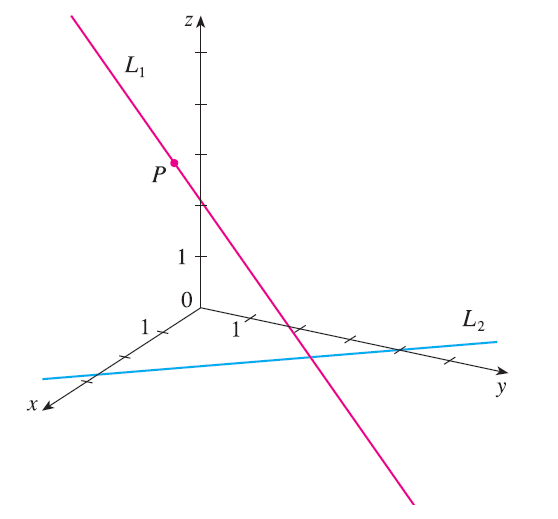

<page>

# Exercise 1

Suppose you start at the origin, move along the x-axis a distance of 4 units in the positive direction, and then move downward a distance of 3 units. What are the coordinates of your position?

</page>
<page>

# Exercise 2

Sketch the points (1, 5, 3), (0, 2, -3), (-3, 0, 2), and (2, -2, -1) on a single set of coordinate axes.

</page>
<page>

# Exercise 3

Which of the points A(-4, 0, -1), B(3, 1, -5), and C(2, 4, 6) is closest to the yz-plane? Which point lies in the xz-plane?

</page>
<page>

# Exercise 4

What are the projections of the point (2, 3, 5) on the xy-, yz-, and xz-planes? Draw a rectangular box with the origin and (2, 3, 5) as opposite vertices and with its faces parallel to the coordinate planes. Label all vertices of the box. Find the length of the diagonal of the box.

</page>
<page>

# Exercise 5

What does the equation $x = 4$ represent in $\mathbb{R}^2$? What does it represent in $\mathbb{R}^3$? Illustrate with sketches.

</page>
<page>

# Exercise 6

What does the equation $y = 3$ represent in $\mathbb{R}^3$? What does $z = 5$ represent? What does the pair of equations $y = 3, z = 5$ represent? In other words, describe the set of points $(x, y, z)$ such that $y = 3$ and $z = 5$. Illustrate with a sketch.

</page>
<page>

# Exercise 7

Describe and sketch the surface in $\mathbb{R}^3$ represented by the equation $x + y = 2$.

</page>
<page>

# Exercise 8

Describe and sketch the surface in $\mathbb{R}^3$ represented by the equation $x^2 + z^2 = 9$.

</page>
<page>

# Exercise 9

Find the lengths of the sides of the triangle PQR. Is it a right triangle? Is it an isosceles triangle?
$P(3, -2, -3), Q(7, 0, 1), R(1, 2, 1)$

</page>
<page>

# Exercise 10

Find the lengths of the sides of the triangle PQR. Is it a right triangle? Is it an isosceles triangle?
$P(2, -1, 0), Q(4, 1, 1), R(4, -5, 4)$

</page>
<page>

# Exercise 11

Determine whether the points lie on a straight line.
(a) $A(2, 4, 2), B(3, 7, -2), C(1, 3, 3)$
(b) $D(0, -5, 5), E(1, -2, 4), F(3, 4, 2)$

</page>
<page>

# Exercise 12

Find the distance from (4, -2, 6) to each of the following.
(a) The xy-plane
(b) The yz-plane
(c) The xz-plane
(d) The x-axis
(e) The y-axis
(f) The z-axis

</page>
<page>

# Exercise 13

Find an equation of the sphere with center (-3, 2, 5) and radius 4. What is the intersection of this sphere with the yz-plane?

</page>
<page>

# Exercise 14

Find an equation of the sphere with center (2, -6, 4) and radius 5. Describe its intersection with each of the coordinate planes.

</page>
<page>

# Exercise 15

Find an equation of the sphere that passes through the point (4, 3, -1) and has center (3, 8, 1).

</page>
<page>

# Exercise 16

Find an equation of the sphere that passes through the origin and whose center is (1, 2, 3).

</page>
<page>

# Exercise 17

Show that the equation $x^2 + y^2 + z^2 - 2x - 4y + 8z = 15$ represents a sphere, and find its center and radius.

</page>
<page>

# Exercise 18

Show that the equation $x^2 + y^2 + z^2 + 8x - 6y + 2z + 17 = 0$ represents a sphere, and find its center and radius.

</page>
<page>

# Exercise 19

Show that the equation $2x^2 + 2y^2 + 2z^2 = 8x - 24z + 1$ represents a sphere, and find its center and radius.

</page>
<page>

# Exercise 20

Show that the equation $3x^2 + 3y^2 + 3z^2 = 10 + 6y + 12z$ represents a sphere, and find its center and radius.

</page>
<page>

# Exercise 21

(a) Prove that the midpoint of the line segment from $P_1(x_1, y_1, z_1)$ to $P_2(x_2, y_2, z_2)$ is
$$ \left( \frac{x_1 + x_2}{2}, \frac{y_1 + y_2}{2}, \frac{z_1 + z_2}{2} \right) $$
(b) Find the lengths of the medians of the triangle with vertices A(1, 2, 3), B(-2, 0, 5), and C(4, 1, 5). (A median of a triangle is a line segment that joins a vertex to the midpoint of the opposite side.)

</page>
<page>

# Exercise 22

Find an equation of a sphere if one of its diameters has endpoints (5, 4, 3) and (1, 6, -9).

</page>
<page>

# Exercise 23

Find equations of the spheres with center (2, -3, 6) that touch
(a) the xy-plane, (b) the yz-plane, (c) the xz-plane.

</page>
<page>

# Exercise 24

Find an equation of the largest sphere with center (5, 4, 9) that is contained in the first octant.

</page>
<page>

# Exercise 25

Describe in words the region of $\mathbb{R}^3$ represented by the equation $x = 5$.

</page>
<page>

# Exercise 26

Describe in words the region of $\mathbb{R}^3$ represented by the equation $y = -2$.

</page>
<page>

# Exercise 27

Describe in words the region of $\mathbb{R}^3$ represented by the inequality $y < 8$.

</page>
<page>

# Exercise 28

Describe in words the region of $\mathbb{R}^3$ represented by the inequality $z \ge -1$.

</page>
<page>

# Exercise 29

Describe in words the region of $\mathbb{R}^3$ represented by the inequality $0 \le z \le 6$.

</page>
<page>

# Exercise 30

Describe in words the region of $\mathbb{R}^3$ represented by the equation $y^2 = 4$.

</page>
<page>

# Exercise 31

Describe in words the region of $\mathbb{R}^3$ represented by the equations $x^2 + y^2 = 4, z = -1$.

</page>
<page>

# Exercise 32

Describe in words the region of $\mathbb{R}^3$ represented by the equation $x^2 + y^2 = 4$.

</page>
<page>

# Exercise 33

Describe in words the region of $\mathbb{R}^3$ represented by the equation $x^2 + y^2 + z^2 = 4$.

</page>
<page>

# Exercise 34

Describe in words the region of $\mathbb{R}^3$ represented by the inequality $x^2 + y^2 + z^2 \le 4$.

</page>
<page>

# Exercise 35

Describe in words the region of $\mathbb{R}^3$ represented by the inequality $1 \le x^2 + y^2 + z^2 \le 5$.

</page>
<page>

# Exercise 36

Describe in words the region of $\mathbb{R}^3$ represented by the equation $x = z$.

</page>
<page>

# Exercise 37

Describe in words the region of $\mathbb{R}^3$ represented by the inequality $x^2 + z^2 \le 9$.

</page>
<page>

# Exercise 38

Describe in words the region of $\mathbb{R}^3$ represented by the inequality $x^2 + y^2 + z^2 > 2z$.

</page>
<page>

# Exercise 39

Write inequalities to describe the region: The region between the yz-plane and the vertical plane $x = 5$.

</page>
<page>

# Exercise 40

Write inequalities to describe the region: The solid cylinder that lies on or below the plane $z = 8$ and on or above the disk in the xy-plane with center the origin and radius 2.

</page>
<page>

# Exercise 41

Write inequalities to describe the region: The region consisting of all points between (but not on) the spheres of radius $r$ and $R$ centered at the origin, where $r < R$.

</page>
<page>

# Exercise 42

Write inequalities to describe the region: The solid upper hemisphere of the sphere of radius 2 centered at the origin.

</page>
<page>

# Exercise 43

The figure shows a line $L_1$ in space and a second line $L_2$, which is the projection of $L_1$ onto the xy-plane. (In other words, the points on $L_2$ are directly beneath, or above, the points on $L_1$.)
(a) Find the coordinates of the point P on the line $L_1$.
(b) Locate on the diagram the points A, B, and C, where the line $L_1$ intersects the xy-plane, the yz-plane, and the xz-plane, respectively.

</page>
<page>

# Exercise 44

Consider the points P such that the distance from P to A(-1, 5, 3) is twice the distance from P to B(6, 2, -2). Show that the set of all such points is a sphere, and find its center and radius.

</page>
<page>

# Exercise 45

Find an equation of the set of all points equidistant from the points A(-1, 5, 3) and B(6, 2, -2). Describe the set.

</page>
<page>

# Exercise 46

Find the volume of the solid that lies inside both of the spheres
$x^2 + y^2 + z^2 + 4x - 2y + 4z + 5 = 0$
and
$x^2 + y^2 + z^2 = 4$

</page>
<page>

# Exercise 47

Find the distance between the spheres $x^2 + y^2 + z^2 = 4$ and $x^2 + y^2 + z^2 = 4x + 4y + 4z - 11$.

</page>
<page>

# Exercise 48

Describe and sketch a solid with the following properties. When illuminated by rays parallel to the z-axis, its shadow is a circular disk. If the rays are parallel to the y-axis, its shadow is a square. If the rays are parallel to the x-axis, its shadow is an isosceles triangle.

</page>
