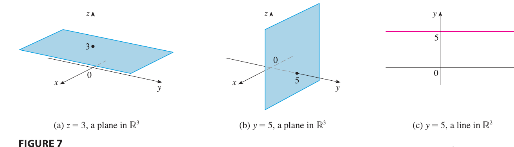

<page>

# 3D Space

To locate a point in a plane, we need two numbers. We know that any point in the plane can be represented as an ordered pair $(a, b)$ of real numbers, where $a$ is the x-coordinate and $b$ is the y-coordinate. For this reason, a plane is called two-dimensional. To locate a point in space, three numbers are required. We represent any point in space by an ordered triple $(a, b, c)$ of real numbers.

In order to represent points in space, we first choose a fixed point $O$ (the origin) and three directed lines through $O$ that are perpendicular to each other, called the **coordinate axes** and labeled the x-axis, y-axis, and z-axis. Usually we think of the x- and y-axes as being horizontal and the z-axis as being vertical, and we draw the orientation of the axes as in Figure 1.

The direction of the z-axis is determined by the **right-hand rule** as illustrated in Figure 2: If you curl the fingers of your right hand around the z-axis in the direction of a 90° counterclockwise rotation from the positive x-axis to the positive y-axis, then your thumb points in the positive direction of the z-axis.

The three coordinate axes determine the three **coordinate planes** illustrated in Figure 3(a). The **xy-plane** is the plane that contains the x- and y-axes; the **yz-plane** contains the y- and z-axes; the **xz-plane** contains the x- and z-axes. These three coordinate planes divide space into eight parts, called **octants**. The **first octant**, in the foreground, is determined by the positive axes.

Because many people have some difficulty visualizing diagrams of three-dimensional figures, you may find it helpful to do the following [see Figure 3(b)]. Look at any bottom corner of a room and call the corner the origin. The wall on your left is in the xz-plane, the wall on your right is in the yz-plane, and the floor is in the xy-plane. The x-axis runs along the intersection of the floor and the left wall. The y-axis runs along the intersection of the floor and the right wall. The z-axis runs up from the floor toward the ceiling along the intersection of the two walls. You are situated in the first octant, and you can now imagine seven other rooms situated in the other seven octants (three on the same floor and four on the floor below), all connected by the common corner point $O$.

Now if $P$ is any point in space, let $a$ be the (directed) distance from the yz-plane to $P$, let $b$ be the distance from the xz-plane to $P$, and let $c$ be the distance from the xy-plane to $P$. We represent the point $P$ by the ordered triple $(a, b, c)$ of real numbers and we call $a, b,$ and $c$ the **coordinates** of $P$; $a$ is the **x-coordinate**, $b$ is the **y-coordinate**, and $c$ is the **z-coordinate**. Thus, to locate the point $(a, b, c)$, we can start at the origin $O$ and move $a$ units along the x-axis, then $b$ units parallel to the y-axis, and then $c$ units parallel to the z-axis as in Figure 4.

The point $P(a, b, c)$ determines a rectangular box as in Figure 5. If we drop a perpendicular from $P$ to the xy-plane, we get a point $Q$ with coordinates $(a, b, 0)$ called the **projection** of $P$ onto the xy-plane. Similarly, $R(0, b, c)$ and $S(a, 0, c)$ are the projections of $P$ onto the yz-plane and xz-plane, respectively.

As numerical illustrations, the points $(-4, 3, -5)$ and $(3, -2, -6)$ are plotted in Figure 6.

The Cartesian product $\mathbb{R} \times \mathbb{R} \times \mathbb{R} = \{(x, y, z) | x, y, z \in \mathbb{R}\}$ is the set of all ordered triples of real numbers and is denoted by $\mathbb{R}^3$. We have given a one-to-one correspondence between points $P$ in space and ordered triples $(a, b, c)$ in $\mathbb{R}^3$. It is called a **three-dimensional rectangular coordinate system**. Notice that, in terms of coordinates, the first octant can be described as the set of points whose coordinates are all positive.

</page>

<page>

# Surfaces

In two-dimensional analytic geometry, the graph of an equation involving $x$ and $y$ is a curve in $\mathbb{R}^2$. In three-dimensional analytic geometry, an equation in $x, y,$ and $z$ represents a **surface** in $\mathbb{R}^3$.

---------

**EXAMPLE 1** What surfaces in $\mathbb{R}^3$ are represented by the following equations?
(a) $z = 3$
(b) $y = 5$

<ans>

**SOLUTION**
(a) The equation $z = 3$ represents the set $\{(x, y, z) | z = 3\}$, which is the set of all points in $\mathbb{R}^3$ whose z-coordinate is 3 ($x$ and $y$ can each be any value). This is the horizontal plane that is parallel to the xy-plane and three units above it as in Figure 7(a).

(b) The equation $y = 5$ represents the set of all points in $\mathbb{R}^3$ whose y-coordinate is 5. This is the vertical plane that is parallel to the xz-plane and five units to the right of it as in Figure 7(b).

**NOTE** When an equation is given, we must understand from the context whether it represents a curve in $\mathbb{R}^2$ or a surface in $\mathbb{R}^3$. In Example 1, $y = 5$ represents a plane in $\mathbb{R}^3$, but of course $y = 5$ can also represent a line in $\mathbb{R}^2$ if we are dealing with two-dimensional analytic geometry. See Figure 7(b) and (c).

</ans>

-----------

In general, if $k$ is a constant, then $x = k$ represents a plane parallel to the yz-plane, $y = k$ is a plane parallel to the xz-plane, and $z = k$ is a plane parallel to the xy-plane. In Figure 5, the faces of the rectangular box are formed by the three coordinate planes $x = 0$ (the yz-plane), $y = 0$ (the xz-plane), and $z = 0$ (the xy-plane), and the planes $x = a, y = b,$ and $z = c$.

-------------

**EXAMPLE 2**
(a) Which points $(x, y, z)$ satisfy the equations $x^2 + y^2 = 1$ and $z = 3$?
(b) What does the equation $x^2 + y^2 = 1$ represent as a surface in $\mathbb{R}^3$?

<ans>

**SOLUTION**
(a) Because $z = 3$, the points lie in the horizontal plane $z = 3$ from Example 1(a). Because $x^2 + y^2 = 1$, the points lie on the circle with radius 1 and center on the z-axis. See Figure 8.
(b) Given that $x^2 + y^2 = 1$, with no restrictions on $z$, we see that the point $(x, y, z)$ could lie on a circle in any horizontal plane $z = k$. So the surface $x^2 + y^2 = 1$ in $\mathbb{R}^3$ consists of all possible horizontal circles $x^2 + y^2 = 1, z = k$, and is therefore the circular cylinder with radius 1 whose axis is the z-axis. See Figure 9.

</ans>

-------------

**EXAMPLE 3** Describe and sketch the surface in $\mathbb{R}^3$ represented by the equation $y = x$.

<ans>

**SOLUTION** The equation represents the set of all points in $\mathbb{R}^3$ whose x- and y-coordinates are equal, that is, $\{(x, x, z) | x \in \mathbb{R}, z \in \mathbb{R}\}$. This is a vertical plane that intersects the xy-plane in the line $y = x, z = 0$. The portion of this plane that lies in the first octant is sketched in Figure 10.

</ans>
</page>

<page>

# Distance and Spheres

The familiar formula for the distance between two points in a plane is easily extended to the following three-dimensional formula.

**Distance Formula in Three Dimensions** The distance $|P_1P_2|$ between the points $P_1(x_1, y_1, z_1)$ and $P_2(x_2, y_2, z_2)$ is
$$
|P_1P_2| = \sqrt{(x_2 - x_1)^2 + (y_2 - y_1)^2 + (z_2 - z_1)^2}
$$

To see why this formula is true, we construct a rectangular box as in Figure 11, where $P_1$ and $P_2$ are opposite vertices and the faces of the box are parallel to the coordinate planes. If $A(x_2, y_1, z_1)$ and $B(x_2, y_2, z_1)$ are the vertices of the box indicated in the figure, then
$$
|P_1A| = |x_2 - x_1| \quad |AB| = |y_2 - y_1| \quad |BP_2| = |z_2 - z_1|
$$
Because triangles $P_1BP_2$ and $P_1AB$ are both right-angled, two applications of the Pythagorean Theorem give
$$
|P_1P_2|^2 = |P_1B|^2 + |BP_2|^2
$$
and
$$
|P_1B|^2 = |P_1A|^2 + |AB|^2
$$
Combining these equations, we get
$$
|P_1P_2|^2 = |P_1A|^2 + |AB|^2 + |BP_2|^2 = |x_2 - x_1|^2 + |y_2 - y_1|^2 + |z_2 - z_1|^2
$$
$$
= (x_2 - x_1)^2 + (y_2 - y_1)^2 + (z_2 - z_1)^2
$$
Therefore
$$
|P_1P_2| = \sqrt{(x_2 - x_1)^2 + (y_2 - y_1)^2 + (z_2 - z_1)^2}
$$

--------------

**EXAMPLE 4** The distance from the point $P(2, -1, 7)$ to the point $Q(1, -3, 5)$ is
$$
|PQ| = \sqrt{(1 - 2)^2 + (-3 - (-1))^2 + (5 - 7)^2} = \sqrt{1 + 4 + 4} = 3
$$

-----------

**EXAMPLE 5** Find an equation of a sphere with radius $r$ and center $C(h, k, l)$.

<ans>

**SOLUTION** 

By definition, a sphere is the set of all points $P(x, y, z)$ whose distance from $C$ is $r$. (See Figure 12.) Thus $P$ is on the sphere if and only if $|PC| = r$. Squaring both sides, we have $|PC|^2 = r^2$ or
$$
(x - h)^2 + (y - k)^2 + (z - l)^2 = r^2
$$
</ans>

----------

**Equation of a Sphere** An equation of a sphere with center $C(h, k, l)$ and radius $r$ is
$$
(x - h)^2 + (y - k)^2 + (z - l)^2 = r^2
$$
In particular, if the center is the origin $O$, then an equation of the sphere is
$$
x^2 + y^2 + z^2 = r^2
$$

---------------

**EXAMPLE 6** Show that $x^2 + y^2 + z^2 + 4x - 6y + 2z + 6 = 0$ is the equation of a sphere, and find its center and radius.

<ans>

**SOLUTION** We can rewrite the given equation in the form of an equation of a sphere if we complete squares:
$$
(x^2 + 4x + 4) + (y^2 - 6y + 9) + (z^2 + 2z + 1) = -6 + 4 + 9 + 1
$$
$$
(x + 2)^2 + (y - 3)^2 + (z + 1)^2 = 8
$$
Comparing this equation with the standard form, we see that it is the equation of a sphere with center $(-2, 3, -1)$ and radius $\sqrt{8} = 2\sqrt{2}$.

</ans>

-------------

**EXAMPLE 7** What region in $\mathbb{R}^3$ is represented by the following inequalities?
$$
1 \le x^2 + y^2 + z^2 \le 4 \quad z \le 0
$$

<ans>

**SOLUTION** The inequalities $1 \le x^2 + y^2 + z^2 \le 4$ can be rewritten as
$$
1 \le \sqrt{x^2 + y^2 + z^2} \le 2
$$
so they represent the points $(x, y, z)$ whose distance from the origin is at least 1 and at most 2. But we are also given that $z \le 0$, so the points lie on or below the xy-plane. Thus the given inequalities represent the region that lies between (or on) the spheres $x^2 + y^2 + z^2 = 1$ and $x^2 + y^2 + z^2 = 4$ and beneath (or on) the xy-plane. It is sketched in Figure 13.

</ans>
</page>