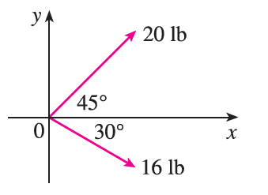

<page>

# Exercise 1

Are the following quantities vectors or scalars? Explain.
(a) The cost of a theater ticket
(b) The current in a river
(c) The initial flight path from Houston to Dallas
(d) The population of the world

</page>
<page>

# Exercise 2

What is the relationship between the point (4, 7) and the vector $\langle 4, 7 \rangle$? Illustrate with a sketch.

</page>
<page>

# Exercise 3

Name all the equal vectors in the parallelogram shown.

</page>
<page>

# Exercise 4

Write each combination of vectors as a single vector.
(a) $\vec{AB} + \vec{BC}$
(b) $\vec{CD} + \vec{DB}$
(c) $\vec{DB} - \vec{AB}$
(d) $\vec{DC} + \vec{CA} + \vec{AB}$

</page>
<page>

# Exercise 5

Copy the vectors in the figure and use them to draw the following vectors.
(a) $\mathbf{u} + \mathbf{v}$
(b) $\mathbf{u} + \mathbf{w}$
(c) $\mathbf{v} + \mathbf{w}$
(d) $\mathbf{u} - \mathbf{v}$
(e) $\mathbf{v} + \mathbf{u} + \mathbf{w}$
(f) $\mathbf{u} - \mathbf{w} - \mathbf{v}$

</page>
<page>

# Exercise 6

Copy the vectors in the figure and use them to draw the following vectors.
(a) $\mathbf{a} + \mathbf{b}$
(b) $\mathbf{a} - \mathbf{b}$
(c) $\frac{1}{2}\mathbf{a}$
(d) $-3\mathbf{b}$
(e) $\mathbf{a} + 2\mathbf{b}$
(f) $2\mathbf{b} - \mathbf{a}$

</page>
<page>

# Exercise 7

In the figure, the tip of **c** and the tail of **d** are both the midpoint of QR. Express **c** and **d** in terms of **a** and **b**.

</page>
<page>

# Exercise 8

If the vectors in the figure satisfy $|\mathbf{u}| = |\mathbf{v}| = 1$ and $\mathbf{u} + \mathbf{v} + \mathbf{w} = \mathbf{0}$, what is $|\mathbf{w}|$?

</page>
<page>

# Exercise 9

Find a vector **a** with representation given by the directed line segment $\vec{AB}$. Draw $\vec{AB}$ and the equivalent representation starting at the origin.
$A(-2, 1), B(1, 2)$

</page>
<page>

# Exercise 10

Find a vector **a** with representation given by the directed line segment $\vec{AB}$. Draw $\vec{AB}$ and the equivalent representation starting at the origin.
$A(-5, -1), B(-3, 3)$

</page>
<page>

# Exercise 11

Find a vector **a** with representation given by the directed line segment $\vec{AB}$. Draw $\vec{AB}$ and the equivalent representation starting at the origin.
$A(3, -1), B(2, 3)$

</page>
<page>

# Exercise 12

Find a vector **a** with representation given by the directed line segment $\vec{AB}$. Draw $\vec{AB}$ and the equivalent representation starting at the origin.
$A(3, 2), B(1, 0)$

</page>
<page>

# Exercise 13

Find a vector **a** with representation given by the directed line segment $\vec{AB}$. Draw $\vec{AB}$ and the equivalent representation starting at the origin.
$A(0, 3, 1), B(2, 3, -1)$

</page>
<page>

# Exercise 14

Find a vector **a** with representation given by the directed line segment $\vec{AB}$. Draw $\vec{AB}$ and the equivalent representation starting at the origin.
$A(0, 6, -1), B(3, 4, 4)$

</page>
<page>

# Exercise 15

Find the sum of the given vectors and illustrate geometrically.
$\langle -1, 4 \rangle, \langle 6, -2 \rangle$

</page>
<page>

# Exercise 16

Find the sum of the given vectors and illustrate geometrically.
$\langle 3, -1 \rangle, \langle -1, 5 \rangle$

</page>
<page>

# Exercise 17

Find the sum of the given vectors and illustrate geometrically.
$\langle 3, 0, 1 \rangle, \langle 0, 8, 0 \rangle$

</page>
<page>

# Exercise 18

Find the sum of the given vectors and illustrate geometrically.
$\langle 1, 3, -2 \rangle, \langle 0, 0, 6 \rangle$

</page>
<page>

# Exercise 19

Find $\mathbf{a} + \mathbf{b}, 4\mathbf{a} + 2\mathbf{b}, |\mathbf{a}|,$ and $|\mathbf{a} - \mathbf{b}|$.
$\mathbf{a} = \langle -3, 4 \rangle, \mathbf{b} = \langle 9, -1 \rangle$

</page>
<page>

# Exercise 20

Find $\mathbf{a} + \mathbf{b}, 4\mathbf{a} + 2\mathbf{b}, |\mathbf{a}|,$ and $|\mathbf{a} - \mathbf{b}|$.
$\mathbf{a} = 5\mathbf{i} + 3\mathbf{j}, \mathbf{b} = -\mathbf{i} - 2\mathbf{j}$

</page>
<page>

# Exercise 21

Find $\mathbf{a} + \mathbf{b}, 4\mathbf{a} + 2\mathbf{b}, |\mathbf{a}|,$ and $|\mathbf{a} - \mathbf{b}|$.
$\mathbf{a} = 4\mathbf{i} - 3\mathbf{j} + 2\mathbf{k}, \mathbf{b} = 2\mathbf{i} - 4\mathbf{k}$

</page>
<page>

# Exercise 22

Find $\mathbf{a} + \mathbf{b}, 4\mathbf{a} + 2\mathbf{b}, |\mathbf{a}|,$ and $|\mathbf{a} - \mathbf{b}|$.
$\mathbf{a} = \langle 8, 1, -4 \rangle, \mathbf{b} = \langle 5, -2, 1 \rangle$

</page>
<page>

# Exercise 23

Find a unit vector that has the same direction as the given vector.
$\langle 6, -2 \rangle$

</page>
<page>

# Exercise 24

Find a unit vector that has the same direction as the given vector.
$-5\mathbf{i} + 3\mathbf{j} - \mathbf{k}$

</page>
<page>

# Exercise 25

Find a unit vector that has the same direction as the given vector.
$8\mathbf{i} - \mathbf{j} + 4\mathbf{k}$

</page>
<page>

# Exercise 26

Find the vector that has the same direction as $\langle 6, 2, -3 \rangle$ but has length 4.

</page>
<page>

# Exercise 27

What is the angle between the given vector and the positive direction of the x-axis?
$\mathbf{i} + \sqrt{3}\mathbf{j}$

</page>
<page>

# Exercise 28

What is the angle between the given vector and the positive direction of the x-axis?
$8\mathbf{i} + 6\mathbf{j}$

</page>
<page>

# Exercise 29

If **v** lies in the first quadrant and makes an angle $\pi/3$ with the positive x-axis and $|\mathbf{v}| = 4$, find **v** in component form.

</page>
<page>

# Exercise 30

If a child pulls a sled through the snow on a level path with a force of 50 N exerted at an angle of $38^\circ$ above the horizontal, find the horizontal and vertical components of the force.

</page>
<page>

# Exercise 31

A quarterback throws a football with angle of elevation $40^\circ$ and speed 60 ft/s. Find the horizontal and vertical components of the velocity vector.

</page>
<page>

# Exercise 32

Find the magnitude of the resultant force and the angle it makes with the positive x-axis. 

</page>
<page>

# Exercise 33

Find the magnitude of the resultant force and the angle it makes with the positive x-axis. 

</page>
<page>

# Exercise 34

The magnitude of a velocity vector is called speed. Suppose that a wind is blowing from the direction N45°W at a speed of 50 km/h. (This means that the direction from which the wind blows is 45° west of the northerly direction.) A pilot is steering a plane in the direction N60°E at an airspeed (speed in still air) of 250 km/h. The true course, or track, of the plane is the direction of the resultant of the velocity vectors of the plane and the wind. The ground speed of the plane is the magnitude of the resultant. Find the true course and the ground speed of the plane.

</page>
<page>

# Exercise 35

A woman walks due west on the deck of a ship at 3 mi/h. The ship is moving north at a speed of 22 mi/h. Find the speed and direction of the woman relative to the surface of the water.

</page>
<page>

# Exercise 36

A crane suspends a 500-lb steel beam horizontally by support cables (with negligible weight) attached from a hook to each end of the beam. The support cables each make an angle of $60^\circ$ with the beam. Find the tension vector in each support cable and the magnitude of each tension.

</page>
<page>

# Exercise 37

A block-and-tackle pulley hoist is suspended in a warehouse by ropes of lengths 2 m and 3 m. The hoist weighs 350 N. The ropes, fastened at different heights, make angles of $50^\circ$ and $38^\circ$ with the horizontal. Find the tension in each rope and the magnitude of each tension.

</page>
<page>

# Exercise 38

The tension **T** at each end of a chain has magnitude 25 N (see the figure). What is the weight of the chain?

</page>
<page>

# Exercise 39

A boatman wants to cross a canal that is 3 km wide and wants to land at a point 2 km upstream from his starting point. The current in the canal flows at 3.5 km/h and the speed of his boat is 13 km/h.
(a) In what direction should he steer?
(b) How long will the trip take?

</page>
<page>

# Exercise 40

Three forces act on an object. Two of the forces are at an angle of $100^\circ$ to each other and have magnitudes 25 N and 12 N. The third is perpendicular to the plane of these two forces and has magnitude 4 N. Calculate the magnitude of the force that would exactly counterbalance these three forces.

</page>
<page>

# Exercise 41

Find the unit vectors that are parallel to the tangent line to the parabola $y = x^2$ at the point (2, 4).

</page>
<page>

# Exercise 42

(a) Find the unit vectors that are parallel to the tangent line to the curve $y = 2 \sin x$ at the point $(\pi/6, 1)$.
(b) Find the unit vectors that are perpendicular to the tangent line.
(c) Sketch the curve $y = 2 \sin x$ and the vectors in parts (a) and (b), all starting at $(\pi/6, 1)$.

</page>
<page>

# Exercise 43

If A, B, and C are the vertices of a triangle, find $\vec{AB} + \vec{BC} + \vec{CA}$.

</page>
<page>

# Exercise 44

Let C be the point on the line segment AB that is twice as far from B as it is from A. If $\mathbf{a} = \vec{OA}, \mathbf{b} = \vec{OB},$ and $\mathbf{c} = \vec{OC}$, show that $\mathbf{c} = \frac{2}{3}\mathbf{a} + \frac{1}{3}\mathbf{b}$.

</page>
<page>

# Exercise 45

(a) Draw the vectors $\mathbf{a} = \langle 3, 2 \rangle, \mathbf{b} = \langle 2, -1 \rangle,$ and $\mathbf{c} = \langle 7, 1 \rangle$.
(b) Show, by means of a sketch, that there are scalars s and t such that $\mathbf{c} = s\mathbf{a} + t\mathbf{b}$.
(c) Use the sketch to estimate the values of s and t.
(d) Find the exact values of s and t.

</page>
<page>

# Exercise 46

Suppose that **a** and **b** are nonzero vectors that are not parallel and **c** is any vector in the plane determined by **a** and **b**. Give a geometric argument to show that **c** can be written as $\mathbf{c} = s\mathbf{a} + t\mathbf{b}$ for suitable scalars s and t. Then give an argument using components.

</page>
<page>

# Exercise 47

If $\mathbf{r} = \langle x, y, z \rangle$ and $\mathbf{r}_0 = \langle x_0, y_0, z_0 \rangle$, describe the set of all points $(x, y, z)$ such that $|\mathbf{r} - \mathbf{r}_0| = 1$.

</page>
<page>

# Exercise 48

If $\mathbf{r} = \langle x, y \rangle, \mathbf{r}_1 = \langle x_1, y_1 \rangle,$ and $\mathbf{r}_2 = \langle x_2, y_2 \rangle$, describe the set of all points $(x, y)$ such that $|\mathbf{r} - \mathbf{r}_1| + |\mathbf{r} - \mathbf{r}_2| = k$, where $k > |\mathbf{r}_1 - \mathbf{r}_2|$.

</page>
<page>

# Exercise 49

Figure 16 gives a geometric demonstration of Property 2 of vectors. Use components to give an algebraic proof of this fact for the case n = 2.

</page>
<page>

# Exercise 50

Prove Property 5 of vectors algebraically for the case n = 3. Then use similar triangles to give a geometric proof.

</page>
<page>

# Exercise 51

Use vectors to prove that the line joining the midpoints of two sides of a triangle is parallel to the third side and half its length.

</page>
<page>

# Exercise 52

Suppose the three coordinate planes are all mirrored and a light ray given by the vector $\mathbf{a} = \langle a_1, a_2, a_3 \rangle$ first strikes the xz-plane, as shown in the figure. Use the fact that the angle of incidence equals the angle of reflection to show that the direction of the reflected ray is given by $\mathbf{b} = \langle a_1, -a_2, a_3 \rangle$. Deduce that, after being reflected by all three mutually perpendicular mirrors, the resulting ray is parallel to the initial ray.

</page>
