<page>

# Vectors

The term **vector** is used by scientists to indicate a quantity (such as displacement or velocity or force) that has both magnitude and direction. 

A vector is often represented by an arrow or a directed line segment. The length of the arrow represents the magnitude of the vector and the arrow points in the direction of the vector. We denote a vector by printing a letter in boldface (**v**) or by putting an arrow above the letter ($\vec{v}$).

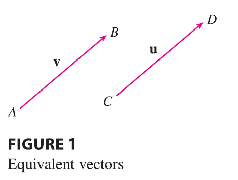

For instance, suppose a particle moves along a line segment from point A to point B. The corresponding **displacement vector** **v**, shown in Figure 1, has **initial point** A (the tail) and **terminal point** B (the tip) and we indicate this by writing $\mathbf{v} = \vec{AB}$. Notice that the vector $\mathbf{u} = \vec{CD}$ has the same length and the same direction as **v** even though it is in a different position. We say that **u** and **v** are **equivalent** (or **equal**) and we write $\mathbf{u} = \mathbf{v}$. The **zero vector**, denoted by **0**, has length 0. It is the only vector with no specific direction.

</page>

<page>

# Combining Vectors - Vector Addition

Suppose a particle moves from A to B, so its displacement vector is $\vec{AB}$. Then the particle changes direction and moves from B to C, with displacement vector $\vec{BC}$ as in Figure 2. 

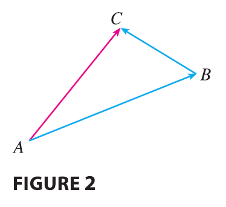

The combined effect of these displacements is that the particle has moved from A to C. The resulting displacement vector $\vec{AC}$ is called the **sum** of $\vec{AB}$ and $\vec{BC}$ and we write
$$
\vec{AC} = \vec{AB} + \vec{BC}
$$
In general, if we start with vectors **u** and **v**, we first move **v** so that its tail coincides with the tip of **u** and define the sum of **u** and **v** as follows.

---

**Definition of Vector Addition** If **u** and **v** are vectors positioned so the initial point of **v** is at the terminal point of **u**, then the **sum** $\mathbf{u} + \mathbf{v}$ is the vector from the initial point of **u** to the terminal point of **v**.

---

The definition of vector addition is illustrated in Figure 3. You can see why this definition is sometimes called the **Triangle Law**.

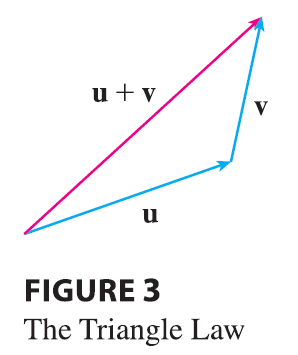

-----

In Figure 4 we start with the same vectors **u** and **v** as in Figure 3 and draw another copy of **v** with the same initial point as **u**. Completing the parallelogram, we see that $\mathbf{u} + \mathbf{v} = \mathbf{v} + \mathbf{u}$. This also gives another way to construct the sum: if we place **u** and **v** so they start at the same point, then $\mathbf{u} + \mathbf{v}$ lies along the diagonal of the parallelogram with **u** and **v** as sides. (This is called the **Parallelogram Law**.)

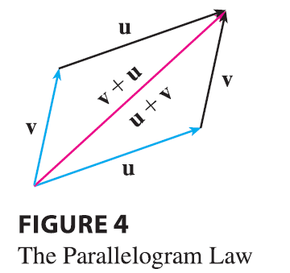

-------------

**EXAMPLE 1** Draw the sum of the vectors **a** and **b** shown in Figure 5.

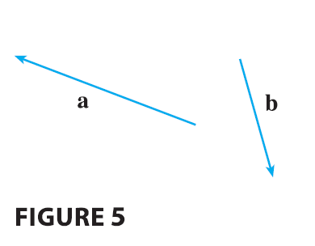

<ans>

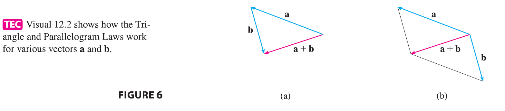

**SOLUTION** First we move **b** and place its tail at the tip of **a**, being careful to draw a copy of **b** that has the same length and direction. Then we draw the vector $\mathbf{a} + \mathbf{b}$ [see Figure 6(a)] starting at the initial point of **a** and ending at the terminal point of the copy of **b**.

Alternatively, we could place **b** so it starts where **a** starts and construct $\mathbf{a} + \mathbf{b}$ by the Parallelogram Law as in Figure 6(b).

</ans>
</page>

<page>

# Scalar Multiplication of vectors

It is possible to multiply a vector by a real number $c$. (In this context we call the real number $c$ a **scalar** to distinguish it from a vector.) For instance, we want $2\mathbf{v}$ to be the same vector as $\mathbf{v} + \mathbf{v}$, which has the same direction as **v** but is twice as long. In general, we multiply a vector by a scalar as follows.

---

**Definition of Scalar Multiplication** If $c$ is a scalar and **v** is a vector, then the **scalar multiple** $c\mathbf{v}$ is the vector whose length is $|c|$ times the length of **v** and whose direction is the same as **v** if $c > 0$ and is opposite to **v** if $c < 0$. If $c = 0$ or $\mathbf{v} = \mathbf{0}$, then $c\mathbf{v} = \mathbf{0}$.

---

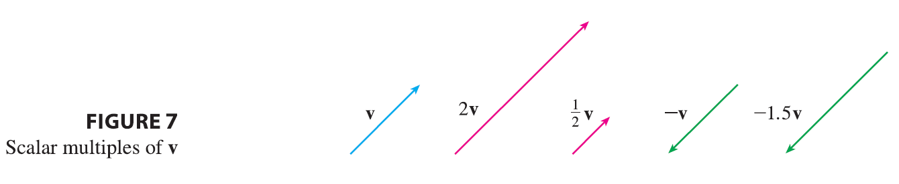

This definition is illustrated in Figure 7. We see that real numbers work like scaling factors here; that’s why we call them scalars. Notice that two nonzero vectors are **parallel** if they are scalar multiples of one another. In particular, the vector $-\mathbf{v} = (-1)\mathbf{v}$ has the same length as **v** but points in the opposite direction. We call it the **negative** of **v**.

</page>

<page>

# Difference of two vectors

Recall, the vector $-\mathbf{v} = (-1)\mathbf{v}$ has the same length as **v** but points in the opposite direction. We call it the **negative** of **v**.

By the **difference** $\mathbf{u} - \mathbf{v}$ of two vectors we mean
$$
\mathbf{u} - \mathbf{v} = \mathbf{u} + (-\mathbf{v})
$$

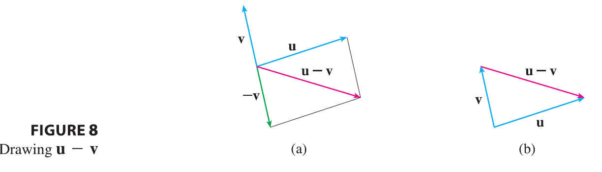

So we can construct $\mathbf{u} - \mathbf{v}$ by first drawing the negative of **v**, $-\mathbf{v}$, and then adding it to **u** by the Parallelogram Law as in Figure 8(a). Alternatively, since $\mathbf{v} + (\mathbf{u} - \mathbf{v}) = \mathbf{u}$, the vector $\mathbf{u} - \mathbf{v}$, when added to **v**, gives **u**. So we could construct $\mathbf{u} - \mathbf{v}$ as in Figure 8(b) by means of the Triangle Law. Notice that if **u** and **v** both start from the same initial point, then $\mathbf{u} - \mathbf{v}$ connects the tip of **v** to the tip of **u**.

--------------

**EXAMPLE 2** If **a** and **b** are the vectors shown in Figure 9, draw $\mathbf{a} - 2\mathbf{b}$.
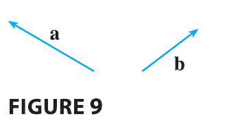

<ans>

**SOLUTION** We first draw the vector $-2\mathbf{b}$ pointing in the direction opposite to **b** and twice as long. We place it with its tail at the tip of **a** and then use the Triangle Law to draw $\mathbf{a} + (-2\mathbf{b})$ as in Figure 10.

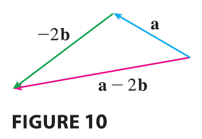
</ans>
</page>

<page>

# Components of vector

For some purposes it’s best to introduce a coordinate system and treat vectors algebraically. If we place the initial point of a vector **a** at the origin of a rectangular coordinate system, then the terminal point of **a** has coordinates of the form $(a_1, a_2)$ or $(a_1, a_2, a_3)$, depending on whether our coordinate system is two- or three-dimensional (see Figure 11). 

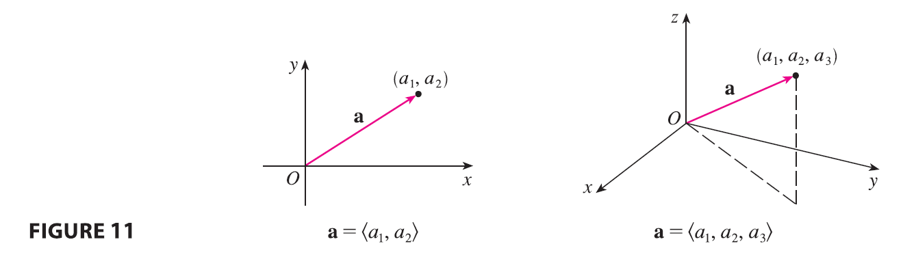

These coordinates are called the **components** of **a** and we write
$$
\mathbf{a} = \langle a_1, a_2 \rangle \quad \text{or} \quad \mathbf{a} = \langle a_1, a_2, a_3 \rangle
$$

-----

We use the notation $\langle a_1, a_2 \rangle$ for the ordered pair that refers to a vector so as not to confuse it with the ordered pair $(a_1, a_2)$ that refers to a point in the plane.

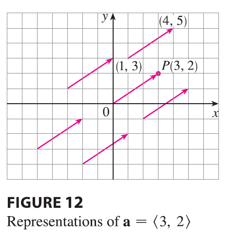

For instance, the vectors shown in Figure 12 are all equivalent to the vector $\vec{OP} = \langle 3, 2 \rangle$ whose terminal point is $P(3, 2)$. What they have in common is that the terminal point is reached from the initial point by a displacement of three units to the right and two upward. We can think of all these geometric vectors as representations of the algebraic vector $\mathbf{a} = \langle 3, 2 \rangle$. The particular representation $\vec{OP}$ from the origin to the point $P(3, 2)$ is called the **position vector** of the point $P$.

In three dimensions, the vector $\mathbf{a} = \vec{OP} = \langle a_1, a_2, a_3 \rangle$ is the **position vector** of the point $P(a_1, a_2, a_3)$. (See Figure 13.) 

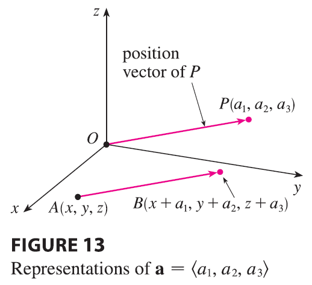

Let’s consider any other representation $\vec{AB}$ of **a**, where the initial point is $A(x_1, y_1, z_1)$ and the terminal point is $B(x_2, y_2, z_2)$. Then we must have $x_1 + a_1 = x_2, y_1 + a_2 = y_2,$ and $z_1 + a_3 = z_2$ and so $a_1 = x_2 - x_1, a_2 = y_2 - y_1,$ and $a_3 = z_2 - z_1$. Thus we have the following result.

---

Given the points $A(x_1, y_1, z_1)$ and $B(x_2, y_2, z_2)$, the vector **a** with representation $\vec{AB}$ is
$$
\mathbf{a} = \langle x_2 - x_1, y_2 - y_1, z_2 - z_1 \rangle
\tag{1}
$$

---

**EXAMPLE 3** Find the vector represented by the directed line segment with initial point $A(2, -3, 4)$ and terminal point $B(-2, 1, 1)$.

<ans>

**SOLUTION** By (1), the vector corresponding to $\vec{AB}$ is
$$
\mathbf{a} = \langle -2 - 2, 1 - (-3), 1 - 4 \rangle = \langle -4, 4, -3 \rangle
$$
</ans>
</page>

<page>

# Magnitude or Length of vectors

The **magnitude** or **length** of the vector **v** is the length of any of its representations and is denoted by the symbol $|\mathbf{v}|$ or $||\mathbf{v}||$. By using the distance formula to compute the length of a segment OP, we obtain the following formulas.

The length of the two-dimensional vector $\mathbf{a} = \langle a_1, a_2 \rangle$ is
$$
|\mathbf{a}| = \sqrt{a_1^2 + a_2^2}
$$
The length of the three-dimensional vector $\mathbf{a} = \langle a_1, a_2, a_3 \rangle$ is
$$
|\mathbf{a}| = \sqrt{a_1^2 + a_2^2 + a_3^2}
$$

</page>

<page>

# How do we add vectors algebraically?

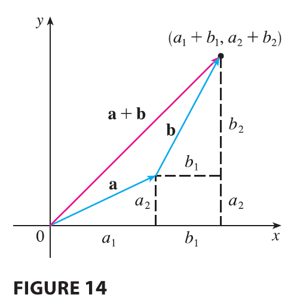

Figure 14 shows that if $\mathbf{a} = \langle a_1, a_2 \rangle$ and $\mathbf{b} = \langle b_1, b_2 \rangle$, then the sum is $\mathbf{a} + \mathbf{b} = \langle a_1 + b_1, a_2 + b_2 \rangle$, at least for the case where the components are positive. In other words, to add algebraic vectors we add corresponding components. Similarly, to subtract vectors we subtract corresponding components. From the similar triangles in Figure 15 we see that the components of $c\mathbf{a}$ are $ca_1$ and $ca_2$. So to multiply a vector by a scalar we multiply each component by that scalar.

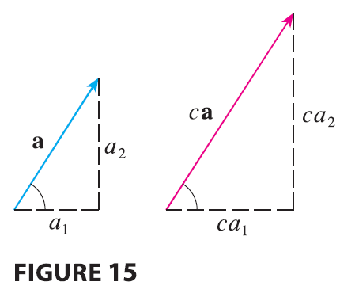

If $\mathbf{a} = \langle a_1, a_2 \rangle$ and $\mathbf{b} = \langle b_1, b_2 \rangle$, then
$$
\mathbf{a} + \mathbf{b} = \langle a_1 + b_1, a_2 + b_2 \rangle \quad \mathbf{a} - \mathbf{b} = \langle a_1 - b_1, a_2 - b_2 \rangle
$$
$$
c\mathbf{a} = \langle ca_1, ca_2 \rangle
$$
Similarly, for three-dimensional vectors,
$$
\langle a_1, a_2, a_3 \rangle + \langle b_1, b_2, b_3 \rangle = \langle a_1 + b_1, a_2 + b_2, a_3 + b_3 \rangle
$$
$$
\langle a_1, a_2, a_3\rangle - \langle b_1, b_2, b_3 \rangle = \langle a_1 - b_1, a_2 - b_2, a_3 - b_3 \rangle
$$
$$
c\langle a_1, a_2, a_3 \rangle = \langle ca_1, ca_2, ca_3 \rangle
$$

-----------

**EXAMPLE 4** If $\mathbf{a} = \langle 4, 0, 3 \rangle$ and $\mathbf{b} = \langle -2, 1, 5 \rangle$, find $|\mathbf{a}|$ and the vectors $\mathbf{a} + \mathbf{b}, \mathbf{a} - \mathbf{b}, 3\mathbf{b},$ and $2\mathbf{a} + 5\mathbf{b}$.

<ans>

**SOLUTION**
$$
|\mathbf{a}| = \sqrt{4^2 + 0^2 + 3^2} = \sqrt{25} = 5
$$
$$
\mathbf{a} + \mathbf{b} = \langle 4, 0, 3 \rangle + \langle -2, 1, 5 \rangle = \langle 4 + (-2), 0 + 1, 3 + 5 \rangle = \langle 2, 1, 8 \rangle
$$
$$
\mathbf{a} - \mathbf{b} = \langle 4, 0, 3 \rangle - \langle -2, 1, 5 \rangle = \langle 4 - (-2), 0 - 1, 3 - 5 \rangle = \langle 6, -1, -2 \rangle
$$
$$
3\mathbf{b} = 3\langle -2, 1, 5 \rangle = \langle 3(-2), 3(1), 3(5) \rangle = \langle -6, 3, 15 \rangle
$$
$$
2\mathbf{a} + 5\mathbf{b} = 2\langle 4, 0, 3 \rangle + 5\langle -2, 1, 5 \rangle = \langle 8, 0, 6 \rangle + \langle -10, 5, 25 \rangle = \langle -2, 5, 31 \rangle
$$

</ans>
</page>

<page>

# N-dimensional vectors

We denote by $V_2$ the set of all two-dimensional vectors and by $V_3$ the set of all three-dimensional vectors. More generally, we will later need to consider the set $V_n$ of all n-dimensional vectors. An **n-dimensional vector** is an ordered n-tuple:
$$
\mathbf{a} = \langle a_1, a_2, ..., a_n \rangle
$$
where $a_1, a_2, ..., a_n$ are real numbers that are called the components of **a**. Addition and scalar multiplication are defined in terms of components just as for the cases $n = 2$ and $n = 3$.

</page>

<page>

# Properties of Vectors

**Properties of Vectors** If **a**, **b**, and **c** are vectors in $V_n$ and $c$ and $d$ are scalars, then
1. $\mathbf{a} + \mathbf{b} = \mathbf{b} + \mathbf{a}$
2. $\mathbf{a} + (\mathbf{b} + \mathbf{c}) = (\mathbf{a} + \mathbf{b}) + \mathbf{c}$
3. $\mathbf{a} + \mathbf{0} = \mathbf{a}$
4. $\mathbf{a} + (-\mathbf{a}) = \mathbf{0}$
5. $c(\mathbf{a} + \mathbf{b}) = c\mathbf{a} + c\mathbf{b}$
6. $(c + d)\mathbf{a} = c\mathbf{a} + d\mathbf{a}$
7. $(cd)\mathbf{a} = c(d\mathbf{a})$
8. $1\mathbf{a} = \mathbf{a}$
---

These eight properties of vectors can be readily verified either geometrically or algebraically. For instance, Property 1 can be seen from Figure 4 (it’s equivalent to the Parallelogram Law) or as follows for the case $n = 2$:
$$
\mathbf{a} + \mathbf{b} = \langle a_1, a_2 \rangle + \langle b_1, b_2 \rangle = \langle a_1 + b_1, a_2 + b_2 \rangle
$$
$$
= \langle b_1 + a_1, b_2 + a_2 \rangle = \langle b_1, b_2 \rangle + \langle a_1, a_2 \rangle = \mathbf{b} + \mathbf{a}
$$
We can see why Property 2 (the associative law) is true by looking at Figure 16 and applying the Triangle Law several times: the vector $\vec{PQ}$ is obtained either by first constructing $\mathbf{a} + \mathbf{b}$ and then adding **c** or by adding **a** to the vector $\mathbf{b} + \mathbf{c}$.

</page>

<page>

# Standard basis vectors

Three vectors in $V_3$ play a special role. Let
$$
\mathbf{i} = \langle 1, 0, 0 \rangle \quad \mathbf{j} = \langle 0, 1, 0 \rangle \quad \mathbf{k} = \langle 0, 0, 1 \rangle
$$

These vectors **i**, **j**, and **k** are called the **standard basis vectors**. They have length 1 and point in the directions of the positive x-, y-, and z-axes. Similarly, in two dimensions we define $\mathbf{i} = \langle 1, 0 \rangle$ and $\mathbf{j} = \langle 0, 1 \rangle$. (See Figure 17.)

------

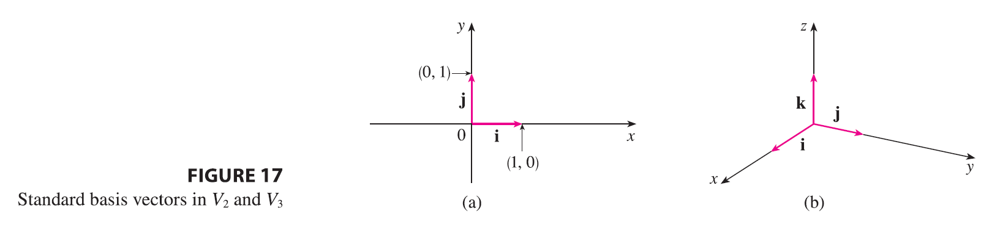

-------
If $\mathbf{a} = \langle a_1, a_2, a_3 \rangle$, then we can write
$$
\mathbf{a} = \langle a_1, a_2, a_3 \rangle = \langle a_1, 0, 0 \rangle + \langle 0, a_2, 0 \rangle + \langle 0, 0, a_3 \rangle
$$
$$
= a_1\langle 1, 0, 0 \rangle + a_2\langle 0, 1, 0 \rangle + a_3\langle 0, 0, 1 \rangle
$$
$$
\mathbf{a} = a_1\mathbf{i} + a_2\mathbf{j} + a_3\mathbf{k}
\tag{2}
$$
Thus any vector in $V_3$ can be expressed in terms of **i**, **j**, and **k**. For instance,
$$
\langle 1, -2, 6 \rangle = \mathbf{i} - 2\mathbf{j} + 6\mathbf{k}
$$
Similarly, in two dimensions, we can write
$$
\mathbf{a} = \langle a_1, a_2 \rangle = a_1\mathbf{i} + a_2\mathbf{j}
\tag{3}
$$
See Figure 18 for the geometric interpretation of Equations 3 and 2 and compare with Figure 17.

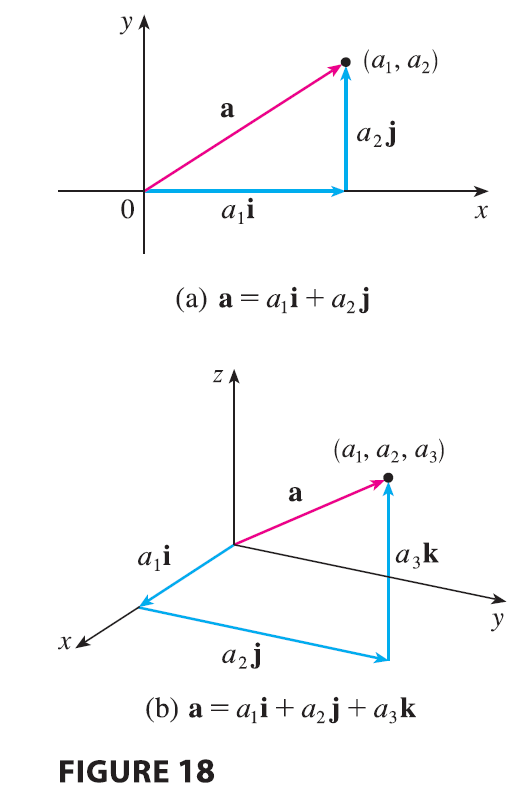

----------

**EXAMPLE 5** If $\mathbf{a} = \mathbf{i} + 2\mathbf{j} - 3\mathbf{k}$ and $\mathbf{b} = 4\mathbf{i} + 7\mathbf{k}$, express the vector $2\mathbf{a} + 3\mathbf{b}$ in terms of **i**, **j**, and **k**.

<ans>

**SOLUTION** Using Properties 1, 2, 5, 6, and 7 of vectors, we have
$$
2\mathbf{a} + 3\mathbf{b} = 2(\mathbf{i} + 2\mathbf{j} - 3\mathbf{k}) + 3(4\mathbf{i} + 7\mathbf{k})
$$
$$
= 2\mathbf{i} + 4\mathbf{j} - 6\mathbf{k} + 12\mathbf{i} + 21\mathbf{k} = 14\mathbf{i} + 4\mathbf{j} + 15\mathbf{k}
$$

</ans>

</page>

<page>

# Unit Vector

A **unit vector** is a vector whose length is 1. For instance, **i**, **j**, and **k** are all unit vectors. In general, if $\mathbf{a} \ne \mathbf{0}$, then the unit vector that has the same direction as **a** is
$$
\mathbf{u} = \frac{1}{|\mathbf{a}|}\mathbf{a} = \frac{\mathbf{a}}{|\mathbf{a}|}
\tag{4}
$$
In order to verify this, we let $c = 1/|\mathbf{a}|$. Then $\mathbf{u} = c\mathbf{a}$ and $c$ is a positive scalar, so **u** has the same direction as **a**. Also
$$
|\mathbf{u}| = |c\mathbf{a}| = |c||\mathbf{a}| = \frac{1}{|\mathbf{a}|}|\mathbf{a}| = 1
$$

--------

**EXAMPLE 6** Find the unit vector in the direction of the vector $2\mathbf{i} - \mathbf{j} - 2\mathbf{k}$.

<ans>

**SOLUTION** The given vector has length
$$
|2\mathbf{i} - \mathbf{j} - 2\mathbf{k}| = \sqrt{2^2 + (-1)^2 + (-2)^2} = \sqrt{9} = 3
$$
so, by Equation 4, the unit vector with the same direction is
$$
\frac{1}{3}(2\mathbf{i} - \mathbf{j} - 2\mathbf{k}) = \frac{2}{3}\mathbf{i} - \frac{1}{3}\mathbf{j} - \frac{2}{3}\mathbf{k}
$$
</ans>
</page>

<page>

# Applications of vectors

Vectors are useful in many aspects of physics and engineering. In Chapter 13 we will see how they describe the velocity and acceleration of objects moving in space. Here we look at forces.

A **force** is represented by a vector because it has both a magnitude (measured in pounds or newtons) and a direction. If several forces are acting on an object, the **resultant force** experienced by the object is the vector sum of these forces.

---------

**EXAMPLE 7** A 100-lb weight hangs from two wires as shown in Figure 19. Find the tensions (forces) $\mathbf{T}_1$ and $\mathbf{T}_2$ in both wires and the magnitudes of the tensions.

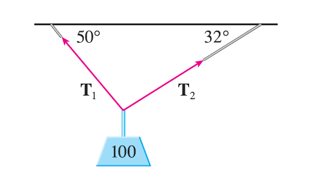

<ans>

**SOLUTION** We first express $\mathbf{T}_1$ and $\mathbf{T}_2$ in terms of their horizontal and vertical components. From Figure 20 we see that

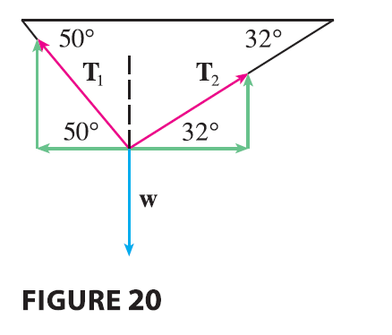

$$
\mathbf{T}_1 = -|\mathbf{T}_1|\cos 50^\circ \mathbf{i} + |\mathbf{T}_1|\sin 50^\circ \mathbf{j}
\tag{5}
$$
$$
\mathbf{T}_2 = |\mathbf{T}_2|\cos 32^\circ \mathbf{i} + |\mathbf{T}_2|\sin 32^\circ \mathbf{j}
\tag{6}
$$
The resultant $\mathbf{T}_1 + \mathbf{T}_2$ of the tensions counterbalances the weight $\mathbf{w} = -100\mathbf{j}$ and so we must have
$$
\mathbf{T}_1 + \mathbf{T}_2 = -\mathbf{w} = 100\mathbf{j}
$$
Thus
$$
(-|\mathbf{T}_1|\cos 50^\circ + |\mathbf{T}_2|\cos 32^\circ)\mathbf{i} + (|\mathbf{T}_1|\sin 50^\circ + |\mathbf{T}_2|\sin 32^\circ)\mathbf{j} = 100\mathbf{j}
$$
Equating components, we get
$$
-|\mathbf{T}_1|\cos 50^\circ + |\mathbf{T}_2|\cos 32^\circ = 0
$$
$$
|\mathbf{T}_1|\sin 50^\circ + |\mathbf{T}_2|\sin 32^\circ = 100
$$
Solving the first of these equations for $|\mathbf{T}_2|$ and substituting into the second, we get
$$
|\mathbf{T}_1|\sin 50^\circ + \frac{|\mathbf{T}_1|\cos 50^\circ}{\cos 32^\circ}\sin 32^\circ = 100
$$
$$
|\mathbf{T}_1|\left(\sin 50^\circ + \cos 50^\circ \frac{\sin 32^\circ}{\cos 32^\circ}\right) = 100
$$
So the magnitudes of the tensions are
$$
|\mathbf{T}_1| = \frac{100}{\sin 50^\circ + \tan 32^\circ \cos 50^\circ} \approx 85.64 \text{ lb}
$$
and
$$
|\mathbf{T}_2| = \frac{|\mathbf{T}_1|\cos 50^\circ}{\cos 32^\circ} \approx 64.91 \text{ lb}
$$
Substituting these values in (5) and (6), we obtain the tension vectors
$$
\mathbf{T}_1 \approx -55.05\mathbf{i} + 65.60\mathbf{j} \quad \mathbf{T}_2 \approx 55.05\mathbf{i} + 34.40\mathbf{j}
$$

</ans>
</page>