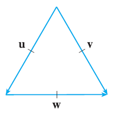
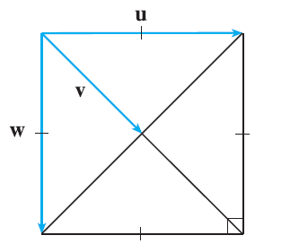
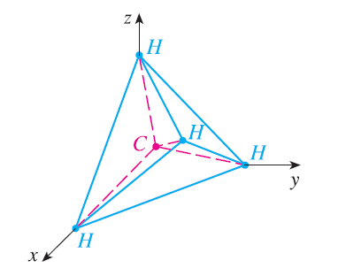

<page>

# Exercise 1

Which of the following expressions are meaningful? Which are meaningless? Explain.
(a) $(\mathbf{a} \cdot \mathbf{b}) \cdot \mathbf{c}$
(b) $(\mathbf{a} \cdot \mathbf{b})\mathbf{c}$
(c) $|\mathbf{a}|(\mathbf{b} \cdot \mathbf{c})$
(d) $\mathbf{a} \cdot (\mathbf{b} + \mathbf{c})$
(e) $\mathbf{a} \cdot \mathbf{b} + \mathbf{c}$
(f) $|\mathbf{a}| \cdot (\mathbf{b} + \mathbf{c})$

</page>
<page>

# Exercise 2

Find $\mathbf{a} \cdot \mathbf{b}$.
$\mathbf{a} = \langle 5, -2 \rangle, \mathbf{b} = \langle 3, 4 \rangle$

</page>
<page>

# Exercise 3

Find $\mathbf{a} \cdot \mathbf{b}$.
$\mathbf{a} = \langle 1.5, 0.4 \rangle, \mathbf{b} = \langle -4, 6 \rangle$

</page>
<page>

# Exercise 4

Find $\mathbf{a} \cdot \mathbf{b}$.
$\mathbf{a} = \langle 6, -2, 3 \rangle, \mathbf{b} = \langle 2, 5, -1 \rangle$

</page>
<page>

# Exercise 5

Find $\mathbf{a} \cdot \mathbf{b}$.
$\mathbf{a} = \langle 4, 1, \frac{1}{4} \rangle, \mathbf{b} = \langle 6, -3, -8 \rangle$

</page>
<page>

# Exercise 6

Find $\mathbf{a} \cdot \mathbf{b}$.
$\mathbf{a} = \langle p, -p, 2p \rangle, \mathbf{b} = \langle 2q, q, -q \rangle$

</page>
<page>

# Exercise 7

Find $\mathbf{a} \cdot \mathbf{b}$.
$\mathbf{a} = 2\mathbf{i} + \mathbf{j}, \mathbf{b} = \mathbf{i} - \mathbf{j} + \mathbf{k}$

</page>
<page>

# Exercise 8

Find $\mathbf{a} \cdot \mathbf{b}$.
$\mathbf{a} = 3\mathbf{i} + 2\mathbf{j} - \mathbf{k}, \mathbf{b} = 4\mathbf{i} + 5\mathbf{k}$

</page>
<page>

# Exercise 9

Find $\mathbf{a} \cdot \mathbf{b}$.
$|\mathbf{a}| = 7, |\mathbf{b}| = 4$, the angle between **a** and **b** is $30^\circ$

</page>
<page>

# Exercise 10

Find $\mathbf{a} \cdot \mathbf{b}$.
$|\mathbf{a}| = 80, |\mathbf{b}| = 50$, the angle between **a** and **b** is $3\pi/4$

</page>
<page>

# Exercise 11

If **u** is a unit vector, find $\mathbf{u} \cdot \mathbf{v}$ and $\mathbf{u} \cdot \mathbf{w}$. (A diagram with an equilateral triangle with side length 1 is shown, with vectors u, v, w forming the sides).

</page>
<page>

# Exercise 12

If **u** is a unit vector, find $\mathbf{u} \cdot \mathbf{v}$ and $\mathbf{u} \cdot \mathbf{w}$. (A diagram with a square with side length 1 is shown, with vectors u, v, w).

</page>
<page>

# Exercise 13

(a) Show that $\mathbf{i} \cdot \mathbf{j} = \mathbf{j} \cdot \mathbf{k} = \mathbf{k} \cdot \mathbf{i} = 0$.
(b) Show that $\mathbf{i} \cdot \mathbf{i} = \mathbf{j} \cdot \mathbf{j} = \mathbf{k} \cdot \mathbf{k} = 1$.

</page>
<page>

# Exercise 14

A street vendor sells $a$ hamburgers, $b$ hot dogs, and $c$ soft drinks on a given day. He charges $2 for a hamburger, $1.50 for a hot dog, and $1 for a soft drink. If $\mathbf{A} = \langle a, b, c \rangle$ and $\mathbf{P} = \langle 2, 1.5, 1 \rangle$, what is the meaning of the dot product $\mathbf{A} \cdot \mathbf{P}$?

</page>
<page>

# Exercise 15

Find the angle between the vectors. (First find an exact expression and then approximate to the nearest degree.)
$\mathbf{a} = \langle 4, 3 \rangle, \mathbf{b} = \langle 2, -1 \rangle$

</page>
<page>

# Exercise 16

Find the angle between the vectors. (First find an exact expression and then approximate to the nearest degree.)
$\mathbf{a} = \langle -2, 5 \rangle, \mathbf{b} = \langle 5, 12 \rangle$

</page>
<page>

# Exercise 17

Find the angle between the vectors. (First find an exact expression and then approximate to the nearest degree.)
$\mathbf{a} = \langle 1, -4, 1 \rangle, \mathbf{b} = \langle 0, 2, -2 \rangle$

</page>
<page>

# Exercise 18

Find the angle between the vectors. (First find an exact expression and then approximate to the nearest degree.)
$\mathbf{a} = \langle -1, 3, 4 \rangle, \mathbf{b} = \langle 5, 2, 1 \rangle$

</page>
<page>

# Exercise 19

Find the angle between the vectors. (First find an exact expression and then approximate to the nearest degree.)
$\mathbf{a} = 4\mathbf{i} - 3\mathbf{j} + \mathbf{k}, \mathbf{b} = 2\mathbf{i} - \mathbf{k}$

</page>
<page>

# Exercise 20

Find the angle between the vectors. (First find an exact expression and then approximate to the nearest degree.)
$\mathbf{a} = 8\mathbf{i} - \mathbf{j} + 4\mathbf{k}, \mathbf{b} = 4\mathbf{j} + 2\mathbf{k}$

</page>
<page>

# Exercise 21

Find, correct to the nearest degree, the three angles of the triangle with the given vertices.
$P(2, 0), Q(0, 3), R(3, 4)$

</page>
<page>

# Exercise 22

Find, correct to the nearest degree, the three angles of the triangle with the given vertices.
$A(1, 0, -1), B(3, -2, 0), C(1, 3, 3)$

</page>
<page>

# Exercise 23

Determine whether the given vectors are orthogonal, parallel, or neither.
(a) $\mathbf{a} = \langle 9, 3 \rangle, \mathbf{b} = \langle -2, 6 \rangle$
(b) $\mathbf{a} = \langle 4, 5, -2 \rangle, \mathbf{b} = \langle 3, -1, 5 \rangle$
(c) $\mathbf{a} = -8\mathbf{i} + 12\mathbf{j} + 4\mathbf{k}, \mathbf{b} = 6\mathbf{i} - 9\mathbf{j} - 3\mathbf{k}$
(d) $\mathbf{a} = 3\mathbf{i} - \mathbf{j} + 3\mathbf{k}, \mathbf{b} = 5\mathbf{i} + 9\mathbf{j} - 2\mathbf{k}$

</page>
<page>

# Exercise 24

Determine whether the given vectors are orthogonal, parallel, or neither.
(a) $\mathbf{u} = \langle -5, 4, -2 \rangle, \mathbf{v} = \langle 3, 4, -1 \rangle$
(b) $\mathbf{u} = 9\mathbf{i} - 6\mathbf{j} + 3\mathbf{k}, \mathbf{v} = -6\mathbf{i} + 4\mathbf{j} - 2\mathbf{k}$
(c) $\mathbf{u} = \langle c, c, c \rangle, \mathbf{v} = \langle c, 0, -c \rangle$

</page>
<page>

# Exercise 25

Use vectors to decide whether the triangle with vertices $P(1, -3, -2), Q(2, 0, -4),$ and $R(6, -2, -5)$ is right-angled.

</page>
<page>

# Exercise 26

Find the values of $x$ such that the angle between the vectors $\langle 2, 1, -1 \rangle$ and $\langle 1, x, 0 \rangle$ is $45^\circ$.

</page>
<page>

# Exercise 27

Find a unit vector that is orthogonal to both $\mathbf{i} + \mathbf{j}$ and $\mathbf{i} + \mathbf{k}$.

</page>
<page>

# Exercise 28

Find two unit vectors that make an angle of $60^\circ$ with $\mathbf{v} = \langle 3, 4 \rangle$.

</page>
<page>

# Exercise 29

Find the acute angle between the lines.
$2x - y = 3, 3x + y = 7$

</page>
<page>

# Exercise 30

Find the acute angle between the lines.
$x + 2y = 7, 5x - y = 2$

</page>
<page>

# Exercise 31

Find the acute angles between the curves at their points of intersection. (The angle between two curves is the angle between their tangent lines at the point of intersection.)
$y = x^2, y = x^3$

</page>
<page>

# Exercise 32

Find the acute angles between the curves at their points of intersection. (The angle between two curves is the angle between their tangent lines at the point of intersection.)
$y = \sin x, y = \cos x, 0 \le x \le \pi/2$

</page>
<page>

# Exercise 33

Find the direction cosines and direction angles of the vector. (Give the direction angles correct to the nearest degree.)
$\langle 2, 1, 2 \rangle$

</page>
<page>

# Exercise 34

Find the direction cosines and direction angles of the vector. (Give the direction angles correct to the nearest degree.)
$\langle 6, 3, -2 \rangle$

</page>
<page>

# Exercise 35

Find the direction cosines and direction angles of the vector. (Give the direction angles correct to the nearest degree.)
$\mathbf{i} - 2\mathbf{j} - 3\mathbf{k}$

</page>
<page>

# Exercise 36

Find the direction cosines and direction angles of the vector. (Give the direction angles correct to the nearest degree.)
$\langle 1, 1, 1 \rangle$

</page>
<page>

# Exercise 37

Find the direction cosines and direction angles of the vector. (Give the direction angles correct to the nearest degree.)
$\langle c, c, c \rangle$, where $c > 0$

</page>
<page>

# Exercise 38

If a vector has direction angles $\alpha = \pi/4$ and $\beta = \pi/3$, find the third direction angle $\gamma$.

</page>
<page>

# Exercise 39

Find the scalar and vector projections of **b** onto **a**.
$\mathbf{a} = \langle -5, 12 \rangle, \mathbf{b} = \langle 4, 6 \rangle$

</page>
<page>

# Exercise 40

Find the scalar and vector projections of **b** onto **a**.
$\mathbf{a} = \langle 1, 4 \rangle, \mathbf{b} = \langle 2, 3 \rangle$

</page>
<page>

# Exercise 41

Find the scalar and vector projections of **b** onto **a**.
$\mathbf{a} = \langle 4, 7, -4 \rangle, \mathbf{b} = \langle 3, -1, 1 \rangle$

</page>
<page>

# Exercise 42

Find the scalar and vector projections of **b** onto **a**.
$\mathbf{a} = \langle -1, 4, 8 \rangle, \mathbf{b} = \langle 12, 1, 2 \rangle$

</page>
<page>

# Exercise 43

Find the scalar and vector projections of **b** onto **a**.
$\mathbf{a} = 3\mathbf{i} - 3\mathbf{j} + \mathbf{k}, \mathbf{b} = 2\mathbf{i} + 4\mathbf{j} - \mathbf{k}$

</page>
<page>

# Exercise 44

Find the scalar and vector projections of **b** onto **a**.
$\mathbf{a} = \mathbf{i} + 2\mathbf{j} + 3\mathbf{k}, \mathbf{b} = 5\mathbf{i} - \mathbf{k}$

</page>
<page>

# Exercise 45

Show that the vector $\text{orth}_\mathbf{a}\mathbf{b} = \mathbf{b} - \text{proj}_\mathbf{a}\mathbf{b}$ is orthogonal to **a**. (It is called an orthogonal projection of **b**.)

</page>
<page>

# Exercise 46

For the vectors in Exercise 40, find $\text{orth}_\mathbf{a}\mathbf{b}$ and illustrate by drawing the vectors **a**, **b**, $\text{proj}_\mathbf{a}\mathbf{b}$, and $\text{orth}_\mathbf{a}\mathbf{b}$.

</page>
<page>

# Exercise 47

If $\mathbf{a} = \langle 3, 0, -1 \rangle$, find a vector **b** such that $\text{comp}_\mathbf{a}\mathbf{b} = 2$.

</page>
<page>

# Exercise 48

Suppose that **a** and **b** are nonzero vectors.
(a) Under what circumstances is $\text{comp}_\mathbf{a}\mathbf{b} = \text{comp}_\mathbf{b}\mathbf{a}$?
(b) Under what circumstances is $\text{proj}_\mathbf{a}\mathbf{b} = \text{proj}_\mathbf{b}\mathbf{a}$?

</page>
<page>

# Exercise 49

Find the work done by a force $\mathbf{F} = 8\mathbf{i} - 6\mathbf{j} + 9\mathbf{k}$ that moves an object from the point $(0, 10, 8)$ to the point $(6, 12, 20)$ along a straight line. The distance is measured in meters and the force in newtons.

</page>
<page>

# Exercise 50

A tow truck drags a stalled car along a road. The chain makes an angle of $30^\circ$ with the road and the tension in the chain is 1500 N. How much work is done by the truck in pulling the car 1 km?

</page>
<page>

# Exercise 51

A sled is pulled along a level path through snow by a rope. A 30-lb force acting at an angle of $40^\circ$ above the horizontal moves the sled 80 ft. Find the work done by the force.

</page>
<page>

# Exercise 52

A boat sails south with the help of a wind blowing in the direction S36°E with magnitude 400 lb. Find the work done by the wind as the boat moves 120 ft.

</page>
<page>

# Exercise 53

Use a scalar projection to show that the distance from a point $P_1(x_1, y_1)$ to the line $ax + by + c = 0$ is
$$ \frac{|ax_1 + by_1 + c|}{\sqrt{a^2 + b^2}} $$
Use this formula to find the distance from the point $(-2, 3)$ to the line $3x - 4y + 5 = 0$.

</page>
<page>

# Exercise 54

If $\mathbf{r} = \langle x, y, z \rangle, \mathbf{a} = \langle a_1, a_2, a_3 \rangle,$ and $\mathbf{b} = \langle b_1, b_2, b_3 \rangle$, show that the vector equation $(\mathbf{r} - \mathbf{a}) \cdot (\mathbf{r} - \mathbf{b}) = 0$ represents a sphere, and find its center and radius.

</page>
<page>

# Exercise 55

Find the angle between a diagonal of a cube and one of its edges.

</page>
<page>

# Exercise 56

Find the angle between a diagonal of a cube and a diagonal of one of its faces.

</page>
<page>

# Exercise 57

A molecule of methane, CH$_4$, is structured with the four hydrogen atoms at the vertices of a regular tetrahedron and the carbon atom at the centroid. The bond angle is the angle formed by the H-C-H combination; it is the angle between the lines that join the carbon atom to two of the hydrogen atoms. Show that the bond angle is about $109.5^\circ$. [Hint: Take the vertices of the tetrahedron to be the points (1, 0, 0), (0, 1, 0), (0, 0, 1), and (1, 1, 1), as shown in the figure. Then the centroid is $(\frac{1}{2}, \frac{1}{2}, \frac{1}{2})$.]

</page>
<page>

# Exercise 58

If $\mathbf{c} = |\mathbf{a}|\mathbf{b} + |\mathbf{b}|\mathbf{a}$, where **a**, **b**, and **c** are all nonzero vectors, show that **c** bisects the angle between **a** and **b**.

</page>
<page>

# Exercise 59

Prove Properties 2, 4, and 5 of the dot product (Theorem 2).

</page>
<page>

# Exercise 60

Suppose that all sides of a quadrilateral are equal in length and opposite sides are parallel. Use vector methods to show that the diagonals are perpendicular.

</page>
<page>

# Exercise 61

Use Theorem 3 to prove the Cauchy-Schwarz Inequality:
$|\mathbf{a} \cdot \mathbf{b}| \le |\mathbf{a}||\mathbf{b}|$

</page>
<page>

# Exercise 62

The Triangle Inequality for vectors is
$|\mathbf{a} + \mathbf{b}| \le |\mathbf{a}| + |\mathbf{b}|$
(a) Give a geometric interpretation of the Triangle Inequality.
(b) Use the Cauchy-Schwarz Inequality from Exercise 61 to prove the Triangle Inequality. [Hint: Use the fact that $|\mathbf{a} + \mathbf{b}|^2 = (\mathbf{a} + \mathbf{b}) \cdot (\mathbf{a} + \mathbf{b})$ and use Property 3 of the dot product.]

</page>
<page>

# Exercise 63

The Parallelogram Law states that
$|\mathbf{a} + \mathbf{b}|^2 + |\mathbf{a} - \mathbf{b}|^2 = 2|\mathbf{a}|^2 + 2|\mathbf{b}|^2$
(a) Give a geometric interpretation of the Parallelogram Law.
(b) Prove the Parallelogram Law. (See the hint in Exercise 62.)

</page>
<page>

# Exercise 64

Show that if $\mathbf{u} + \mathbf{v}$ and $\mathbf{u} - \mathbf{v}$ are orthogonal, then the vectors **u** and **v** must have the same length.

</page>
<page>

# Exercise 65

If $\theta$ is the angle between vectors **a** and **b**, show that
$\text{proj}_\mathbf{a}(\text{proj}_\mathbf{a}\mathbf{b}) = (\mathbf{a} \cdot \mathbf{b})\cos^2\theta$

</page>
