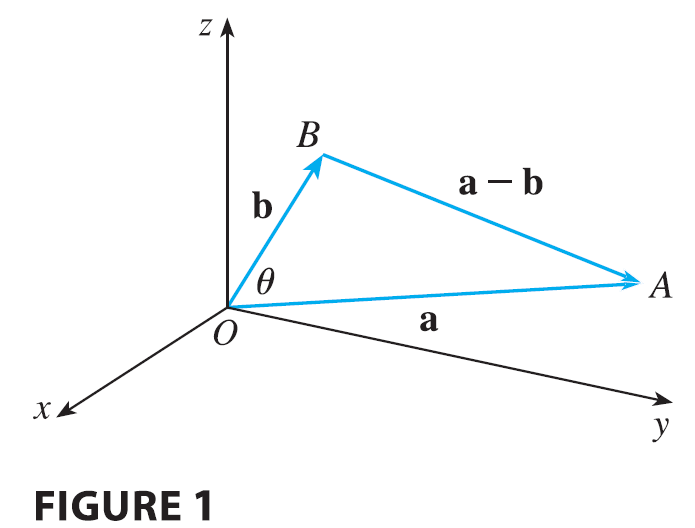
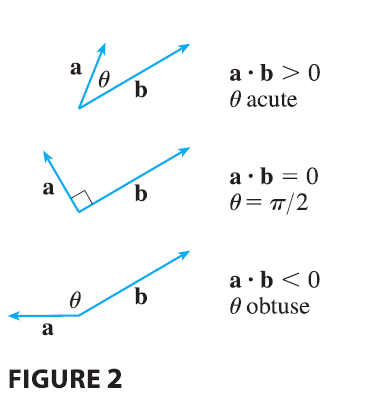
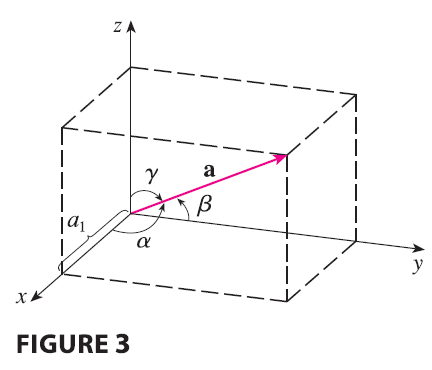
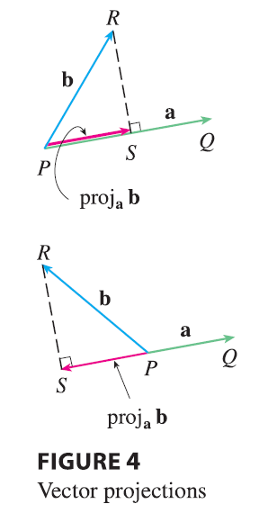
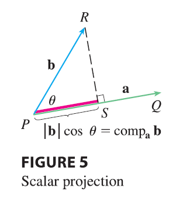
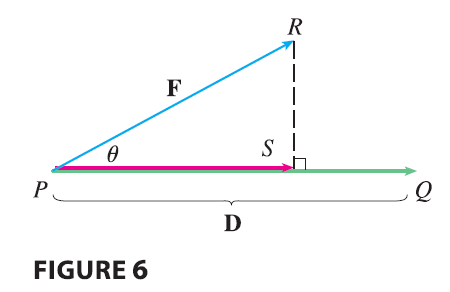
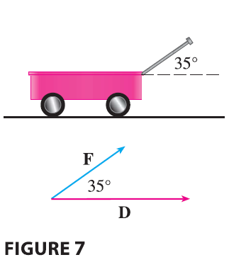

<page>

# The Dot Product

So far we have added two vectors and multiplied a vector by a scalar. The question arises: is it possible to multiply two vectors so that their product is a useful quantity? One such product is the dot product, whose definition follows. Another is the cross product, which is discussed in the next section.

-------

**Definition 1** If $\mathbf{a} = \langle a_1, a_2, a_3 \rangle$ and $\mathbf{b} = \langle b_1, b_2, b_3 \rangle$, then the **dot product** of **a** and **b** is the number $\mathbf{a} \cdot \mathbf{b}$ given by
$$
\mathbf{a} \cdot \mathbf{b} = a_1b_1 + a_2b_2 + a_3b_3
$$

--------

Thus, to find the dot product of **a** and **b**, we multiply corresponding components and add. The result is not a vector. It is a real number, that is, a scalar. For this reason, the dot product is sometimes called the **scalar product** (or **inner product**). Although Definition 1 is given for three-dimensional vectors, the dot product of two-dimensional vectors is defined in a similar fashion:
$$
\langle a_1, a_2 \rangle \cdot \langle b_1, b_2 \rangle = a_1b_1 + a_2b_2
$$

----------

**EXAMPLE 1**
$$
\langle 2, 4 \rangle \cdot \langle 3, -1 \rangle = 2(3) + 4(-1) = 2
$$
$$
\langle -1, 7, 4 \rangle \cdot \langle 6, 2, -\frac{1}{2} \rangle = (-1)(6) + 7(2) + 4(-\frac{1}{2}) = 6
$$
$$
(\mathbf{i} + 2\mathbf{j} - 3\mathbf{k}) \cdot (2\mathbf{j} - \mathbf{k}) = 1(0) + 2(2) + (-3)(-1) = 7
$$

</page>

<page>

# Properties of Dot Product

The dot product obeys many of the laws that hold for ordinary products of real numbers. These are stated in the following theorem.

---

**Properties of the Dot Product 2** If **a**, **b**, and **c** are vectors in $V_3$ and $c$ is a scalar, then
1. $\mathbf{a} \cdot \mathbf{a} = |\mathbf{a}|^2$
2. $\mathbf{a} \cdot \mathbf{b} = \mathbf{b} \cdot \mathbf{a}$
3. $\mathbf{a} \cdot (\mathbf{b} + \mathbf{c}) = \mathbf{a} \cdot \mathbf{b} + \mathbf{a} \cdot \mathbf{c}$
4. $(c\mathbf{a}) \cdot \mathbf{b} = c(\mathbf{a} \cdot \mathbf{b}) = \mathbf{a} \cdot (c\mathbf{b})$
5. $\mathbf{0} \cdot \mathbf{a} = 0$

---

These properties are easily proved using Definition 1. For instance, here are the proofs of Properties 1 and 3:
1. $\mathbf{a} \cdot \mathbf{a} = a_1^2 + a_2^2 + a_3^2 = |\mathbf{a}|^2$
3. $\mathbf{a} \cdot (\mathbf{b} + \mathbf{c}) = \langle a_1, a_2, a_3 \rangle \cdot \langle b_1 + c_1, b_2 + c_2, b_3 + c_3 \rangle$
$= a_1(b_1 + c_1) + a_2(b_2 + c_2) + a_3(b_3 + c_3)$
$= a_1b_1 + a_1c_1 + a_2b_2 + a_2c_2 + a_3b_3 + a_3c_3$
$= (a_1b_1 + a_2b_2 + a_3b_3) + (a_1c_1 + a_2c_2 + a_3c_3)$
$= \mathbf{a} \cdot \mathbf{b} + \mathbf{a} \cdot \mathbf{c}$

The proofs of the remaining properties are left as exercises.

</page>

<page>

# Geometric Intepretation of Dot Product

The dot product $\mathbf{a} \cdot \mathbf{b}$ can be given a geometric interpretation in terms of the angle $\theta$ between **a** and **b**, which is defined to be the angle between the representations of **a** and **b** that start at the origin, where $0 \le \theta \le \pi$. In other words, $\theta$ is the angle between the line segments $\vec{OA}$ and $\vec{OB}$ in Figure 1. 

Note that if **a** and **b** are parallel vectors, then $\theta = 0$ or $\theta = \pi$.

The formula in the following theorem is used by physicists as the definition of the dot product.

---

**Theorem 3** If $\theta$ is the angle between the vectors **a** and **b**, then
$$
\mathbf{a} \cdot \mathbf{b} = |\mathbf{a}||\mathbf{b}|\cos\theta
$$

---

**PROOF** If we apply the Law of Cosines to triangle OAB in Figure 1, we get
$$
|\vec{AB}|^2 = |\vec{OA}|^2 + |\vec{OB}|^2 - 2|\vec{OA}||\vec{OB}|\cos\theta
\tag{4}
$$
(Observe that the Law of Cosines still applies in the limiting cases when $\theta = 0$ or $\pi$, or $\mathbf{a} = \mathbf{0}$ or $\mathbf{b} = \mathbf{0}$.) But $|\vec{OA}| = |\mathbf{a}|, |\vec{OB}| = |\mathbf{b}|$, and $|\vec{AB}| = |\mathbf{a} - \mathbf{b}|$, so Equation 4 becomes
$$
|\mathbf{a} - \mathbf{b}|^2 = |\mathbf{a}|^2 + |\mathbf{b}|^2 - 2|\mathbf{a}||\mathbf{b}|\cos\theta
\tag{5}
$$
Using Properties 1, 2, and 3 of the dot product, we can rewrite the left side of this equation as follows:
$$
|\mathbf{a} - \mathbf{b}|^2 = (\mathbf{a} - \mathbf{b}) \cdot (\mathbf{a} - \mathbf{b}) = \mathbf{a} \cdot \mathbf{a} - \mathbf{a} \cdot \mathbf{b} - \mathbf{b} \cdot \mathbf{a} + \mathbf{b} \cdot \mathbf{b} = |\mathbf{a}|^2 - 2\mathbf{a} \cdot \mathbf{b} + |\mathbf{b}|^2
$$
Therefore Equation 5 gives
$$
|\mathbf{a}|^2 - 2\mathbf{a} \cdot \mathbf{b} + |\mathbf{b}|^2 = |\mathbf{a}|^2 + |\mathbf{b}|^2 - 2|\mathbf{a}||\mathbf{b}|\cos\theta
$$
Thus
$$
-2\mathbf{a} \cdot \mathbf{b} = -2|\mathbf{a}||\mathbf{b}|\cos\theta
$$
or
$$
\mathbf{a} \cdot \mathbf{b} = |\mathbf{a}||\mathbf{b}|\cos\theta
$$

-----

**EXAMPLE 2** If the vectors **a** and **b** have lengths 4 and 6, and the angle between them is $\pi/3$, find $\mathbf{a} \cdot \mathbf{b}$.

<ans>

**SOLUTION** Using Theorem 3, we have
$$
\mathbf{a} \cdot \mathbf{b} = |\mathbf{a}||\mathbf{b}|\cos(\pi/3) = 4 \cdot 6 \cdot \frac{1}{2} = 12
$$
The formula in Theorem 3 also enables us to find the angle between two vectors.

---

**Corollary 6** If $\theta$ is the angle between the nonzero vectors **a** and **b**, then
$$
\cos\theta = \frac{\mathbf{a} \cdot \mathbf{b}}{|\mathbf{a}||\mathbf{b}|}
$$

</ans>

------

**EXAMPLE 3** Find the angle between the vectors $\mathbf{a} = \langle 2, 2, -1 \rangle$ and $\mathbf{b} = \langle 5, -3, 2 \rangle$.

<ans>

**SOLUTION** Since
$$
|\mathbf{a}| = \sqrt{2^2 + 2^2 + (-1)^2} = 3 \quad \text{and} \quad |\mathbf{b}| = \sqrt{5^2 + (-3)^2 + 2^2} = \sqrt{38}
$$
and since
$$
\mathbf{a} \cdot \mathbf{b} = 2(5) + 2(-3) + (-1)(2) = 2
$$
we have, from Corollary 6,
$$
\cos\theta = \frac{\mathbf{a} \cdot \mathbf{b}}{|\mathbf{a}||\mathbf{b}|} = \frac{2}{3\sqrt{38}}
$$
So the angle between **a** and **b** is
$$
\theta = \cos^{-1}\left(\frac{2}{3\sqrt{38}}\right) \approx 1.46 \text{ (or } 84^\circ)
$$
</ans>

</page>

<page>

# Use of dot product to check perpendicularity of two vectors

Two nonzero vectors **a** and **b** are called **perpendicular** or **orthogonal** if the angle between them is $\theta = \pi/2$. Then Theorem 3 gives
$$
\mathbf{a} \cdot \mathbf{b} = |\mathbf{a}||\mathbf{b}|\cos(\pi/2) = 0
$$
and conversely if $\mathbf{a} \cdot \mathbf{b} = 0$, then $\cos\theta = 0$, so $\theta = \pi/2$. The zero vector **0** is considered to be perpendicular to all vectors. Therefore we have the following method for determining whether two vectors are orthogonal.

---

**Theorem 7**: Two vectors **a** and **b** are orthogonal if and only if 

$$\mathbf{a} \cdot \mathbf{b} = 0$$.

---

**EXAMPLE 4** Show that $2\mathbf{i} + 2\mathbf{j} - \mathbf{k}$ is perpendicular to $5\mathbf{i} - 4\mathbf{j} + 2\mathbf{k}$.

<ans>

**SOLUTION** Since
$$
(2\mathbf{i} + 2\mathbf{j} - \mathbf{k}) \cdot (5\mathbf{i} - 4\mathbf{j} + 2\mathbf{k}) = 2(5) + 2(-4) + (-1)(2) = 0
$$
these vectors are perpendicular by (7).

</ans>

</page>

<page>

# Direction Angles and Direction Cosine

Because $\cos\theta > 0$ if $0 \le \theta < \pi/2$ and $\cos\theta < 0$ if $\pi/2 < \theta \le \pi$, we see that $\mathbf{a} \cdot \mathbf{b}$ is positive for $\theta < \pi/2$ and negative for $\theta > \pi/2$. We can think of $\mathbf{a} \cdot \mathbf{b}$ as measuring the extent to which **a** and **b** point in the same direction. The dot product $\mathbf{a} \cdot \mathbf{b}$ is positive if **a** and **b** point in the same general direction, 0 if they are perpendicular, and negative if they point in generally opposite directions (see Figure 2). In the extreme case where **a** and **b** point in exactly the same direction, we have $\theta = 0$, so $\cos\theta = 1$ and
$$
\mathbf{a} \cdot \mathbf{b} = |\mathbf{a}||\mathbf{b}|
$$
If **a** and **b** point in exactly opposite directions, then we have $\theta = \pi$ and so $\cos\theta = -1$ and $\mathbf{a} \cdot \mathbf{b} = -|\mathbf{a}||\mathbf{b}|$.

### Direction Angles and Direction Cosines

The **direction angles** of a nonzero vector **a** are the angles $\alpha, \beta,$ and $\gamma$ (in the interval $[0, \pi]$) that **a** makes with the positive x-, y-, and z-axes, respectively. (See Figure 3.)

The cosines of these direction angles, $\cos\alpha, \cos\beta,$ and $\cos\gamma$, are called the **direction cosines** of the vector **a**. Using Corollary 6 with **b** replaced by **i**, we obtain
$$
\cos\alpha = \frac{\mathbf{a} \cdot \mathbf{i}}{|\mathbf{a}||\mathbf{i}|} = \frac{a_1}{|\mathbf{a}|}
\tag{8}
$$
(This can also be seen directly from Figure 3.)
Similarly, we also have
$$
\cos\beta = \frac{a_2}{|\mathbf{a}|} \quad \cos\gamma = \frac{a_3}{|\mathbf{a}|}
\tag{9}
$$
By squaring the expressions in Equations 8 and 9 and adding, we see that
$$
\cos^2\alpha + \cos^2\beta + \cos^2\gamma = 1
\tag{10}
$$
We can also use Equations 8 and 9 to write
$$
\mathbf{a} = \langle a_1, a_2, a_3 \rangle = \langle |\mathbf{a}|\cos\alpha, |\mathbf{a}|\cos\beta, |\mathbf{a}|\cos\gamma \rangle = |\mathbf{a}|\langle \cos\alpha, \cos\beta, \cos\gamma \rangle
$$
Therefore
$$
\frac{1}{|\mathbf{a}|}\mathbf{a} = \langle \cos\alpha, \cos\beta, \cos\gamma \rangle
\tag{11}
$$
which says that the direction cosines of **a** are the components of the unit vector in the direction of **a**.

---------

**EXAMPLE 5** Find the direction angles of the vector $\mathbf{a} = \langle 1, 2, 3 \rangle$.

<ans>

**SOLUTION** Since $|\mathbf{a}| = \sqrt{1^2 + 2^2 + 3^2} = \sqrt{14}$, Equations 8 and 9 give
$$
\cos\alpha = \frac{1}{\sqrt{14}} \quad \cos\beta = \frac{2}{\sqrt{14}} \quad \cos\gamma = \frac{3}{\sqrt{14}}
$$
and so
$$
\alpha = \cos^{-1}\left(\frac{1}{\sqrt{14}}\right) \approx 74^\circ \quad \beta = \cos^{-1}\left(\frac{2}{\sqrt{14}}\right) \approx 58^\circ \quad \gamma = \cos^{-1}\left(\frac{3}{\sqrt{14}}\right) \approx 37^\circ
$$

</ans>
</page>

<page>

# Projections

Figure 4 shows representations $\vec{PQ}$ and $\vec{PR}$ of two vectors **a** and **b** with the same initial point $P$. If $S$ is the foot of the perpendicular from $R$ to the line containing $\vec{PQ}$, then the vector with representation $\vec{PS}$ is called the **vector projection** of **b** onto **a** and is denoted by proj$_\mathbf{a}$**b**.

The **scalar projection** of **b** onto **a** (also called the **component** of **b** along **a**) is defined to be the signed magnitude of the vector projection, which is the number $|\mathbf{b}|\cos\theta$, where $\theta$ is the angle between **a** and **b**. (See Figure 5.) This is denoted by comp$_\mathbf{a}$**b**. Observe that it is negative if $\pi/2 < \theta \le \pi$. The equation
$$
\mathbf{a} \cdot \mathbf{b} = |\mathbf{a}||\mathbf{b}|\cos\theta = |\mathbf{a}|(|\mathbf{b}|\cos\theta)
$$
shows that the dot product of **a** and **b** can be interpreted as the length of **a** times the scalar projection of **b** onto **a**. Since
$$
|\mathbf{b}|\cos\theta = \frac{\mathbf{a} \cdot \mathbf{b}}{|\mathbf{a}|} = \frac{\mathbf{a}}{|\mathbf{a}|} \cdot \mathbf{b}
$$
the component of **b** along **a** can be computed by taking the dot product of **b** with the unit vector in the direction of **a**. We summarize these ideas as follows.

Scalar projection of **b** onto **a**: $\text{comp}_\mathbf{a}\mathbf{b} = \frac{\mathbf{a} \cdot \mathbf{b}}{|\mathbf{a}|}$
Vector projection of **b** onto **a**: $\text{proj}_\mathbf{a}\mathbf{b} = \left(\frac{\mathbf{a} \cdot \mathbf{b}}{|\mathbf{a}|}\right)\frac{\mathbf{a}}{|\mathbf{a}|} = \frac{\mathbf{a} \cdot \mathbf{b}}{|\mathbf{a}|^2}\mathbf{a}$

Notice that the vector projection is the scalar projection times the unit vector in the direction of **a**.

---------

**EXAMPLE 6** Find the scalar projection and vector projection of $\mathbf{b} = \langle 1, 1, 2 \rangle$ onto $\mathbf{a} = \langle -2, 3, 1 \rangle$.

<ans>

**SOLUTION** Since $|\mathbf{a}| = \sqrt{(-2)^2 + 3^2 + 1^2} = \sqrt{14}$, the scalar projection of **b** onto **a** is
$$
\text{comp}_\mathbf{a}\mathbf{b} = \frac{\mathbf{a} \cdot \mathbf{b}}{|\mathbf{a}|} = \frac{(-2)(1) + 3(1) + 1(2)}{\sqrt{14}} = \frac{3}{\sqrt{14}}
$$
The vector projection is this scalar projection times the unit vector in the direction of **a**:
$$
\text{proj}_\mathbf{a}\mathbf{b} = \frac{3}{\sqrt{14}}\frac{\mathbf{a}}{|\mathbf{a}|} = \frac{3}{14}\mathbf{a} = \left\langle -\frac{6}{14}, \frac{9}{14}, \frac{3}{14} \right\rangle = \left\langle -\frac{3}{7}, \frac{9}{14}, \frac{3}{14} \right\rangle
$$

</ans>

</page>

<page>

# Use of Projection in Physics: Force & Work

One use of projections occurs in physics in calculating **work**. We know that the work done by a constant force $F$ in moving an object through a distance $d$ as $W = Fd$, but this applies only when the force is directed along the line of motion of the object. Suppose, however, that the constant force is a vector $\mathbf{F} = \vec{PR}$ pointing in some other direction, as in Figure 6. If the force moves the object from $P$ to $Q$, then the displacement vector is $\mathbf{D} = \vec{PQ}$. The work done by this force is defined to be the product of the component of the force along **D** and the distance moved:
$$
W = (|\mathbf{F}|\cos\theta)|\mathbf{D}|
$$
But then, from Theorem 3, we have
$$
W = |\mathbf{F}||\mathbf{D}|\cos\theta = \mathbf{F} \cdot \mathbf{D}
\tag{12}
$$
Thus the work done by a constant force **F** is the dot product $\mathbf{F} \cdot \mathbf{D}$, where **D** is the displacement vector.

---------

**EXAMPLE 7** A wagon is pulled a distance of 100 m along a horizontal path by a constant force of 70 N. The handle of the wagon is held at an angle of $35^\circ$ above the horizontal. Find the work done by the force.

<ans>

**SOLUTION** If **F** and **D** are the force and displacement vectors, as pictured in Figure 7, then the work done is
$$
W = \mathbf{F} \cdot \mathbf{D} = |\mathbf{F}||\mathbf{D}|\cos 35^\circ = (70)(100)\cos 35^\circ \approx 5734 \text{ N} \cdot \text{m} = 5734 \text{ J}
$$

<ans>

**EXAMPLE 8** A force is given by a vector $\mathbf{F} = 3\mathbf{i} + 4\mathbf{j} + 5\mathbf{k}$ and moves a particle from the point $P(2, 1, 0)$ to the point $Q(4, 6, 2)$. Find the work done.
**SOLUTION** The displacement vector is $\mathbf{D} = \vec{PQ} = \langle 2, 5, 2 \rangle$, so by Equation 12, the work done is
$$
W = \mathbf{F} \cdot \mathbf{D} = \langle 3, 4, 5 \rangle \cdot \langle 2, 5, 2 \rangle = 6 + 20 + 10 = 36
$$
If the unit of length is meters and the magnitude of the force is measured in newtons, then the work done is 36 J.

</ans>
</page>

