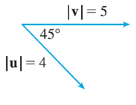
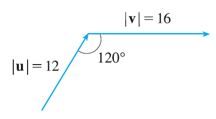
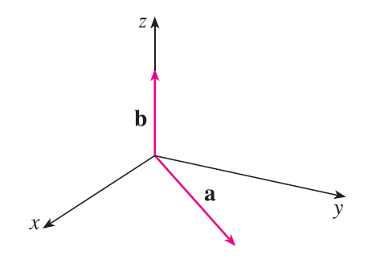
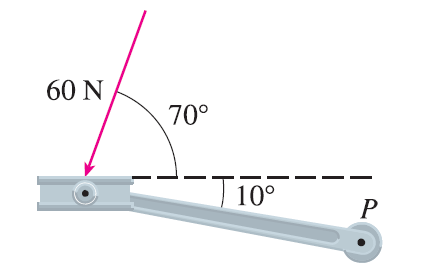
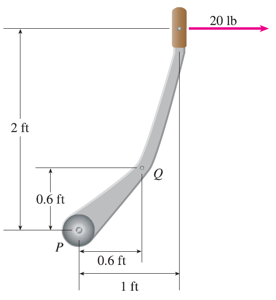

<page>

# Exercise 1

Find the cross product $\mathbf{a} \times \mathbf{b}$ and verify that it is orthogonal to both **a** and **b**.
$\mathbf{a} = \langle 2, 3, 0 \rangle, \mathbf{b} = \langle 1, 0, 5 \rangle$

</page>
<page>

# Exercise 2

Find the cross product $\mathbf{a} \times \mathbf{b}$ and verify that it is orthogonal to both **a** and **b**.
$\mathbf{a} = \langle 4, 3, -2 \rangle, \mathbf{b} = \langle 2, -1, 1 \rangle$

</page>
<page>

# Exercise 3

Find the cross product $\mathbf{a} \times \mathbf{b}$ and verify that it is orthogonal to both **a** and **b**.
$\mathbf{a} = 2\mathbf{j} - 4\mathbf{k}, \mathbf{b} = -\mathbf{i} + 3\mathbf{j} + \mathbf{k}$

</page>
<page>

# Exercise 4

Find the cross product $\mathbf{a} \times \mathbf{b}$ and verify that it is orthogonal to both **a** and **b**.
$\mathbf{a} = 3\mathbf{i} + 3\mathbf{j} - 3\mathbf{k}, \mathbf{b} = 3\mathbf{i} - 3\mathbf{j} + 3\mathbf{k}$

</page>
<page>

# Exercise 5

Find the cross product $\mathbf{a} \times \mathbf{b}$ and verify that it is orthogonal to both **a** and **b**.
$\mathbf{a} = \frac{1}{2}\mathbf{i} + \frac{1}{3}\mathbf{j} + \frac{1}{4}\mathbf{k}, \mathbf{b} = \mathbf{i} + 2\mathbf{j} - 3\mathbf{k}$

</page>
<page>

# Exercise 6

Find the cross product $\mathbf{a} \times \mathbf{b}$ and verify that it is orthogonal to both **a** and **b**.
$\mathbf{a} = t\mathbf{i} + \cos t\mathbf{j} + \sin t\mathbf{k}, \mathbf{b} = \mathbf{i} - \sin t\mathbf{j} + \cos t\mathbf{k}$

</page>
<page>

# Exercise 7

Find the cross product $\mathbf{a} \times \mathbf{b}$ and verify that it is orthogonal to both **a** and **b**.
$\mathbf{a} = \langle t, 1, 1/t \rangle, \mathbf{b} = \langle t^2, t^2, 1 \rangle$

</page>
<page>

# Exercise 8

If $\mathbf{a} = \mathbf{i} - 2\mathbf{k}$ and $\mathbf{b} = \mathbf{j} + \mathbf{k}$, find $\mathbf{a} \times \mathbf{b}$. Sketch **a**, **b**, and $\mathbf{a} \times \mathbf{b}$ as vectors starting at the origin.

</page>
<page>

# Exercise 9

Find the vector, not with determinants, but by using properties of cross products.
$(\mathbf{i} \times \mathbf{j}) \times \mathbf{k}$

</page>
<page>

# Exercise 10

Find the vector, not with determinants, but by using properties of cross products.
$\mathbf{k} \times (\mathbf{i} - 2\mathbf{j})$

</page>
<page>

# Exercise 11

Find the vector, not with determinants, but by using properties of cross products.
$(\mathbf{j} - \mathbf{k}) \times (\mathbf{k} - \mathbf{i})$

</page>
<page>

# Exercise 12

Find the vector, not with determinants, but by using properties of cross products.
$(\mathbf{i} + \mathbf{j}) \times (\mathbf{i} - \mathbf{j})$

</page>
<page>

# Exercise 13

State whether each expression is meaningful. If not, explain why. If so, state whether it is a vector or a scalar.
(a) $\mathbf{a} \cdot (\mathbf{b} \times \mathbf{c})$
(b) $\mathbf{a} \times (\mathbf{b} \cdot \mathbf{c})$
(c) $\mathbf{a} \times (\mathbf{b} \times \mathbf{c})$
(d) $\mathbf{a} \cdot (\mathbf{b} \cdot \mathbf{c})$
(e) $(\mathbf{a} \cdot \mathbf{b}) \times (\mathbf{c} \cdot \mathbf{d})$
(f) $(\mathbf{a} \times \mathbf{b}) \cdot (\mathbf{c} \times \mathbf{d})$

</page>
<page>

# Exercise 14

Find $|\mathbf{u} \times \mathbf{v}|$ and determine whether $\mathbf{u} \times \mathbf{v}$ is directed into the page or out of the page.

</page>
<page>

# Exercise 15

Find $|\mathbf{u} \times \mathbf{v}|$ and determine whether $\mathbf{u} \times \mathbf{v}$ is directed into the page or out of the page.
$|\mathbf{v}|=16, |\mathbf{u}|=12, \theta=120^\circ$

</page>
<page>

# Exercise 16

The figure shows a vector **a** in the xy-plane and a vector **b** in the direction of **k**. Their lengths are $|\mathbf{a}| = 3$ and $|\mathbf{b}| = 2$.
(a) Find $|\mathbf{a} \times \mathbf{b}|$.
(b) Use the right-hand rule to decide whether the components of $\mathbf{a} \times \mathbf{b}$ are positive, negative, or 0.

</page>
<page>

# Exercise 17

If $\mathbf{a} = \langle 2, -1, 3 \rangle$ and $\mathbf{b} = \langle 4, 2, 1 \rangle$, find $\mathbf{a} \times \mathbf{b}$ and $\mathbf{b} \times \mathbf{a}$.

</page>
<page>

# Exercise 18

If $\mathbf{a} = \langle 1, 0, 1 \rangle, \mathbf{b} = \langle 2, 1, -1 \rangle$, and $\mathbf{c} = \langle 0, 1, 3 \rangle$, show that $\mathbf{a} \times (\mathbf{b} \times \mathbf{c}) \ne (\mathbf{a} \times \mathbf{b}) \times \mathbf{c}$.

</page>
<page>

# Exercise 19

Find two unit vectors orthogonal to both $\langle 3, 2, 1 \rangle$ and $\langle -1, 1, 0 \rangle$.

</page>
<page>

# Exercise 20

Find two unit vectors orthogonal to both $\mathbf{j} - \mathbf{k}$ and $\mathbf{i} + \mathbf{j}$.

</page>
<page>

# Exercise 21

Show that $\mathbf{0} \times \mathbf{a} = \mathbf{0} = \mathbf{a} \times \mathbf{0}$ for any vector **a** in $V_3$.

</page>
<page>

# Exercise 22

Show that $(\mathbf{a} \times \mathbf{b}) \cdot \mathbf{b} = 0$ for all vectors **a** and **b** in $V_3$.

</page>
<page>

# Exercise 23

Prove Property 1 of cross products (Theorem 11): $\mathbf{a} \times \mathbf{b} = -\mathbf{b} \times \mathbf{a}$.

</page>
<page>

# Exercise 24

Prove Property 2 of cross products (Theorem 11): $(c\mathbf{a}) \times \mathbf{b} = c(\mathbf{a} \times \mathbf{b}) = \mathbf{a} \times (c\mathbf{b})$.

</page>
<page>

# Exercise 25

Prove Property 3 of cross products (Theorem 11): $\mathbf{a} \times (\mathbf{b} + \mathbf{c}) = \mathbf{a} \times \mathbf{b} + \mathbf{a} \times \mathbf{c}$.

</page>
<page>

# Exercise 26

Prove Property 4 of cross products (Theorem 11): $(\mathbf{a} + \mathbf{b}) \times \mathbf{c} = \mathbf{a} \times \mathbf{c} + \mathbf{b} \times \mathbf{c}$.

</page>
<page>

# Exercise 27

Find the area of the parallelogram with vertices A(-3, 0), B(-1, 3), C(5, 2), and D(3, -1).

</page>
<page>

# Exercise 28

Find the area of the parallelogram with vertices P(1, 0, 2), Q(3, 3, 3), R(7, 5, 8), and S(5, 2, 7).

</page>
<page>

# Exercise 29

(a) Find a nonzero vector orthogonal to the plane through the points P, Q, and R, and (b) find the area of triangle PQR.
$P(1, 0, 1), Q(-2, 1, 3), R(4, 2, 5)$

</page>
<page>

# Exercise 30

(a) Find a nonzero vector orthogonal to the plane through the points P, Q, and R, and (b) find the area of triangle PQR.
$P(0, 0, -3), Q(4, 2, 0), R(3, 3, 1)$

</page>
<page>

# Exercise 31

(a) Find a nonzero vector orthogonal to the plane through the points P, Q, and R, and (b) find the area of triangle PQR.
$P(0, -2, 0), Q(4, 1, -2), R(5, 3, 1)$

</page>
<page>

# Exercise 32

(a) Find a nonzero vector orthogonal to the plane through the points P, Q, and R, and (b) find the area of triangle PQR.
$P(2, -3, 4), Q(-1, -2, 2), R(3, 1, -3)$

</page>
<page>

# Exercise 33

Find the volume of the parallelepiped determined by the vectors **a**, **b**, and **c**.
$\mathbf{a} = \langle 1, 2, 3 \rangle, \mathbf{b} = \langle -1, 1, 2 \rangle, \mathbf{c} = \langle 2, 1, 4 \rangle$

</page>
<page>

# Exercise 34

Find the volume of the parallelepiped determined by the vectors **a**, **b**, and **c**.
$\mathbf{a} = \mathbf{i} + \mathbf{j}, \mathbf{b} = \mathbf{j} + \mathbf{k}, \mathbf{c} = \mathbf{i} + \mathbf{j} + \mathbf{k}$

</page>
<page>

# Exercise 35

Find the volume of the parallelepiped with adjacent edges PQ, PR, and PS.
$P(-2, 1, 0), Q(2, 3, 2), R(1, 4, -1), S(3, 6, 1)$

</page>
<page>

# Exercise 36

Find the volume of the parallelepiped with adjacent edges PQ, PR, and PS.
$P(3, 0, 1), Q(-1, 2, 5), R(5, 1, -1), S(0, 4, 2)$

</page>
<page>

# Exercise 37

Use the scalar triple product to verify that the vectors $\mathbf{u} = \mathbf{i} + 5\mathbf{j} - 2\mathbf{k}, \mathbf{v} = 3\mathbf{i} - \mathbf{j},$ and $\mathbf{w} = 5\mathbf{i} + 9\mathbf{j} - 4\mathbf{k}$ are coplanar.

</page>
<page>

# Exercise 38

Use the scalar triple product to determine whether the points A(1, 3, 2), B(3, -1, 6), C(5, 2, 0), and D(3, 6, -4) lie in the same plane.

</page>
<page>

# Exercise 39

A bicycle pedal is pushed by a foot with a 60-N force as shown. The shaft of the pedal is 18 cm long. Find the magnitude of the torque about P.

</page>
<page>

# Exercise 40

(a) A horizontal force of 20 lb is applied to the handle of a gearshift lever as shown. Find the magnitude of the torque about the pivot point P.
(b) Find the magnitude of the torque about P if the same force is applied at the elbow Q of the lever.

</page>
<page>

# Exercise 41

A wrench 30 cm long lies along the positive y-axis and grips a bolt at the origin. A force is applied in the direction $\langle 0, 3, -4 \rangle$ at the end of the wrench. Find the magnitude of the force needed to supply 100 N·m of torque to the bolt.

</page>
<page>

# Exercise 42

Let $\mathbf{v} = 5\mathbf{j}$ and let **u** be a vector with length 3 that starts at the origin and rotates in the xy-plane. Find the maximum and minimum values of the length of the vector $\mathbf{u} \times \mathbf{v}$. In what direction does $\mathbf{u} \times \mathbf{v}$ point?

</page>
<page>

# Exercise 43

If $\mathbf{a} \cdot \mathbf{b} = \sqrt{3}$ and $\mathbf{a} \times \mathbf{b} = \langle 1, 2, 2 \rangle$, find the angle between **a** and **b**.

</page>
<page>

# Exercise 44

(a) Find all vectors **v** such that $\langle 1, 2, 1 \rangle \times \mathbf{v} = \langle 3, 1, -5 \rangle$.
(b) Explain why there is no vector **v** such that $\langle 1, 2, 1 \rangle \times \mathbf{v} = \langle 3, 1, 5 \rangle$.

</page>
<page>

# Exercise 45

(a) Let P be a point not on the line L that passes through the points Q and R. Show that the distance $d$ from the point P to the line L is
$$ d = \frac{|\mathbf{a} \times \mathbf{b}|}{|\mathbf{a}|} $$
where $\mathbf{a} = \vec{QR}$ and $\mathbf{b} = \vec{QP}$.
(b) Use the formula in part (a) to find the distance from the point P(1, 1, 1) to the line through Q(0, 6, 8) and R(-1, 4, 7).

</page>
<page>

# Exercise 46

(a) Let P be a point not on the plane that passes through the points Q, R, and S. Show that the distance $d$ from P to the plane is
$$ d = \frac{|\mathbf{a} \cdot (\mathbf{b} \times \mathbf{c})|}{|\mathbf{a} \times \mathbf{b}|} $$
where $\mathbf{a} = \vec{QR}, \mathbf{b} = \vec{QS},$ and $\mathbf{c} = \vec{QP}$.
(b) Use the formula in part (a) to find the distance from the point P(2, 1, 4) to the plane through the points Q(1, 0, 0), R(0, 2, 0), and S(0, 0, 3).

</page>
<page>

# Exercise 47

Show that $|\mathbf{a} \times \mathbf{b}|^2 = |\mathbf{a}|^2|\mathbf{b}|^2 - (\mathbf{a} \cdot \mathbf{b})^2$.

</page>
<page>

# Exercise 48

If $\mathbf{a} + \mathbf{b} + \mathbf{c} = \mathbf{0}$, show that $\mathbf{a} \times \mathbf{b} = \mathbf{b} \times \mathbf{c} = \mathbf{c} \times \mathbf{a}$.

</page>
<page>

# Exercise 49

Prove that $(\mathbf{a} - \mathbf{b}) \times (\mathbf{a} + \mathbf{b}) = 2(\mathbf{a} \times \mathbf{b})$.

</page>
<page>

# Exercise 50

Prove Property 6 of cross products, that is, $\mathbf{a} \times (\mathbf{b} \times \mathbf{c}) = (\mathbf{a} \cdot \mathbf{c})\mathbf{b} - (\mathbf{a} \cdot \mathbf{b})\mathbf{c}$.

</page>
<page>

# Exercise 51

Use Exercise 50 to prove that $\mathbf{a} \times (\mathbf{b} \times \mathbf{c}) + \mathbf{b} \times (\mathbf{c} \times \mathbf{a}) + \mathbf{c} \times (\mathbf{a} \times \mathbf{b}) = \mathbf{0}$.

</page>
<page>

# Exercise 52

Prove that
$$ (\mathbf{a} \times \mathbf{b}) \cdot (\mathbf{c} \times \mathbf{d}) = \begin{vmatrix} \mathbf{a} \cdot \mathbf{c} & \mathbf{b} \cdot \mathbf{c} \\ \mathbf{a} \cdot \mathbf{d} & \mathbf{b} \cdot \mathbf{d} \end{vmatrix} $$

</page>
<page>

# Exercise 53

Suppose that $\mathbf{a} \ne \mathbf{0}$.
(a) If $\mathbf{a} \cdot \mathbf{b} = \mathbf{a} \cdot \mathbf{c}$, does it follow that $\mathbf{b} = \mathbf{c}$?
(b) If $\mathbf{a} \times \mathbf{b} = \mathbf{a} \times \mathbf{c}$, does it follow that $\mathbf{b} = \mathbf{c}$?
(c) If $\mathbf{a} \cdot \mathbf{b} = \mathbf{a} \cdot \mathbf{c}$ and $\mathbf{a} \times \mathbf{b} = \mathbf{a} \times \mathbf{c}$, does it follow that $\mathbf{b} = \mathbf{c}$?

</page>
<page>

# Exercise 54

If $\mathbf{v}_1, \mathbf{v}_2,$ and $\mathbf{v}_3$ are noncoplanar vectors, let
$$ \mathbf{k}_1 = \frac{\mathbf{v}_2 \times \mathbf{v}_3}{\mathbf{v}_1 \cdot (\mathbf{v}_2 \times \mathbf{v}_3)} \quad \mathbf{k}_2 = \frac{\mathbf{v}_3 \times \mathbf{v}_1}{\mathbf{v}_1 \cdot (\mathbf{v}_2 \times \mathbf{v}_3)} \quad \mathbf{k}_3 = \frac{\mathbf{v}_1 \times \mathbf{v}_2}{\mathbf{v}_1 \cdot (\mathbf{v}_2 \times \mathbf{v}_3)} $$
(These vectors occur in the study of crystallography. Vectors of the form $n_1\mathbf{v}_1 + n_2\mathbf{v}_2 + n_3\mathbf{v}_3$, where each $n_i$ is an integer, form a lattice for a crystal. Vectors written similarly in terms of $\mathbf{k}_1, \mathbf{k}_2,$ and $\mathbf{k}_3$ form the reciprocal lattice.)
(a) Show that $\mathbf{k}_i$ is perpendicular to $\mathbf{v}_j$ if $i \ne j$.
(b) Show that $\mathbf{k}_i \cdot \mathbf{v}_i = 1$ for $i = 1, 2, 3$.
(c) Show that $\mathbf{k}_1 \cdot (\mathbf{k}_2 \times \mathbf{k}_3) = \frac{1}{\mathbf{v}_1 \cdot (\mathbf{v}_2 \times \mathbf{v}_3)}$.

</page>
