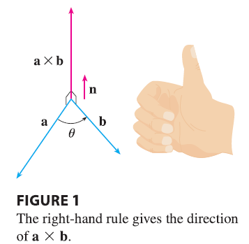
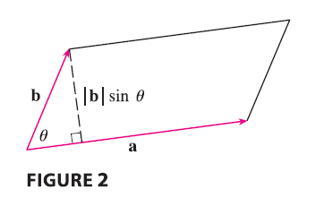
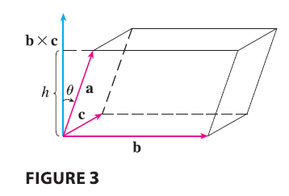
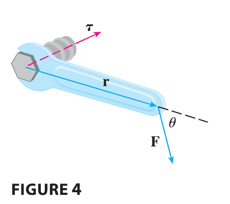
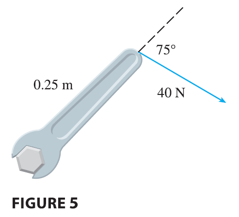

<page>

# The Cross Product

Given two nonzero vectors $\mathbf{a} = \langle a_1, a_2, a_3 \rangle$ and $\mathbf{b} = \langle b_1, b_2, b_3 \rangle$, it is very useful to be able to find a nonzero vector **c** that is perpendicular to both **a** and **b**. If $\mathbf{c} = \langle c_1, c_2, c_3 \rangle$ is such a vector, then $\mathbf{a} \cdot \mathbf{c} = 0$ and $\mathbf{b} \cdot \mathbf{c} = 0$ and so
$$ a_1c_1 + a_2c_2 + a_3c_3 = 0 \tag{1} $$
$$ b_1c_1 + b_2c_2 + b_3c_3 = 0 \tag{2} $$
To eliminate $c_3$ we multiply (1) by $b_3$ and (2) by $a_3$ and subtract:
$$ (a_1b_3 - a_3b_1)c_1 + (a_2b_3 - a_3b_2)c_2 = 0 \tag{3} $$
Equation 3 has the form $pc_1 + qc_2 = 0$, for which an obvious solution is $c_1 = q$ and $c_2 = -p$. So a solution of (3) is
$$ c_1 = a_2b_3 - a_3b_2 \qquad c_2 = a_3b_1 - a_1b_3 $$
Substituting these values into (1) and (2), we then get
$$ c_3 = a_1b_2 - a_2b_1 $$
This means that a vector perpendicular to both **a** and **b** is
$$ \mathbf{c} = \langle c_1, c_2, c_3 \rangle = \langle a_2b_3 - a_3b_2, a_3b_1 - a_1b_3, a_1b_2 - a_2b_1 \rangle $$
The resulting vector is called the **cross product** of **a** and **b** and is denoted by $\mathbf{a} \times \mathbf{b}$.

---

**Definition 4** If $\mathbf{a} = \langle a_1, a_2, a_3 \rangle$ and $\mathbf{b} = \langle b_1, b_2, b_3 \rangle$, then the **cross product** of **a** and **b** is the vector
$$ \mathbf{a} \times \mathbf{b} = \langle a_2b_3 - a_3b_2, a_3b_1 - a_1b_3, a_1b_2 - a_2b_1 \rangle $$

---

Notice that the cross product $\mathbf{a} \times \mathbf{b}$ of two vectors **a** and **b**, unlike the dot product, is a vector. For this reason it is also called the **vector product**. Note that $\mathbf{a} \times \mathbf{b}$ is defined only when **a** and **b** are three-dimensional vectors.

In order to make Definition 4 easier to remember, we use the notation of determinants. A **determinant of order 2** is defined by
$$
\begin{vmatrix} a & b \\ c & d \end{vmatrix} = ad - bc
$$
(Multiply across the diagonals and subtract.) For example,
$$
\begin{vmatrix} 2 & 1 \\ -6 & 4 \end{vmatrix} = 2(4) - 1(-6) = 14
$$
A **determinant of order 3** can be defined in terms of second-order determinants as follows:
$$
\begin{vmatrix} a_1 & a_2 & a_3 \\ b_1 & b_2 & b_3 \\ c_1 & c_2 & c_3 \end{vmatrix} = a_1 \begin{vmatrix} b_2 & b_3 \\ c_2 & c_3 \end{vmatrix} - a_2 \begin{vmatrix} b_1 & b_3 \\ c_1 & c_3 \end{vmatrix} + a_3 \begin{vmatrix} b_1 & b_2 \\ c_1 & c_2 \end{vmatrix} \tag{5}
$$
Observe that each term on the right side of Equation 5 involves a number $a_i$ in the first row of the determinant, and $a_i$ is multiplied by the second-order determinant obtained from the left side by deleting the row and column in which $a_i$ appears. Notice also the minus sign in the second term. For example,
$$
\begin{vmatrix} 1 & 2 & -1 \\ 3 & 0 & 1 \\ -5 & 4 & 2 \end{vmatrix} = 1 \begin{vmatrix} 0 & 1 \\ 4 & 2 \end{vmatrix} - 2 \begin{vmatrix} 3 & 1 \\ -5 & 2 \end{vmatrix} + (-1) \begin{vmatrix} 3 & 0 \\ -5 & 4 \end{vmatrix}
$$
$$
= 1(0 - 4) - 2(6 - (-5)) + (-1)(12 - 0) = -4 - 22 - 12 = -38
$$
If we now rewrite Definition 4 using second-order determinants and the standard basis vectors **i**, **j**, and **k**, we see that the cross product of the vectors $\mathbf{a} = a_1\mathbf{i} + a_2\mathbf{j} + a_3\mathbf{k}$ and $\mathbf{b} = b_1\mathbf{i} + b_2\mathbf{j} + b_3\mathbf{k}$ is
$$
\mathbf{a} \times \mathbf{b} = \begin{vmatrix} a_2 & a_3 \\ b_2 & b_3 \end{vmatrix} \mathbf{i} - \begin{vmatrix} a_1 & a_3 \\ b_1 & b_3 \end{vmatrix} \mathbf{j} + \begin{vmatrix} a_1 & a_2 \\ b_1 & b_2 \end{vmatrix} \mathbf{k} \tag{6}
$$
In view of the similarity between Equations 5 and 6, we often write
$$
\mathbf{a} \times \mathbf{b} = \begin{vmatrix} \mathbf{i} & \mathbf{j} & \mathbf{k} \\ a_1 & a_2 & a_3 \\ b_1 & b_2 & b_3 \end{vmatrix} \tag{7}
$$
Although the first row of the symbolic determinant in Equation 7 consists of vectors, if we expand it as if it were an ordinary determinant using the rule in Equation 5, we obtain Equation 6. The symbolic formula in Equation 7 is probably the easiest way of remembering and computing cross products.

----------

**EXAMPLE 1** If $\mathbf{a} = \langle 1, 3, 4 \rangle$ and $\mathbf{b} = \langle 2, 7, -5 \rangle$, then
$$
\mathbf{a} \times \mathbf{b} = \begin{vmatrix} \mathbf{i} & \mathbf{j} & \mathbf{k} \\ 1 & 3 & 4 \\ 2 & 7 & -5 \end{vmatrix} = \begin{vmatrix} 3 & 4 \\ 7 & -5 \end{vmatrix} \mathbf{i} - \begin{vmatrix} 1 & 4 \\ 2 & -5 \end{vmatrix} \mathbf{j} + \begin{vmatrix} 1 & 3 \\ 2 & 7 \end{vmatrix} \mathbf{k}
$$
$$
= (-15 - 28)\mathbf{i} - (-5 - 8)\mathbf{j} + (7 - 6)\mathbf{k} = -43\mathbf{i} + 13\mathbf{j} + \mathbf{k}
$$

</page>

<page>

# Example: Cross product with parallel vectors

**EXAMPLE 2** Show that $\mathbf{a} \times \mathbf{a} = \mathbf{0}$ for any vector **a** in $V_3$.

<ans>

**SOLUTION** If $\mathbf{a} = \langle a_1, a_2, a_3 \rangle$, then
$$
\mathbf{a} \times \mathbf{a} = \begin{vmatrix} \mathbf{i} & \mathbf{j} & \mathbf{k} \\ a_1 & a_2 & a_3 \\ a_1 & a_2 & a_3 \end{vmatrix} = (a_2a_3 - a_3a_2)\mathbf{i} - (a_1a_3 - a_3a_1)\mathbf{j} + (a_1a_2 - a_2a_1)\mathbf{k} = 0\mathbf{i} - 0\mathbf{j} + 0\mathbf{k} = \mathbf{0}
$$

</ans>

</page>

<page>

# Cross product is perpendicular to the plane

We constructed the cross product $\mathbf{a} \times \mathbf{b}$ so that it would be perpendicular to both **a** and **b**. This is one of the most important properties of a cross product, so let’s emphasize and verify it in the following theorem and give a formal proof.

---

**Theorem 8** The vector $\mathbf{a} \times \mathbf{b}$ is orthogonal to both **a** and **b**.

---

**PROOF** In order to show that $\mathbf{a} \times \mathbf{b}$ is orthogonal to **a**, we compute their dot product as follows:
$$
(\mathbf{a} \times \mathbf{b}) \cdot \mathbf{a} = \begin{vmatrix} a_2 & a_3 \\ b_2 & b_3 \end{vmatrix} a_1 - \begin{vmatrix} a_1 & a_3 \\ b_1 & b_3 \end{vmatrix} a_2 + \begin{vmatrix} a_1 & a_2 \\ b_1 & b_2 \end{vmatrix} a_3
$$
$$
= a_1(a_2b_3 - a_3b_2) - a_2(a_1b_3 - a_3b_1) + a_3(a_1b_2 - a_2b_1)
$$
$$
= a_1a_2b_3 - a_1a_3b_2 - a_1a_2b_3 + a_2a_3b_1 + a_1a_3b_2 - a_2a_3b_1 = 0
$$
A similar computation shows that $(\mathbf{a} \times \mathbf{b}) \cdot \mathbf{b} = 0$. Therefore $\mathbf{a} \times \mathbf{b}$ is orthogonal to both **a** and **b**.

</page>

<page>

# Right Hand Rule

If **a** and **b** are represented by directed line segments with the same initial point (as in Figure 1), then Theorem 8 says that the cross product $\mathbf{a} \times \mathbf{b}$ points in a direction perpendicular to the plane through **a** and **b**. It turns out that the direction of $\mathbf{a} \times \mathbf{b}$ is given by the **right-hand rule**: if the fingers of your right hand curl in the direction of a rotation (through an angle less than $180^\circ$) from **a** to **b**, then your thumb points in the direction of $\mathbf{a} \times \mathbf{b}$.

Now that we know the direction of the vector $\mathbf{a} \times \mathbf{b}$, the remaining thing we need to complete its geometric description is its length $|\mathbf{a} \times \mathbf{b}|$. This is given by the following theorem.

---

**Theorem 9** If $\theta$ is the angle between **a** and **b** (so $0 \le \theta \le \pi$), then
$$ |\mathbf{a} \times \mathbf{b}| = |\mathbf{a}||\mathbf{b}|\sin\theta $$

---

**PROOF** From the definitions of the cross product and length of a vector, we have
$$
|\mathbf{a} \times \mathbf{b}|^2 = (a_2b_3 - a_3b_2)^2 + (a_3b_1 - a_1b_3)^2 + (a_1b_2 - a_2b_1)^2
$$
$$
= a_2^2b_3^2 - 2a_2a_3b_2b_3 + a_3^2b_2^2 + a_3^2b_1^2 - 2a_1a_3b_1b_3 + a_1^2b_3^2 + a_1^2b_2^2 - 2a_1a_2b_1b_2 + a_2^2b_1^2
$$
$$
= (a_1^2 + a_2^2 + a_3^2)(b_1^2 + b_2^2 + b_3^2) - (a_1b_1 + a_2b_2 + a_3b_3)^2
$$
$$
= |\mathbf{a}|^2|\mathbf{b}|^2 - (\mathbf{a} \cdot \mathbf{b})^2 = |\mathbf{a}|^2|\mathbf{b}|^2 - |\mathbf{a}|^2|\mathbf{b}|^2\cos^2\theta \quad (\text{by Theorem 12.3.3})
$$
$$
= |\mathbf{a}|^2|\mathbf{b}|^2(1 - \cos^2\theta) = |\mathbf{a}|^2|\mathbf{b}|^2\sin^2\theta
$$
Taking square roots and observing that $\sqrt{\sin^2\theta} = \sin\theta$ because $\sin\theta \ge 0$ when $0 \le \theta \le \pi$, we have
$$
|\mathbf{a} \times \mathbf{b}| = |\mathbf{a}||\mathbf{b}|\sin\theta
$$
Since a vector is completely determined by its magnitude and direction, we can now say that $\mathbf{a} \times \mathbf{b}$ is the vector that is perpendicular to both **a** and **b**, whose orientation is determined by the right-hand rule, and whose length is $|\mathbf{a}||\mathbf{b}|\sin\theta$. In fact, that is exactly how physicists define $\mathbf{a} \times \mathbf{b}$.

---

**Corollary 10** Two nonzero vectors **a** and **b** are parallel if and only if
$$ \mathbf{a} \times \mathbf{b} = \mathbf{0} $$

**PROOF** Two nonzero vectors **a** and **b** are parallel if and only if $\theta = 0$ or $\pi$. In either case $\sin\theta = 0$, so $|\mathbf{a} \times \mathbf{b}| = 0$ and therefore $\mathbf{a} \times \mathbf{b} = \mathbf{0}$.

The geometric interpretation of Theorem 9 can be seen by looking at Figure 2. If **a** and **b** are represented by directed line segments with the same initial point, then they determine a parallelogram with base $|\mathbf{a}|$, altitude $|\mathbf{b}|\sin\theta$, and area
$$
A = |\mathbf{a}|(|\mathbf{b}|\sin\theta) = |\mathbf{a} \times \mathbf{b}|
$$
Thus we have the following way of interpreting the magnitude of a cross product.

---
</page>

<page>

# Cross Product & Area of parallelogram

The length of the cross product $\mathbf{a} \times \mathbf{b}$ is equal to the area of the parallelogram determined by **a** and **b**.

</page>

<page>

# Example exercise

**EXAMPLE 3** Find a vector perpendicular to the plane that passes through the points $P(1, 4, 6), Q(-2, 5, -1),$ and $R(1, -1, 1)$.

<ans>

**SOLUTION** The vector $\vec{PQ} \times \vec{PR}$ is perpendicular to both $\vec{PQ}$ and $\vec{PR}$ and is therefore perpendicular to the plane through P, Q, and R. We know from (12.2.1) that
$$
\vec{PQ} = (-2 - 1)\mathbf{i} + (5 - 4)\mathbf{j} + (-1 - 6)\mathbf{k} = -3\mathbf{i} + \mathbf{j} - 7\mathbf{k}
$$
$$
\vec{PR} = (1 - 1)\mathbf{i} + (-1 - 4)\mathbf{j} + (1 - 6)\mathbf{k} = -5\mathbf{j} - 5\mathbf{k}
$$
We compute the cross product of these vectors:
$$
\vec{PQ} \times \vec{PR} = \begin{vmatrix} \mathbf{i} & \mathbf{j} & \mathbf{k} \\ -3 & 1 & -7 \\ 0 & -5 & -5 \end{vmatrix}
$$
$$
= (-5 - 35)\mathbf{i} - (15 - 0)\mathbf{j} + (15 - 0)\mathbf{k} = -40\mathbf{i} - 15\mathbf{j} + 15\mathbf{k}
$$

So the vector $\langle -40, -15, 15 \rangle$ is perpendicular to the given plane. Any nonzero scalar multiple of this vector, such as $\langle -8, -3, 3 \rangle$, is also perpendicular to the plane.

</ans>
</page>

<page>

# Example Exercise

**EXAMPLE 4** Find the area of the triangle with vertices $P(1, 4, 6), Q(-2, 5, -1),$ and $R(1, -1, 1)$.

<ans>

**SOLUTION** In Example 3 we computed that $\vec{PQ} \times \vec{PR} = \langle -40, -15, 15 \rangle$. The area of the parallelogram with adjacent sides PQ and PR is the length of this cross product:
$$
|\vec{PQ} \times \vec{PR}| = \sqrt{(-40)^2 + (-15)^2 + 15^2} = \sqrt{1600 + 225 + 225} = \sqrt{2050} = 5\sqrt{82}
$$
The area A of the triangle PQR is half the area of this parallelogram, that is, $\frac{5}{2}\sqrt{82}$.

</ans>
</page>

<page>

# Some common identities

If we apply Theorems 8 and 9 to the standard basis vectors **i**, **j**, and **k** using $\theta = \pi/2$, we obtain
$$
\mathbf{i} \times \mathbf{j} = \mathbf{k} \qquad \mathbf{j} \times \mathbf{k} = \mathbf{i} \qquad \mathbf{k} \times \mathbf{i} = \mathbf{j}
$$
$$
\mathbf{j} \times \mathbf{i} = -\mathbf{k} \qquad \mathbf{k} \times \mathbf{j} = -\mathbf{i} \qquad \mathbf{i} \times \mathbf{k} = -\mathbf{j}
$$
Observe that
$$
\mathbf{i} \times \mathbf{j} \ne \mathbf{j} \times \mathbf{i}
$$
Thus the cross product is not commutative. Also
$$
\mathbf{i} \times (\mathbf{i} \times \mathbf{j}) = \mathbf{i} \times \mathbf{k} = -\mathbf{j}
$$
whereas
$$
(\mathbf{i} \times \mathbf{i}) \times \mathbf{j} = \mathbf{0} \times \mathbf{j} = \mathbf{0}
$$
So the associative law for multiplication does not usually hold; that is, in general,
$$
(\mathbf{a} \times \mathbf{b}) \times \mathbf{c} \ne \mathbf{a} \times (\mathbf{b} \times \mathbf{c})
$$
However, some of the usual laws of algebra do hold for cross products. The following theorem summarizes the properties of vector products.

---

**Properties of the Cross Product 11** If **a**, **b**, and **c** are vectors and $c$ is a scalar, then
1. $\mathbf{a} \times \mathbf{b} = -\mathbf{b} \times \mathbf{a}$
2. $(c\mathbf{a}) \times \mathbf{b} = c(\mathbf{a} \times \mathbf{b}) = \mathbf{a} \times (c\mathbf{b})$
3. $\mathbf{a} \times (\mathbf{b} + \mathbf{c}) = \mathbf{a} \times \mathbf{b} + \mathbf{a} \times \mathbf{c}$
4. $(\mathbf{a} + \mathbf{b}) \times \mathbf{c} = \mathbf{a} \times \mathbf{c} + \mathbf{b} \times \mathbf{c}$
5. $\mathbf{a} \cdot (\mathbf{b} \times \mathbf{c}) = (\mathbf{a} \times \mathbf{b}) \cdot \mathbf{c}$
6. $\mathbf{a} \times (\mathbf{b} \times \mathbf{c}) = (\mathbf{a} \cdot \mathbf{c})\mathbf{b} - (\mathbf{a} \cdot \mathbf{b})\mathbf{c}$
   
---

These properties can be proved by writing the vectors in terms of their components and using the definition of a cross product. We give the proof of Property 5 and leave the remaining proofs as exercises.

**PROOF OF PROPERTY 5** If $\mathbf{a} = \langle a_1, a_2, a_3 \rangle, \mathbf{b} = \langle b_1, b_2, b_3 \rangle,$ and $\mathbf{c} = \langle c_1, c_2, c_3 \rangle$, then
$$
\mathbf{a} \cdot (\mathbf{b} \times \mathbf{c}) = a_1(b_2c_3 - b_3c_2) + a_2(b_3c_1 - b_1c_3) + a_3(b_1c_2 - b_2c_1)
\tag{12}
$$
$$
= a_1b_2c_3 - a_1b_3c_2 + a_2b_3c_1 - a_2b_1c_3 + a_3b_1c_2 - a_3b_2c_1
$$
$$
= (a_2b_3 - a_3b_2)c_1 + (a_3b_1 - a_1b_3)c_2 + (a_1b_2 - a_2b_1)c_3
$$
$$
= (\mathbf{a} \times \mathbf{b}) \cdot \mathbf{c}
$$

</page>

<page>

# Triple Products

The product $\mathbf{a} \cdot (\mathbf{b} \times \mathbf{c})$ that occurs in Property 5 is called the **scalar triple product** of the vectors **a**, **b**, and **c**. Notice from Equation 12 that we can write the scalar triple product as a determinant:
$$
\mathbf{a} \cdot (\mathbf{b} \times \mathbf{c}) = \begin{vmatrix} a_1 & a_2 & a_3 \\ b_1 & b_2 & b_3 \\ c_1 & c_2 & c_3 \end{vmatrix}
\tag{13}
$$

--------

------------

The geometric significance of the scalar triple product can be seen by considering the parallelepiped determined by the vectors **a**, **b**, and **c**. (See Figure 3.) The area of the base parallelogram is $A = |\mathbf{b} \times \mathbf{c}|$. If $\theta$ is the angle between **a** and $\mathbf{b} \times \mathbf{c}$, then the height $h$ of the parallelepiped is $h = |\mathbf{a}||\cos\theta|$. (We must use $|\cos\theta|$ instead of $\cos\theta$ in case $\theta > \pi/2$.) Therefore the volume of the parallelepiped is
$$
V = Ah = |\mathbf{b} \times \mathbf{c}||\mathbf{a}||\cos\theta| = |\mathbf{a} \cdot (\mathbf{b} \times \mathbf{c})|
$$
Thus we have proved the following formula.

---

The volume of the parallelepiped determined by the vectors **a**, **b**, and **c** is the magnitude of their scalar triple product:
$$ V = |\mathbf{a} \cdot (\mathbf{b} \times \mathbf{c})| \tag{14} $$

---

If we use the formula in (14) and discover that the volume of the parallelepiped determined by **a**, **b**, and **c** is 0, then the vectors must lie in the same plane; that is, they are **coplanar**.

-------

**EXAMPLE 5** Use the scalar triple product to show that the vectors $\mathbf{a} = \langle 1, 4, -7 \rangle, \mathbf{b} = \langle 2, -1, 4 \rangle,$ and $\mathbf{c} = \langle 0, -9, 18 \rangle$ are coplanar.

<ans>

**SOLUTION** We use Equation 13 to compute their scalar triple product:
$$
\mathbf{a} \cdot (\mathbf{b} \times \mathbf{c}) = \begin{vmatrix} 1 & 4 & -7 \\ 2 & -1 & 4 \\ 0 & -9 & 18 \end{vmatrix}
$$
$$
= 1\begin{vmatrix} -1 & 4 \\ -9 & 18 \end{vmatrix} - 4\begin{vmatrix} 2 & 4 \\ 0 & 18 \end{vmatrix} + (-7)\begin{vmatrix} 2 & -1 \\ 0 & -9 \end{vmatrix}
$$
$$
= 1(-18 - (-36)) - 4(36 - 0) - 7(-18 - 0) = 18 - 144 + 126 = 0
$$
Therefore, by (14), the volume of the parallelepiped determined by **a**, **b**, and **c** is 0. This means that **a**, **b**, and **c** are coplanar.
</ans>
</page>

<page>

# Vector Triple Product

The product $\mathbf{a} \times (\mathbf{b} \times \mathbf{c})$ that occurs in Property 6 is called the **vector triple product** of **a**, **b**, and **c**.

</page>

<page>

# Torque

The idea of a cross product occurs often in physics. In particular, we consider a force **F** acting on a rigid body at a point given by a position vector **r**. The **torque** $\mathbf{\tau}$ (relative to the origin) is defined to be the cross product of the position and force vectors
$$
\mathbf{\tau} = \mathbf{r} \times \mathbf{F}
$$
and measures the tendency of the body to rotate about the origin. The direction of the torque vector indicates the axis of rotation. According to Theorem 9, the magnitude of the torque vector is
$$
|\mathbf{\tau}| = |\mathbf{r} \times \mathbf{F}| = |\mathbf{r}||\mathbf{F}|\sin\theta
$$
where $\theta$ is the angle between the position and force vectors. Observe that the only component of **F** that can cause a rotation is the one perpendicular to **r**, that is, $|\mathbf{F}|\sin\theta$. The magnitude of the torque is equal to the area of the parallelogram determined by **r** and **F**.

-----------

**EXAMPLE 6** A bolt is tightened by applying a 40-N force to a 0.25-m wrench as shown in Figure 5. Find the magnitude of the torque about the center of the bolt.

<ans>

**SOLUTION** The magnitude of the torque vector is
$$
|\mathbf{\tau}| = |\mathbf{r} \times \mathbf{F}| = |\mathbf{r}||\mathbf{F}|\sin 75^\circ = (0.25)(40)\sin 75^\circ = 10 \sin 75^\circ \approx 9.66 \text{ N}\cdot\text{m}
$$
If the bolt is right-threaded, then the torque vector itself is
$$
\mathbf{\tau} = |\mathbf{\tau}|\mathbf{n} \approx 9.66\mathbf{n}
$$
where **n** is a unit vector directed down into the page (by the right-hand rule).

</ans>
</page>