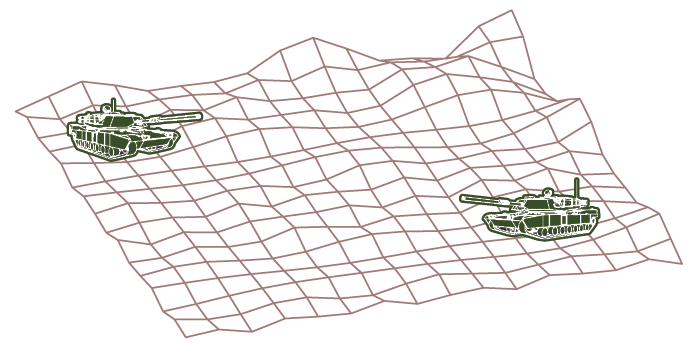

<page>

# Exercise 1

Determine whether each statement is true or false in $\mathbb{R}^3$.
(a) Two lines parallel to a third line are parallel.
(b) Two lines perpendicular to a third line are parallel.
(c) Two planes parallel to a third plane are parallel.
(d) Two planes perpendicular to a third plane are parallel.
(e) Two lines parallel to a plane are parallel.
(f) Two lines perpendicular to a plane are parallel.
(g) Two planes parallel to a line are parallel.
(h) Two planes perpendicular to a line are parallel.
(i) Two planes either intersect or are parallel.
(j) Two lines either intersect or are parallel.
(k) A plane and a line either intersect or are parallel.

</page>
<page>

# Exercise 2

Find a vector equation and parametric equations for the line through the point $(6, -5, 2)$ and parallel to the vector $\langle 1, 3, -\frac{2}{3} \rangle$.

</page>
<page>

# Exercise 3

Find a vector equation and parametric equations for the line through the point $(2, 2.4, 3.5)$ and parallel to the vector $3\mathbf{i} + 2\mathbf{j} - \mathbf{k}$.

</page>
<page>

# Exercise 4

Find a vector equation and parametric equations for the line through the point $(0, 14, -10)$ and parallel to the line $x = -1 + 2t, y = 6 - 3t, z = 3 + 9t$.

</page>
<page>

# Exercise 5

Find a vector equation and parametric equations for the line through the point $(1, 0, 6)$ and perpendicular to the plane $x + 3y + z = 5$.

</page>
<page>

# Exercise 6

Find parametric equations and symmetric equations for the line through the origin and the point $(4, 3, -1)$.

</page>
<page>

# Exercise 7

Find parametric equations and symmetric equations for the line through the points $(0, \frac{1}{2}, 1)$ and $(2, 1, -3)$.

</page>
<page>

# Exercise 8

Find parametric equations and symmetric equations for the line through the points $(1, 2.4, 4.6)$ and $(2.6, 1.2, 0.3)$.

</page>
<page>

# Exercise 9

Find parametric equations and symmetric equations for the line through the points $(-8, 1, 4)$ and $(3, -2, 4)$.

</page>
<page>

# Exercise 10

Find parametric equations and symmetric equations for the line through $(2, 1, 0)$ and perpendicular to both $\mathbf{i} + \mathbf{j}$ and $\mathbf{j} + \mathbf{k}$.

</page>
<page>

# Exercise 11

Find parametric equations and symmetric equations for the line through $(-6, 2, 3)$ and parallel to the line $\frac{x}{2} = \frac{y}{3} = z + 1$.

</page>
<page>

# Exercise 12

Find parametric equations and symmetric equations for the line of intersection of the planes $x + 2y + 3z = 1$ and $x - y + z = 1$.

</page>
<page>

# Exercise 13

Is the line through $(-4, -6, 1)$ and $(-2, 0, -3)$ parallel to the line through $(10, 18, 4)$ and $(5, 3, 14)$?

</page>
<page>

# Exercise 14

Is the line through $(-2, 4, 0)$ and $(1, 1, 1)$ perpendicular to the line through $(2, 3, 4)$ and $(3, -1, -8)$?

</page>
<page>

# Exercise 15

(a) Find symmetric equations for the line that passes through the point $(1, -5, 6)$ and is parallel to the vector $\langle -1, 2, -3 \rangle$.
(b) Find the points in which the required line in part (a) intersects the coordinate planes.

</page>
<page>

# Exercise 16

(a) Find parametric equations for the line through $(2, 4, 6)$ that is perpendicular to the plane $x - y + 3z = 7$.
(b) In what points does this line intersect the coordinate planes?

</page>
<page>

# Exercise 17

Find a vector equation for the line segment from $(6, -1, 9)$ to $(7, 6, 0)$.

</page>
<page>

# Exercise 18

Find parametric equations for the line segment from $(-2, 18, 31)$ to $(11, -4, 48)$.

</page>
<page>

# Exercise 19

Determine whether the lines $L_1$ and $L_2$ are parallel, skew, or intersecting. If they intersect, find the point of intersection.
$L_1: x = -3 + 2t, y = 4 - t, z = 1 + 3t$
$L_2: x = 1 + 4s, y = 3 - 2s, z = 4 + 5s$

</page>
<page>

# Exercise 20

Determine whether the lines $L_1$ and $L_2$ are parallel, skew, or intersecting. If they intersect, find the point of intersection.
$L_1: x = 5 - 12t, y = 3 + 9t, z = 1 - 3t$
$L_2: x = 3 + 8s, y = -6s, z = 7 + 2s$

</page>
<page>

# Exercise 21

Determine whether the lines $L_1$ and $L_2$ are parallel, skew, or intersecting. If they intersect, find the point of intersection.
$L_1: \frac{x-2}{1} = \frac{y-3}{-2} = \frac{z-1}{-3}$
$L_2: \frac{x-3}{1} = \frac{y+4}{3} = \frac{z-2}{-7}$

</page>
<page>

# Exercise 22

Determine whether the lines $L_1$ and $L_2$ are parallel, skew, or intersecting. If they intersect, find the point of intersection.
$L_1: \frac{x}{1} = \frac{y-1}{-1} = \frac{z-2}{3}$
$L_2: \frac{x-2}{2} = \frac{y-3}{-2} = \frac{z}{7}$

</page>
<page>

# Exercise 23

Find an equation of the plane through the origin and perpendicular to the vector $\langle 1, -2, 5 \rangle$.

</page>
<page>

# Exercise 24

Find an equation of the plane through the point $(5, 3, 5)$ and with normal vector $2\mathbf{i} + \mathbf{j} - \mathbf{k}$.

</page>
<page>

# Exercise 25

Find an equation of the plane through the point $(-1, \frac{1}{2}, 3)$ and with normal vector $\mathbf{i} + 4\mathbf{j} + \mathbf{k}$.

</page>
<page>

# Exercise 26

Find an equation of the plane through the point $(2, 0, 1)$ and perpendicular to the line $x = 3t, y = 2 - t, z = 3 + 4t$.

</page>
<page>

# Exercise 27

Find an equation of the plane through the point $(1, -1, -1)$ and parallel to the plane $5x - y - z = 6$.

</page>
<page>

# Exercise 28

Find an equation of the plane through the point $(3, -2, 8)$ and parallel to the plane $z = x + y$.

</page>
<page>

# Exercise 29

Find an equation of the plane through the point $(1, \frac{1}{2}, \frac{1}{3})$ and parallel to the plane $x + y + z = 0$.

</page>
<page>

# Exercise 30

Find an equation of the plane that contains the line $x = 1 + t, y = 2 - t, z = 4 - 3t$ and is parallel to the plane $5x + 2y + z = 1$.

</page>
<page>

# Exercise 31

Find an equation of the plane through the points $(0, 1, 1), (1, 0, 1),$ and $(1, 1, 0)$.

</page>
<page>

# Exercise 32

Find an equation of the plane through the origin and the points $(3, -2, 1)$ and $(1, 1, 1)$.

</page>
<page>

# Exercise 33

Find an equation of the plane through the points $(2, 1, 2), (3, -8, 6),$ and $(-2, -3, 1)$.

</page>
<page>

# Exercise 34

Find an equation of the plane through the points $(3, 0, -1), (-2, -2, 3),$ and $(7, 1, -4)$.

</page>
<page>

# Exercise 35

Find an equation of the plane that passes through the point $(3, 5, -1)$ and contains the line $x = 4 - t, y = 2t - 1, z = -3t$.

</page>
<page>

# Exercise 36

Find an equation of the plane that passes through the point $(6, -1, 3)$ and contains the line with symmetric equations $\frac{x}{3} = y + 4 = \frac{z}{2}$.

</page>
<page>

# Exercise 37

Find an equation of the plane that passes through the point $(3, 1, 4)$ and contains the line of intersection of the planes $x + 2y + 3z = 1$ and $2x - y + z = -3$.

</page>
<page>

# Exercise 38

Find an equation of the plane that passes through the points $(0, -2, 5)$ and $(-1, 3, 1)$ and is perpendicular to the plane $2z = 5x + 4y$.

</page>
<page>

# Exercise 39

Find an equation of the plane that passes through the point $(1, 5, 1)$ and is perpendicular to the planes $2x + y - 2z = 2$ and $x + 3z = 4$.

</page>
<page>

# Exercise 40

Find an equation of the plane that passes through the line of intersection of the planes $x - z = 1$ and $y + 2z = 3$ and is perpendicular to the plane $x + y - 2z = 1$.

</page>
<page>

# Exercise 41

Use intercepts to help sketch the plane $2x + 5y + z = 10$.

</page>
<page>

# Exercise 42

Use intercepts to help sketch the plane $3x + y + 2z = 6$.

</page>
<page>

# Exercise 43

Use intercepts to help sketch the plane $6x - 3y + 4z = 6$.

</page>
<page>

# Exercise 44

Use intercepts to help sketch the plane $6x + 5y - 3z = 15$.

</page>
<page>

# Exercise 45

Find the point at which the line intersects the given plane.
$x = 2 - 2t, y = 3t, z = 1 + t; \quad x + 2y - z = 7$

</page>
<page>

# Exercise 46

Find the point at which the line intersects the given plane.
$x = t - 1, y = 1 + 2t, z = 3 - t; \quad 3x - y + 2z = 5$

</page>
<page>

# Exercise 47

Find the point at which the line intersects the given plane.
$5x = y/2 = z + 2; \quad 10x - 7y + 3z + 24 = 0$

</page>
<page>

# Exercise 48

Where does the line through $(-3, 1, 0)$ and $(-1, 5, 6)$ intersect the plane $2x + y - z = -2$?

</page>
<page>

# Exercise 49

Find direction numbers for the line of intersection of the planes $x + y + z = 1$ and $x + z = 0$.

</page>
<page>

# Exercise 50

Find the cosine of the angle between the planes $x + y + z = 0$ and $x + 2y + 3z = 1$.

</page>
<page>

# Exercise 51

Determine whether the planes are parallel, perpendicular, or neither. If neither, find the angle between them. (Round to one decimal place.)
$x + 4y - 3z = 1, \quad -3x + 6y + 7z = 0$

</page>
<page>

# Exercise 52

Determine whether the planes are parallel, perpendicular, or neither. If neither, find the angle between them. (Round to one decimal place.)
$9x - 3y + 6z = 2, \quad 2y = 6x + 4z$

</page>
<page>

# Exercise 53

Determine whether the planes are parallel, perpendicular, or neither. If neither, find the angle between them. (Round to one decimal place.)
$x + 2y - z = 2, \quad 2x - 2y + z = 1$

</page>
<page>

# Exercise 54

Determine whether the planes are parallel, perpendicular, or neither. If neither, find the angle between them. (Round to one decimal place.)
$x - y + 3z = 1, \quad 3x + y - z = 2$

</page>
<page>

# Exercise 55

Determine whether the planes are parallel, perpendicular, or neither. If neither, find the angle between them. (Round to one decimal place.)
$2x - 3y = z, \quad 4x = 3 + 6y + 2z$

</page>
<page>

# Exercise 56

Determine whether the planes are parallel, perpendicular, or neither. If neither, find the angle between them. (Round to one decimal place.)
$5x + 2y + 3z = 2, \quad y = 4x - 6z$

</page>
<page>

# Exercise 57

(a) Find parametric equations for the line of intersection of the planes $x + y + z = 1$ and $x + 2y + 2z = 1$.
(b) Find the angle between the planes.

</page>
<page>

# Exercise 58

(a) Find parametric equations for the line of intersection of the planes $3x - 2y + z = 1$ and $2x + y - 3z = 3$.
(b) Find the angle between the planes.

</page>
<page>

# Exercise 59

Find symmetric equations for the line of intersection of the planes.
$5x - 2y - 2z = 1, \quad 4x + y + z = 6$

</page>
<page>

# Exercise 60

Find symmetric equations for the line of intersection of the planes.
$z = 2x - y - 5, \quad z = 4x + 3y - 5$

</page>
<page>

# Exercise 61

Find an equation for the plane consisting of all points that are equidistant from the points $(1, 0, -2)$ and $(3, 4, 0)$.

</page>
<page>

# Exercise 62

Find an equation for the plane consisting of all points that are equidistant from the points $(2, 5, 5)$ and $(-6, 3, 1)$.

</page>
<page>

# Exercise 63

Find an equation of the plane with x-intercept a, y-intercept b, and z-intercept c.

</page>
<page>

# Exercise 64

(a) Find the point at which the given lines intersect:
$\mathbf{r} = \langle 1, 1, 0 \rangle + t\langle 1, -1, 2 \rangle$
$\mathbf{r} = \langle 2, 0, 2 \rangle + s\langle -1, 1, 0 \rangle$
(b) Find an equation of the plane that contains these lines.

</page>
<page>

# Exercise 65

Find parametric equations for the line through the point $(0, 1, 2)$ that is parallel to the plane $x + y + z = 2$ and perpendicular to the line $x = 1 + t, y = 1 - t, z = 2t$.

</page>
<page>

# Exercise 66

Find parametric equations for the line through the point $(0, 1, 2)$ that is perpendicular to the line $x = 1 + t, y = 1 - t, z = 2t$ and intersects this line.

</page>
<page>

# Exercise 67

Which of the following four planes are parallel? Are any of them identical?
$P_1: 3x + 6y - 3z = 6$
$P_2: 4x - 12y + 8z = 5$
$P_3: 9y = 1 + 3x + 6z$
$P_4: z = x + 2y - 2$

</page>
<page>

# Exercise 68

Which of the following four lines are parallel? Are any of them identical?
$L_1: x = 1 + 6t, y = 1 - 3t, z = 12t + 5$
$L_2: x = 1 + 2t, y = t, z = 1 + 4t$
$L_3: 2x - 2 = 4 - 4y = z + 1$
$L_4: \mathbf{r} = \langle 3, 1, 5 \rangle + t\langle 4, 2, 8 \rangle$

</page>
<page>

# Exercise 69

Use the formula in Exercise 12.4.45 to find the distance from the point to the given line.
$(4, 1, -2); \quad x = 1 + t, y = 3 - 2t, z = 4 - 3t$

</page>
<page>

# Exercise 70

Use the formula in Exercise 12.4.45 to find the distance from the point to the given line.
$(0, 1, 3); \quad x = 2t, y = 6 - 2t, z = 3 + t$

</page>
<page>

# Exercise 71

Find the distance from the point to the given plane.
$(1, -2, 4), \quad 3x + 2y + 6z = 5$

</page>
<page>

# Exercise 72

Find the distance from the point to the given plane.
$(-6, 3, 5), \quad x - 2y - 4z = 8$

</page>
<page>

# Exercise 73

Find the distance between the given parallel planes.
$2x - 3y + z = 4, \quad 4x - 6y + 2z = 3$

</page>
<page>

# Exercise 74

Find the distance between the given parallel planes.
$6z = 4y - 2x, \quad 9z = 1 - 3x + 6y$

</page>
<page>

# Exercise 75

Show that the distance between the parallel planes $ax + by + cz + d_1 = 0$ and $ax + by + cz + d_2 = 0$ is
$$ D = \frac{|d_1 - d_2|}{\sqrt{a^2 + b^2 + c^2}} $$

</page>
<page>

# Exercise 76

Find equations of the planes that are parallel to the plane $x + 2y - 2z = 1$ and two units away from it.

</page>
<page>

# Exercise 77

Show that the lines with symmetric equations $x = y = z$ and $x + 1 = y/2 = z/3$ are skew, and find the distance between these lines.

</page>
<page>

# Exercise 78

Find the distance between the skew lines with parametric equations $x = 1 + t, y = 1 + 6t, z = 2t,$ and $x = 1 + 2s, y = 5 + 15s, z = -2 + 6s$.

</page>
<page>

# Exercise 79

Let $L_1$ be the line through the origin and the point $(2, 0, -1)$. Let $L_2$ be the line through the points $(1, -1, 1)$ and $(4, 1, 3)$. Find the distance between $L_1$ and $L_2$.

</page>
<page>

# Exercise 80

Let $L_1$ be the line through the points $(1, 2, 6)$ and $(2, 4, 8)$. Let $L_2$ be the line of intersection of the planes $\mathcal{P}_1$ and $\mathcal{P}_2$, where $\mathcal{P}_1$ is the plane $x - y + 2z + 1 = 0$ and $\mathcal{P}_2$ is the plane through the points $(3, 2, -1), (0, 0, 1),$ and $(1, 2, 1)$. Calculate the distance between $L_1$ and $L_2$.

</page>
<page>

# Exercise 81

Two tanks are participating in a battle simulation. Tank A is at point $(325, 810, 561)$ and tank B is positioned at point $(765, 675, 599)$.
(a) Find parametric equations for the line of sight between the tanks.
(b) If we divide the line of sight into 5 equal segments, the elevations of the terrain at the four intermediate points from tank A to tank B are 549, 566, 586, and 589. Can the tanks see each other?

</page>
<page>

# Exercise 82

Give a geometric description of each family of planes.
(a) $x + y + z = c$
(b) $x + y + cz = 1$
(c) $y \cos\theta + z \sin\theta = 1$

</page>
<page>

# Exercise 83

If a, b, and c are not all 0, show that the equation $ax + by + cz + d = 0$ represents a plane and $\langle a, b, c \rangle$ is a normal vector to the plane.
Hint: Suppose $a \ne 0$ and rewrite the equation in the form
$a(x + d/a) + b(y - 0) + c(z - 0) = 0$

</page>
