<page>

# Lines

A line in the xy-plane is determined when a point on the line and the direction of the line (its slope or angle of inclination) are given. The equation of the line can then be written using the point-slope form.

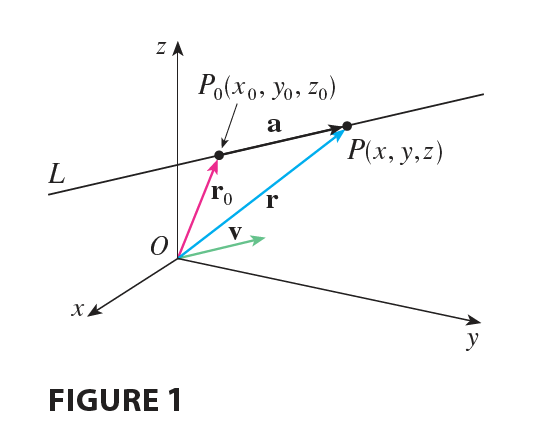

Likewise, a line L in three-dimensional space is determined when we know a point $P_0(x_0, y_0, z_0)$ on L and the direction of L. In three dimensions the direction of a line is conveniently described by a vector, so we let **v** be a vector parallel to L. Let $P(x, y, z)$ be an arbitrary point on L and let $\mathbf{r}_0$ and **r** be the position vectors of $P_0$ and $P$ (that is, they have representations $\vec{OP_0}$ and $\vec{OP}$). If **a** is the vector with representation $\vec{P_0P}$, as in Figure 1, then the Triangle Law for vector addition gives $\mathbf{r} = \mathbf{r}_0 + \mathbf{a}$. But, since **a** and **v** are parallel vectors, there is a scalar $t$ such that $\mathbf{a} = t\mathbf{v}$. Thus
$$
\mathbf{r} = \mathbf{r}_0 + t\mathbf{v}
\tag{1}
$$
which is a **vector equation** of L. Each value of the parameter $t$ gives the position vector **r** of a point on L. In other words, as $t$ varies, the line is traced out by the tip of the vector **r**. As Figure 2 indicates, positive values of $t$ correspond to points on L that lie on one side of $P_0$, whereas negative values of $t$ correspond to points that lie on the other side of $P_0$.

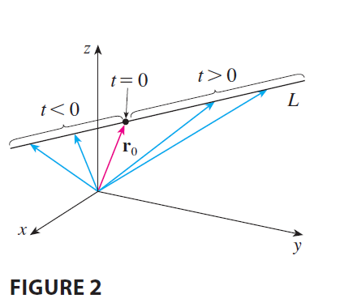

If the vector **v** that gives the direction of the line L is written in component form as $\mathbf{v} = \langle a, b, c \rangle$, then we have $t\mathbf{v} = \langle ta, tb, tc \rangle$. We can also write $\mathbf{r} = \langle x, y, z \rangle$ and $\mathbf{r}_0 = \langle x_0, y_0, z_0 \rangle$, so the vector equation (1) becomes
$$
\langle x, y, z \rangle = \langle x_0 + ta, y_0 + tb, z_0 + tc \rangle
$$
Two vectors are equal if and only if corresponding components are equal. Therefore we have the three scalar equations:
$$
x = x_0 + at \quad y = y_0 + bt \quad z = z_0 + ct
$$
where $t \in \mathbb{R}$. These equations are called **parametric equations** of the line L through the point $P_0(x_0, y_0, z_0)$ and parallel to the vector $\mathbf{v} = \langle a, b, c \rangle$. Each value of the parameter $t$ gives a point $(x, y, z)$ on L.

---

**Parametric equations** for a line through the point $(x_0, y_0, z_0)$ and parallel to the direction vector $\langle a, b, c \rangle$ are
$$
x = x_0 + at \quad y = y_0 + bt \quad z = z_0 + ct
\tag{2}
$$

---

**EXAMPLE 1**
(a) Find a vector equation and parametric equations for the line that passes through the point $(5, 1, 3)$ and is parallel to the vector $\mathbf{i} + 4\mathbf{j} - 2\mathbf{k}$.
(b) Find two other points on the line.

<ans>

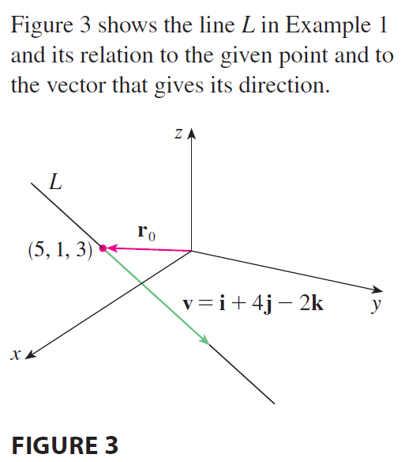

**SOLUTION**
(a) Here $\mathbf{r}_0 = \langle 5, 1, 3 \rangle = 5\mathbf{i} + \mathbf{j} + 3\mathbf{k}$ and $\mathbf{v} = \mathbf{i} + 4\mathbf{j} - 2\mathbf{k}$, so the vector equation (1) becomes
$$
\mathbf{r} = (5\mathbf{i} + \mathbf{j} + 3\mathbf{k}) + t(\mathbf{i} + 4\mathbf{j} - 2\mathbf{k})
$$
or
$$
\mathbf{r} = (5 + t)\mathbf{i} + (1 + 4t)\mathbf{j} + (3 - 2t)\mathbf{k}
$$
Parametric equations are
$$
x = 5 + t \quad y = 1 + 4t \quad z = 3 - 2t
$$
(b) Choosing the parameter value $t = 1$ gives $x = 6, y = 5,$ and $z = 1$, so $(6, 5, 1)$ is a point on the line. Similarly, $t = -1$ gives the point $(4, -3, 5)$.

</ans>

The vector equation and parametric equations of a line are not unique. If we change the point or the parameter or choose a different parallel vector, then the equations change. For instance, if, instead of $(5, 1, 3)$, we choose the point $(6, 5, 1)$ in Example 1, then the parametric equations of the line become
$$
x = 6 + t \quad y = 5 + 4t \quad z = 1 - 2t
$$
Or, if we stay with the point $(5, 1, 3)$ but choose the parallel vector $2\mathbf{i} + 8\mathbf{j} - 4\mathbf{k}$, we arrive at the equations
$$
x = 5 + 2t \quad y = 1 + 8t \quad z = 3 - 4t
$$
In general, if a vector $\mathbf{v} = \langle a, b, c \rangle$ is used to describe the direction of a line L, then the numbers $a, b,$ and $c$ are called **direction numbers** of L. Since any vector parallel to **v** could also be used, we see that any three numbers proportional to $a, b,$ and $c$ could also be used as a set of direction numbers for L.

Another way of describing a line L is to eliminate the parameter $t$ from Equations 2. If none of $a, b,$ or $c$ is 0, we can solve each of these equations for $t$:
$$
t = \frac{x - x_0}{a} \quad t = \frac{y - y_0}{b} \quad t = \frac{z - z_0}{c}
$$
Equating the results, we obtain
$$
\frac{x - x_0}{a} = \frac{y - y_0}{b} = \frac{z - z_0}{c}
\tag{3}
$$
These equations are called **symmetric equations** of L. Notice that the numbers $a, b,$ and $c$ that appear in the denominators of Equations 3 are direction numbers of L, that is, components of a vector parallel to L. If one of $a, b,$ or $c$ is 0, we can still eliminate $t$. For instance, if $a = 0$, we could write the equations of L as
$$
x = x_0 \quad \frac{y - y_0}{b} = \frac{z - z_0}{c}
$$
This means that L lies in the vertical plane $x = x_0$.

----------

**EXAMPLE 2**
(a) Find parametric equations and symmetric equations of the line that passes through the points $A(2, 4, -3)$ and $B(3, -1, 1)$.
(b) At what point does this line intersect the xy-plane?

<ans>

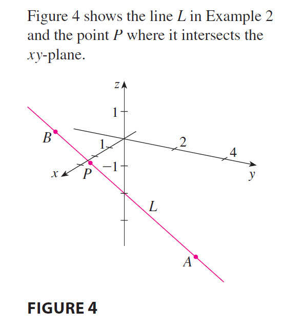

**SOLUTION**
(a) We are not explicitly given a vector parallel to the line, but observe that the vector **v** with representation $\vec{AB}$ is parallel to the line and
$$
\mathbf{v} = \langle 3 - 2, -1 - 4, 1 - (-3) \rangle = \langle 1, -5, 4 \rangle
$$
Thus direction numbers are $a = 1, b = -5,$ and $c = 4$. Taking the point $(2, 4, -3)$ as $P_0$, we see that parametric equations (2) are
$$
x = 2 + t \quad y = 4 - 5t \quad z = -3 + 4t
$$
and symmetric equations (3) are
$$
\frac{x - 2}{1} = \frac{y - 4}{-5} = \frac{z + 3}{4}
$$
(b) The line intersects the xy-plane when $z = 0$, so we put $z = 0$ in the symmetric equations and obtain
$$
\frac{x - 2}{1} = \frac{y - 4}{-5} = \frac{3}{4}
$$
This gives $x = \frac{11}{4}$ and $y = \frac{1}{4}$, so the line intersects the xy-plane at the point $(\frac{11}{4}, \frac{1}{4}, 0)$.

In general, the procedure of Example 2 shows that direction numbers of the line L through the points $P_0(x_0, y_0, z_0)$ and $P_1(x_1, y_1, z_1)$ are $x_1 - x_0, y_1 - y_0,$ and $z_1 - z_0$ and so symmetric equations of L are
$$
\frac{x - x_0}{x_1 - x_0} = \frac{y - y_0}{y_1 - y_0} = \frac{z - z_0}{z_1 - z_0}
$$

</ans>

</page>

<page>

# Line Segment

Often, we need a description, not of an entire line, but of just a **line segment**. How, for instance, could we describe the line segment AB in Example 2? If we put $t = 0$ in the parametric equations in Example 2(a), we get the point $(2, 4, -3)$ and if we put $t = 1$ we get $(3, -1, 1)$. So the line segment AB is described by the parametric equations
$$
x = 2 + t \quad y = 4 - 5t \quad z = -3 + 4t \quad 0 \le t \le 1
$$
or by the corresponding vector equation
$$
\mathbf{r}(t) = \langle 2 + t, 4 - 5t, -3 + 4t \rangle \quad 0 \le t \le 1
$$
In general, we know from Equation 1 that the vector equation of a line through the (tip of the) vector $\mathbf{r}_0$ in the direction of a vector **v** is $\mathbf{r} = \mathbf{r}_0 + t\mathbf{v}$. If the line also passes through (the tip of) $\mathbf{r}_1$, then we can take $\mathbf{v} = \mathbf{r}_1 - \mathbf{r}_0$ and so its vector equation is
$$
\mathbf{r} = \mathbf{r}_0 + t(\mathbf{r}_1 - \mathbf{r}_0) = (1 - t)\mathbf{r}_0 + t\mathbf{r}_1
$$
The line segment from $\mathbf{r}_0$ to $\mathbf{r}_1$ is given by the parameter interval $0 \le t \le 1$.

---

The line segment from $\mathbf{r}_0$ to $\mathbf{r}_1$ is given by the vector equation
$$
\mathbf{r}(t) = (1 - t)\mathbf{r}_0 + t\mathbf{r}_1 \quad 0 \le t \le 1
\tag{4}
$$

---

</page>

<page>

# What are skew lines?

**EXAMPLE 3** Show that the lines $L_1$ and $L_2$ with parametric equations
$$
L_1: x = 1 + t \quad y = -2 + 3t \quad z = 4 - t
$$
$$
L_2: x = 2s \quad y = 3 + s \quad z = -3 + 4s
$$
are **skew lines**; that is, they do not intersect and are not parallel (and therefore do not lie in the same plane).

<ans>

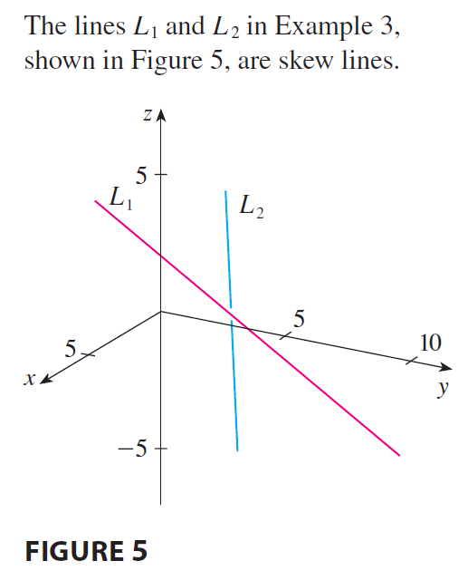

**SOLUTION** The lines are not parallel because the corresponding direction vectors $\langle 1, 3, -1 \rangle$ and $\langle 2, 1, 4 \rangle$ are not parallel. (Their components are not proportional.) If $L_1$ and $L_2$ had a point of intersection, there would be values of $t$ and $s$ such that
$$
1 + t = 2s
$$
$$
-2 + 3t = 3 + s
$$
$$
4 - t = -3 + 4s
$$
But if we solve the first two equations, we get $t = \frac{11}{5}$ and $s = \frac{8}{5}$, and these values don’t satisfy the third equation. Therefore there are no values of $t$ and $s$ that satisfy the three equations, so $L_1$ and $L_2$ do not intersect. Thus $L_1$ and $L_2$ are skew lines.

</ans>
</page>

<page>

# Planes

Although a line in space is determined by a point and a direction, a plane in space is more difficult to describe. A single vector parallel to a plane is not enough to convey the “direction” of the plane, but a vector perpendicular to the plane does completely specify its direction. Thus a plane in space is determined by a point $P_0(x_0, y_0, z_0)$ in the plane and a vector **n** that is orthogonal to the plane. This orthogonal vector **n** is called a **normal vector**. 

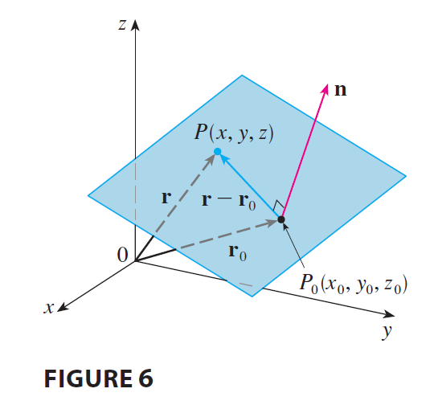

Let $P(x, y, z)$ be an arbitrary point in the plane, and let $\mathbf{r}_0$ and **r** be the position vectors of $P_0$ and $P$. Then the vector $\mathbf{r} - \mathbf{r}_0$ is represented by $\vec{P_0P}$. The normal vector **n** is orthogonal to every vector in the given plane. In particular, **n** is orthogonal to $\mathbf{r} - \mathbf{r}_0$ and so we have
$$
\mathbf{n} \cdot (\mathbf{r} - \mathbf{r}_0) = 0
\tag{5}
$$
which can be rewritten as
$$
\mathbf{n} \cdot \mathbf{r} = \mathbf{n} \cdot \mathbf{r}_0
\tag{6}
$$
Either Equation 5 or Equation 6 is called a **vector equation of the plane**.

To obtain a scalar equation for the plane, we write $\mathbf{n} = \langle a, b, c \rangle, \mathbf{r} = \langle x, y, z \rangle,$ and $\mathbf{r}_0 = \langle x_0, y_0, z_0 \rangle$. Then the vector equation (5) becomes
$$
\langle a, b, c \rangle \cdot \langle x - x_0, y - y_0, z - z_0 \rangle = 0
$$
or
$$
a(x - x_0) + b(y - y_0) + c(z - z_0) = 0
$$

---

A **scalar equation** of the plane through point $P_0(x_0, y_0, z_0)$ with normal vector $\mathbf{n} = \langle a, b, c \rangle$ is
$$
a(x - x_0) + b(y - y_0) + c(z - z_0) = 0
\tag{7}
$$

---

**EXAMPLE 4** Find an equation of the plane through the point $(2, 4, -1)$ with normal vector $\mathbf{n} = \langle 2, 3, 4 \rangle$. Find the intercepts and sketch the plane.

<ans>

**SOLUTION** Putting $a = 2, b = 3, c = 4, x_0 = 2, y_0 = 4,$ and $z_0 = -1$ in Equation 7, we see that an equation of the plane is
$$
2(x - 2) + 3(y - 4) + 4(z + 1) = 0
$$
or
$$
2x + 3y + 4z = 12
$$
To find the x-intercept we set $y = z = 0$ in this equation and obtain $x = 6$. Similarly, the y-intercept is 4 and the z-intercept is 3. This enables us to sketch the portion of the plane that lies in the first octant (see Figure 7).

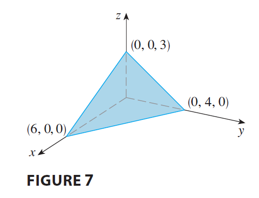

</ans>

---------

By collecting terms in Equation 7 as we did in Example 4, we can rewrite the equation of a plane as
$$
ax + by + cz + d = 0
\tag{8}
$$
where $d = -(ax_0 + by_0 + cz_0)$. Equation 8 is called a **linear equation** in $x, y,$ and $z$. Conversely, it can be shown that if $a, b,$ and $c$ are not all 0, then the linear equation (8) represents a plane with normal vector $\langle a, b, c \rangle$.

---------

**EXAMPLE 5** Find an equation of the plane that passes through the points $P(1, 3, 2), Q(3, -1, 6),$ and $R(5, 2, 0)$.

<ans>

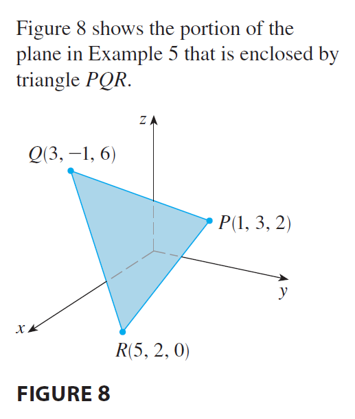

**SOLUTION** The vectors **a** and **b** corresponding to $\vec{PQ}$ and $\vec{PR}$ are
$$
\mathbf{a} = \langle 2, -4, 4 \rangle \quad \mathbf{b} = \langle 4, -1, -2 \rangle
$$
Since both **a** and **b** lie in the plane, their cross product $\mathbf{a} \times \mathbf{b}$ is orthogonal to the plane and can be taken as the normal vector. Thus
$$
\mathbf{n} = \mathbf{a} \times \mathbf{b} = \begin{vmatrix} \mathbf{i} & \mathbf{j} & \mathbf{k} \\ 2 & -4 & 4 \\ 4 & -1 & -2 \end{vmatrix} = 12\mathbf{i} + 20\mathbf{j} + 14\mathbf{k}
$$
With the point $P(1, 3, 2)$ and the normal vector **n**, an equation of the plane is
$$
12(x - 1) + 20(y - 3) + 14(z - 2) = 0
$$
or
$$
6x + 10y + 7z = 50
$$
</ans>

</page>

<page>

# Example Problems

**EXAMPLE 6** Find the point at which the line with parametric equations $x = 2 + 3t, y = -4t, z = 5 + t$ intersects the plane $4x + 5y - 2z = 18$.

<ans>

**SOLUTION** We substitute the expressions for $x, y,$ and $z$ from the parametric equations into the equation of the plane:
$$
4(2 + 3t) + 5(-4t) - 2(5 + t) = 18
$$
This simplifies to $-10t = 20$, so $t = -2$. Therefore the point of intersection occurs when the parameter value is $t = -2$. Then $x = 2 + 3(-2) = -4, y = -4(-2) = 8, z = 5 - 2 = 3$ and so the point of intersection is $(-4, 8, 3)$.

</ans>

</page>

<page>

# When are planes called parallel? If they are not parallel, What is the angle between two non-parallel planes?

Two planes are **parallel** if their normal vectors are parallel. For instance, the planes $x + 2y - 3z = 4$ and $2x + 4y - 6z = 3$ are parallel because their normal vectors are $\mathbf{n}_1 = \langle 1, 2, -3 \rangle$ and $\mathbf{n}_2 = \langle 2, 4, -6 \rangle$ and $\mathbf{n}_2 = 2\mathbf{n}_1$. If two planes are not parallel, then they intersect in a straight line and the **angle between the two planes** is defined as the acute angle between their normal vectors (see angle $\theta$ in Figure 9).

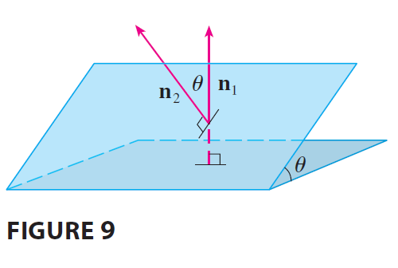

------------

**EXAMPLE 7**
(a) Find the angle between the planes $x + y + z = 1$ and $x - 2y + 3z = 1$.
(b) Find symmetric equations for the line of intersection L of these two planes.

<ans>

**SOLUTION**
(a) The normal vectors of these planes are
$$
\mathbf{n}_1 = \langle 1, 1, 1 \rangle \quad \mathbf{n}_2 = \langle 1, -2, 3 \rangle
$$
and so, if $\theta$ is the angle between the planes, Corollary 12.3.6 gives
$$
\cos\theta = \frac{\mathbf{n}_1 \cdot \mathbf{n}_2}{|\mathbf{n}_1||\mathbf{n}_2|} = \frac{1(1) + 1(-2) + 1(3)}{\sqrt{1+1+1}\sqrt{1+4+9}} = \frac{2}{\sqrt{3}\sqrt{14}} = \frac{2}{\sqrt{42}}
$$
$$
\theta = \cos^{-1}\left(\frac{2}{\sqrt{42}}\right) \approx 72^\circ
$$
(b) We first need to find a point on L. For instance, we can find the point where the line intersects the xy-plane by setting $z = 0$ in the equations of both planes. This gives the equations $x + y = 1$ and $x - 2y = 1$, whose solution is $x = 1, y = 0$. So the point $(1, 0, 0)$ lies on L.

Now we observe that, since L lies in both planes, it is perpendicular to both of the normal vectors. Thus a vector **v** parallel to L is given by the cross product
$$
\mathbf{v} = \mathbf{n}_1 \times \mathbf{n}_2 = \begin{vmatrix} \mathbf{i} & \mathbf{j} & \mathbf{k} \\ 1 & 1 & 1 \\ 1 & -2 & 3 \end{vmatrix} = 5\mathbf{i} - 2\mathbf{j} - 3\mathbf{k}
$$
and so the symmetric equations of L can be written as
$$
\frac{x - 1}{5} = \frac{y}{-2} = \frac{z}{-3}
$$
NOTE Since a linear equation in $x, y,$ and $z$ represents a plane and two nonparallel planes intersect in a line, it follows that two linear equations can represent a line. The points $(x, y, z)$ that satisfy both $a_1x + b_1y + c_1z + d_1 = 0$ and $a_2x + b_2y + c_2z + d_2 = 0$ lie on both of these planes, and so the pair of linear equations represents the line of intersection of the planes (if they are not parallel). For instance, in Example 7 the line L was given as the line of intersection of the planes $x + y + z = 1$ and $x - 2y + 3z = 1$. The symmetric equations that we found for L could be written as
$$
\frac{x - 1}{5} = \frac{y}{-2} \quad \text{and} \quad \frac{y}{-2} = \frac{z}{-3}
$$
which is again a pair of linear equations. They exhibit L as the line of intersection of the planes $(x - 1)/5 = y/(-2)$ and $y/(-2) = z/(-3)$.

</ans>

</page>

<page>

# Distance between a point and a plane

**EXAMPLE 8** Find a formula for the distance $D$ from a point $P_1(x_1, y_1, z_1)$ to the plane $ax + by + cz + d = 0$.

<ans>

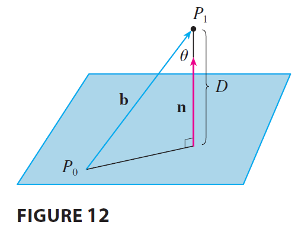

**SOLUTION** Let $P_0(x_0, y_0, z_0)$ be any point in the given plane and let **b** be the vector corresponding to $\vec{P_0P_1}$. Then
$$
\mathbf{b} = \langle x_1 - x_0, y_1 - y_0, z_1 - z_0 \rangle
$$
From Figure 12 you can see that the distance $D$ from $P_1$ to the plane is equal to the absolute value of the scalar projection of **b** onto the normal vector $\mathbf{n} = \langle a, b, c \rangle$. Thus
$$
D = |\text{comp}_\mathbf{n}\mathbf{b}| = \frac{|\mathbf{n} \cdot \mathbf{b}|}{|\mathbf{n}|} = \frac{|a(x_1 - x_0) + b(y_1 - y_0) + c(z_1 - z_0)|}{\sqrt{a^2 + b^2 + c^2}}
$$
$$
= \frac{|(ax_1 + by_1 + cz_1) - (ax_0 + by_0 + cz_0)|}{\sqrt{a^2 + b^2 + c^2}}
$$
Since $P_0$ lies in the plane, its coordinates satisfy the equation of the plane and so we have $ax_0 + by_0 + cz_0 + d = 0$. Thus the formula for $D$ can be written as
$$
D = \frac{|ax_1 + by_1 + cz_1 + d|}{\sqrt{a^2 + b^2 + c^2}}
\tag{9}
$$

</ans>

------------

**EXAMPLE 9** Find the distance between the parallel planes $10x + 2y - 2z = 5$ and $5x + y - z = 1$.

<ans>

**SOLUTION** First we note that the planes are parallel because their normal vectors $\langle 10, 2, -2 \rangle$ and $\langle 5, 1, -1 \rangle$ are parallel. To find the distance $D$ between the planes, we choose any point on one plane and calculate its distance to the other plane. In particular, if we put $y = z = 0$ in the equation of the first plane, we get $10x = 5$ and so $(\frac{1}{2}, 0, 0)$ is a point in this plane. By Formula 9, the distance between $(\frac{1}{2}, 0, 0)$ and the plane $5x + y - z - 1 = 0$ is
$$
D = \frac{|5(\frac{1}{2}) + 1(0) - 1(0) - 1|}{\sqrt{5^2 + 1^2 + (-1)^2}} = \frac{|\frac{3}{2}|}{\sqrt{27}} = \frac{3}{2\sqrt{27}} = \frac{3}{6\sqrt{3}} = \frac{\sqrt{3}}{6}
$$
So the distance between the planes is $\sqrt{3}/6$.

</ans>

</page>

<page>

# Distance between two skew lines

**EXAMPLE 10** In Example 3 we showed that the lines
$$
L_1: x = 1 + t \quad y = -2 + 3t \quad z = 4 - t
$$
$$
L_2: x = 2s \quad y = 3 + s \quad z = -3 + 4s
$$
are skew. Find the distance between them.

<ans>

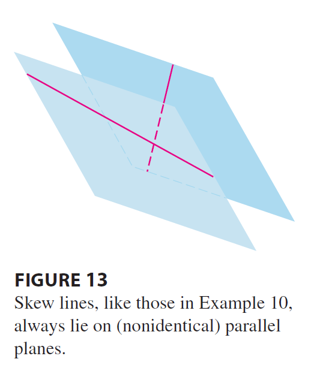

**SOLUTION** Since the two lines $L_1$ and $L_2$ are skew, they can be viewed as lying on two parallel planes $P_1$ and $P_2$. The distance between $L_1$ and $L_2$ is the same as the distance between $P_1$ and $P_2$, which can be computed as in Example 9. The common normal vector to both planes must be orthogonal to both $\mathbf{v}_1 = \langle 1, 3, -1 \rangle$ (the direction of $L_1$) and $\mathbf{v}_2 = \langle 2, 1, 4 \rangle$ (the direction of $L_2$). So a normal vector is
$$
\mathbf{n} = \mathbf{v}_1 \times \mathbf{v}_2 = \begin{vmatrix} \mathbf{i} & \mathbf{j} & \mathbf{k} \\ 1 & 3 & -1 \\ 2 & 1 & 4 \end{vmatrix} = 13\mathbf{i} - 6\mathbf{j} - 5\mathbf{k}
$$
If we put $s = 0$ in the equations of $L_2$, we get the point $(0, 3, -3)$ on $L_2$ and so an equation for $P_2$ is
$$
13(x - 0) - 6(y - 3) - 5(z + 3) = 0 \quad \text{or} \quad 13x - 6y - 5z + 3 = 0
$$
If we now set $t = 0$ in the equations for $L_1$, we get the point $(1, -2, 4)$ on $P_1$. So the distance between $L_1$ and $L_2$ is the same as the distance from $(1, -2, 4)$ to $13x - 6y - 5z + 3 = 0$. By Formula 9, this distance is
$$
D = \frac{|13(1) - 6(-2) - 5(4) + 3|}{\sqrt{13^2 + (-6)^2 + (-5)^2}} = \frac{|13 + 12 - 20 + 3|}{\sqrt{169 + 36 + 25}} = \frac{8}{\sqrt{230}} \approx 0.53
$$

</ans>
</page>