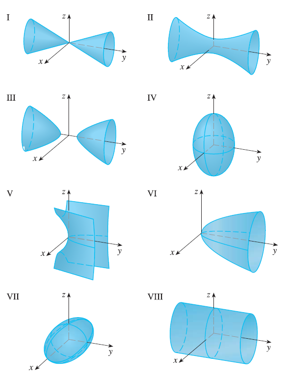
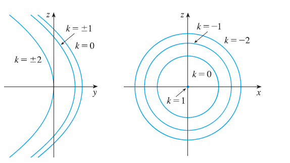
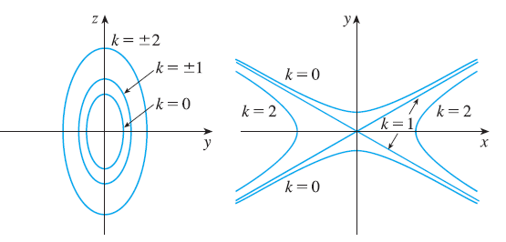

<page>

# Exercise 1

(a) What does the equation $y = x^2$ represent as a curve in $\mathbb{R}^2$?
(b) What does it represent as a surface in $\mathbb{R}^3$?
(c) What does the equation $z = y^2$ represent?

</page>

<page>

# Exercise 2

(a) Sketch the graph of $y = e^x$ as a curve in $\mathbb{R}^2$.
(b) Sketch the graph of $y = e^x$ as a surface in $\mathbb{R}^3$.
(c) Describe and sketch the surface $z = e^y$.

</page>

<page>

# Exercise 3

Describe and sketch the surface.
$x^2 + z^2 = 1$

</page>

<page>

# Exercise 4

Describe and sketch the surface.
$4x^2 + y^2 = 4$

</page>

<page>

# Exercise 5

Describe and sketch the surface.
$z = 1 - y^2$

</page>

<page>

# Exercise 6

Describe and sketch the surface.
$y = z^2$

</page>

<page>

# Exercise 7

Describe and sketch the surface.
$xy = 1$

</page>

<page>

# Exercise 8

Describe and sketch the surface.
$z = \sin y$

</page>

<page>

# Exercise 9

(a) Find and identify the traces of the quadric surface $x^2 + y^2 - z^2 = 1$ and explain why the graph looks like the graph of the hyperboloid of one sheet in Table 1.
(b) If we change the equation in part (a) to $x^2 - y^2 + z^2 = 1$, how is the graph affected?
(c) What if we change the equation in part (a) to $x^2 + y^2 + 2y - z^2 = 0$?

</page>

<page>

# Exercise 10

(a) Find and identify the traces of the quadric surface $-x^2 - y^2 + z^2 = 1$ and explain why the graph looks like the graph of the hyperboloid of two sheets in Table 1.
(b) If the equation in part (a) is changed to $x^2 - y^2 - z^2 = 1$, what happens to the graph? Sketch the new graph.

</page>

<page>

# Exercise 11

Use traces to sketch and identify the surface.
$x = y^2 + 4z^2$

</page>

<page>

# Exercise 12

Use traces to sketch and identify the surface.
$4x^2 + 9y^2 + 9z^2 = 36$

</page>

<page>

# Exercise 13

Use traces to sketch and identify the surface.
$x^2 = 4y^2 + z^2$

</page>

<page>

# Exercise 14

Use traces to sketch and identify the surface.
$z^2 - 4x^2 - y^2 = 4$

</page>

<page>

# Exercise 15

Use traces to sketch and identify the surface.
$9y^2 + 4z^2 = x^2 + 36$

</page>

<page>

# Exercise 16

Use traces to sketch and identify the surface.
$3x^2 + y + 3z^2 = 0$

</page>

<page>

# Exercise 17

Use traces to sketch and identify the surface.
$\frac{x^2}{9} + \frac{y^2}{25} + \frac{z^2}{4} = 1$

</page>

<page>

# Exercise 18

Use traces to sketch and identify the surface.
$3x^2 - y^2 + 3z^2 = 0$

</page>

<page>

# Exercise 19

Use traces to sketch and identify the surface.
$y = z^2 - x^2$

</page>

<page>

# Exercise 20

Use traces to sketch and identify the surface.
$x = y^2 - z^2$

</page>

<page>

# Exercise 21

Match the equation with its graph (labeled I-VIII). Give reasons for your choice.
$x^2 + 4y^2 + 9z^2 = 1$

</page>

<page>

# Exercise 22

Match the equation with its graph (labeled I-VIII). Give reasons for your choice.
$9x^2 + 4y^2 + z^2 = 1$

</page>

<page>

# Exercise 23

Match the equation with its graph (labeled I-VIII). Give reasons for your choice.
$x^2 - y^2 + z^2 = 1$

</page>

<page>

# Exercise 24

Match the equation with its graph (labeled I-VIII). Give reasons for your choice.
$-x^2 + y^2 - z^2 = 1$

</page>

<page>

# Exercise 25

Match the equation with its graph (labeled I-VIII). Give reasons for your choice.
$y = 2x^2 + z^2$

</page>

<page>

# Exercise 26

Match the equation with its graph (labeled I-VIII). Give reasons for your choice.
$y^2 = x^2 + 2z^2$

</page>

<page>

# Exercise 27

Match the equation with its graph (labeled I-VIII). Give reasons for your choice.
$x^2 + 2z^2 = 1$

</page>

<page>

# Exercise 28

Match the equation with its graph (labeled I-VIII). Give reasons for your choice.
$y = x^2 - z^2$

</page>

<page>

# Exercise 29

Sketch and identify a quadric surface that could have the traces shown.
Traces in $x=k$
Traces in $y=k$

</page>

<page>

# Exercise 30

Sketch and identify a quadric surface that could have the traces shown.
Traces in $x=k$
Traces in $z=k$

</page>

<page>

# Exercise 31

Reduce the equation to one of the standard forms, classify the surface, and sketch it.
$y^2 = x^2 + 4z^2$

</page>

<page>

# Exercise 32

Reduce the equation to one of the standard forms, classify the surface, and sketch it.
$4x^2 - y + 2z^2 = 0$

</page>

<page>

# Exercise 33

Reduce the equation to one of the standard forms, classify the surface, and sketch it.
$x^2 + 2y - 2z^2 = 0$

</page>

<page>

# Exercise 34

Reduce the equation to one of the standard forms, classify the surface, and sketch it.
$y^2 = x^2 + 4z^2 + 4$

</page>

<page>

# Exercise 35

Reduce the equation to one of the standard forms, classify the surface, and sketch it.
$x^2 + y^2 - 2x - 6y - z + 10 = 0$

</page>

<page>

# Exercise 36

Reduce the equation to one of the standard forms, classify the surface, and sketch it.
$x^2 - y^2 - z^2 - 4x - 2z + 3 = 0$

</page>

<page>

# Exercise 37

Reduce the equation to one of the standard forms, classify the surface, and sketch it.
$x^2 - y^2 + z^2 - 4x - 2z = 0$

</page>

<page>

# Exercise 38

Reduce the equation to one of the standard forms, classify the surface, and sketch it.
$4x^2 + y^2 + z^2 - 24x - 8y + 4z + 55 = 0$

</page>

<page>

# Exercise 39

Use a computer with three-dimensional graphing software to graph the surface. Experiment with viewpoints and with domains for the variables until you get a good view of the surface.
$-4x^2 - y^2 + z^2 = 1$

</page>

<page>

# Exercise 40

Use a computer with three-dimensional graphing software to graph the surface. Experiment with viewpoints and with domains for the variables until you get a good view of the surface.
$x^2 - y^2 - z = 0$

</page>

<page>

# Exercise 41

Use a computer with three-dimensional graphing software to graph the surface. Experiment with viewpoints and with domains for the variables until you get a good view of the surface.
$-4x^2 - y^2 + z^2 = 0$

</page>

<page>

# Exercise 42

Use a computer with three-dimensional graphing software to graph the surface. Experiment with viewpoints and with domains for the variables until you get a good view of the surface.
$x^2 - 6x + 4y^2 - z = 0$

</page>

<page>

# Exercise 43

Sketch the region bounded by the surfaces $z = \sqrt{x^2 + y^2}$ and $x^2 + y^2 = 1$ for $1 \le z \le 2$.

</page>

<page>

# Exercise 44

Sketch the region bounded by the paraboloids $z = x^2 + y^2$ and $z = 2 - x^2 - y^2$.

</page>

<page>

# Exercise 45

Find an equation for the surface obtained by rotating the curve $y = \sqrt{x}$ about the x-axis.

</page>

<page>

# Exercise 46

Find an equation for the surface obtained by rotating the line $z = 2y$ about the z-axis.

</page>

<page>

# Exercise 47

Find an equation for the surface consisting of all points that are equidistant from the point $(-1, 0, 0)$ and the plane $x = 1$. Identify the surface.

</page>

<page>

# Exercise 48

Find an equation for the surface consisting of all points P for which the distance from P to the x-axis is twice the distance from P to the yz-plane. Identify the surface.

</page>

<page>

# Exercise 49

Traditionally, the earth's surface has been modeled as a sphere, but the World Geodetic System of 1984 (WGS-84) uses an ellipsoid as a more accurate model. It places the center of the earth at the origin and the north pole on the positive z-axis. The distance from the center to the poles is 6356.523 km and the distance to a point on the equator is 6378.137 km.
(a) Find an equation of the earth's surface as used by WGS-84.
(b) Curves of equal latitude are traces in the planes $z = k$. What is the shape of these curves?
(c) Meridians (curves of equal longitude) are traces in planes of the form $y = mx$. What is the shape of these meridians?

</page>

<page>

# Exercise 50

A cooling tower for a nuclear reactor is to be constructed in the shape of a hyperboloid of one sheet (see the photo on page 839). The diameter at the base is 280 m and the minimum diameter, 500 m above the base, is 200 m. Find an equation for the tower.

</page>

<page>

# Exercise 51

Show that if the point $(a, b, c)$ lies on the hyperbolic paraboloid $z = y^2 - x^2$, then the lines with parametric equations $x = a + t, y = b + t, z = c + 2(b-a)t$ and $x = a + t, y = b - t, z = c - 2(b+a)t$ both lie entirely on this paraboloid. (This shows that the hyperbolic paraboloid is what is called a ruled surface; that is, it can be generated by the motion of a straight line. In fact, this exercise shows that through each point on the hyperbolic paraboloid there are two generating lines. The only other quadric surfaces that are ruled surfaces are cylinders, cones, and hyperboloids of one sheet.)

</page>

<page>

# Exercise 52

Show that the curve of intersection of the surfaces $x^2 + 2y^2 - z^2 + 3x = 1$ and $2x^2 + 4y^2 - 2z^2 - 5y = 0$ lies in a plane.

</page>

<page>

# Exercise 53

Graph the surfaces $z = x^2 + y^2$ and $z = 1 - y^2$ on a common screen using the domain $|x| \le 1.2, |y| \le 1.2$ and observe the curve of intersection of these surfaces. Show that the projection of this curve onto the xy-plane is an ellipse.

</page>
