<page>

# Cylinders

We have already looked at two special types of surfaces: planes (in Section 12.5) and spheres (in Section 12.1). Here we investigate two other types of surfaces: cylinders and quadric surfaces.

In order to sketch the graph of a surface, it is useful to determine the curves of intersection of the surface with planes parallel to the coordinate planes. These curves are called **traces** (or **cross-sections**) of the surface.

### Cylinders

--------

A **cylinder** is a surface that consists of all lines (called **rulings**) that are parallel to a given line and pass through a given plane curve.

----------

**EXAMPLE 1** Sketch the graph of the surface $z = x^2$.

<ans>

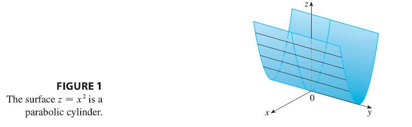

**SOLUTION** Notice that the equation of the graph, $z = x^2$, doesn't involve $y$. This means that any vertical plane with equation $y = k$ (parallel to the xz-plane) intersects the graph in a curve with equation $z = x^2$. So these vertical traces are parabolas. Figure 1 shows how the graph is formed by taking the parabola $z = x^2$ in the xz-plane and moving it in the direction of the y-axis. The graph is a surface, called a **parabolic cylinder**, made up of infinitely many shifted copies of the same parabola. Here the rulings of the cylinder are parallel to the y-axis.

We noticed that the variable $y$ is missing from the equation of the cylinder in Example 1. This is typical of a surface whose rulings are parallel to one of the coordinate axes. If one of the variables $x$, $y$, or $z$ is missing from the equation of a surface, then the surface is a cylinder.
</ans>

-------

**EXAMPLE 2** Identify and sketch the surfaces.
(a) $x^2 + y^2 = 1$
(b) $y^2 + z^2 = 1$

<ans>

**SOLUTION**
(a) Since $z$ is missing and the equations $x^2 + y^2 = 1$, $z = k$ represent a circle with radius 1 in the plane $z = k$, the surface $x^2 + y^2 = 1$ is a circular cylinder whose axis is the z-axis. (See Figure 2.) Here the rulings are vertical lines.

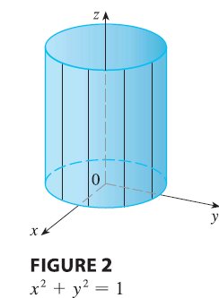

(b) In this case $x$ is missing and the surface is a circular cylinder whose axis is the x-axis. (See Figure 3.) It is obtained by taking the circle $y^2 + z^2 = 1$, $x = 0$ in the yz-plane and moving it parallel to the x-axis.

</ans>

-----

> **NOTE** When you are dealing with surfaces, it is important to recognize that an equation like $x^2 + y^2 = 1$ represents a cylinder and not a circle. The trace of the cylinder $x^2 + y^2 = 1$ in the xy-plane is the circle with equations $x^2 + y^2 = 1$, $z = 0$.

</page>

<page>

# Quadric Surfaces

A **quadric surface** is the graph of a second-degree equation in three variables $x$, $y$, and $z$. The most general such equation is
$$Ax^2 + By^2 + Cz^2 + Dxy + Eyz + Fxz + Gx + Hy + Iz + J = 0$$
where A, B, C, ..., J are constants, but by translation and rotation it can be brought into one of the two standard forms
$$Ax^2 + By^2 + Cz^2 + J = 0 \quad \text{or} \quad Ax^2 + By^2 + Iz = 0$$

> Quadric surfaces are the counterparts in three dimensions of the conic sections in the plane.

------- 

**EXAMPLE 3** Use traces to sketch the quadric surface with equation
$$x^2 + \frac{y^2}{9} + \frac{z^2}{4} = 1$$

<ans>

**SOLUTION** By substituting $z = 0$, we find that the trace in the xy-plane is $x^2 + y^2/9 = 1$, which we recognize as an equation of an ellipse. In general, the horizontal trace in the plane $z = k$ is
$$x^2 + \frac{y^2}{9} = 1 - \frac{k^2}{4}, \quad z=k$$
which is an ellipse, provided that $k^2 < 4$, that is, $-2 < k < 2$.
Similarly, vertical traces parallel to the yz- and xz-planes are also ellipses:
$$\frac{y^2}{9} + \frac{z^2}{4} = 1 - k^2, \quad x=k \quad (\text{if } -1 < k < 1)$$
$$x^2 + \frac{z^2}{4} = 1 - \frac{k^2}{9}, \quad y=k \quad (\text{if } -3 < k < 3)$$

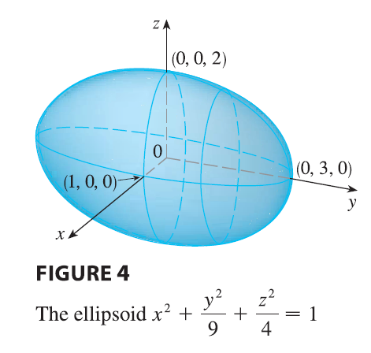

Figure 4 shows how drawing some traces indicates the shape of the surface. It's called an **ellipsoid** because all of its traces are ellipses. Notice that it is symmetric with respect to each coordinate plane; this is a reflection of the fact that its equation involves only even powers of $x$, $y$, and $z$.

</ans>

------------

**EXAMPLE 4** Use traces to sketch the surface $z = 4x^2 + y^2$.

<ans>

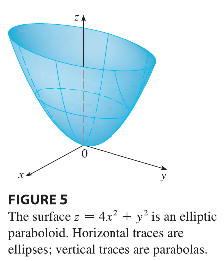

**SOLUTION** If we put $x = 0$, we get $z = y^2$, so the yz-plane intersects the surface in a parabola. If we put $x = k$ (a constant), we get $z = y^2 + 4k^2$. This means that if we slice the graph with any plane parallel to the yz-plane, we obtain a parabola that opens upward. Similarly, if $y = k$, the trace is $z = 4x^2 + k^2$, which is again a parabola that opens upward. If we put $z = k$, we get the horizontal traces $4x^2 + y^2 = k$, which we recognize as a family of ellipses. Knowing the shapes of the traces, we can sketch the graph in Figure 5. Because of the elliptical and parabolic traces, the quadric surface $z = 4x^2 + y^2$ is called an **elliptic paraboloid**.

</ans>

-----------

**EXAMPLE 5** Sketch the surface $z = y^2 - x^2$.

<ans>

**SOLUTION** The traces in the vertical planes $x = k$ are the parabolas $z = y^2 - k^2$, which open upward. The traces in $y = k$ are the parabolas $z = -x^2 + k^2$, which open downward. The horizontal traces are $y^2 - x^2 = k$, a family of hyperbolas. We draw the families of traces in Figure 6, and we show how the traces appear when placed in their correct planes in Figure 7.

----------
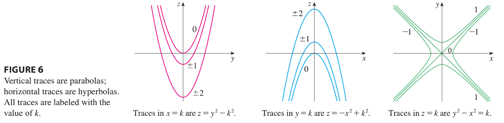

-------------

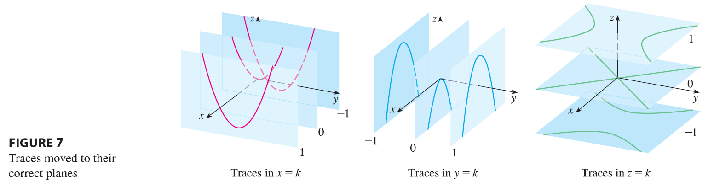

----------

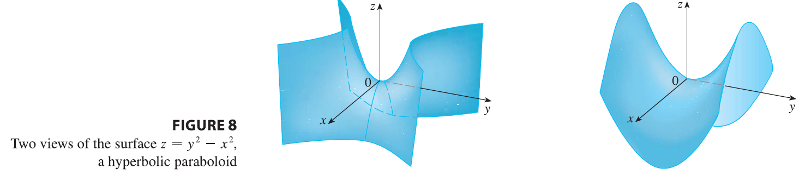

--------

In Figure 8 we fit together the traces from Figure 7 to form the surface $z = y^2 - x^2$, a **hyperbolic paraboloid**. Notice that the shape of the surface near the origin resembles that of a saddle. This surface will be investigated further in Section 14.7 when we discuss saddle points.

</ans>

------

**EXAMPLE 6** Sketch the surface $\frac{x^2}{4} + y^2 - \frac{z^2}{4} = 1$.

<ans>

**SOLUTION** The trace in any horizontal plane $z = k$ is the ellipse
$$\frac{x^2}{4} + y^2 = 1 + \frac{k^2}{4}, \quad z=k$$
but the traces in the xz- and yz-planes are the hyperbolas
$$\frac{x^2}{4} - \frac{z^2}{4} = 1, \quad y=0 \quad \text{and} \quad y^2 - \frac{z^2}{4} = 1, \quad x=0$$
This surface is called a **hyperboloid of one sheet** and is sketched in Figure 9.

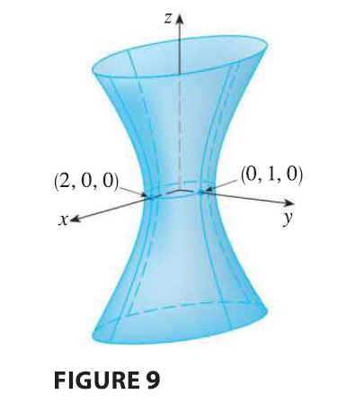

</ans>

</page>

<page>

# Combined discussion

The idea of using traces to draw a surface is employed in three-dimensional graphing software. In most such software, traces in the vertical planes $x = k$ and $y = k$ are drawn for equally spaced values of $k$, and parts of the graph are eliminated using hidden line removal. Table 1 shows computer-drawn graphs of the six basic types of quadric surfaces in standard form. All surfaces are symmetric with respect to the z-axis. If a quadric surface is symmetric about a different axis, its equation changes accordingly.

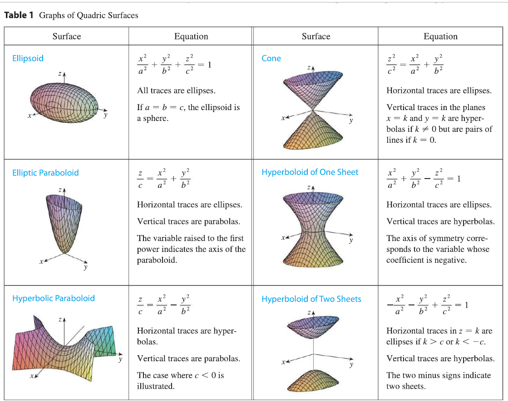

----------

**EXAMPLE 7** Identify and sketch the surface $4x^2 - y^2 + 2z^2 + 4 = 0$.

<ans>

**SOLUTION** Dividing by $-4$, we first put the equation in standard form:
$$-x^2 + \frac{y^2}{4} - \frac{z^2}{2} = 1$$
Comparing this equation with Table 1, we see that it represents a hyperboloid of two sheets, the only difference being that in this case the axis of the hyperboloid is the y-axis. The traces in the xy- and yz-planes are the hyperbolas
$$-x^2 + \frac{y^2}{4} = 1, \quad z=0 \quad \text{and} \quad \frac{y^2}{4} - \frac{z^2}{2} = 1, \quad x=0$$
The surface has no trace in the xz-plane, but traces in the vertical planes $y = k$ for $|k| > 2$ are the ellipses
$$x^2 + \frac{z^2}{2} = \frac{k^2}{4} - 1, \quad y=k$$
which can be written as
$$\frac{x^2}{\frac{k^2}{4}-1} + \frac{z^2}{2(\frac{k^2}{4}-1)} = 1, \quad y=k$$
These traces are used to make the sketch in Figure 10.

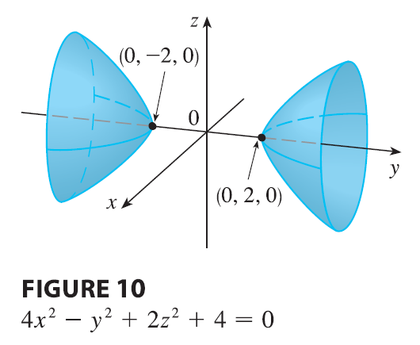

</ans>

--------

**EXAMPLE 8** Classify the quadric surface $x^2 + 2z^2 - 6x - y + 10 = 0$.

<ans>

**SOLUTION** By completing the square we rewrite the equation as
$$y - 1 = (x-3)^2 + 2z^2$$
Comparing this equation with Table 1, we see that it represents an elliptic paraboloid. Here, however, the axis of the paraboloid is parallel to the y-axis, and it has been shifted so that its vertex is the point $(3, 1, 0)$. The traces in the plane $y = k$ ($k > 1$) are the ellipses
$$(x-3)^2 + 2z^2 = k-1, \quad y=k$$
The trace in the xy-plane is the parabola with equation $y = 1 + (x-3)^2$, $z=0$. The paraboloid is sketched in Figure 11.

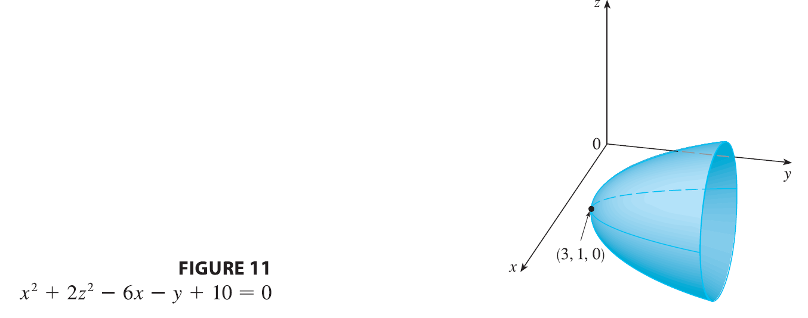

</ans>
</page>

<page>

# Applications of Quadric Surfaces

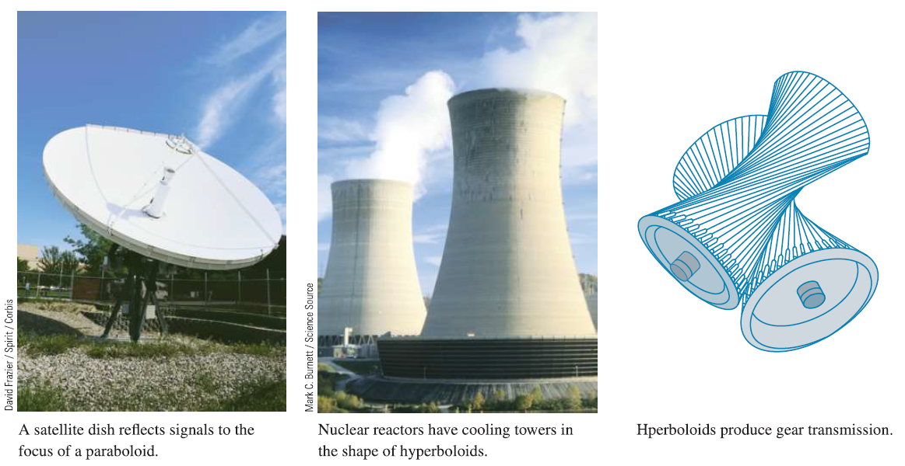

Examples of quadric surfaces can be found in the world around us. In fact, the world itself is a good example. Although the earth is commonly modeled as a sphere, a more accurate model is an ellipsoid because the earth's rotation has caused a flattening at the poles.

Circular paraboloids, obtained by rotating a parabola about its axis, are used to collect and reflect light, sound, and radio and television signals. In a radio telescope, for instance, signals from distant stars that strike the bowl are all reflected to the receiver at the focus and are therefore amplified. The same principle applies to microphones and satellite dishes in the shape of paraboloids.

Cooling towers for nuclear reactors are usually designed in the shape of hyperboloids of one sheet for reasons of structural stability. Pairs of hyperboloids are used to transmit rotational motion between skew axes. (The cogs of the gears are the generating lines of the hyperboloids.)

</page>

