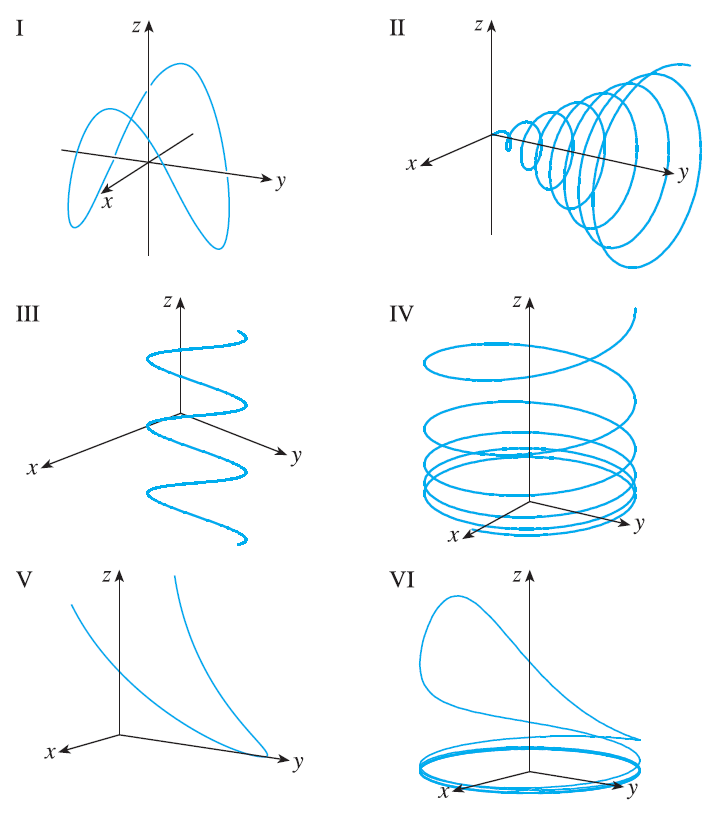

<page>

# Exercise 1

Find the domain of the vector function.
$\mathbf{r}(t) = \left\langle \ln(t+1), \frac{t}{\sqrt{9-t^2}}, 2^t \right\rangle$

</page>

<page>

# Exercise 2

Find the domain of the vector function.
$\mathbf{r}(t) = \cos t \mathbf{i} + \ln t \mathbf{j} + \frac{1}{t-2}\mathbf{k}$

</page>

<page>

# Exercise 3

Find the limit.
$\lim_{t \to 0} \left( e^{-3t}\mathbf{i} + \frac{t^2}{\sin^2 t}\mathbf{j} + \cos 2t \mathbf{k} \right)$

</page>

<page>

# Exercise 4

Find the limit.
$\lim_{t \to 1} \left( \frac{t^2-t}{t-1}\mathbf{i} + \sqrt{t+8}\mathbf{j} + \frac{\sin \pi t}{\ln t}\mathbf{k} \right)$

</page>

<page>

# Exercise 5

Find the limit.
$\lim_{t \to \infty} \left\langle \frac{1+t^2}{1-t^2}, \tan^{-1} t, \frac{1-e^{-2t}}{t} \right\rangle$

</page>

<page>

# Exercise 6

Find the limit.
$\lim_{t \to \infty} \left\langle te^{-t}, \frac{t^3+t}{2t^3-1}, t\sin\frac{1}{t} \right\rangle$

</page>

<page>

# Exercise 7

Sketch the curve with the given vector equation. Indicate with an arrow the direction in which t increases.
$\mathbf{r}(t) = \langle \sin \pi t, t \rangle$

</page>

<page>

# Exercise 8

Sketch the curve with the given vector equation. Indicate with an arrow the direction in which t increases.
$\mathbf{r}(t) = \langle t^2-1, t \rangle$

</page>

<page>

# Exercise 9

Sketch the curve with the given vector equation. Indicate with an arrow the direction in which t increases.
$\mathbf{r}(t) = \langle t, 2-t, 2t \rangle$

</page>

<page>

# Exercise 10

Sketch the curve with the given vector equation. Indicate with an arrow the direction in which t increases.
$\mathbf{r}(t) = \langle \sin \pi t, t, \cos \pi t \rangle$

</page>

<page>

# Exercise 11

Sketch the curve with the given vector equation. Indicate with an arrow the direction in which t increases.
$\mathbf{r}(t) = \langle 3, t, 2-t^2 \rangle$

</page>

<page>

# Exercise 12

Sketch the curve with the given vector equation. Indicate with an arrow the direction in which t increases.
$\mathbf{r}(t) = 2\cos t \mathbf{i} + 2\sin t \mathbf{j} + \mathbf{k}$

</page>

<page>

# Exercise 13

Sketch the curve with the given vector equation. Indicate with an arrow the direction in which t increases.
$\mathbf{r}(t) = t^2\mathbf{i} + t^4\mathbf{j} + t^6\mathbf{k}$

</page>

<page>

# Exercise 14

Sketch the curve with the given vector equation. Indicate with an arrow the direction in which t increases.
$\mathbf{r}(t) = \cos t \mathbf{i} - \cos t \mathbf{j} + \sin t \mathbf{k}$

</page>

<page>

# Exercise 15

Draw the projections of the curve on the three coordinate planes. Use these projections to help sketch the curve.
$\mathbf{r}(t) = \langle t, \sin t, 2\cos t \rangle$

</page>

<page>

# Exercise 16

Draw the projections of the curve on the three coordinate planes. Use these projections to help sketch the curve.
$\mathbf{r}(t) = \langle t, t, t^2 \rangle$

</page>

<page>

# Exercise 17

Find a vector equation and parametric equations for the line segment that joins P to Q.
$P(2, 0, 0), Q(6, 2, -2)$

</page>

<page>

# Exercise 18

Find a vector equation and parametric equations for the line segment that joins P to Q.
$P(-1, 2, -2), Q(-3, 5, 1)$

</page>

<page>

# Exercise 19

Find a vector equation and parametric equations for the line segment that joins P to Q.
$P(0, -1, 1), Q(\frac{1}{2}, \frac{1}{3}, \frac{1}{4})$

</page>

<page>

# Exercise 20

Find a vector equation and parametric equations for the line segment that joins P to Q.
$P(a, b, c), Q(u, v, w)$

</page>

<page>

# Exercise 21

Match the parametric equations with the graphs (labeled I-VI). Give reasons for your choices.
$x = t\cos t, y=t, z=t\sin t, t \ge 0$

</page>

<page>

# Exercise 22

Match the parametric equations with the graphs (labeled I-VI). Give reasons for your choices.
$x = \cos t, y=\sin t, z=1/(1+t^2)$

</page>

<page>

# Exercise 23

Match the parametric equations with the graphs (labeled I-VI). Give reasons for your choices.
$x=t, y=1/(1+t^2), z=t^2$

</page>

<page>

# Exercise 24

Match the parametric equations with the graphs (labeled I-VI). Give reasons for your choices.
$x=\cos t, y=\sin t, z=\cos 2t$

</page>

<page>

# Exercise 25

Match the parametric equations with the graphs (labeled I-VI). Give reasons for your choices.
$x=\cos 8t, y=\sin 8t, z=e^{0.8t}, t \ge 0$

</page>

<page>

# Exercise 26

Match the parametric equations with the graphs (labeled I-VI). Give reasons for your choices.
$x=\cos^2 t, y=\sin^2 t, z=t$

</page>

<page>

# Exercise 27

Show that the curve with parametric equations $x = t \cos t, y = t \sin t, z = t$ lies on the cone $z^2 = x^2 + y^2$, and use this fact to help sketch the curve.

</page>

<page>

# Exercise 28

Show that the curve with parametric equations $x = \sin t, y = \cos t, z = \sin^2 t$ is the curve of intersection of the surfaces $z=x^2$ and $x^2+y^2=1$. Use this fact to help sketch the curve.

</page>

<page>

# Exercise 29

Find three different surfaces that contain the curve $\mathbf{r}(t) = 2t\mathbf{i} + e^t\mathbf{j} + e^{2t}\mathbf{k}$.

</page>

<page>

# Exercise 30

Find three different surfaces that contain the curve $\mathbf{r}(t) = t^2\mathbf{i} + \ln t \mathbf{j} + (1/t)\mathbf{k}$.

</page>

<page>

# Exercise 31

At what points does the curve $\mathbf{r}(t) = t\mathbf{i} + (2t-t^2)\mathbf{k}$ intersect the paraboloid $z=x^2+y^2$?

</page>

<page>

# Exercise 32

At what points does the helix $\mathbf{r}(t) = \langle \sin t, \cos t, t \rangle$ intersect the sphere $x^2+y^2+z^2=5$?

</page>

<page>

# Exercise 33

Use a computer to graph the curve with the given vector equation. Make sure you choose a parameter domain and viewpoints that reveal the true nature of the curve.
$\mathbf{r}(t) = \langle \cos t \sin 2t, \sin t \sin 2t, \cos 2t \rangle$

</page>

<page>

# Exercise 34

Use a computer to graph the curve with the given vector equation. Make sure you choose a parameter domain and viewpoints that reveal the true nature of the curve.
$\mathbf{r}(t) = \langle te^t, e^{-t}, t \rangle$

</page>

<page>

# Exercise 35

Use a computer to graph the curve with the given vector equation. Make sure you choose a parameter domain and viewpoints that reveal the true nature of the curve.
$\mathbf{r}(t) = \langle \sin 3t \cos t, \frac{1}{4}t, \sin 3t \sin t \rangle$

</page>

<page>

# Exercise 36

Use a computer to graph the curve with the given vector equation. Make sure you choose a parameter domain and viewpoints that reveal the true nature of the curve.
$\mathbf{r}(t) = \langle \cos(8\cos t)\sin t, \sin(8\cos t)\sin t, \cos t \rangle$

</page>

<page>

# Exercise 37

Use a computer to graph the curve with the given vector equation. Make sure you choose a parameter domain and viewpoints that reveal the true nature of the curve.
$\mathbf{r}(t) = \langle \cos 2t, \cos 3t, \cos 4t \rangle$

</page>

<page>

# Exercise 38

Graph the curve with parametric equations $x = \sin t, y = \sin 2t, z = \cos 4t$. Explain its shape by graphing its projections onto the three coordinate planes.

</page>

<page>

# Exercise 39

Graph the curve with parametric equations
$x = (1+\cos 16t)\cos t$
$y = (1+\cos 16t)\sin t$
$z = 1+\cos 16t$
Explain the appearance of the graph by showing that it lies on a cone.

</page>

<page>

# Exercise 40

Graph the curve with parametric equations
$x = \sqrt{1-0.25\cos^2 10t}\cos t$
$y = \sqrt{1-0.25\cos^2 10t}\sin t$
$z = 0.5\cos 10t$
Explain the appearance of the graph by showing that it lies on a sphere.

</page>

<page>

# Exercise 41

Show that the curve with parametric equations $x=t^2, y=1-3t, z=1+t^3$ passes through the points $(1, -2, 2)$ and $(9, -8, 28)$ but not through the point $(4, 7, -6)$.

</page>

<page>

# Exercise 42

Find a vector function that represents the curve of intersection of the two surfaces.
The cylinder $x^2+y^2=4$ and the surface $z=xy$.

</page>

<page>

# Exercise 43

Find a vector function that represents the curve of intersection of the two surfaces.
The cone $z=\sqrt{x^2+y^2}$ and the plane $z=1+y$.

</page>

<page>

# Exercise 44

Find a vector function that represents the curve of intersection of the two surfaces.
The paraboloid $z=4x^2+y^2$ and the parabolic cylinder $y=x^2$.

</page>

<page>

# Exercise 45

Find a vector function that represents the curve of intersection of the two surfaces.
The hyperboloid $z=x^2-y^2$ and the cylinder $x^2+y^2=1$.

</page>

<page>

# Exercise 46

Find a vector function that represents the curve of intersection of the two surfaces.
The semiellipsoid $x^2+y^2+4z^2=4, y \ge 0$, and the cylinder $x^2+z^2=1$.

</page>

<page>

# Exercise 47

Try to sketch by hand the curve of intersection of the circular cylinder $x^2+y^2=4$ and the parabolic cylinder $z=x^2$. Then find parametric equations for this curve and use these equations and a computer to graph the curve.

</page>

<page>

# Exercise 48

Try to sketch by hand the curve of intersection of the parabolic cylinder $y=x^2$ and the top half of the ellipsoid $x^2+4y^2+4z^2=16$. Then find parametric equations for this curve and use these equations and a computer to graph the curve.

</page>

<page>

# Exercise 49

If two objects travel through space along two different curves, it's often important to know whether they will collide. (Will a missile hit its moving target? Will two aircraft collide?) The curves might intersect, but we need to know whether the objects are in the same position at the same time. Suppose the trajectories of two particles are given by the vector functions
$\mathbf{r}_1(t) = \langle t^2, 7t-12, t^2 \rangle$
$\mathbf{r}_2(t) = \langle 4t-3, t^2, 5t-6 \rangle$
for $t \ge 0$. Do the particles collide?

</page>

<page>

# Exercise 50

Two particles travel along the space curves
$\mathbf{r}_1(t) = \langle t, t^2, t^3 \rangle$
$\mathbf{r}_2(t) = \langle 1+2t, 1+6t, 1+14t \rangle$
Do the particles collide? Do their paths intersect?

</page>

<page>

# Exercise 51

(a) Graph the curve with parametric equations
$x = \frac{27}{26}\sin 8t - \frac{8}{39}\sin 18t$
$y = -\frac{27}{26}\cos 8t + \frac{8}{39}\cos 18t$
$z = \frac{144}{65}\sin 5t$
(b) Show that the curve lies on the hyperboloid of one sheet $144x^2+144y^2-25z^2=100$.

</page>

<page>

# Exercise 52

The view of the trefoil knot shown in Figure 8 is accurate, but it doesn't reveal the whole story. Use the parametric equations
$x = (2+\cos 1.5t)\cos t$
$y = (2+\cos 1.5t)\sin t$
$z = \sin 1.5t$
to sketch the curve by hand as viewed from above, with gaps indicating where the curve passes over itself. Start by showing that the projection of the curve onto the xy-plane has polar coordinates $r=2+\cos 1.5t$ and $\theta=t$, so $r$ varies between 1 and 3. Then show that $z$ has maximum and minimum values when the projection is halfway between $r=1$ and $r=3$.
When you have finished your sketch, use a computer to draw the curve with viewpoint directly above and compare with your sketch. Then use the computer to draw the curve from several other viewpoints. You can get a better impression of the curve if you plot a tube with radius 0.2 around the curve.

</page>

<page>

# Exercise 53

Suppose **u** and **v** are vector functions that possess limits as $t \to a$ and let c be a constant. Prove the following properties of limits.
(a) $\lim_{t \to a} [\mathbf{u}(t) + \mathbf{v}(t)] = \lim_{t \to a} \mathbf{u}(t) + \lim_{t \to a} \mathbf{v}(t)$
(b) $\lim_{t \to a} c\mathbf{u}(t) = c \lim_{t \to a} \mathbf{u}(t)$
(c) $\lim_{t \to a} [\mathbf{u}(t) \cdot \mathbf{v}(t)] = \lim_{t \to a} \mathbf{u}(t) \cdot \lim_{t \to a} \mathbf{v}(t)$
(d) $\lim_{t \to a} [\mathbf{u}(t) \times \mathbf{v}(t)] = \lim_{t \to a} \mathbf{u}(t) \times \lim_{t \to a} \mathbf{v}(t)$

</page>

<page>

# Exercise 54

Show that $\lim_{t \to a} \mathbf{r}(t) = \mathbf{b}$ if and only if for every $\epsilon > 0$ there is a number $\delta > 0$ such that
if $0 < |t-a| < \delta$ then $|\mathbf{r}(t) - \mathbf{b}| < \epsilon$

</page>
