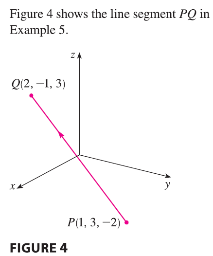

<page>

# Vector Functions

In general, a function is a rule that assigns to each element in the domain an element in the range. A **vector-valued function**, or **vector function**, is simply a function whose domain is a set of real numbers and whose range is a set of vectors. We are most interested in vector functions **r** whose values are three-dimensional vectors. This means that for every number $t$ in the domain of **r** there is a unique vector in $V_3$ denoted by $\mathbf{r}(t)$. If $f(t)$, $g(t)$, and $h(t)$ are the components of the vector $\mathbf{r}(t)$, then $f$, $g$, and $h$ are real-valued functions called the **component functions** of **r** and we can write
$$ \mathbf{r}(t) = \langle f(t), g(t), h(t) \rangle = f(t)\mathbf{i} + g(t)\mathbf{j} + h(t)\mathbf{k} $$
We use the letter $t$ to denote the independent variable because it represents time in most applications of vector functions.

----

**EXAMPLE 1** If
$$ \mathbf{r}(t) = \langle t^3, \ln(3-t), \sqrt{t} \rangle $$
then the component functions are
$$ f(t) = t^3 \qquad g(t) = \ln(3-t) \qquad h(t) = \sqrt{t} $$
By our usual convention, the domain of **r** consists of all values of $t$ for which the expression for $\mathbf{r}(t)$ is defined. The expressions $t^3$, $\ln(3-t)$, and $\sqrt{t}$ are all defined when $3-t > 0$ and $t \ge 0$. Therefore the domain of **r** is the interval $[0, 3)$.

------

</page>

<page>

# Limits and Continuity of vector function

The limit of a vector function **r** is defined by taking the limits of its component functions as follows.

> 1. If $\mathbf{r}(t) = \langle f(t), g(t), h(t) \rangle$, then
> $$ \lim_{t \to a} \mathbf{r}(t) = \left\langle \lim_{t \to a} f(t), \lim_{t \to a} g(t), \lim_{t \to a} h(t) \right\rangle $$
> provided the limits of the component functions exist.

If $\lim_{t \to a} \mathbf{r}(t) = \mathbf{L}$, this definition is equivalent to saying that the length and direction of the vector $\mathbf{r}(t)$ approach the length and direction of the vector **L**.

Equivalently, we could have used an $\epsilon-\delta$ definition (see Exercise 54). Limits of vector functions obey the same rules as limits of real-valued functions (see Exercise 53).

---------

**EXAMPLE 2** Find $\lim_{t \to 0} \mathbf{r}(t)$, where $\mathbf{r}(t) = (1+t^3)\mathbf{i} + te^{-t}\mathbf{j} + \frac{\sin t}{t}\mathbf{k}$.

<ans>

**SOLUTION** According to Definition 1, the limit of **r** is the vector whose components are the limits of the component functions of **r**:
$$ \lim_{t \to 0} \mathbf{r}(t) = \left[ \lim_{t \to 0} (1+t^3) \right]\mathbf{i} + \left[ \lim_{t \to 0} te^{-t} \right]\mathbf{j} + \left[ \lim_{t \to 0} \frac{\sin t}{t} \right]\mathbf{k} $$
$$ = \mathbf{i} + \mathbf{k} \quad (\text{by Equation 3.3.2}) $$

</ans>

----------

A vector function **r** is continuous at **a** if
$$ \lim_{t \to a} \mathbf{r}(t) = \mathbf{r}(a) $$
In view of Definition 1, we see that **r** is continuous at $a$ if and only if its component functions $f$, $g$, and $h$ are continuous at $a$.

</page>

<page>

# Space Curves

There is a close connection between continuous vector functions and space curves. Suppose that $f$, $g$, and $h$ are continuous real-valued functions on an interval $I$. Then the set $C$ of all points $(x, y, z)$ in space, where
$$ x = f(t) \quad y = g(t) \quad z = h(t) \tag{2} $$
and $t$ varies throughout the interval $I$, is called a **space curve**. The equations in (2) are called **parametric equations** of $C$ and $t$ is called a **parameter**. We can think of $C$ as being traced out by a moving particle whose position at time $t$ is $(f(t), g(t), h(t))$. If we now consider the vector function $\mathbf{r}(t) = \langle f(t), g(t), h(t) \rangle$, then $\mathbf{r}(t)$ is the position vector of the point $P(f(t), g(t), h(t))$ on $C$. Thus any continuous vector function **r** defines a space curve $C$ that is traced out by the tip of the moving vector $\mathbf{r}(t)$, as shown in Figure 1.

------------

**EXAMPLE 3** Describe the curve defined by the vector function
$$ \mathbf{r}(t) = \langle 1+t, 2+5t, -1+6t \rangle $$

<ans>

**SOLUTION** The corresponding parametric equations are
$$ x = 1+t \qquad y = 2+5t \qquad z = -1+6t $$
which we recognize from Equations 12.5.2 as parametric equations of a line passing through the point $(1, 2, -1)$ and parallel to the vector $\langle 1, 5, 6 \rangle$. Alternatively, we could observe that the function can be written as $\mathbf{r} = \mathbf{r}_0 + t\mathbf{v}$, where $\mathbf{r}_0 = \langle 1, 2, -1 \rangle$ and $\mathbf{v} = \langle 1, 5, 6 \rangle$, and this is the vector equation of a line as given by Equation 12.5.1.

</ans>

---------

Plane curves can also be represented in vector notation. For instance, the curve given by the parametric equations $x = t^2 - 2t$ and $y = t+1$ could also be described by the vector equation
$$ \mathbf{r}(t) = \langle t^2 - 2t, t+1 \rangle = (t^2 - 2t)\mathbf{i} + (t+1)\mathbf{j} $$
where $\mathbf{i} = \langle 1, 0 \rangle$ and $\mathbf{j} = \langle 0, 1 \rangle$.

------

**EXAMPLE 4** Sketch the curve whose vector equation is
$$ \mathbf{r}(t) = \cos t \mathbf{i} + \sin t \mathbf{j} + t \mathbf{k} $$

<ans>

**SOLUTION** The parametric equations for this curve are
$$ x = \cos t \qquad y = \sin t \qquad z = t $$
Since $x^2 + y^2 = \cos^2 t + \sin^2 t = 1$ for all values of $t$, the curve must lie on the circular cylinder $x^2 + y^2 = 1$. The point $(x, y, z)$ lies directly above the point $(x, y, 0)$, which moves counterclockwise around the circle $x^2 + y^2 = 1$ in the xy-plane. Since $z=t$, the curve spirals upward around the cylinder as $t$ increases. The curve, shown in Figure 2, is called a **helix**.

</ans>

---------

The corkscrew shape of the helix in Example 4 is familiar from its occurrence in coiled springs. It also occurs in the model of DNA (deoxyribonucleic acid, the genetic material of living cells). In 1953 James Watson and Francis Crick showed that the structure of the DNA molecule is that of two linked, parallel helixes that are intertwined as in Figure 3.

</page>

<page>

# Example problem

In Examples 3 and 4 we were given vector equations of curves and asked for a geometric description or sketch. In the next two examples we are given a geometric description of a curve and are asked to find parametric equations for the curve.

------

**EXAMPLE 5** Find a vector equation and parametric equations for the line segment that joins the point $P(1, 3, -2)$ to the point $Q(2, -1, 3)$.

<ans>

**SOLUTION** In Section 12.5 we found a vector equation for the line segment that joins the tip of the vector $\mathbf{r}_0$ to the tip of the vector $\mathbf{r}_1$:
$$ \mathbf{r}(t) = (1-t)\mathbf{r}_0 + t\mathbf{r}_1 \qquad 0 \le t \le 1 $$
(See Equation 12.5.4.) Here we take $\mathbf{r}_0 = \langle 1, 3, -2 \rangle$ and $\mathbf{r}_1 = \langle 2, -1, 3 \rangle$ to obtain a vector equation of the line segment from $P$ to $Q$:
$$ \mathbf{r}(t) = (1-t)\langle 1, 3, -2 \rangle + t\langle 2, -1, 3 \rangle \qquad 0 \le t \le 1 $$
or
$$ \mathbf{r}(t) = \langle 1+t, 3-4t, -2+5t \rangle \qquad 0 \le t \le 1 $$
The corresponding parametric equations are
$$ x = 1+t \qquad y = 3-4t \qquad z = -2+5t \qquad 0 \le t \le 1 $$

</ans>

------------

**EXAMPLE 6** Find a vector function that represents the curve of intersection of the cylinder $x^2 + y^2 = 1$ and the plane $y+z=2$.

<ans>

**SOLUTION** 

Figure 5 shows how the plane and the cylinder intersect, and Figure 6 shows the curve of intersection $C$, which is an ellipse.
The projection of $C$ onto the xy-plane is the circle $x^2 + y^2 = 1, z=0$. So we know from Example 10.1.2 that we can write
$$ x = \cos t \qquad y = \sin t \qquad 0 \le t \le 2\pi $$
From the equation of the plane, we have
$$ z = 2-y = 2 - \sin t $$
So we can write parametric equations for $C$ as
$$ x = \cos t \qquad y = \sin t \qquad z = 2 - \sin t \qquad 0 \le t \le 2\pi $$
The corresponding vector equation is
$$ \mathbf{r}(t) = \cos t \mathbf{i} + \sin t \mathbf{j} + (2-\sin t)\mathbf{k} \qquad 0 \le t \le 2\pi $$
This equation is called a **parametrization** of the curve $C$. The arrows in Figure 6 indicate the direction in which $C$ is traced as the parameter $t$ increases.

</ans>

</page>

<page>

# Using Computers to Draw Space Curves
Space curves are inherently more difficult to draw by hand than plane curves; for an accurate representation we need to use technology. For instance, Figure 7 shows a computer-generated graph of the curve with parametric equations
$$ x = (4 + \sin 20t)\cos t \qquad y = (4 + \sin 20t)\sin t \qquad z = \cos 20t $$

It's called a **toroidal spiral** because it lies on a torus. Another interesting curve, the **trefoil knot**, with equations
$$ x = (2 + \cos 1.5t)\cos t \qquad y = (2 + \cos 1.5t)\sin t \qquad z = \sin 1.5t $$
is graphed in Figure 8. It wouldn't be easy to plot either of these curves by hand.

Even when a computer is used to draw a space curve, optical illusions make it difficult to get a good impression of what the curve really looks like. (This is especially true in Figure 8. See Exercise 52.) The next example shows how to cope with this problem.

---------

**EXAMPLE 7** Use a computer to draw the curve with vector equation $\mathbf{r}(t) = \langle t, t^2, t^3 \rangle$. This curve is called a **twisted cubic**.

<ans>

**SOLUTION** We start by using the computer to plot the curve with parametric equations $x=t, y=t^2, z=t^3$ for $-2 \le t \le 2$. The result is shown in Figure 9(a), but it's hard to see the true nature of the curve from that graph alone. Most three-dimensional computer graphing programs allow the user to enclose a curve or surface in a box instead of displaying the coordinate axes. When we look at the same curve in a box in Figure 9(b), we have a much clearer picture of the curve. We can see that it climbs from a lower corner of the box to the upper corner nearest us, and it twists as it climbs.

We get an even better idea of the curve when we view it from different vantage points. Part (c) shows the result of rotating the box to give another viewpoint. Parts (d), (e), and (f) show the views we get when we look directly at a face of the box. In particular, part (d) shows the view from directly above the box. It is the projection of the curve onto the xy-plane, namely, the parabola $y=x^2$. Part (e) shows the projection onto the xz-plane, the cubic curve $z=x^3$. It's now obvious why the given curve is called a twisted cubic.

Another method of visualizing a space curve is to draw it on a surface. For instance, the twisted cubic in Example 7 lies on the parabolic cylinder $y=x^2$. (Eliminate the parameter from the first two parametric equations, $x=t$ and $y=t^2$.) Figure 10 shows both the cylinder and the twisted cubic, and we see that the curve moves upward from the origin along the surface of the cylinder. 

A third method for visualizing the twisted cubic is to realize that it also lies on the cylinder $z=x^3$. So it can be viewed as the curve of intersection of the cylinders $y=x^2$ and $z=x^3$. (See Figure 11.)

</ans>

</page>