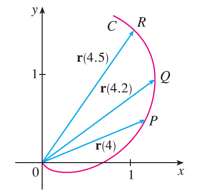

<page>

# Exercise 1

The figure shows a curve C given by a vector function $\mathbf{r}(t)$.
(a) Draw the vectors $\mathbf{r}(4.5) - \mathbf{r}(4)$ and $\mathbf{r}(4.2) - \mathbf{r}(4)$.
(b) Draw the vectors
$$ \frac{\mathbf{r}(4.5) - \mathbf{r}(4)}{0.5} \quad \text{and} \quad \frac{\mathbf{r}(4.2) - \mathbf{r}(4)}{0.2} $$
(c) Write expressions for $\mathbf{r}'(4)$ and the unit tangent vector $\mathbf{T}(4)$.
(d) Draw the vector $\mathbf{T}(4)$.

</page>

<page>

# Exercise 2

(a) Make a large sketch of the curve described by the vector function $\mathbf{r}(t) = \langle t^2, t \rangle$, $0 \le t \le 2$, and draw the vectors $\mathbf{r}(1)$, $\mathbf{r}(1.1)$, and $\mathbf{r}(1.1) - \mathbf{r}(1)$.
(b) Draw the vector $\mathbf{r}'(1)$ starting at (1, 1), and compare it with the vector
$$ \frac{\mathbf{r}(1.1) - \mathbf{r}(1)}{0.1} $$
Explain why these vectors are so close to each other in length and direction.

</page>

<page>

# Exercise 3

(a) Sketch the plane curve with the given vector equation.
(b) Find $\mathbf{r}'(t)$.
(c) Sketch the position vector $\mathbf{r}(t)$ and the tangent vector $\mathbf{r}'(t)$ for the given value of t.
$\mathbf{r}(t) = \langle t-2, t^2+1 \rangle, t=-1$

</page>

<page>

# Exercise 4

(a) Sketch the plane curve with the given vector equation.
(b) Find $\mathbf{r}'(t)$.
(c) Sketch the position vector $\mathbf{r}(t)$ and the tangent vector $\mathbf{r}'(t)$ for the given value of t.
$\mathbf{r}(t) = \langle t^2, t^3 \rangle, t=1$

</page>

<page>

# Exercise 5

(a) Sketch the plane curve with the given vector equation.
(b) Find $\mathbf{r}'(t)$.
(c) Sketch the position vector $\mathbf{r}(t)$ and the tangent vector $\mathbf{r}'(t)$ for the given value of t.
$\mathbf{r}(t) = e^{2t}\mathbf{i} + e^t\mathbf{j}, t=0$

</page>

<page>

# Exercise 6

(a) Sketch the plane curve with the given vector equation.
(b) Find $\mathbf{r}'(t)$.
(c) Sketch the position vector $\mathbf{r}(t)$ and the tangent vector $\mathbf{r}'(t)$ for the given value of t.
$\mathbf{r}(t) = e^t\mathbf{i} + 2t\mathbf{j}, t=0$

</page>

<page>

# Exercise 7

(a) Sketch the plane curve with the given vector equation.
(b) Find $\mathbf{r}'(t)$.
(c) Sketch the position vector $\mathbf{r}(t)$ and the tangent vector $\mathbf{r}'(t)$ for the given value of t.
$\mathbf{r}(t) = 4\sin t \mathbf{i} - 2\cos t \mathbf{j}, t=3\pi/4$

</page>

<page>

# Exercise 8

(a) Sketch the plane curve with the given vector equation.
(b) Find $\mathbf{r}'(t)$.
(c) Sketch the position vector $\mathbf{r}(t)$ and the tangent vector $\mathbf{r}'(t)$ for the given value of t.
$\mathbf{r}(t) = (\cos t + 1)\mathbf{i} + (\sin t - 1)\mathbf{j}, t=-\pi/3$

</page>

<page>

# Exercise 9

Find the derivative of the vector function.
$\mathbf{r}(t) = \langle \sqrt{t}-2, 3, 1/t^2 \rangle$

</page>

<page>

# Exercise 10

Find the derivative of the vector function.
$\mathbf{r}(t) = \langle e^t, t-t^3, \ln t \rangle$

</page>

<page>

# Exercise 11

Find the derivative of the vector function.
$\mathbf{r}(t) = t^2\mathbf{i} + \cos(t^2)\mathbf{j} + \sin^2 t \mathbf{k}$

</page>

<page>

# Exercise 12

Find the derivative of the vector function.
$\mathbf{r}(t) = \frac{1}{1+t}\mathbf{i} + \frac{t}{1+t}\mathbf{j} + \frac{t^2}{1+t}\mathbf{k}$

</page>

<page>

# Exercise 13

Find the derivative of the vector function.
$\mathbf{r}(t) = t\sin t \mathbf{i} + e^t\cos t \mathbf{j} + \sin t \cos t \mathbf{k}$

</page>

<page>

# Exercise 14

Find the derivative of the vector function.
$\mathbf{r}(t) = \sin^2(at)\mathbf{i} + te^{bt}\mathbf{j} + \cos^2(ct)\mathbf{k}$

</page>

<page>

# Exercise 15

Find the derivative of the vector function.
$\mathbf{r}(t) = \mathbf{a} + t\mathbf{b} + t^2\mathbf{c}$

</page>

<page>

# Exercise 16

Find the derivative of the vector function.
$\mathbf{r}(t) = t\mathbf{a} \times (\mathbf{b} + t\mathbf{c})$

</page>

<page>

# Exercise 17

Find the unit tangent vector $\mathbf{T}(t)$ at the point with the given value of the parameter t.
$\mathbf{r}(t) = \langle t^2-2t, 1+3t, \frac{1}{3}t^3 + \frac{1}{2}t^2 \rangle, t=2$

</page>

<page>

# Exercise 18

Find the unit tangent vector $\mathbf{T}(t)$ at the point with the given value of the parameter t.
$\mathbf{r}(t) = \langle \tan^{-1} t, 2e^{2t}, 8te^t \rangle, t=0$

</page>

<page>

# Exercise 19

Find the unit tangent vector $\mathbf{T}(t)$ at the point with the given value of the parameter t.
$\mathbf{r}(t) = \cos t \mathbf{i} + 3t \mathbf{j} + 2\sin 2t \mathbf{k}, t=0$

</page>

<page>

# Exercise 20

Find the unit tangent vector $\mathbf{T}(t)$ at the point with the given value of the parameter t.
$\mathbf{r}(t) = \sin^2 t \mathbf{i} + \cos^2 t \mathbf{j} + \tan^2 t \mathbf{k}, t=\pi/4$

</page>

<page>

# Exercise 21

If $\mathbf{r}(t) = \langle t, t^2, t^3 \rangle$, find $\mathbf{r}'(t)$, $\mathbf{T}(1)$, $\mathbf{r}''(t)$, and $\mathbf{r}'(t) \times \mathbf{r}''(t)$.

</page>

<page>

# Exercise 22

If $\mathbf{r}(t) = \langle e^{2t}, e^{-2t}, te^{2t} \rangle$, find $\mathbf{T}(0)$, $\mathbf{r}''(0)$, and $\mathbf{r}'(t) \cdot \mathbf{r}''(t)$.

</page>

<page>

# Exercise 23

Find parametric equations for the tangent line to the curve with the given parametric equations at the specified point.
$x = t^2+1, y=4\sqrt{t}, z=e^{t^2-t}; (2, 4, 1)$

</page>

<page>

# Exercise 24

Find parametric equations for the tangent line to the curve with the given parametric equations at the specified point.
$x = \ln(t+1), y=t\cos 2t, z=2^t; (0, 0, 1)$

</page>

<page>

# Exercise 25

Find parametric equations for the tangent line to the curve with the given parametric equations at the specified point.
$x = e^{-t}\cos t, y=e^{-t}\sin t, z=e^{-t}; (1, 0, 1)$

</page>

<page>

# Exercise 26

Find parametric equations for the tangent line to the curve with the given parametric equations at the specified point.
$x = \sqrt{t^2+3}, y=\ln(t^2+3), z=t; (2, \ln 4, 1)$

</page>

<page>

# Exercise 27

Find a vector equation for the tangent line to the curve of intersection of the cylinders $x^2+y^2=25$ and $y^2+z^2=20$ at the point $(3, 4, 2)$.

</page>

<page>

# Exercise 28

Find the point on the curve $\mathbf{r}(t) = \langle 2\cos t, 2\sin t, e^t \rangle$, $0 \le t \le \pi$, where the tangent line is parallel to the plane $\sqrt{3}x+y=1$.

</page>

<page>

# Exercise 29

Find parametric equations for the tangent line to the curve with the given parametric equations at the specified point. Illustrate by graphing both the curve and the tangent line on a common screen.
$x=t, y=e^{-t}, z=2t-t^2; (0, 1, 0)$

</page>

<page>

# Exercise 30

Find parametric equations for the tangent line to the curve with the given parametric equations at the specified point. Illustrate by graphing both the curve and the tangent line on a common screen.
$x=2\cos t, y=2\sin t, z=4\cos 2t; (\sqrt{3}, 1, 2)$

</page>

<page>

# Exercise 31

Find parametric equations for the tangent line to the curve with the given parametric equations at the specified point. Illustrate by graphing both the curve and the tangent line on a common screen.
$x=t\cos t, y=t, z=t\sin t; (-\pi, \pi, 0)$

</page>

<page>

# Exercise 32

(a) Find the point of intersection of the tangent lines to the curve $\mathbf{r}(t) = \langle \sin \pi t, 2\sin \pi t, \cos \pi t \rangle$ at the points where $t=0$ and $t=0.5$.
(b) Illustrate by graphing the curve and both tangent lines.

</page>

<page>

# Exercise 33

The curves $\mathbf{r}_1(t) = \langle t, t^2, t^3 \rangle$ and $\mathbf{r}_2(t) = \langle \sin t, \sin 2t, t \rangle$ intersect at the origin. Find their angle of intersection correct to the nearest degree.

</page>

<page>

# Exercise 34

At what point do the curves $\mathbf{r}_1(t) = \langle t, 1-t, 3+t^2 \rangle$ and $\mathbf{r}_2(s) = \langle 3-s, s-2, s^2 \rangle$ intersect? Find their angle of intersection correct to the nearest degree.

</page>

<page>

# Exercise 35

Evaluate the integral.
$\int_0^2 (t\mathbf{i} - t^3\mathbf{j} + 3t^5\mathbf{k}) dt$

</page>

<page>

# Exercise 36

Evaluate the integral.
$\int_0^1 (t^{3/2}\mathbf{i} + (t+1)\sqrt{t}\mathbf{k}) dt$

</page>

<page>

# Exercise 37

Evaluate the integral.
$\int_0^1 \left( \frac{1}{t+1}\mathbf{i} + \frac{1}{t^2+1}\mathbf{j} + \frac{t}{t^2+1}\mathbf{k} \right) dt$

</page>

<page>

# Exercise 38

Evaluate the integral.
$\int_0^{\pi/4} (\sec t \tan t \mathbf{i} + t\cos 2t \mathbf{j} + \sin^2 2t \cos 2t \mathbf{k}) dt$

</page>

<page>

# Exercise 39

Evaluate the integral.
$\int (\sec^2 t \mathbf{i} + t(t^2+1)^3\mathbf{j} + t^2\ln t \mathbf{k}) dt$

</page>

<page>

# Exercise 40

Evaluate the integral.
$\int \left( te^{2t}\mathbf{i} + \frac{t}{1-t}\mathbf{j} + \frac{1}{\sqrt{1-t^2}}\mathbf{k} \right) dt$

</page>

<page>

# Exercise 41

Find $\mathbf{r}(t)$ if $\mathbf{r}'(t) = 2t\mathbf{i} + 3t^2\mathbf{j} + \sqrt{t}\mathbf{k}$ and $\mathbf{r}(1) = \mathbf{i} + \mathbf{j}$.

</page>

<page>

# Exercise 42

Find $\mathbf{r}(t)$ if $\mathbf{r}'(t) = t\mathbf{i} + e^t\mathbf{j} + te^t\mathbf{k}$ and $\mathbf{r}(0) = \mathbf{i} + \mathbf{j} + \mathbf{k}$.

</page>

<page>

# Exercise 43

Prove Formula 1 of Theorem 3.

</page>

<page>

# Exercise 44

Prove Formula 3 of Theorem 3.

</page>

<page>

# Exercise 45

Prove Formula 5 of Theorem 3.

</page>

<page>

# Exercise 46

Prove Formula 6 of Theorem 3.

</page>

<page>

# Exercise 47

If $\mathbf{u}(t) = \langle \sin t, \cos t, t \rangle$ and $\mathbf{v}(t) = \langle t, \cos t, \sin t \rangle$, use Formula 4 of Theorem 3 to find
$\frac{d}{dt}[\mathbf{u}(t) \cdot \mathbf{v}(t)]$

</page>

<page>

# Exercise 48

If $\mathbf{u}$ and $\mathbf{v}$ are the vector functions in Exercise 47, use Formula 5 of Theorem 3 to find
$\frac{d}{dt}[\mathbf{u}(t) \times \mathbf{v}(t)]$

</page>

<page>

# Exercise 49

Find $f'(2)$, where $f(t) = \mathbf{u}(t) \cdot \mathbf{v}(t)$, $\mathbf{u}(2) = \langle 1, 2, -1 \rangle$, $\mathbf{u}'(2) = \langle 3, 0, 4 \rangle$, and $\mathbf{v}(t) = \langle t, t^2, t^3 \rangle$.

</page>

<page>

# Exercise 50

If $\mathbf{r}(t) = \mathbf{u}(t) \times \mathbf{v}(t)$, where $\mathbf{u}$ and $\mathbf{v}$ are the vector functions in Exercise 49, find $\mathbf{r}'(2)$.

</page>

<page>

# Exercise 51

If $\mathbf{r}(t) = \mathbf{a}\cos \omega t + \mathbf{b}\sin \omega t$, where $\mathbf{a}$ and $\mathbf{b}$ are constant vectors, show that $\mathbf{r}(t) \times \mathbf{r}'(t) = \omega \mathbf{a} \times \mathbf{b}$.

</page>

<page>

# Exercise 52

If $\mathbf{r}$ is the vector function in Exercise 51, show that $\mathbf{r}''(t) + \omega^2\mathbf{r}(t) = \mathbf{0}$.

</page>

<page>

# Exercise 53

Show that if $\mathbf{r}$ is a vector function such that $\mathbf{r}''$ exists, then
$\frac{d}{dt}[\mathbf{r}(t) \times \mathbf{r}'(t)] = \mathbf{r}(t) \times \mathbf{r}''(t)$

</page>

<page>

# Exercise 54

Find an expression for $\frac{d}{dt}[\mathbf{u}(t) \cdot (\mathbf{v}(t) \times \mathbf{w}(t))]$.

</page>

<page>

# Exercise 55

If $\mathbf{r}(t) \neq \mathbf{0}$, show that $\frac{d}{dt}|\mathbf{r}(t)| = \frac{1}{|\mathbf{r}(t)|}\mathbf{r}(t) \cdot \mathbf{r}'(t)$.
[Hint: $|\mathbf{r}(t)|^2 = \mathbf{r}(t) \cdot \mathbf{r}(t)$]

</page>

<page>

# Exercise 56

If a curve has the property that the position vector $\mathbf{r}(t)$ is always perpendicular to the tangent vector $\mathbf{r}'(t)$, show that the curve lies on a sphere with center the origin.

</page>

<page>

# Exercise 57

If $\mathbf{u}(t) = \mathbf{r}(t) \cdot [\mathbf{r}'(t) \times \mathbf{r}''(t)]$, show that
$\mathbf{u}'(t) = \mathbf{r}(t) \cdot [\mathbf{r}'(t) \times \mathbf{r}'''(t)]$

</page>

<page>

# Exercise 58

Show that the tangent vector to a curve defined by a vector function $\mathbf{r}(t)$ points in the direction of increasing t.
[Hint: Refer to Figure 1 and consider the cases $h>0$ and $h<0$ separately.]

</page>
