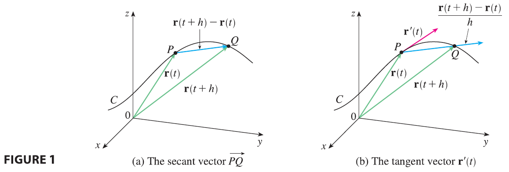
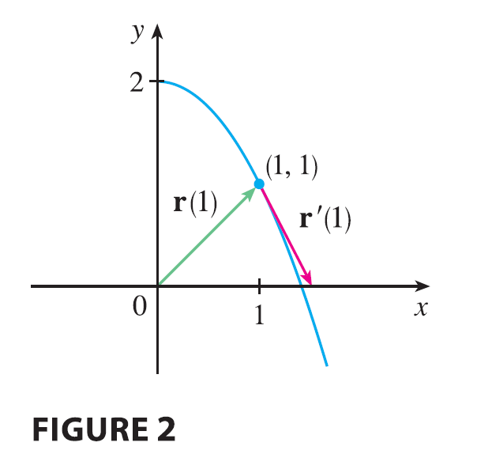
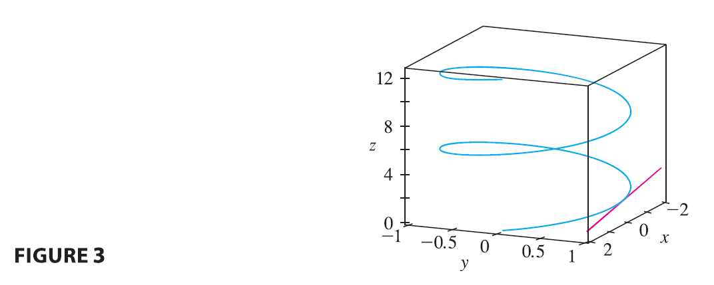
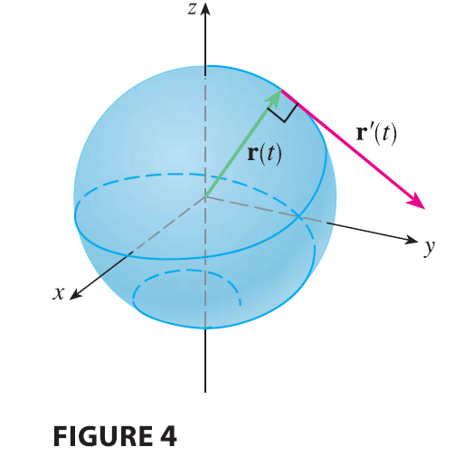

<page>

# Derivatives of Vector Functions

Later in this chapter we are going to use vector functions to describe the motion of planets and other objects through space. Here we prepare the way by developing the calculus of vector functions.

## Derivatives

The derivative $\mathbf{r}'$ of a vector function $\mathbf{r}$ is defined in much the same way as for real-valued functions:

$$
\frac{d\mathbf{r}}{dt} = \mathbf{r}'(t) = \lim_{h \to 0} \frac{\mathbf{r}(t+h) - \mathbf{r}(t)}{h} \tag{1}
$$

if this limit exists. The geometric significance of this definition is shown in Figure 1. If the points P and Q have position vectors $\mathbf{r}(t)$ and $\mathbf{r}(t+h)$, then $\vec{PQ}$ represents the vector $\mathbf{r}(t+h) - \mathbf{r}(t)$, which can therefore be regarded as a secant vector. If $h > 0$, the scalar multiple $(1/h)(\mathbf{r}(t+h) - \mathbf{r}(t))$ has the same direction as $\mathbf{r}(t+h) - \mathbf{r}(t)$. As $h \to 0$, it appears that this vector approaches a vector that lies on the tangent line. For this reason, the vector $\mathbf{r}'(t)$ is called the **tangent vector** to the curve defined by $\mathbf{r}$ at the point P, provided that $\mathbf{r}'(t)$ exists and $\mathbf{r}'(t) \neq \mathbf{0}$. The **tangent line** to C at P is defined to be the line through P parallel to the tangent vector $\mathbf{r}'(t)$. We will also have occasion to consider the **unit tangent vector**, which is

$$
\mathbf{T}(t) = \frac{\mathbf{r}'(t)}{|\mathbf{r}'(t)|}
$$

The following theorem gives us a convenient method for computing the derivative of a vector function $\mathbf{r}$: just differentiate each component of $\mathbf{r}$.

> **Theorem 2** If $\mathbf{r}(t) = \langle f(t), g(t), h(t) \rangle = f(t)\mathbf{i} + g(t)\mathbf{j} + h(t)\mathbf{k}$, where f, g, and h are differentiable functions, then
> $$
> \mathbf{r}'(t) = \langle f'(t), g'(t), h'(t) \rangle = f'(t)\mathbf{i} + g'(t)\mathbf{j} + h'(t)\mathbf{k}
> $$

**PROOF**
$$
\mathbf{r}'(t) = \lim_{\Delta t \to 0} \frac{1}{\Delta t}[\mathbf{r}(t+\Delta t) - \mathbf{r}(t)]
$$
$$
= \lim_{\Delta t \to 0} \frac{1}{\Delta t}[\langle f(t+\Delta t), g(t+\Delta t), h(t+\Delta t) \rangle - \langle f(t), g(t), h(t) \rangle]
$$
$$
= \lim_{\Delta t \to 0} \left\langle \frac{f(t+\Delta t) - f(t)}{\Delta t}, \frac{g(t+\Delta t) - g(t)}{\Delta t}, \frac{h(t+\Delta t) - h(t)}{\Delta t} \right\rangle
$$
$$
= \left\langle \lim_{\Delta t \to 0} \frac{f(t+\Delta t) - f(t)}{\Delta t}, \lim_{\Delta t \to 0} \frac{g(t+\Delta t) - g(t)}{\Delta t}, \lim_{\Delta t \to 0} \frac{h(t+\Delta t) - h(t)}{\Delta t} \right\rangle
$$
$$
= \langle f'(t), g'(t), h'(t) \rangle
$$

-----------

**EXAMPLE 1**
(a) Find the derivative of $\mathbf{r}(t) = (1+t^3)\mathbf{i} + te^{-t}\mathbf{j} + \sin 2t \mathbf{k}$.
(b) Find the unit tangent vector at the point where $t=0$.

<ans>

**SOLUTION**
(a) According to Theorem 2, we differentiate each component of $\mathbf{r}$:
$$
\mathbf{r}'(t) = 3t^2\mathbf{i} + (1-t)e^{-t}\mathbf{j} + 2\cos 2t \mathbf{k}
$$
(b) Since $\mathbf{r}(0) = \mathbf{i}$ and $\mathbf{r}'(0) = \mathbf{j} + 2\mathbf{k}$, the unit tangent vector at the point (1, 0, 0) is
$$
\mathbf{T}(0) = \frac{\mathbf{r}'(0)}{|\mathbf{r}'(0)|} = \frac{\mathbf{j} + 2\mathbf{k}}{\sqrt{1+4}} = \frac{1}{\sqrt{5}}\mathbf{j} + \frac{2}{\sqrt{5}}\mathbf{k}
$$

</ans>

-------

**EXAMPLE 2** For the curve $\mathbf{r}(t) = \sqrt{t}\mathbf{i} + (2-t)\mathbf{j}$, find $\mathbf{r}'(t)$ and sketch the position vector $\mathbf{r}(1)$ and the tangent vector $\mathbf{r}'(1)$.

<ans>

**SOLUTION** We have
$$
\mathbf{r}'(t) = \frac{1}{2\sqrt{t}}\mathbf{i} - \mathbf{j} \quad \text{and} \quad \mathbf{r}'(1) = \frac{1}{2}\mathbf{i} - \mathbf{j}
$$
The curve is a plane curve and elimination of the parameter from the equations $x=\sqrt{t}, y=2-t$ gives $y=2-x^2, x \ge 0$. In Figure 2 we draw the position vector $\mathbf{r}(1) = \mathbf{i}+\mathbf{j}$ starting at the origin and the tangent vector $\mathbf{r}'(1)$ starting at the corresponding point (1, 1).

</ans>

------------

**EXAMPLE 3** Find parametric equations for the tangent line to the helix with parametric equations
$$
x = 2\cos t \quad y = \sin t \quad z=t
$$
at the point $(0, 1, \pi/2)$.

<ans>

**SOLUTION** The vector equation of the helix is $\mathbf{r}(t) = \langle 2\cos t, \sin t, t \rangle$, so
$$
\mathbf{r}'(t) = \langle -2\sin t, \cos t, 1 \rangle
$$
The parameter value corresponding to the point $(0, 1, \pi/2)$ is $t=\pi/2$, so the tangent vector there is $\mathbf{r}'(\pi/2) = \langle -2, 0, 1 \rangle$. The tangent line is the line through $(0, 1, \pi/2)$ parallel to the vector $\langle -2, 0, 1 \rangle$, so by Equations 12.5.2 its parametric equations are
$$
x = -2t \quad y=1 \quad z = \frac{\pi}{2} + t
$$

</ans>

</page>

<page>

# Second derivatives

Just as for real-valued functions, the **second derivative** of a vector function $\mathbf{r}$ is the derivative of $\mathbf{r}'$, that is, $\mathbf{r}'' = (\mathbf{r}')'$. For instance, the second derivative of the function in Example 3 is
$$
\mathbf{r}''(t) = \langle -2\cos t, -\sin t, 0 \rangle
$$

</page>

<page>

# Differentiation Rules

The next theorem shows that the differentiation formulas for real-valued functions have their counterparts for vector-valued functions.

> **Theorem 3** Suppose $\mathbf{u}$ and $\mathbf{v}$ are differentiable vector functions, c is a scalar, and f is a real-valued function. Then
> 1. $\frac{d}{dt}[\mathbf{u}(t) + \mathbf{v}(t)] = \mathbf{u}'(t) + \mathbf{v}'(t)$
> 2. $\frac{d}{dt}[c\mathbf{u}(t)] = c\mathbf{u}'(t)$
> 3. $\frac{d}{dt}[f(t)\mathbf{u}(t)] = f'(t)\mathbf{u}(t) + f(t)\mathbf{u}'(t)$
> 4. $\frac{d}{dt}[\mathbf{u}(t) \cdot \mathbf{v}(t)] = \mathbf{u}'(t) \cdot \mathbf{v}(t) + \mathbf{u}(t) \cdot \mathbf{v}'(t)$
> 5. $\frac{d}{dt}[\mathbf{u}(t) \times \mathbf{v}(t)] = \mathbf{u}'(t) \times \mathbf{v}(t) + \mathbf{u}(t) \times \mathbf{v}'(t)$
> 6. $\frac{d}{dt}[\mathbf{u}(f(t))] = f'(t)\mathbf{u}'(f(t))$ (Chain Rule)

This theorem can be proved either directly from Definition 1 or by using Theorem 2 and the corresponding differentiation formulas for real-valued functions. The proof of Formula 4 follows; the remaining formulas are left as exercises.

**PROOF OF FORMULA 4** Let
$$
\mathbf{u}(t) = \langle f_1(t), f_2(t), f_3(t) \rangle \quad \mathbf{v}(t) = \langle g_1(t), g_2(t), g_3(t) \rangle
$$
Then
$$
\mathbf{u}(t) \cdot \mathbf{v}(t) = f_1(t)g_1(t) + f_2(t)g_2(t) + f_3(t)g_3(t) = \sum_{i=1}^3 f_i(t)g_i(t)
$$
so the ordinary Product Rule gives
$$
\frac{d}{dt}[\mathbf{u}(t) \cdot \mathbf{v}(t)] = \frac{d}{dt} \sum_{i=1}^3 f_i(t)g_i(t) = \sum_{i=1}^3 \frac{d}{dt}[f_i(t)g_i(t)]
$$
$$
= \sum_{i=1}^3 [f_i'(t)g_i(t) + f_i(t)g_i'(t)]
$$
$$
= \sum_{i=1}^3 f_i'(t)g_i(t) + \sum_{i=1}^3 f_i(t)g_i'(t)
$$
$$
= \mathbf{u}'(t) \cdot \mathbf{v}(t) + \mathbf{u}(t) \cdot \mathbf{v}'(t)
$$

</page>

<page>

# Example

**EXAMPLE 4** Show that if $|\mathbf{r}(t)| = c$ (a constant), then $\mathbf{r}'(t)$ is orthogonal to $\mathbf{r}(t)$ for all t.

<ans>

**SOLUTION** Since

$$
\mathbf{r}(t) \cdot \mathbf{r}(t) = |\mathbf{r}(t)|^2 = c^2
$$
and $c^2$ is a constant, Formula 4 of Theorem 3 gives
$$
0 = \frac{d}{dt}[\mathbf{r}(t) \cdot \mathbf{r}(t)] = \mathbf{r}'(t) \cdot \mathbf{r}(t) + \mathbf{r}(t) \cdot \mathbf{r}'(t) = 2\mathbf{r}'(t) \cdot \mathbf{r}(t)
$$
Thus $\mathbf{r}'(t) \cdot \mathbf{r}(t) = 0$, which says that $\mathbf{r}'(t)$ is orthogonal to $\mathbf{r}(t)$.

Geometrically, this result says that if a curve lies on a sphere with center the origin, then the tangent vector $\mathbf{r}'(t)$ is always perpendicular to the position vector $\mathbf{r}(t)$. (See Figure 4.)

</ans>

</page>

<page>

# Integrals

The **definite integral** of a continuous vector function $\mathbf{r}(t)$ can be defined in much the same way as for real-valued functions except that the integral is a vector. But then we can express the integral of $\mathbf{r}$ in terms of the integrals of its component functions f, g, and h as follows. 

$$
\int_a^b \mathbf{r}(t) dt = \lim_{n \to \infty} \sum_{i=1}^n \mathbf{r}(t_i^*) \Delta t
$$
$$
= \lim_{n \to \infty} \left[ \left( \sum_{i=1}^n f(t_i^*) \Delta t \right)\mathbf{i} + \left( \sum_{i=1}^n g(t_i^*) \Delta t \right)\mathbf{j} + \left( \sum_{i=1}^n h(t_i^*) \Delta t \right)\mathbf{k} \right]
$$
and so
$$
\int_a^b \mathbf{r}(t) dt = \left( \int_a^b f(t) dt \right)\mathbf{i} + \left( \int_a^b g(t) dt \right)\mathbf{j} + \left( \int_a^b h(t) dt \right)\mathbf{k}
$$
This means that we can evaluate an integral of a vector function by integrating each component function.
We can extend the Fundamental Theorem of Calculus to continuous vector functions as follows:
$$
\int_a^b \mathbf{r}(t) dt = \mathbf{R}(t) \Big]_a^b = \mathbf{R}(b) - \mathbf{R}(a)
$$
where $\mathbf{R}$ is an antiderivative of $\mathbf{r}$, that is, $\mathbf{R}'(t) = \mathbf{r}(t)$. We use the notation $\int \mathbf{r}(t) dt$ for indefinite integrals (antiderivatives).

---------

**EXAMPLE 5** If $\mathbf{r}(t) = 2\cos t \mathbf{i} + \sin t \mathbf{j} + 2t \mathbf{k}$, then
$$
\int \mathbf{r}(t) dt = \left( \int 2\cos t dt \right)\mathbf{i} + \left( \int \sin t dt \right)\mathbf{j} + \left( \int 2t dt \right)\mathbf{k}
$$
$$
= 2\sin t \mathbf{i} - \cos t \mathbf{j} + t^2 \mathbf{k} + \mathbf{C}
$$
where $\mathbf{C}$ is a vector constant of integration, and
$$
\int_0^{\pi/2} \mathbf{r}(t) dt = [2\sin t \mathbf{i} - \cos t \mathbf{j} + t^2 \mathbf{k}]_0^{\pi/2} = 2\mathbf{i} + \mathbf{j} + \frac{\pi^2}{4}\mathbf{k}
$$

</page>

