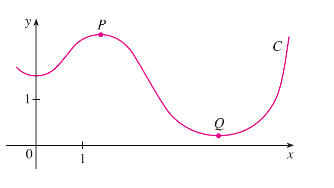
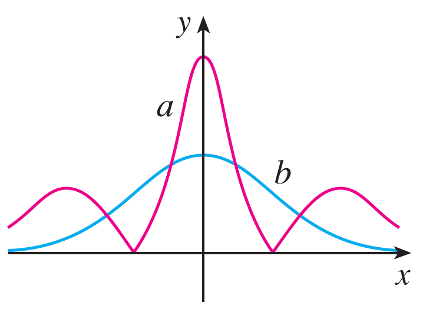
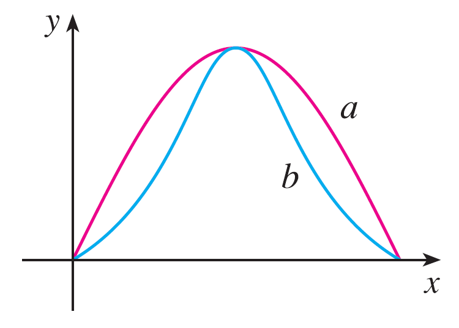

<page>

# Exercise 1

Find the length of the curve.
$\mathbf{r}(t) = \langle t, 3\cos t, 3\sin t \rangle, -5 \le t \le 5$

</page>

<page>

# Exercise 2

Find the length of the curve.
$\mathbf{r}(t) = \langle 2t, t^2, \frac{1}{3}t^3 \rangle, 0 \le t \le 1$

</page>

<page>

# Exercise 3

Find the length of the curve.
$\mathbf{r}(t) = \sqrt{2}t\mathbf{i} + e^t\mathbf{j} + e^{-t}\mathbf{k}, 0 \le t \le 1$

</page>

<page>

# Exercise 4

Find the length of the curve.
$\mathbf{r}(t) = \cos t \mathbf{i} + \sin t \mathbf{j} + \ln(\cos t)\mathbf{k}, 0 \le t \le \pi/4$

</page>

<page>

# Exercise 5

Find the length of the curve.
$\mathbf{r}(t) = \mathbf{i} + t^2\mathbf{j} + t^3\mathbf{k}, 0 \le t \le 1$

</page>

<page>

# Exercise 6

Find the length of the curve.
$\mathbf{r}(t) = t^2\mathbf{i} + 9t\mathbf{j} + 4t^{3/2}\mathbf{k}, 1 \le t \le 4$

</page>

<page>

# Exercise 7

Find the length of the curve correct to four decimal places. (Use a calculator to approximate the integral.)
$\mathbf{r}(t) = \langle t^2, t^3, t^4 \rangle, 0 \le t \le 2$

</page>

<page>

# Exercise 8

Find the length of the curve correct to four decimal places. (Use a calculator to approximate the integral.)
$\mathbf{r}(t) = \langle t, e^{-t}, te^{-t} \rangle, 1 \le t \le 3$

</page>

<page>

# Exercise 9

Find the length of the curve correct to four decimal places. (Use a calculator to approximate the integral.)
$\mathbf{r}(t) = \langle \cos \pi t, 2t, \sin 2\pi t \rangle$, from $(1, 0, 0)$ to $(1, 4, 0)$

</page>

<page>

# Exercise 10

Graph the curve with parametric equations $x = \sin t, y = \sin 2t, z = \sin 3t$. Find the total length of this curve correct to four decimal places.

</page>

<page>

# Exercise 11

Let C be the curve of intersection of the parabolic cylinder $x^2=2y$ and the surface $3z=xy$. Find the exact length of C from the origin to the point $(6, 18, 36)$.

</page>

<page>

# Exercise 12

Find, correct to four decimal places, the length of the curve of intersection of the cylinder $4x^2+y^2=4$ and the plane $x+y+z=2$.

</page>

<page>

# Exercise 13

(a) Find the arc length function for the curve measured from the point P in the direction of increasing t and then reparametrize the curve with respect to arc length starting from P, and (b) find the point 4 units along the curve (in the direction of increasing t) from P.
$\mathbf{r}(t) = (5-t)\mathbf{i} + (4t-3)\mathbf{j} + 3t\mathbf{k}, P(4, 1, 3)$

</page>

<page>

# Exercise 14

(a) Find the arc length function for the curve measured from the point P in the direction of increasing t and then reparametrize the curve with respect to arc length starting from P, and (b) find the point 4 units along the curve (in the direction of increasing t) from P.
$\mathbf{r}(t) = e^t\sin t \mathbf{i} + e^t\cos t \mathbf{j} + \sqrt{2}e^t\mathbf{k}, P(0, 1, \sqrt{2})$

</page>

<page>

# Exercise 15

Suppose you start at the point $(0, 0, 3)$ and move 5 units along the curve $x = 3\sin t, y = 4t, z = 3\cos t$ in the positive direction. Where are you now?

</page>

<page>

# Exercise 16

Reparametrize the curve
$$ \mathbf{r}(t) = \left( \frac{2}{t^2+1} - 1 \right)\mathbf{i} + \frac{2t}{t^2+1}\mathbf{j} $$
with respect to arc length measured from the point $(1, 0)$ in the direction of increasing t. Express the reparametrization in its simplest form. What can you conclude about the curve?

</page>

<page>

# Exercise 17

(a) Find the unit tangent and unit normal vectors $\mathbf{T}(t)$ and $\mathbf{N}(t)$.
(b) Use Formula 9 to find the curvature.
$\mathbf{r}(t) = \langle t, 3\cos t, 3\sin t \rangle$

</page>

<page>

# Exercise 18

(a) Find the unit tangent and unit normal vectors $\mathbf{T}(t)$ and $\mathbf{N}(t)$.
(b) Use Formula 9 to find the curvature.
$\mathbf{r}(t) = \langle t^2, \sin t - t\cos t, \cos t + t\sin t \rangle, t > 0$

</page>

<page>

# Exercise 19

(a) Find the unit tangent and unit normal vectors $\mathbf{T}(t)$ and $\mathbf{N}(t)$.
(b) Use Formula 9 to find the curvature.
$\mathbf{r}(t) = \langle \sqrt{2}t, e^t, e^{-t} \rangle$

</page>

<page>

# Exercise 20

(a) Find the unit tangent and unit normal vectors $\mathbf{T}(t)$ and $\mathbf{N}(t)$.
(b) Use Formula 9 to find the curvature.
$\mathbf{r}(t) = \langle t, \frac{1}{2}t^2, t^2 \rangle$

</page>

<page>

# Exercise 21

Use Theorem 10 to find the curvature.
$\mathbf{r}(t) = t^3\mathbf{j} + t^2\mathbf{k}$

</page>

<page>

# Exercise 22

Use Theorem 10 to find the curvature.
$\mathbf{r}(t) = t\mathbf{i} + t^2\mathbf{j} + e^t\mathbf{k}$

</page>

<page>

# Exercise 23

Use Theorem 10 to find the curvature.
$\mathbf{r}(t) = \sqrt{6}t^2\mathbf{i} + 2t\mathbf{j} + 2t^3\mathbf{k}$

</page>

<page>

# Exercise 24

Find the curvature of $\mathbf{r}(t) = \langle t^2, \ln t, t\ln t \rangle$ at the point $(1, 0, 0)$.

</page>

<page>

# Exercise 25

Find the curvature of $\mathbf{r}(t) = \langle t, t^2, t^3 \rangle$ at the point $(1, 1, 1)$.

</page>

<page>

# Exercise 26

Graph the curve with parametric equations $x = \cos t, y = \sin t, z = \sin 5t$ and find the curvature at the point $(1, 0, 0)$.

</page>

<page>

# Exercise 27

Use Formula 11 to find the curvature.
$y = x^4$

</page>

<page>

# Exercise 28

Use Formula 11 to find the curvature.
$y = \tan x$

</page>

<page>

# Exercise 29

Use Formula 11 to find the curvature.
$y = xe^x$

</page>

<page>

# Exercise 30

At what point does the curve have maximum curvature? What happens to the curvature as $x \to \infty$?
$y = \ln x$

</page>

<page>

# Exercise 31

At what point does the curve have maximum curvature? What happens to the curvature as $x \to \infty$?
$y = e^x$

</page>

<page>

# Exercise 32

Find an equation of a parabola that has curvature 4 at the origin.

</page>

<page>

# Exercise 33

(a) Is the curvature of the curve C shown in the figure greater at P or at Q? Explain.
(b) Estimate the curvature at P and at Q by sketching the osculating circles at those points.

</page>

<page>

# Exercise 34

Use a graphing calculator or computer to graph both the curve and its curvature function $\kappa(x)$ on the same screen. Is the graph of $\kappa$ what you would expect?
$y = x^4 - 2x^2$

</page>

<page>

# Exercise 35

Use a graphing calculator or computer to graph both the curve and its curvature function $\kappa(x)$ on the same screen. Is the graph of $\kappa$ what you would expect?
$y = x^{-2}$

</page>

<page>

# Exercise 36

Plot the space curve and its curvature function $\kappa(t)$. Comment on how the curvature reflects the shape of the curve.
$\mathbf{r}(t) = \langle t - \sin t, 1 - \cos t, 4\cos(t/2) \rangle, 0 \le t \le 8\pi$

</page>

<page>

# Exercise 37

Plot the space curve and its curvature function $\kappa(t)$. Comment on how the curvature reflects the shape of the curve.
$\mathbf{r}(t) = \langle te^t, e^{-t}, \sqrt{2}t \rangle, -5 \le t \le 5$

</page>

<page>

# Exercise 38

Two graphs, a and b, are shown. One is a curve $y = f(x)$ and the other is the graph of its curvature function $y = \kappa(x)$. Identify each curve and explain your choices.

</page>

<page>

# Exercise 39

Two graphs, a and b, are shown. One is a curve $y = f(x)$ and the other is the graph of its curvature function $y = \kappa(x)$. Identify each curve and explain your choices.

</page>

<page>

# Exercise 40

(a) Graph the curve $\mathbf{r}(t) = \langle \sin 3t, \sin 2t, \sin 3t \rangle$. At how many points on the curve does it appear that the curvature has a local or absolute maximum?
(b) Use a CAS to find and graph the curvature function. Does this graph confirm your conclusion from part (a)?

</page>

<page>

# Exercise 41

The graph of $\mathbf{r}(t) = \langle t - \frac{3}{2}\sin t, 1 - \frac{3}{2}\cos t, t \rangle$ is shown in Figure 13.1.12(b). Where do you think the curvature is largest? Use a CAS to find and graph the curvature function. For which values of t is the curvature largest?

</page>

<page>

# Exercise 42

Use Theorem 10 to show that the curvature of a plane parametric curve $x = f(t), y = g(t)$ is
$$ \kappa = \frac{|\dot{x}\ddot{y} - \dot{y}\ddot{x}|}{[\dot{x}^2 + \dot{y}^2]^{3/2}} $$
where the dots indicate derivatives with respect to t.

</page>

<page>

# Exercise 43

Use the formula in Exercise 42 to find the curvature.
$x = t^2, y = t^3$

</page>

<page>

# Exercise 44

Use the formula in Exercise 42 to find the curvature.
$x = a\cos \omega t, y = b\sin \omega t$

</page>

<page>

# Exercise 45

Use the formula in Exercise 42 to find the curvature.
$x = e^t\cos t, y = e^t\sin t$

</page>

<page>

# Exercise 46

Consider the curvature at $x=0$ for each member of the family of functions $f(x) = e^{cx}$. For which members is $\kappa(0)$ largest?

</page>

<page>

# Exercise 47

Find the vectors $\mathbf{T}$, $\mathbf{N}$, and $\mathbf{B}$ at the given point.
$\mathbf{r}(t) = \langle t^2, \frac{2}{3}t^3, t \rangle, (1, \frac{2}{3}, 1)$

</page>

<page>

# Exercise 48

Find the vectors $\mathbf{T}$, $\mathbf{N}$, and $\mathbf{B}$ at the given point.
$\mathbf{r}(t) = \langle \cos t, \sin t, \ln(\cos t) \rangle, (1, 0, 0)$

</page>

<page>

# Exercise 49

Find equations of the normal plane and osculating plane of the curve at the given point.
$x = \sin 2t, y = -\cos 2t, z = 4t; (0, 1, 2\pi)$

</page>

<page>

# Exercise 50

Find equations of the normal plane and osculating plane of the curve at the given point.
$x = \ln t, y = 2t, z = t^2; (0, 2, 1)$

</page>

<page>

# Exercise 51

Find equations of the osculating circles of the ellipse $9x^2+4y^2=36$ at the points $(2, 0)$ and $(0, 3)$. Use a graphing calculator or computer to graph the ellipse and both osculating circles on the same screen.

</page>

<page>

# Exercise 52

Find equations of the osculating circles of the parabola $y = \frac{1}{2}x^2$ at the points $(0, 0)$ and $(1, \frac{1}{2})$. Graph both osculating circles and the parabola on the same screen.

</page>

<page>

# Exercise 53

At what point on the curve $x=t^3, y=3t, z=t^4$ is the normal plane parallel to the plane $6x+6y-8z=1$?

</page>

<page>

# Exercise 54

Is there a point on the curve in Exercise 53 where the osculating plane is parallel to the plane $x+y+z=1$? [Note: You will need a CAS for differentiating, for simplifying, and for computing a cross product.]

</page>

<page>

# Exercise 55

Find equations of the normal and osculating planes of the curve of intersection of the parabolic cylinders $x=y^2$ and $z=x^2$ at the point $(1, 1, 1)$.

</page>

<page>

# Exercise 56

Show that the osculating plane at every point on the curve $\mathbf{r}(t) = \langle t+2, 1-t, \frac{1}{2}t^2 \rangle$ is the same plane. What can you conclude about the curve?

</page>

<page>

# Exercise 57

Show that at every point on the curve
$$ \mathbf{r}(t) = \langle e^t\cos t, e^t\sin t, e^t \rangle $$
the angle between the unit tangent vector and the z-axis is the same. Then show that the same result holds true for the unit normal and binormal vectors.

</page>

<page>

# Exercise 58

The rectifying plane of a curve at a point is the plane that contains the vectors T and B at that point. Find the rectifying plane of the curve $\mathbf{r}(t) = \sin t \mathbf{i} + \cos t \mathbf{j} + \tan t \mathbf{k}$ at the point $(\sqrt{2}/2, \sqrt{2}/2, 1)$.

</page>

<page>

# Exercise 59

Show that the curvature $\kappa$ is related to the tangent and normal vectors by the equation
$$ \frac{d\mathbf{T}}{ds} = \kappa\mathbf{N} $$

</page>

<page>

# Exercise 60

Show that the curvature of a plane curve is $\kappa = |d\phi/ds|$, where $\phi$ is the angle between $\mathbf{T}$ and $\mathbf{i}$; that is, $\phi$ is the angle of inclination of the tangent line. (This shows that the definition of curvature is consistent with the definition for plane curves given in Exercise 10.2.69.)

</page>
