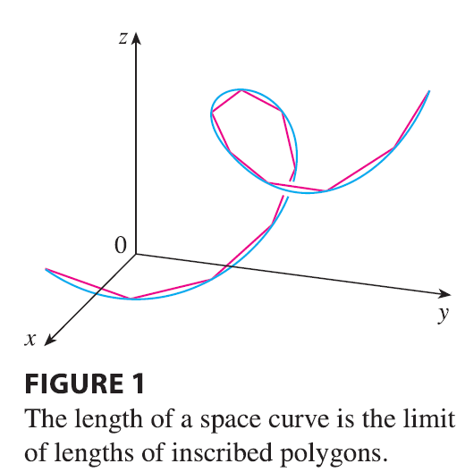
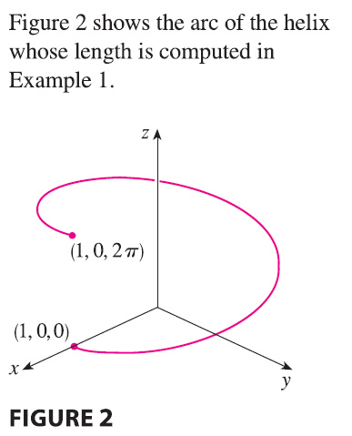
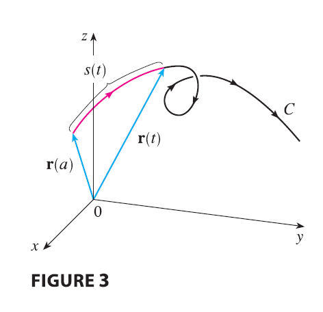
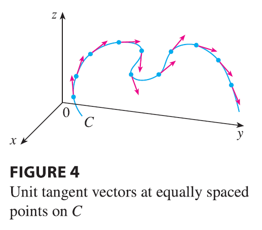
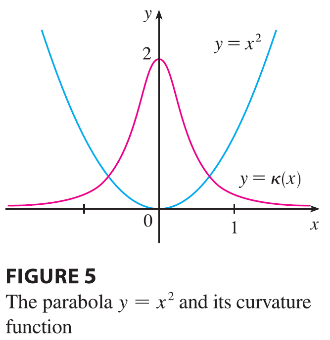
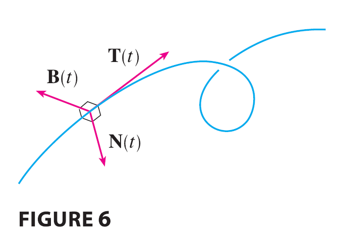
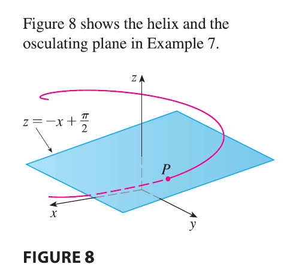
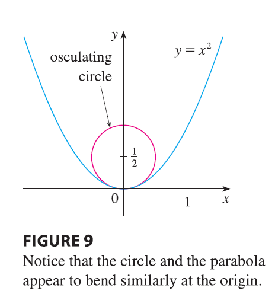

<page>

# Length of a Curve

In Section 10.2 we defined the length of a plane curve with parametric equations $x = f(t)$, $y = g(t)$, $a \le t \le b$, as the limit of lengths of inscribed polygons and, for the case where $f'$ and $g'$ are continuous, we arrived at the formula

$$
L = \int_a^b \sqrt{[f'(t)]^2 + [g'(t)]^2} dt = \int_a^b \sqrt{\left(\frac{dx}{dt}\right)^2 + \left(\frac{dy}{dt}\right)^2} dt \tag{1}
$$

The length of a space curve is defined in exactly the same way (see Figure 1). Suppose that the curve has the vector equation $\mathbf{r}(t) = \langle f(t), g(t), h(t) \rangle$, $a \le t \le b$, or, equivalently, the parametric equations $x = f(t)$, $y = g(t)$, $z = h(t)$, where $f'$, $g'$, and $h'$ are continuous. If the curve is traversed exactly once as $t$ increases from $a$ to $b$, then it can be shown that its length is

$$
L = \int_a^b \sqrt{[f'(t)]^2 + [g'(t)]^2 + [h'(t)]^2} dt \tag{2}
$$

$$
= \int_a^b \sqrt{\left(\frac{dx}{dt}\right)^2 + \left(\frac{dy}{dt}\right)^2 + \left(\frac{dz}{dt}\right)^2} dt
$$

Notice that both of the arc length formulas (1) and (2) can be put into the more compact form

$$
L = \int_a^b |\mathbf{r}'(t)| dt \tag{3}
$$

because, for plane curves $\mathbf{r}(t) = f(t)\mathbf{i} + g(t)\mathbf{j}$,
$$
|\mathbf{r}'(t)| = |f'(t)\mathbf{i} + g'(t)\mathbf{j}| = \sqrt{[f'(t)]^2 + [g'(t)]^2}
$$
and for space curves $\mathbf{r}(t) = f(t)\mathbf{i} + g(t)\mathbf{j} + h(t)\mathbf{k}$,
$$
|\mathbf{r}'(t)| = |f'(t)\mathbf{i} + g'(t)\mathbf{j} + h'(t)\mathbf{k}| = \sqrt{[f'(t)]^2 + [g'(t)]^2 + [h'(t)]^2}
$$

------

**EXAMPLE 1** Find the length of the arc of the circular helix with vector equation $\mathbf{r}(t) = \cos t \mathbf{i} + \sin t \mathbf{j} + t \mathbf{k}$ from the point $(1, 0, 0)$ to the point $(1, 0, 2\pi)$.

<ans>

**SOLUTION** Since $\mathbf{r}'(t) = -\sin t \mathbf{i} + \cos t \mathbf{j} + \mathbf{k}$, we have
$$
|\mathbf{r}'(t)| = \sqrt{(-\sin t)^2 + \cos^2 t + 1} = \sqrt{2}
$$
The arc from $(1, 0, 0)$ to $(1, 0, 2\pi)$ is described by the parameter interval $0 \le t \le 2\pi$ and so, from Formula 3, we have
$$
L = \int_0^{2\pi} |\mathbf{r}'(t)| dt = \int_0^{2\pi} \sqrt{2} dt = 2\sqrt{2}\pi
$$

</ans>

</page>

<page>

# Arc Length Function

A single curve C can be represented by more than one vector function. For instance, the twisted cubic
$$
\mathbf{r}_1(t) = \langle t, t^2, t^3 \rangle \qquad 1 \le t \le 2 \tag{4}
$$
could also be represented by the function
$$
\mathbf{r}_2(u) = \langle e^u, e^{2u}, e^{3u} \rangle \qquad 0 \le u \le \ln 2 \tag{5}
$$
where the connection between the parameters $t$ and $u$ is given by $t=e^u$. We say that Equations 4 and 5 are **parametrizations** of the curve C. If we were to use Equation 3 to compute the length of C using Equations 4 and 5, we would get the same answer. In general, it can be shown that when Equation 3 is used to compute arc length, the answer is independent of the parametrization that is used.

### The Arc Length Function

Now we suppose that C is a curve given by a vector function
$$
\mathbf{r}(t) = f(t)\mathbf{i} + g(t)\mathbf{j} + h(t)\mathbf{k} \qquad a \le t \le b
$$
where $\mathbf{r}'$ is continuous and C is traversed exactly once as $t$ increases from $a$ to $b$. We define its **arc length function** s by

$$
s(t) = \int_a^t |\mathbf{r}'(u)| du = \int_a^t \sqrt{\left(\frac{dx}{du}\right)^2 + \left(\frac{dy}{du}\right)^2 + \left(\frac{dz}{du}\right)^2} du \tag{6}
$$

Thus $s(t)$ is the length of the part of C between $\mathbf{r}(a)$ and $\mathbf{r}(t)$. (See Figure 3.) If we differentiate both sides of Equation 6 using Part 1 of the Fundamental Theorem of Calculus, we obtain

$$
\frac{ds}{dt} = |\mathbf{r}'(t)| \tag{7}
$$

It is often useful to **parametrize a curve with respect to arc length** because arc length arises naturally from the shape of the curve and does not depend on a particular coordinate system. If a curve $\mathbf{r}(t)$ is already given in terms of a parameter $t$ and $s(t)$ is the arc length function given by Equation 6, then we may be able to solve for $t$ as a function of $s$: $t = t(s)$. Then the curve can be reparametrized in terms of $s$ by substituting for $t$: $\mathbf{r} = \mathbf{r}(t(s))$. Thus, if $s=3$ for instance, $\mathbf{r}(t(3))$ is the position vector of the point 3 units of length along the curve from its starting point.

----------

**EXAMPLE 2** Reparametrize the helix $\mathbf{r}(t) = \cos t \mathbf{i} + \sin t \mathbf{j} + t \mathbf{k}$ with respect to arc length measured from $(1, 0, 0)$ in the direction of increasing $t$.

<ans>

**SOLUTION** The initial point $(1, 0, 0)$ corresponds to the parameter value $t=0$. From Example 1 we have
$$
\frac{ds}{dt} = |\mathbf{r}'(t)| = \sqrt{2}
$$
and so
$$
s = s(t) = \int_0^t |\mathbf{r}'(u)| du = \int_0^t \sqrt{2} du = \sqrt{2}t
$$
Therefore $t = s/\sqrt{2}$ and the required reparametrization is obtained by substituting for $t$:
$$
\mathbf{r}(t(s)) = \cos(s/\sqrt{2})\mathbf{i} + \sin(s/\sqrt{2})\mathbf{j} + (s/\sqrt{2})\mathbf{k}
$$

</ans>

</page>

<page>

# Curvature

A parametrization $\mathbf{r}(t)$ is called **smooth** on an interval I if $\mathbf{r}'$ is continuous and $\mathbf{r}'(t) \neq \mathbf{0}$ on I. A curve is called **smooth** if it has a smooth parametrization. A smooth curve has no sharp corners or cusps; when the tangent vector turns, it does so continuously.

If C is a smooth curve defined by the vector function $\mathbf{r}$, recall that the unit tangent vector $\mathbf{T}(t)$ is given by
$$
\mathbf{T}(t) = \frac{\mathbf{r}'(t)}{|\mathbf{r}'(t)|}
$$

and indicates the direction of the curve. From Figure 4 you can see that $\mathbf{T}(t)$ changes direction very slowly when C is fairly straight, but it changes direction more quickly when C bends or twists more sharply.

The **curvature** of C at a given point is a measure of how quickly the curve changes direction at that point. Specifically, we define it to be the magnitude of the rate of change of the unit tangent vector with respect to arc length. (We use arc length so that the curvature will be independent of the parametrization.) Because the unit tangent vector has constant length, only changes in direction contribute to the rate of change of $\mathbf{T}$.

> **Definition 8** The **curvature** of a curve is
> $$
> \kappa = \left| \frac{d\mathbf{T}}{ds} \right|
> $$
> where T is the unit tangent vector.

The curvature is easier to compute if it is expressed in terms of the parameter $t$ instead of $s$, so we use the Chain Rule (Theorem 13.2.3, Formula 6) to write
$$
\frac{d\mathbf{T}}{dt} = \frac{d\mathbf{T}}{ds} \frac{ds}{dt} \quad \text{and} \quad \kappa = \left| \frac{d\mathbf{T}}{ds} \right| = \left| \frac{d\mathbf{T}/dt}{ds/dt} \right|
$$
But $ds/dt = |\mathbf{r}'(t)|$ from Equation 7, so

$$
\kappa(t) = \frac{|\mathbf{T}'(t)|}{|\mathbf{r}'(t)|} \tag{9}
$$

--------

**EXAMPLE 3** Show that the curvature of a circle of radius $a$ is $1/a$.

<ans>

**SOLUTION** We can take the circle to have center the origin, and then a parametrization is
$$
\mathbf{r}(t) = a\cos t \mathbf{i} + a\sin t \mathbf{j}
$$
Therefore
$$
\mathbf{r}'(t) = -a\sin t \mathbf{i} + a\cos t \mathbf{j} \quad \text{and} \quad |\mathbf{r}'(t)| = a
$$
so
$$
\mathbf{T}(t) = \frac{\mathbf{r}'(t)}{|\mathbf{r}'(t)|} = -\sin t \mathbf{i} + \cos t \mathbf{j}
$$
and
$$
\mathbf{T}'(t) = -\cos t \mathbf{i} - \sin t \mathbf{j}
$$
This gives $|\mathbf{T}'(t)| = 1$, so using Formula 9, we have
$$
\kappa(t) = \frac{|\mathbf{T}'(t)|}{|\mathbf{r}'(t)|} = \frac{1}{a}
$$

</ans>

------------

The result of Example 3 shows that small circles have large curvature and large circles have small curvature, in accordance with our intuition. We can see directly from the definition of curvature that the curvature of a straight line is always 0 because the tangent vector is constant.

Although Formula 9 can be used in all cases to compute the curvature, the formula given by the following theorem is often more convenient to apply.

-------------

> **Theorem 10** The curvature of the curve given by the vector function $\mathbf{r}$ is
> $$
> \kappa(t) = \frac{|\mathbf{r}'(t) \times \mathbf{r}''(t)|}{|\mathbf{r}'(t)|^3}
> $$

**PROOF** Since $\mathbf{T} = \mathbf{r}'/|\mathbf{r}'|$ and $|\mathbf{r}'| = ds/dt$, we have
$$
\mathbf{r}' = |\mathbf{r}'|\mathbf{T} = \frac{ds}{dt}\mathbf{T}
$$
so the Product Rule (Theorem 13.2.3, Formula 3) gives
$$
\mathbf{r}'' = \frac{d^2s}{dt^2}\mathbf{T} + \frac{ds}{dt}\mathbf{T}'
$$
Using the fact that $\mathbf{T} \times \mathbf{T} = \mathbf{0}$, we have
$$
\mathbf{r}' \times \mathbf{r}'' = \left(\frac{ds}{dt}\right)^2(\mathbf{T} \times \mathbf{T}')
$$
Now $|\mathbf{T}(t)| = 1$ for all $t$, so $\mathbf{T}$ and $\mathbf{T}'$ are orthogonal by Example 13.2.4. Therefore, by Theorem 12.4.9,
$$
|\mathbf{r}' \times \mathbf{r}''| = \left(\frac{ds}{dt}\right)^2 |\mathbf{T} \times \mathbf{T}'| = \left(\frac{ds}{dt}\right)^2 |\mathbf{T}||\mathbf{T}'| = \left(\frac{ds}{dt}\right)^2 |\mathbf{T}'|
$$
Thus
$$
|\mathbf{T}'| = \frac{|\mathbf{r}' \times \mathbf{r}''|}{(ds/dt)^2} = \frac{|\mathbf{r}' \times \mathbf{r}''|}{|\mathbf{r}'|^2}
$$
and
$$
\kappa = \frac{|\mathbf{T}'|}{|\mathbf{r}'|} = \frac{|\mathbf{r}' \times \mathbf{r}''|}{|\mathbf{r}'|^3}
$$

-------------

**EXAMPLE 4** Find the curvature of the twisted cubic $\mathbf{r}(t) = \langle t, t^2, t^3 \rangle$ at a general point and at $(0, 0, 0)$.

<ans>

**SOLUTION** We first compute the required ingredients:
$$
\mathbf{r}'(t) = \langle 1, 2t, 3t^2 \rangle \qquad \mathbf{r}''(t) = \langle 0, 2, 6t \rangle
$$
$$
|\mathbf{r}'(t)| = \sqrt{1 + 4t^2 + 9t^4}
$$
$$
\mathbf{r}'(t) \times \mathbf{r}''(t) = \begin{vmatrix} \mathbf{i} & \mathbf{j} & \mathbf{k} \\ 1 & 2t & 3t^2 \\ 0 & 2 & 6t \end{vmatrix} = 6t^2\mathbf{i} - 6t\mathbf{j} + 2\mathbf{k}
$$
$$
|\mathbf{r}'(t) \times \mathbf{r}''(t)| = \sqrt{36t^4 + 36t^2 + 4} = 2\sqrt{9t^4 + 9t^2 + 1}
$$
Theorem 10 then gives
$$
\kappa(t) = \frac{|\mathbf{r}'(t) \times \mathbf{r}''(t)|}{|\mathbf{r}'(t)|^3} = \frac{2\sqrt{1+9t^2+9t^4}}{(1+4t^2+9t^4)^{3/2}}
$$
At the origin, where $t=0$, the curvature is $\kappa(0) = 2$.

</ans>

------------

## Curvature of graphs

For the special case of a plane curve with equation $y=f(x)$, we choose $x$ as the parameter and write $\mathbf{r}(x) = x\mathbf{i} + f(x)\mathbf{j}$. Then $\mathbf{r}'(x) = \mathbf{i} + f'(x)\mathbf{j}$ and $\mathbf{r}''(x) = f''(x)\mathbf{j}$. Since $\mathbf{i} \times \mathbf{j} = \mathbf{k}$ and $\mathbf{j} \times \mathbf{j} = \mathbf{0}$, it follows that $\mathbf{r}'(x) \times \mathbf{r}''(x) = f''(x)\mathbf{k}$. We also have $|\mathbf{r}'(x)| = \sqrt{1+[f'(x)]^2}$ and so, by Theorem 10,

$$
\kappa(x) = \frac{|f''(x)|}{[1+(f'(x))^2]^{3/2}} \tag{11}
$$

---------

**EXAMPLE 5** Find the curvature of the parabola $y=x^2$ at the points $(0, 0)$, $(1, 1)$, and $(2, 4)$.

<ans>

**SOLUTION** Since $y' = 2x$ and $y'' = 2$, Formula 11 gives
$$
\kappa(x) = \frac{|y''|}{[1+(y')^2]^{3/2}} = \frac{2}{(1+4x^2)^{3/2}}
$$
The curvature at $(0, 0)$ is $\kappa(0) = 2$. At $(1, 1)$ it is $\kappa(1) = 2/5^{3/2} \approx 0.18$. At $(2, 4)$ it is $\kappa(2) = 2/17^{3/2} \approx 0.03$. Observe from the expression for $\kappa(x)$ or the graph of $\kappa$ in Figure 5 that $\kappa(x) \to 0$ as $x \to \pm\infty$. This corresponds to the fact that the parabola appears to become flatter as $x \to \pm\infty$.

</ans>

</page>

<page>

# The Normal and Binormal Vectors

At a given point on a smooth space curve $\mathbf{r}(t)$, there are many vectors that are orthogonal to the unit tangent vector $\mathbf{T}(t)$. We single out one by observing that, because $|\mathbf{T}(t)|=1$ for all $t$, we have $\mathbf{T}(t) \cdot \mathbf{T}'(t) = 0$ by Example 13.2.4, so $\mathbf{T}'(t)$ is orthogonal to $\mathbf{T}(t)$. Note that, typically, $\mathbf{T}'(t)$ is itself not a unit vector. But at any point where $\kappa \neq 0$ we can define the **principal unit normal vector** $\mathbf{N}(t)$ (or simply **unit normal**) as
$$
\mathbf{N}(t) = \frac{\mathbf{T}'(t)}{|\mathbf{T}'(t)|}
$$
We can think of the unit normal vector as indicating the direction in which the curve is turning at each point. The vector $\mathbf{B}(t) = \mathbf{T}(t) \times \mathbf{N}(t)$ is called the **binormal vector**. It is perpendicular to both $\mathbf{T}$ and $\mathbf{N}$ and is also a unit vector. (See Figure 6.)

---------

**EXAMPLE 6** Find the unit normal and binormal vectors for the circular helix
$$
\mathbf{r}(t) = \cos t \mathbf{i} + \sin t \mathbf{j} + t \mathbf{k}
$$

<ans>

**SOLUTION** We first compute the ingredients needed for the unit normal vector:
$$
\mathbf{r}'(t) = -\sin t \mathbf{i} + \cos t \mathbf{j} + \mathbf{k} \qquad |\mathbf{r}'(t)| = \sqrt{2}
$$
$$
\mathbf{T}(t) = \frac{\mathbf{r}'(t)}{|\mathbf{r}'(t)|} = \frac{1}{\sqrt{2}}(-\sin t \mathbf{i} + \cos t \mathbf{j} + \mathbf{k})
$$
$$
\mathbf{T}'(t) = \frac{1}{\sqrt{2}}(-\cos t \mathbf{i} - \sin t \mathbf{j}) \qquad |\mathbf{T}'(t)| = \frac{1}{\sqrt{2}}
$$
$$
\mathbf{N}(t) = \frac{\mathbf{T}'(t)}{|\mathbf{T}'(t)|} = -\cos t \mathbf{i} - \sin t \mathbf{j} = \langle -\cos t, -\sin t, 0 \rangle
$$
This shows that the normal vector at any point on the helix is horizontal and points toward the z-axis. The binormal vector is
$$
\mathbf{B}(t) = \mathbf{T}(t) \times \mathbf{N}(t) = \frac{1}{\sqrt{2}} \begin{vmatrix} \mathbf{i} & \mathbf{j} & \mathbf{k} \\ -\sin t & \cos t & 1 \\ -\cos t & -\sin t & 0 \end{vmatrix} = \frac{1}{\sqrt{2}}\langle \sin t, -\cos t, 1 \rangle
$$

</ans>

-----------------

# Normal Plane & Osculating Plane

The plane determined by the normal and binormal vectors $\mathbf{N}$ and $\mathbf{B}$ at a point P on a curve C is called the **normal plane** of C at P. It consists of all lines that are orthogonal to the tangent vector $\mathbf{T}$. The plane determined by the vectors $\mathbf{T}$ and $\mathbf{N}$ is called the **osculating plane** of C at P. The name comes from the Latin *osculum*, meaning "kiss." It is the plane that comes closest to containing the part of the curve near P. (For a plane curve, the osculating plane is simply the plane that contains the curve.)

The circle that lies in the osculating plane of C at P, has the same tangent as C at P, lies on the concave side of C (toward which $\mathbf{N}$ points), and has radius $\rho = 1/\kappa$ (the reciprocal of the curvature) is called the **osculating circle** (or the **circle of curvature**) of C at P. It is the circle that best describes how C behaves near P; it shares the same tangent, normal, and curvature at P.

-------------

**EXAMPLE 7** Find equations of the normal plane and osculating plane of the helix in Example 6 at the point $P(0, 1, \pi/2)$.

<ans>

**SOLUTION** The point P corresponds to $t=\pi/2$ and the normal plane there has normal vector $\mathbf{r}'(\pi/2) = \langle -1, 0, 1 \rangle$, so an equation is
$$
-1(x-0) + 0(y-1) + 1(z-\pi/2) = 0 \quad \text{or} \quad z = x + \pi/2
$$
The osculating plane at P contains the vectors $\mathbf{T}$ and $\mathbf{N}$, so its normal vector is $\mathbf{T} \times \mathbf{N} = \mathbf{B}$. From Example 6 we have
$$
\mathbf{B}(t) = \frac{1}{\sqrt{2}}\langle \sin t, -\cos t, 1 \rangle \qquad \mathbf{B}(\pi/2) = \langle \frac{1}{\sqrt{2}}, 0, \frac{1}{\sqrt{2}} \rangle
$$
A simpler normal vector is $\langle 1, 0, 1 \rangle$, so an equation of the osculating plane is
$$
1(x-0) + 0(y-1) + 1(z-\pi/2) = 0 \quad \text{or} \quad z = -x + \pi/2
$$

</ans>

----------

**EXAMPLE 8** Find and graph the osculating circle of the parabola $y=x^2$ at the origin.

<ans>

**SOLUTION** From Example 5, the curvature of the parabola at the origin is $\kappa(0)=2$. So the radius of the osculating circle at the origin is $1/\kappa = 1/2$ and its center is $(0, 1/2)$. Its equation is therefore
$$
x^2 + (y - 1/2)^2 = 1/4
$$
For the graph in Figure 9 we use parametric equations of this circle:
$$
x = \frac{1}{2}\cos t \qquad y = \frac{1}{2} + \frac{1}{2}\sin t
$$

</ans>

</page>

<page>

# Section Summary

We summarize here the formulas for unit tangent, unit normal and binormal vectors, and curvature.
$$
\mathbf{T}(t) = \frac{\mathbf{r}'(t)}{|\mathbf{r}'(t)|} \qquad \mathbf{N}(t) = \frac{\mathbf{T}'(t)}{|\mathbf{T}'(t)|} \qquad \mathbf{B}(t) = \mathbf{T}(t) \times \mathbf{N}(t)
$$
$$
\kappa = \left| \frac{d\mathbf{T}}{ds} \right| = \frac{|\mathbf{T}'(t)|}{|\mathbf{r}'(t)|} = \frac{|\mathbf{r}'(t) \times \mathbf{r}''(t)|}{|\mathbf{r}'(t)|^3}
$$

</page>