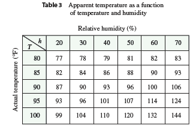
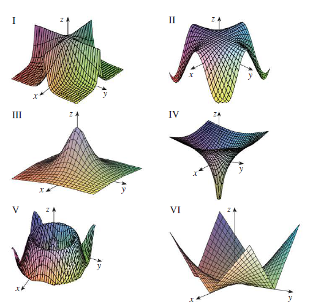

<page>

# Exercise 1

In Example 2 we considered the function $W = f(T, v)$, where $W$ is the wind-chill index, $T$ is the actual temperature, and $v$ is the wind speed. A numerical representation is given in Table 1 on page 889.  
(a) What is the value of $f(-15, 40)$? What is its meaning?  
(b) Describe in words the meaning of the question “For what value of $v$ is $f(-20, v) = -30$?” Then answer the question.  
(c) Describe in words the meaning of the question “For what value of $T$ is $f(T, 20) = -49$?” Then answer the question.  
(d) What is the meaning of the function $W = f(-5, v)$? Describe the behavior of this function.  
(e) What is the meaning of the function $W = f(T, 50)$? Describe the behavior of this function.

</page>

<page>

# Exercise 2

The temperature-humidity index $I$ (or humidex, for short) is the perceived air temperature when the actual temperature is $T$ and the relative humidity is $h$, so we can write $I = f(T, h)$. The following table of values of $I$ is an excerpt from a table compiled by the National Oceanic & Atmospheric Administration.  

(a) What is the value of $f(95, 70)$? What is its meaning?  
(b) For what value of $h$ is $f(90, h) = 100$?  
(c) For what value of $T$ is $f(T, 50) = 88$?  
(d) What are the meanings of the functions $I = f(80, h)$ and $I = f(100, h)$? Compare the behavior of these two functions of $h$.

</page>

<page>

# Exercise 3

A manufacturer has modeled its yearly production function $P$ (the monetary value of its entire production in millions of dollars) as a Cobb-Douglas function  
$$P(L, K) = 1.47L^{0.65}K^{0.35}$$  
where $L$ is the number of labor hours (in thousands) and $K$ is the invested capital (in millions of dollars). Find $P(120, 20)$ and interpret it.

</page>

<page>

# Exercise 4

Verify for the Cobb-Douglas production function  
$$P(L, K) = 1.01L^{0.75}K^{0.25}$$  
discussed in Example 3 that the production will be doubled if both the amount of labor and the amount of capital are doubled. Determine whether this is also true for the general production function  
$$P(L, K) = bL^rK^{1 - r}$$

</page>

<page>

# Exercise 5

A model for the surface area of a human body is given by the function  
$$S = f(w, h) = 0.1091w^{0.425}h^{0.725}$$  
where $w$ is the weight (in pounds), $h$ is the height (in inches), and $S$ is measured in square feet.  
(a) Find $f(160, 70)$ and interpret it.  
(b) What is your own surface area?

</page>

<page>

# Exercise 6

The wind-chill index $W$ discussed in Example 2 has been modeled by the following function:  
$$W(T, v) = 13.12 + 0.6215T - 11.37v^{0.16} + 0.3965Tv^{0.16}$$  
Check to see how closely this model agrees with the values in Table 1 for a few values of $T$ and $v$.

</page>

<page>

# Exercise 7

The wave heights $h$ in the open sea depend on the speed $v$ of the wind and the length of time $t$ that the wind has been blowing at that speed. Values of the function $h = f(v, t)$ are recorded in feet in Table 4.  
(a) What is the value of $f(40, 15)$? What is its meaning?  
(b) What is the meaning of the function $h = f(30, t)$? Describe the behavior of this function.  
(c) What is the meaning of the function $h = f(v, 30)$? Describe the behavior of this function.

</page>

<page>

# Exercise 9

Let $g(x, y) = \cos(x + 2y)$.  
(a) Evaluate $g(2, -1)$.  
(b) Find the domain of $g$.  
(c) Find the range of $g$.

</page>

<page>

# Exercise 10

Let $F(x, y) = 1 + \sqrt{4 - y^2}$.  
(a) Evaluate $F(3, 1)$.  
(b) Find and sketch the domain of $F$.  
(c) Find the range of $F$.

</page>

<page>

# Exercise 11

Let $f(x, y, z) = \sqrt{x} + \sqrt{y} + \sqrt{z} + \ln(4 - x^2 - y^2 - z^2)$.  
(a) Evaluate $f(1, 1, 1)$.  
(b) Find and describe the domain of $f$.

</page>

<page>

# Exercise 12

Let $g(x, y, z) = x^3y^2\sqrt{10 - x - y - z}$.  
(a) Evaluate $g(1, 2, 3)$.  
(b) Find and describe the domain of $g$.

</page>

<page>

# Exercise 13

Find and sketch the domain of the function.  
$f(x, y) = \sqrt{x - 2} + \sqrt{y - 1}$

</page>

<page>

# Exercise 14

Find and sketch the domain of the function.  
$f(x, y) = \sqrt[4]{x - 3y}$

</page>

<page>

# Exercise 15

Find and sketch the domain of the function.  
$f(x, y) = \ln(9 - x^2 - 9y^2)$

</page>

<page>

# Exercise 16

Find and sketch the domain of the function.  
$f(x, y) = \frac{\sqrt{x^2 + y^2 - 4}}{1 - x^2 - y^2}$

</page>

<page>

# Exercise 17

Find and sketch the domain of the function.  
$g(x, y) = \frac{x - y}{x + y}$

</page>

<page>

# Exercise 18

Find and sketch the domain of the function.  
$g(x, y) = \frac{\ln(2 - x)}{1 - x^2 - y^2}$

</page>

<page>

# Exercise 19

Find and sketch the domain of the function.  
$f(x, y) = \frac{\sqrt{y - x^2}}{1 - x^2}$

</page>

<page>

# Exercise 20

Find and sketch the domain of the function.  
$f(x, y) = \sin^{-1}(x + y)$

</page>

<page>

# Exercise 21

Find and sketch the domain of the function.  
$f(x, y, z) = \sqrt{4 - x^2} + \sqrt{9 - y^2} + \sqrt{1 - z^2}$

</page>

<page>

# Exercise 22

Find and sketch the domain of the function.  
$f(x, y, z) = \ln(16 - 4x^2 - 4y^2 - z^2)$

</page>

<page>

# Exercise 32

Match the function with its graph (labeled I–VI). Give reasons for your choices.  
(a) $f(x, y) = \frac{1}{1 + x^2 + y^2}$  
(b) $f(x, y) = \frac{1}{1 + x^2y^2}$  
(c) $f(x, y) = \ln(x^2 + y^2)$  
(d) $f(x, y) = \cos\sqrt{x^2 + y^2}$  
(e) $f(x, y) = |xy|$  
(f) $f(x, y) = \cos(xy)$

</page>

<page>

# Exercise 45

Draw a contour map of the function showing several level curves.  
$f(x, y) = x^2 - y^2$

</page>

<page>

# Exercise 46

Draw a contour map of the function showing several level curves.  
$f(x, y) = xy$

</page>

<page>

# Exercise 47

Draw a contour map of the function showing several level curves.  
$f(x, y) = \sqrt{x} + y$

</page>

<page>

# Exercise 48

Draw a contour map of the function showing several level curves.  
$f(x, y) = \ln(x^2 + 4y^2)$

</page>

<page>

# Exercise 49

Draw a contour map of the function showing several level curves.  
$f(x, y) = ye^x$

</page>

<page>

# Exercise 50

Draw a contour map of the function showing several level curves.  
$f(x, y) = y - \arctan{x}$

</page>

<page>

# Exercise 51

Draw a contour map of the function showing several level curves.  
$f(x, y) = \sqrt[3]{x^2 + y^2}$

</page>

<page>

# Exercise 52

Draw a contour map of the function showing several level curves.  
$f(x, y) = \frac{y}{x^2 + y^2}$

</page>

<page>

# Exercise 67

Describe the level surfaces of the function.  
$f(x, y, z) = x + 3y + 5z$

</page>

<page>

# Exercise 68

Describe the level surfaces of the function.  
$f(x, y, z) = x^2 + 3y^2 + 5z^2$

</page>

<page>

# Exercise 69

Describe the level surfaces of the function.  
$f(x, y, z) = y^2 + z^2$

</page>

<page>

# Exercise 70

Describe the level surfaces of the function.  
$f(x, y, z) = x^2 - y^2 - z^2$

</page>
