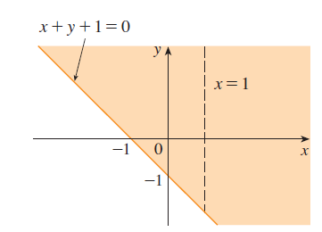
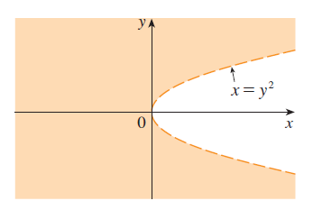
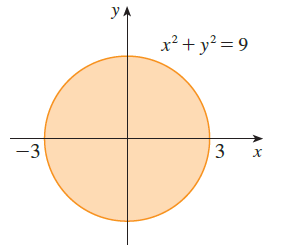
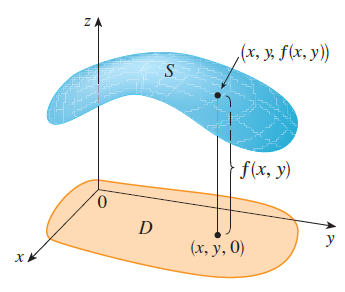
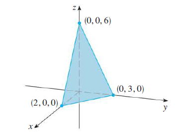
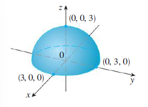
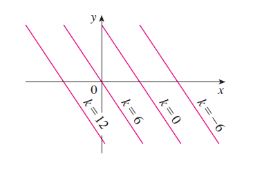
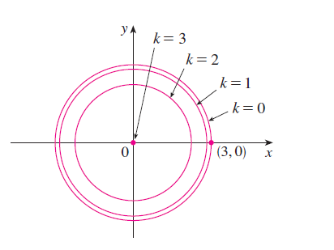
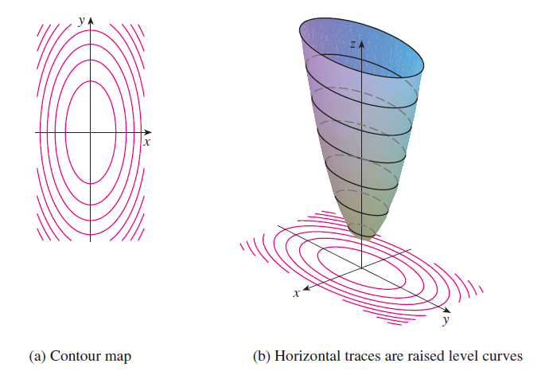

<page>

# Learning Outcomes

In this section we will learn about

- Functions of 2 and 3 variables
- Grpahs
- Domains
- Level curves
- Level Surfaces
</page>

<page>

# Functions of 2 variables

## Definition
A function **f** of two variables is a rule that assigns to each ordered pair of real numbers $(x, y)$ in a set $D$ a unique real number denoted by $f(x, y)$. The set $D$ is the **domain** of $f$ and its **range** is the set of values that $f$ takes on, that is, $f(x, y) \mid (x, y) \in D$.

## Example
- Volume of a cylinder $V(r,h) = \pi r^2 h$
- Area of rectangle $A(l,b) = lb$
</page>

<page>

# Domain: Definition and examples

## Definition
The domain of a function **f** is the collection of the points on which this function can be evaluated.

----------------

### Example Question
Find and sketch the domain of $$f(x,y) = \frac{\sqrt{x+y+1}}{x-1}$$.

<ans>
$$
D = \{ (x, y) \mid x + y + 1 \geq 0,\ x \neq 1 \}
$$

</ans>

---------------

### Example Question
Find and sketch the domain of $f(x, y) = x \ln(y^2 - x)$.

<ans>
$$
D = \{(x,y) | x < y^2\}
$$

</ans>

-------------------

### Example Question
Find and sketch the domain of $g(x, y) = \sqrt{ 9 - x^2 - y^2}$.

<ans>
$$
D = \{(x, y) \mid 9 - x^2 - y^2 \geq 0\} = \{(x, y) \mid x^2 + y^2 \leq 9\}
$$

</ans>

-------------------

</page>

<page>

# Graphs

**Definition** If $f$ is a function of two variables with domain  $D$, then the **graph** of $f$ is the set of all points $(x, y, z)$ in $\mathbb{R}^3$ such that $z = f(x, y)$ and $(x, y) \in D$. 

## Example

Sketch the graph of the function $ f(x, y) = 6 - 3x - 2y $.

<ans>

</ans>

## Example

Sketch the graph of the function $ f(x, y) = \sqrt{9 - x^2 - y^2} $.

<ans>

</ans>
</page>

<page>

# Practice graph plotting in softwares

## Exercise

Plot graphs of these functions on Geobegra or any plotting software you like.

- $f(x, y) = (x^2 + 3y^2) e^{-x^2 - y^2}$
- $f(x, y) = \sin x + \sin y$
- $f(x, y) = \frac{\sin x \sin y}{xy}$
</page>

<page>

# Level Curves and Surfaces

**Definition**  
The **level curves** of a function $f$ of two variables are the curves with equations $f(x, y) = k$, where $k$ is a constant (in the range of $f$).

## Example 

Sketch the level curves of the function $f(x, y) = 6 - 3x - 2y$ for the values $k = -6, 0, 6, 12$.

<ans>

</ans>

---------------------------

## Example Level curves
Sketch the level curves for the function 
$$
g(x,y) = \sqrt{ 9 - x^2 - y^2} \qquad \text{for} \qquad k = 0, 1, 2, 3.
$$

<ans>

</ans>

## Example Level Curves

Sketch some level curves for the function
$$
    h(x,y) = 4x^2 + y^2  + 1
$$

<ans>

</ans>
</page>