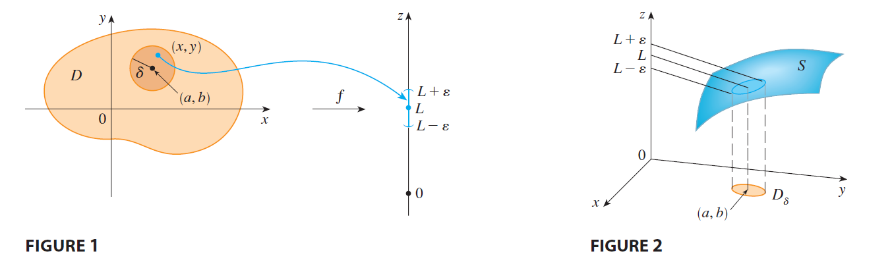
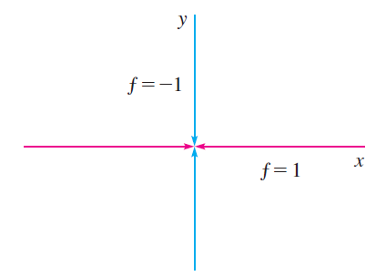
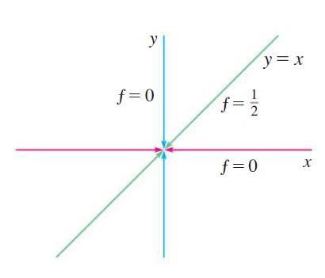

<page>

# Learning Outcomes

In this section we will learn about

- Limits and Continuity of 2 and 3 variable functions

</page>

<page>

# Definition of Limit

**Definition**  
Let $f$ be a function of two variables whose domain $D$ includes points arbitrarily close to $(a, b)$. Then we say that the **limit of $f(x, y)$ as $(x, y)$ approaches $(a, b)$** is $L$ and we write:

$$
\lim_{(x, y) \to (a, b)} f(x, y) = L
$$

if for every number $\varepsilon > 0$ there is a corresponding number $\delta > 0$ such that

$$
\text{if } (x, y) \in D \quad \text{and} \quad 0 < \sqrt{(x - a)^2 + (y - b)^2} < \delta \quad \text{then} \quad |f(x, y) - L| < \varepsilon
$$

**Simple Interpretation**
Function $f(x,y)$ value approaches $L$ regardless of the path through which $(x,y)$ approaces $(a,b)$.

**Limit Does not Exist if** 
Find two paths along which function values approaches different limit.

</page>

<page>

# Example 1: Limit does not exist

**Example**  
Show that  $\lim_{(x, y) \to (0, 0)} \frac{x^2 - y^2}{x^2 + y^2}$  does not exist.

</page>

<page>

# Example 2: Limit does not exist

**Example**  
Show that  $\lim_{(x, y) \to (0, 0)} \frac{xy}{x^2 + y^2}$  does not exist.

</page>

<page>

# Example 2: Limit does not exist

**Example**  
Show that  $\lim_{(x, y) \to (0, 0)} \frac{xy^2}{x^2 + y^4}$  does not exist.

</page>

<page>

# Example 2: Limit exist

**Example**  
Show that  $\lim_{(x, y) \to (0, 0)} \frac{x^2y}{x^2 + y^2}$  exists.

**Note**
Detailed proof is not in the syllabus. Just plot the graph. See that it is pretty smooth at $(0,0)$.

</page>

<page>

# Definition: Continuity

**Definition**  
A function $f$ of two variables is called **continuous at** $(a, b)$ if

$$
\lim_{(x, y) \to (a, b)} f(x, y) = f(a, b)
$$

We say $f$ is **continuous on** $D$ if $f$ is continuous at every point $(a, b)$ in $D$.

**Note**
In this course you will not be asked to prove continuity. Use these rules.

- Polynomials are always continuous
- Most forumulas as continuous if you can evaluate the formula at the given point.

**Example**  
Evaluate  
$$
\lim_{(x, y) \to (1, 2)} \left(x^2 y^3 - x^3 y^2 + 3x + 2y\right).
$$

**Solution**  
Since $f(x, y) = x^2 y^3 - x^3 y^2 + 3x + 2y$ is a polynomial, it is continuous everywhere, so we can find the limit by direct substitution:

$$
\lim_{(x, y) \to (1, 2)} \left(x^2 y^3 - x^3 y^2 + 3x + 2y\right)
= 1^2 \cdot 2^3 - 1^3 \cdot 2^2 + 3 \cdot 1 + 2 \cdot 2 = 11
$$

---

**Example**  
Where is the function  
$$
f(x, y) = \frac{x^2 - y^2}{x^2 + y^2}
$$  
continuous?

**Solution**  
The function $f$ is discontinuous at $(0, 0)$ because it is not defined there. Since $f$ is a rational function, it is continuous on its domain, which is the set  
$$
D = \{(x, y) \mid (x, y) \neq (0, 0)\}.
$$

</page>