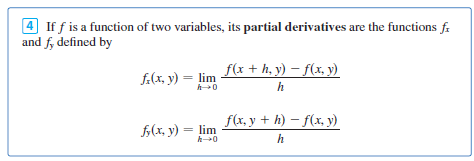
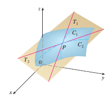
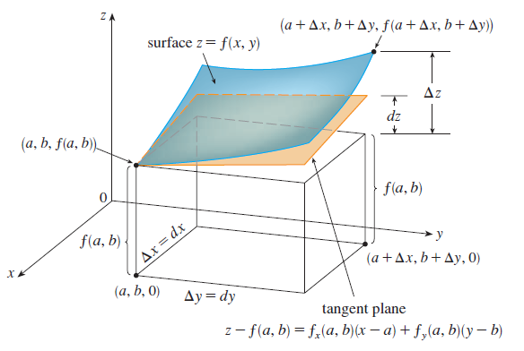
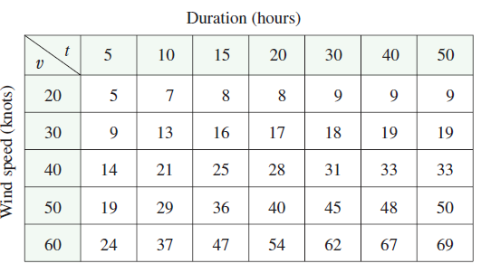
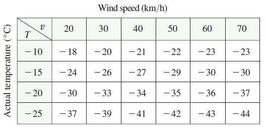

<page>

# Partial Derivatives

Learning Outcomes
- Definition and examples of partial derivatives

**Rough Idea** Differentiate the function with respect to one variable, treating other variables as constant.

**Definition**

**Example**

<ans>

</ans>
</page>

<page>

# Geomtric Interpretation of Partial Derivatives

**Question** If derivatives in one variable functions were giving the slope of the tangent, what are we getting with partial derivatives in two variable or three variable functions?

<ans>

</ans>

</page>

<page>

# Chain rule inside partial derivatives

**Question** 

<ans>

</ans>

---------

**Question**

<ans>

</ans>

</page>

<page>

# Partial deriative of 3 or more variables. 

Basic idea is the same. Treat other variables as constant, and differentiate with respect to the variable of your interest. 

<ans>

</ans>

</page>

<page>

# Higher Order Derivatives

----
**Second partial derivatives**

----

<ans>

</ans>

</page>

<page>

# Is $f_{xy} = f_{yx}$?

**Question**: $f_{xy} = f_{yx}$? Mostly true in application but not always true. 

</page>

<page>

# Partial Differential Equations

Partial derivatives occur in partial differential equations that express certain physical laws. 

**Laplace Equation**
$$
\frac{\partial^2 u}{\partial x^2}+\frac{\partial^2 u}{\partial y^2}=0
$$
They play a role in problems of heat conduction, fluid flow, and electric potential.

-------
**Example**

Show that the function $u(x, y) = e^x \sin y$ is a solution of Laplace’s equation.

<ans>

**Solution** We first compute the needed second-order partial derivatives:

$$
u_x = e^x \sin y \quad\quad u_y = e^x \cos y
$$

$$
u_{xx} = e^x \sin y \quad\quad u_{yy} = -e^x \sin y
$$

So

$$
u_{xx} + u_{yy} = e^x \sin y - e^x \sin y = 0
$$

Therefore $u$ satisfies Laplace’s equation.

</ans>

------

**The Wave Equation**

$$
\frac{\partial^2 u}{\partial t^2} = a^2 \frac{\partial^2 u}{\partial x^2}
$$

describes the motion of a waveform (a sound wave, a light wave, or a wave traveling along a vibrating string). 

For instance, if $u(x, t)$ represents the displacement of a vibrating violin string at time $t$ and at a distance $x$ from one end of the string, then $u(x, t)$ satisfies the wave equation. Here the constant $a$ depends on the density of the string and on the tension in the string.

**Example**

Verify that the function $u(x, t) = \sin(x - at)$ satisfies the wave equation.

<ans> 

**Solution**

$$
u_x = \cos(x - at) \quad\quad u_t = -a \cos(x - at)
$$

$$
u_{xx} = -\sin(x - at) \quad\quad u_{tt} = -a^2 \sin(x - at) = a^2 u_{xx}
$$

So $u$ satisfies the wave equation.

</ans>

</page>