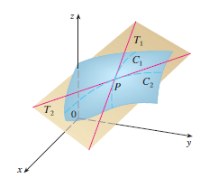
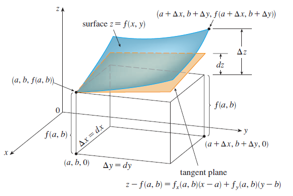

<page>

# Learing Outcomes

- Tangent Planes
- Linear Approximations
- Differentials
  
</page>

<page>

# Tangent Plane

Suppose $f$ has continuous partial derivatives. An equation of the tangent plane to the surface $z = f(x, y)$ at the point $P(x_0, y_0, z_0)$ is

$$
z - z_0 = f_x(x_0, y_0)(x - x_0) + f_y(x_0, y_0)(y - y_0)
$$

-------

**EXAMPLE 1**  
Find the tangent plane to the elliptic paraboloid $z = 2x^2 + y^2$ at the point $(1, 1, 3)$.

<ans> 

**SOLUTION**  
Let $f(x, y) = 2x^2 + y^2$. Then

$$
f_x(x, y) = 4x \qquad f_y(x, y) = 2y
$$

$$
f_x(1, 1) = 4 \qquad f_y(1, 1) = 2
$$

Then (2) gives the equation of the tangent plane at $(1, 1, 3)$ as

$$
z - 3 = 4(x - 1) + 2(y - 1)
$$

or

$$
z = 4x + 2y - 3
$$

</ans>

</page>

<page>

# Differentials

If $z = f(x,y)$, its differential is defined as

$$
dz = f_x(x, y)\,dx + f_y(x, y)\,dy = \frac{\partial z}{\partial x} dx + \frac{\partial z}{\partial y} dy
$$

</page>

<page>

# Geometrical Interpretation of Differentials

</page>

<page>

# Example usage of differentials

**EXAMPLE**  
(a) If $z = f(x, y) = x^2 + 3xy - y^2$, find the differential $dz$.  
(b) If $x$ changes from 2 to 2.05 and $y$ changes from 3 to 2.96, compare the values of $\Delta z$ and $dz$.

<ans>

**SOLUTION**  
(a) Definition 10 gives

$$
dz = \frac{\partial z}{\partial x} dx + \frac{\partial z}{\partial y} dy = (2x + 3y)\,dx + (3x - 2y)\,dy
$$

(b) Putting $x = 2$, $dx = \Delta x = 0.05$, $y = 3$, and $dy = \Delta y = -0.04$, we get

$$
dz = [2(2) + 3(3)](0.05) + [3(2) - 2(3)](-0.04) = 0.65
$$

The increment of $z$ is

$$
\Delta z = f(2.05, 2.96) - f(2, 3)
$$

$$
= [(2.05)^2 + 3(2.05)(2.96) - (2.96)^2] - [2^2 + 3(2)(3) - 3^2]
$$

$$
= 0.6449
$$

Notice that $\Delta z \approx dz$ but $dz$ is easier to compute.

</ans>

-----

**EXAMPLE**  
The base radius and height of a right circular cone are measured as 10 cm and 25 cm, respectively, with a possible error in measurement of as much as 0.1 cm in each. Use differentials to estimate the maximum error in the calculated volume of the cone.

<ans> 

**SOLUTION**  
The volume $V$ of a cone with base radius $r$ and height $h$ is $V = \frac{\pi r^2 h}{3}$.  
So the differential of $V$ is

$$
dV = \frac{\partial V}{\partial r} dr + \frac{\partial V}{\partial h} dh = \frac{2\pi rh}{3} dr + \frac{\pi r^2}{3} dh
$$

Since each error is at most 0.1 cm, we have $|dr| \leq 0.1$, $|dh| \leq 0.1$.  
To estimate the largest error in the volume we take the largest error in the measurement of $r$ and of $h$.  
Therefore we take $dr = 0.1$ and $dh = 0.1$ along with $r = 10$, $h = 25$. This gives

$$
dV = \frac{500\pi}{3}(0.1) + \frac{100\pi}{3}(0.1) = 20\pi
$$

Thus the maximum error in the calculated volume is about $20\pi \,\text{cm}^3 \approx 63\,\text{cm}^3$.

</ans>

</page>

<page>

# Differentials in 3 variables

The **differential** $dw$ is defined in terms of the differentials $dx$, $dy$, and $dz$ of the independent variables by

$$
dw = \frac{\partial w}{\partial x} dx + \frac{\partial w}{\partial y} dy + \frac{\partial w}{\partial z} dz
$$

---

**EXAMPLE**  
The dimensions of a rectangular box are measured to be 75 cm, 60 cm, and 40 cm, and each measurement is correct to within 0.2 cm. Use differentials to estimate the largest possible error when the volume of the box is calculated from these measurements.

<ans>

**SOLUTION**  
If the dimensions of the box are $x$, $y$, and $z$, its volume is $V = xyz$ and so

$$
dV = \frac{\partial V}{\partial x} dx + \frac{\partial V}{\partial y} dy + \frac{\partial V}{\partial z} dz = yz\,dx + xz\,dy + xy\,dz
$$

We are given that $|\Delta x| \leq 0.2$, $|\Delta y| \leq 0.2$, and $|\Delta z| \leq 0.2$.  
To estimate the largest error in the volume, we therefore use $dx = 0.2$, $dy = 0.2$, and $dz = 0.2$ together with  
$x = 75$, $y = 60$, and $z = 40$:

$$
\Delta V \approx dV = (60)(40)(0.2) + (75)(40)(0.2) + (75)(60)(0.2) = 1980
$$

Thus an error of only 0.2 cm in measuring each dimension could lead to an error of approximately 1980 cm³ in the calculated volume! This may seem like a large error, but it’s only about 1% of the volume of the box.

</ans>

</page>

<page>

# Exercise 1

Find an equation of the tangent plane to the given surface at the specified point.

$z = 2x^2 + y^2 - 5y,\quad (1, 2, -4)$  

</page>

<page>

# Exercise 2
Find an equation of the tangent plane to the given surface at the specified point.

$z = (x + 2)^2 - 2(y - 1)^2 - 5,\quad (2, 3, 3)$  

</page>

<page>

# Exercise 3
Find an equation of the tangent plane to the given surface at the specified point.

$z = e^{x - y},\quad (2, 2, 1)$  

</page>

<page>

# Exercise 4
Find an equation of the tangent plane to the given surface at the specified point.
$z = \dfrac{x}{y^2},\quad (-4, 2, -1)$  

</page>

<page>

# Exercise 5

Find an equation of the tangent plane to the given surface at the specified point.

$z = x \sin(x + y),\quad (-1, 1, 0)$  

</page>

<page>

# Exercise 6

Find an equation of the tangent plane to the given surface at the specified point.

$z = \ln(x - 2y),\quad (3, 1, 0)$

</page>

<page>

# Exercise 7

Graph the surface and the tangent plane at the given point. (Choose the domain and viewpoint so that you get a good view of both the surface and the tangent plane.) Then zoom in until the surface and the tangent plane become indistinguishable.

$z = x^2 + xy + 3y^2,\quad (1, 1, 5)$

</page>

<page>

# Exercise 8

Graph the surface and the tangent plane at the given point. (Choose the domain and viewpoint so that you get a good view of both the surface and the tangent plane.) Then zoom in until the surface and the tangent plane become indistinguishable.

$z = \sqrt{9 + x^2y^2},\quad (2, 2, 5)$

</page>

<page>

# Exercise 9

Draw the graph of $f$ and its tangent plane at the given point. (Use your computer algebra system both to compute the partial derivatives and to graph the surface and its tangent plane.)

$f(x, y) = \dfrac{1 + \cos^2(x - y)}{1 + \cos^2(x + y)},\quad \left(\dfrac{\pi}{3}, \dfrac{\pi}{6}, \dfrac{7}{4}\right)$

</page>

<page>

# Exercise 10

Draw the graph of $f$ and its tangent plane at the given point. (Use your computer algebra system both to compute the partial derivatives and to graph the surface and its tangent plane.)

$f(x, y) = e^{-xy/10}\left(\sqrt{x} + \sqrt{y} + \sqrt{xy}\right),\quad (1, 1, 3e^{-0.1})$

</page>

<page>

# Exercise 11

Explain why the function is differentiable at the given point. Then find the linearization $L(x, y)$ of the function at that point.

$f(x, y) = 1 + x \ln(xy - 5),\quad (2, 3)$

</page>

<page>

# Exercise 12

Explain why the function is differentiable at the given point. Then find the linearization $L(x, y)$ of the function at that point.

$f(x, y) = \sqrt{xy},\quad (1, 4)$

</page>

<page>

# Exercise 13

Explain why the function is differentiable at the given point. Then find the linearization $L(x, y)$ of the function at that point.

 $f(x, y) = x^2 e^y,\quad (1, 0)$

</page>

<page>

# Exercise 14

Explain why the function is differentiable at the given point. Then find the linearization $L(x, y)$ of the function at that point.

 $f(x, y) = \dfrac{1 + y}{1 + x},\quad (1, 3)$

</page>

<page>

# Exercise 15

Explain why the function is differentiable at the given point. Then find the linearization $L(x, y)$ of the function at that point.

 $f(x, y) = 4 \arctan(xy),\quad (1, 1)$

</page>

<page>

# Exercise 16

Explain why the function is differentiable at the given point. Then find the linearization $L(x, y)$ of the function at that point.

 $f(x, y) = y + \sin(x/y),\quad (0, 3)$

</page>

<page>

# Exercise 17

Verify the linear approximation at $(0, 0)$.

$e^x \cos(xy) \approx x + 1$

</page>

<page>

# Exercise 18

Verify the linear approximation at $(0, 0)$.

$\dfrac{y - 1}{x + 1} \approx x + y - 1$

</page>

<page>

# Exercise 19

Given that $f$ is a differentiable function with $f(2, 5) = 6$, $f_x(2, 5) = 1$, and $f_y(2, 5) = -1$, use a linear approximation to estimate $f(2.2, 4.9)$.

</page>

<page>

# Exercise 20

Find the linear approximation of the function  
$$
f(x, y) = 1 - xy \cos \pi y \text{ at } (1, 1)
$$  
and use it to approximate $f(1.02, 0.97)$. Illustrate by graphing $f$ and the tangent plane.

</page>

<page>

# Exercise 21

Find the linear approximation of the function  
$$
f(x, y, z) = \sqrt{x^2 + y^2 + z^2} \text{ at } (3, 2, 6)
$$  
and use it to approximate the number $\sqrt{(3.02)^2 + (1.97)^2 + (5.99)^2}$.

</page>

<page>

# Exercise 22

The wave heights $h$ in the open sea depend on the speed $v$ of the wind and the length of time $t$ that the wind has been blowing at that speed. Values of the function $h = f(v, t)$ are recorded in feet in the following table. Use the table to find a linear approximation to the wave height function when $v$ is near 40 knots and $t$ is near 20 hours. Then estimate the wave heights when the wind has been blowing for 24 hours at 43 knots.

</page>

<page>

# Exercise 24

The wind-chill index $W$ is the perceived temperature when the actual temperature is $T$ and the wind speed is $v$, so we can write $W = f(T, v)$. The following table of values is an excerpt from Table 1 in Section 14.1. Use the table to find a linear approximation to the wind-chill index function when $T$ is near $-15^\circ$C and $v$ is near 50 km/h. Then estimate the wind chill index when the temperature is $-17^\circ$C and the wind speed is 55 km/h.

</page>

<page>

# Exercise 25

Find the differential of the function  

$$
z = e^{-2x} \cos(2\pi t)
$$

</page>

<page>

# Exercise 26

Find the differential of the function  
$$
u = \sqrt{x^2 + 3y^2}
$$

</page>

<page>

# Exercise 27

Find the differential of the function  
$$
m = p^5 q^3
$$

</page>

<page>

# Exercise 28

Find the differential of the function  
$$
T = \dfrac{v}{1 + uvw}
$$

</page>

<page>

# Exercise 29

Find the differential of the function  

$$
R = \alpha \beta^2 \cos \gamma
$$

</page>

<page>

# Exercise 30

Find the differential of the function  

$$
L = xze^{-y^2 - z^2}
$$

</page>

<page>

# Exercise 31

If $z = 5x^2 + y^2$ and $(x, y)$ changes from $(1, 2)$ to $(1.05, 2.1)$, compare the values of $\Delta z$ and $dz$.

</page>

<page>

# Exercise 32

If $z = x^2 - xy + 3y^2$ and $(x, y)$ changes from $(3, -1)$ to $(2.96, -0.95)$, compare the values of $\Delta z$ and $dz$.

</page>

<page>

# Exercise 33

The length and width of a rectangle are measured as 30 cm and 24 cm, respectively, with an error in measurement of at most 0.1 cm in each. Use differentials to estimate the maximum error in the calculated area of the rectangle.

</page>

<page>

# Exercise 34

Use differentials to estimate the amount of metal in a closed cylindrical can that is 10 cm high and 4 cm in diameter if the metal in the top and bottom is 0.1 cm thick and the metal in the sides is 0.05 cm thick.

</page>

<page>

# Exercise 35

Use differentials to estimate the amount of tin in a closed tin can with diameter 8 cm and height 12 cm if the tin is 0.04 cm thick.

</page>

<page>

# Exercise 36

The wind-chill index is modeled by the function  
$$
W = 13.12 + 0.6215T - 11.37v^{0.16} + 0.3965Tv^{0.16}
$$  
where $T$ is the temperature (in °C) and $v$ is the wind speed (in km/h). The wind speed is measured as 26 km/h, with a possible error of $\pm 2$ km/h, and the temperature is measured as $-11^\circ$C, with a possible error of $\pm 1^\circ$C. Use differentials to estimate the maximum error in the calculated value of $W$ due to the measurement errors in $T$ and $v$.

</page>

<page>

# Exercise 37

The tension $T$ in the string of the yo-yo in the figure is  
$$
T = \frac{mgR}{2r^2 + R^2}
$$  
where $m$ is the mass of the yo-yo and $g$ is acceleration due to gravity. Use differentials to estimate the change in the tension if $R$ is increased from 3 cm to 3.1 cm and $r$ is increased from 0.7 cm to 0.8 cm. Does the tension increase or decrease?

</page>

<page>

# Exercise 38

The pressure, volume, and temperature of a mole of an ideal gas are related by the equation $PV = 8.31T$, where $P$ is measured in kilopascals, $V$ in liters, and $T$ in kelvins. Use differentials to find the approximate change in the pressure if the volume increases from 12 L to 12.3 L and the temperature decreases from 310 K to 305 K.

</page>

<page>

# Exercise 39

If $R$ is the total resistance of three resistors, connected in parallel, with resistances $R_1$, $R_2$, $R_3$, then  
$$
\frac{1}{R} = \frac{1}{R_1} + \frac{1}{R_2} + \frac{1}{R_3}
$$  
If the resistances are measured in ohms as $R_1 = 25\,\Omega$, $R_2 = 40\,\Omega$, and $R_3 = 50\,\Omega$, with a possible error of 0.5% in each case, estimate the maximum error in the calculated value of $R$.

</page>

<page>
# Exercise 40

A model for the surface area of a human body is given by  
$$
S = 0.1091w^{0.425}h^{0.725}
$$  
where $w$ is the weight (in pounds), $h$ is the height (in inches), and $S$ is measured in square feet. If the errors in measurement of $w$ and $h$ are at most 2%, use differentials to estimate the maximum percentage error in the calculated surface area.

</page>

<page>

# Exercise 41

In Exercise 14.1.39 and Example 14.3.3, the body mass index of a person was defined as $B(m, h) = \frac{m}{h^2}$, where $m$ is the mass in kilograms and $h$ is the height in meters.

(a) What is the linear approximation of $B(m, h)$ for a child with mass 23 kg and height 1.10 m?

(b) If the child’s mass increases by 1 kg and height by 3 cm, use the linear approximation to estimate the new BMI. Compare with the actual new BMI.

</page>

<page>

# Exercise 42

Suppose you need to know an equation of the tangent plane to a surface $S$ at the point $P(2, 1, 3)$. You don’t have an equation for $S$ but you know that the curves  
$$
\mathbf{r}_1(t) = \langle 2 + 3t,\ 1 - t^2,\ 3 - 4t + t^2 \rangle \\
\mathbf{r}_2(u) = \langle 1 + u^2,\ 2u^3 - 1,\ 2u + 1 \rangle
$$  
both lie on $S$. Find an equation of the tangent plane at $P$.

</page>

<page>

# Exercise 43

Show that the function is differentiable by finding values of $\varepsilon_1$ and $\varepsilon_2$ that satisfy Definition 7.  

$f(x, y) = x^2 + y^2$

</page>

<page>

# Exercise 44

Show that the function is differentiable by finding values of $\varepsilon_1$ and $\varepsilon_2$ that satisfy Definition 7. 

$f(x, y) = xy - 5y^2$

</page>

<page>

# Exercise 45

Prove that if $f$ is a function of two variables that is differentiable at $(a, b)$, then $f$ is continuous at $(a, b)$.

*Hint:* Show that  
$$
\lim_{(\Delta x, \Delta y) \to (0, 0)} f(a + \Delta x,\ b + \Delta y) = f(a, b)
$$

</page>
