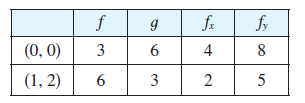

<page>

# Exercise 1

Use chain rule to find $\frac{dz}{dt}$ or $\frac{dw}{dt}$.

$z = x^2y^3 - x^2y$, $x = t^2 + 1$, $y = t^2 - 1$

-----------------------
</page>
<page>

# Exercise 2

Use chain rule to find $\frac{dz}{dt}$ or $\frac{dw}{dt}$.

$z = \frac{x-y}{x+2y}$, $x = e^t$, $y = e^{-2t}$

-----------------------
</page>
<page>

# Exercise 3

Use chain rule to find $\frac{dz}{dt}$ or $\frac{dw}{dt}$.

$z = \sin x \cos y$, $x = \sqrt{t}$, $y = 1/t$

-----------------------
</page>
<page>

# Exercise 4

Use chain rule to find $\frac{dz}{dt}$ or $\frac{dw}{dt}$.

$z = \sqrt{1 + xy}$, $x = \tan t$, $y = \arctan t$

-----------------------
</page>
<page>

# Exercise 5

Use chain rule to find $\frac{dz}{dt}$ or $\frac{dw}{dt}$.

$w = xe^{y/z}$, $x = t^2$, $y = 1-t$, $z = 1 + 2t$

-----------------------
</page>
<page>

# Exercise 6

Use chain rule to find $\frac{dz}{dt}$ or $\frac{dw}{dt}$.

$w = \ln \sqrt{x^2 + y^2 + z^2}$, $x = \sin t$, $y = \cos t$, $z = \tan t$

-----------------------
</page>
<page>

# Exercise 7

Use chain rule to find $\frac{ \partial z}{ \partial s}$ or $\frac{ \partial z}{ \partial t}$.

$z = (x - y)^5$, $x = s^2t$, $y = st^2$

-----------------------
</page>
<page>

# Exercise 8

Use chain rule to find $\frac{ \partial z}{ \partial s}$ or $\frac{ \partial z}{ \partial t}$.

$z = \tan^{-1}(x^2 + y^2)$, $x = s \ln t$, $y = te^s$

-----------------------
</page>
<page>

# Exercise 9

Use chain rule to find $\frac{ \partial z}{ \partial s}$ or $\frac{ \partial z}{ \partial t}$.

$z = \ln(3x + 2y)$, $x = s \sin t$, $y = t \cos s$

-----------------------
</page>
<page>

# Exercise 10

Use chain rule to find $\frac{ \partial z}{ \partial s}$ or $\frac{ \partial z}{ \partial t}$.

$z = \sqrt{x}e^{xy}$, $x = 1 + st$, $y = s^2 - t^2$

-----------------------
</page>
<page>

# Exercise 11

Use chain rule to find $\frac{ \partial z}{ \partial s}$ or $\frac{ \partial z}{ \partial t}$.

$z = e^r \cos \theta$, $r = st$, $\theta = \sqrt{s^2 + t^2}$

-----------------------
</page>
<page>

# Exercise 12

Use chain rule to find $\frac{ \partial z}{ \partial s}$ or $\frac{ \partial z}{ \partial t}$.

$z = \tan(u/v)$, $u = 2s + 3t$, $v = 3s - 2t$

-----------------------
</page>
<page>

# Exercise 13

Let $p(t) = f(g(t), h(t))$, where $f$ is differentiable, $g(2) = 4$, $g'(2) = -3$, $h(2) = 5$, $h'(2) = 6$, $f_x(4, 5) = 2$, $f_y(4, 5) = 8$. Find $p'(2)$.

-----------------------
</page>
<page>

# Exercise 14

Let $R(s, t) = G(u(s, t), v(s, t))$, where $G$, $u$, and $v$ are differentiable, $u(1, 2) = 5$, $u_s(1, 2) = 4$, $u_t(1, 2) = -3$, $v(1, 2) = 7$, $v_s(1, 2) = 2$, $v_t(1, 2) = 6$, $G_u(5, 7) = 9$, $G_v(5, 7) = -2$. Find $R_s(1, 2)$ and $R_t(1, 2)$.

-----------------------
</page>
<page>

# Exercise 15

Suppose $f$ is a differentiable function of $x$ and $y$, and $g(u, v) = f(e^u + \sin v, e^u + \cos v)$. Use the table of values to calculate $g_u(0, 0)$ and $g_v(0, 0)$.

-----------------------
</page>
<page>

# Exercise 16

Suppose $f$ is a differentiable function of $x$ and $y$, and $g(r, s) = f(2r - s, s^2 - 4r)$. Use the table of values in Exercise 15 to calculate $g_r(1, 2)$ and $g_s(1, 2)$.

-----------------------
</page>
<page>

# Exercise 17

Use a tree diagram to write out the Chain Rule for the given case. Assume all functions are differentiable.
$u = f(x, y)$, where $x = x(r, s, t)$, $y = y(r, s, t)$

-----------------------
</page>
<page>

# Exercise 18

Use a tree diagram to write out the Chain Rule for the given case. Assume all functions are differentiable.
$w = f(x, y, z)$, where $x = x(u, v)$, $y = y(u, v)$, $z = z(u, v)$

-----------------------
</page>
<page>

# Exercise 19

Use a tree diagram to write out the Chain Rule for the given case. Assume all functions are differentiable.
$T = F(p, q, r)$, where $p = p(x, y, z)$, $q = q(x, y, z)$, $r = r(x, y, z)$

-----------------------
</page>
<page>

# Exercise 20

Use a tree diagram to write out the Chain Rule for the given case. Assume all functions are differentiable.
$R = F(t, u)$ where $t = t(w, x, y, z)$, $u = u(w, x, y, z)$

-----------------------
</page>
<page>

# Exercise 21

Use the Chain Rule to find the indicated partial derivatives.
$z = x^4 + x^2y$, $x = s + 2t - u$, $y = stu^2$; find $\frac{\partial z}{\partial s}$, $\frac{\partial z}{\partial t}$, $\frac{\partial z}{\partial u}$ when $s = 4, t = 2, u = 1$.

-----------------------
</page>
<page>

# Exercise 22

Use the Chain Rule to find the indicated partial derivatives.
$T = \frac{v}{2u+v}$, $u = p q \sqrt{r}$, $v = p \sqrt{q} r$; find $\frac{\partial T}{\partial p}$, $\frac{\partial T}{\partial q}$, $\frac{\partial T}{\partial r}$ when $p = 2, q = 1, r = 4$.

-----------------------
</page>
<page>

# Exercise 23

Use the Chain Rule to find the indicated partial derivatives.
$w = xy + yz + zx$, $x = r \cos \theta$, $y = r \sin \theta$, $z = r\theta$; find $\frac{\partial w}{\partial r}$, $\frac{\partial w}{\partial \theta}$ when $r = 2, \theta = \pi/2$.

-----------------------
</page>
<page>

# Exercise 24

Use the Chain Rule to find the indicated partial derivatives.
$P = \sqrt{u^2 + v^2 + w^2}$, $u = xe^y$, $v = ye^x$, $w = e^{xy}$; find $\frac{\partial P}{\partial x}$, $\frac{\partial P}{\partial y}$ when $x = 0, y = 2$.

-----------------------
</page>
<page>

# Exercise 25

Use the Chain Rule to find the indicated partial derivatives.
$N = \frac{p+q}{p+r}$, $p = u + vw$, $q = v + uw$, $r = w + uv$; find $\frac{\partial N}{\partial u}$, $\frac{\partial N}{\partial v}$, $\frac{\partial N}{\partial w}$ when $u = 2, v = 3, w = 4$.

-----------------------
</page>
<page>

# Exercise 26

Use the Chain Rule to find the indicated partial derivatives.
$u = x^2e^{y\tau}$, $x = \alpha^2\beta$, $y = \beta^2\gamma$, $\tau = \gamma^2\alpha$; find $\frac{\partial u}{\partial \alpha}$, $\frac{\partial u}{\partial \beta}$, $\frac{\partial u}{\partial \gamma}$ when $\alpha = -1, \beta = 2, \gamma = 1$.

-----------------------
</page>
<page>

# Exercise 27

Use Equation 6 to find $dy/dx$.
$y \cos x = x^2 + y^2$

-----------------------
</page>
<page>

# Exercise 28

Find $dy/dx$.
$\cos(xy) = 1 + \sin y$

-----------------------
</page>
<page>

# Exercise 29

Find $dy/dx$.
$\tan^{-1}(x^2y) = x + xy^2$

-----------------------
</page>
<page>

# Exercise 30

Find $dy/dx$.
$e^y \sin x = x + xy$

-----------------------
</page>
<page>

# Exercise 31

Find $\partial z/\partial x$ and $\partial z/\partial y$.
$x^2 + 2y^2 + 3z^2 = 1$

-----------------------
</page>
<page>

# Exercise 32

Find $\partial z/\partial x$ and $\partial z/\partial y$.
$x^2 - y^2 + z^2 - 2z = 4$

-----------------------
</page>
<page>

# Exercise 33

Find $\partial z/\partial x$ and $\partial z/\partial y$.
$e^z = xyz$

-----------------------
</page>
<page>

# Exercise 34

Find $\partial z/\partial x$ and $\partial z/\partial y$.
$yz + x \ln y = z^2$

-----------------------
</page>
<page>

# Exercise 35

The temperature at a point $(x, y)$ is $T(x, y)$, measured in degrees Celsius. A bug crawls so that its position after $t$ seconds is given by $x = \sqrt{1 + t}$, $y = 2 + \frac{1}{3}t$, where $x$ and $y$ are measured in centimeters. The temperature function satisfies $T_x(2, 3) = 4$ and $T_y(2, 3) = 3$. How fast is the temperature rising on the bug's path after 3 seconds?

-----------------------
</page>
<page>

# Exercise 36

Wheat production $W$ in a given year depends on the average temperature $T$ and the annual rainfall $R$. Scientists estimate that the average temperature is rising at a rate of 0.15°C/year and rainfall is decreasing at a rate of 0.1 cm/year. They also estimate that at current production levels, $\partial W / \partial T = -2$ and $\partial W / \partial R = 8$.
(a) What is the significance of the signs of these partial derivatives?
(b) Estimate the current rate of change of wheat production, $dW/dt$.

-----------------------
</page>
<page>

# Exercise 37

The speed of sound traveling through ocean water with salinity 35 parts per thousand has been modeled by the equation
$C = 1449.2 + 4.6T - 0.055T^2 + 0.00029T^3 + 0.016D$
where $C$ is the speed of sound (in meters per second), $T$ is the temperature (in degrees Celsius), and $D$ is the depth below the ocean surface (in meters). A scuba diver began a leisurely dive into the ocean water; the diver's depth and the surrounding water temperature over time are recorded in the following graphs. Estimate the rate of change (with respect to time) of the speed of sound through the ocean water experienced by the diver 20 minutes into the dive. What are the units?

-----------------------
</page>
<page>

# Exercise 38

The radius of a right circular cone is increasing at a rate of 1.8 in/s while its height is decreasing at a rate of 2.5 in/s. At what rate is the volume of the cone changing when the radius is 120 in. and the height is 140 in.?

-----------------------
</page>
<page>

# Exercise 39

The length $l$, width $w$, and height $h$ of a box change with time. At a certain instant the dimensions are $l = 1$ m and $w = h = 2$ m, and $l$ and $w$ are increasing at a rate of 2 m/s while $h$ is decreasing at a rate of 3 m/s. At that instant find the rates at which the following quantities are changing.
(a) The volume
(b) The surface area
(c) The length of a diagonal

-----------------------
</page>
<page>

# Exercise 40

The voltage $V$ in a simple electrical circuit is slowly decreasing as the battery wears out. The resistance $R$ is slowly increasing as the resistor heats up. Use Ohm's Law, $V = IR$, to find how the current $I$ is changing at the moment when $R = 400\ \Omega$, $I = 0.08$ A, $dV/dt = -0.01$ V/s, and $dR/dt = 0.03\ \Omega$/s.

-----------------------
</page>
<page>

# Exercise 41

The pressure of 1 mole of an ideal gas is increasing at a rate of 0.05 kPa/s and the temperature is increasing at a rate of 0.15 K/s. Use the equation $PV = 8.31T$ in Example 2 to find the rate of change of the volume when the pressure is 20 kPa and the temperature is 320 K.

-----------------------
</page>
<page>

# Exercise 42

A manufacturer has modeled its yearly production function $P$ (the value of its entire production, in millions of dollars) as a Cobb-Douglas function
$P(L, K) = 1.47L^{0.65}K^{0.35}$
where $L$ is the number of labor hours (in thousands) and $K$ is the invested capital (in millions of dollars). Suppose that when $L = 30$ and $K = 8$, the labor force is decreasing at a rate of 2000 labor hours per year and capital is increasing at a rate of $500,000 per year. Find the rate of change of production.

-----------------------
</page>
<page>

# Exercise 43

One side of a triangle is increasing at a rate of 3 cm/s and a second side is decreasing at a rate of 2 cm/s. If the area of the triangle remains constant, at what rate does the angle between the sides change when the first side is 20 cm long, the second side is 30 cm, and the angle is $\pi/6$?

-----------------------
</page>
<page>

# Exercise 44

A sound with frequency $f_s$ is produced by a source traveling along a line with speed $v_s$. If an observer is traveling with speed $v_o$ along the same line from the opposite direction toward the source, then the frequency of the sound heard by the observer is
$f_o = \left(\frac{c + v_o}{c - v_s}\right) f_s$
where $c$ is the speed of sound, about 332 m/s. (This is the Doppler effect.) Suppose that, at a particular moment, you are in a train traveling at 34 m/s and accelerating at 1.2 m/s$^2$. A train is approaching you from the opposite direction on the other track at 40 m/s, accelerating at 1.4 m/s$^2$, and sounds its whistle, which has a frequency of 460 Hz. At that instant, what is the perceived frequency that you hear and how fast is it changing?

-----------------------
</page>
<page>

# Exercise 45

Assume that all the given functions are differentiable.
If $z = f(x, y)$, where $x = r \cos \theta$ and $y = r \sin \theta$, (a) find $\partial z/\partial r$ and $\partial z/\partial \theta$ and (b) show that
$$ \left(\frac{\partial z}{\partial x}\right)^2 + \left(\frac{\partial z}{\partial y}\right)^2 = \left(\frac{\partial z}{\partial r}\right)^2 + \frac{1}{r^2}\left(\frac{\partial z}{\partial \theta}\right)^2 $$

-----------------------
</page>
<page>

# Exercise 46

Assume that all the given functions are differentiable.
If $u = f(x, y)$, where $x = e^s \cos t$ and $y = e^s \sin t$, show that
$$ \left(\frac{\partial u}{\partial x}\right)^2 + \left(\frac{\partial u}{\partial y}\right)^2 = e^{-2s}\left[\left(\frac{\partial u}{\partial s}\right)^2 + \left(\frac{\partial u}{\partial t}\right)^2\right] $$

-----------------------
</page>
<page>

# Exercise 47

Assume that all the given functions are differentiable.
If $z = \frac{1}{x}[f(x - y) + g(x + y)]$, show that
$$ \frac{\partial}{\partial x}\left(x^2 \frac{\partial z}{\partial x}\right) = x^2 \frac{\partial^2 z}{\partial y^2} $$

-----------------------
</page>
<page>

# Exercise 48

Assume that all the given functions are differentiable.
If $z = \frac{1}{y}[f(ax + y) + g(ax - y)]$, show that
$$ \frac{\partial}{\partial x}\left(y^2 \frac{\partial z}{\partial x}\right) = a^2 \frac{\partial}{\partial y}\left(y^2 \frac{\partial z}{\partial y}\right) $$

-----------------------
</page>
<page>

# Exercise 49

Assume that all the given functions have continuous second-order partial derivatives.
Show that any function of the form
$z = f(x + at) + g(x - at)$
is a solution of the wave equation
$$ \frac{\partial^2 z}{\partial t^2} = a^2 \frac{\partial^2 z}{\partial x^2} $$
[Hint: Let $u = x + at, v = x - at$.]

-----------------------
</page>
<page>

# Exercise 50

Assume that all the given functions have continuous second-order partial derivatives.
If $u = f(x, y)$, where $x = e^s \cos t$ and $y = e^s \sin t$, show that
$$ \frac{\partial^2 u}{\partial x^2} + \frac{\partial^2 u}{\partial y^2} = e^{-2s}\left[\frac{\partial^2 u}{\partial s^2} + \frac{\partial^2 u}{\partial t^2}\right] $$

-----------------------
</page>
<page>

# Exercise 51

Assume that all the given functions have continuous second-order partial derivatives.
If $z = f(x, y)$, where $x = r^2 + s^2$ and $y = 2rs$, find $\partial^2 z/\partial r \partial s$. (Compare with Example 7.)

-----------------------
</page>
<page>

# Exercise 52

Assume that all the given functions have continuous second-order partial derivatives.
If $z = f(x, y)$, where $x = r \cos \theta$ and $y = r \sin \theta$, find (a) $\partial z/\partial r$, (b) $\partial z/\partial \theta$, and (c) $\partial^2 z/\partial r \partial \theta$.

-----------------------
</page>
<page>

# Exercise 53

Assume that all the given functions have continuous second-order partial derivatives.
If $z = f(x, y)$, where $x = r \cos \theta$ and $y = r \sin \theta$, show that
$$ \frac{\partial^2 z}{\partial x^2} + \frac{\partial^2 z}{\partial y^2} = \frac{\partial^2 z}{\partial r^2} + \frac{1}{r^2}\frac{\partial^2 z}{\partial \theta^2} + \frac{1}{r}\frac{\partial z}{\partial r} $$

-----------------------
</page>
<page>

# Exercise 54

Assume that all the given functions have continuous second-order partial derivatives.
Suppose $z = f(x, y)$, where $x = g(s, t)$ and $y = h(s, t)$.
(a) Show that
$$ \frac{\partial^2 z}{\partial t^2} = \frac{\partial^2 z}{\partial x^2}\left(\frac{\partial x}{\partial t}\right)^2 + 2\frac{\partial^2 z}{\partial x \partial y}\frac{\partial x}{\partial t}\frac{\partial y}{\partial t} + \frac{\partial^2 z}{\partial y^2}\left(\frac{\partial y}{\partial t}\right)^2 + \frac{\partial z}{\partial x}\frac{\partial^2 x}{\partial t^2} + \frac{\partial z}{\partial y}\frac{\partial^2 y}{\partial t^2} $$
(b) Find a similar formula for $\partial^2 z/\partial s \partial t$.

-----------------------
</page>
<page>

# Exercise 55

A function $f$ is called **homogeneous of degree n** if it satisfies the equation
$f(tx, ty) = t^n f(x, y)$
for all $t$, where $n$ is a positive integer and $f$ has continuous second-order partial derivatives.
(a) Verify that $f(x, y) = x^2y + 2xy^2 + 5y^3$ is homogeneous of degree 3.
(b) Show that if $f$ is homogeneous of degree $n$, then
$$ x \frac{\partial f}{\partial x} + y \frac{\partial f}{\partial y} = nf(x, y) $$
[Hint: Use the Chain Rule to differentiate $f(tx, ty)$ with respect to $t$.]

-----------------------
</page>
<page>

# Exercise 56

If $f$ is homogeneous of degree $n$, show that
$$ x^2 \frac{\partial^2 f}{\partial x^2} + 2xy \frac{\partial^2 f}{\partial x \partial y} + y^2 \frac{\partial^2 f}{\partial y^2} = n(n-1)f(x, y) $$

-----------------------
</page>
<page>

# Exercise 57

If $f$ is homogeneous of degree $n$, show that
$f_x(tx, ty) = t^{n-1}f_x(x, y)$

-----------------------
</page>
<page>

# Exercise 58

Suppose that the equation $F(x, y, z) = 0$ implicitly defines each of the three variables $x, y$, and $z$ as functions of the other two: $z = f(x, y)$, $y = g(x, z)$, $x = h(y, z)$. If $F$ is differentiable and $F_x, F_y$, and $F_z$ are all nonzero, show that
$$ \frac{\partial z}{\partial x} \frac{\partial x}{\partial y} \frac{\partial y}{\partial z} = -1 $$

-----------------------
</page>
<page>

# Exercise 59

Equation 6 is a formula for the derivative $dy/dx$ of a function defined implicitly by an equation $F(x, y) = 0$, provided that $F$ is differentiable and $F_y \ne 0$. Prove that if $F$ has continuous second derivatives, then a formula for the second derivative of $y$ is
$$ \frac{d^2 y}{dx^2} = - \frac{F_{xx}F_y^2 - 2F_{xy}F_x F_y + F_{yy}F_x^2}{F_y^3} $$

-----------------------
</page>
