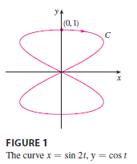
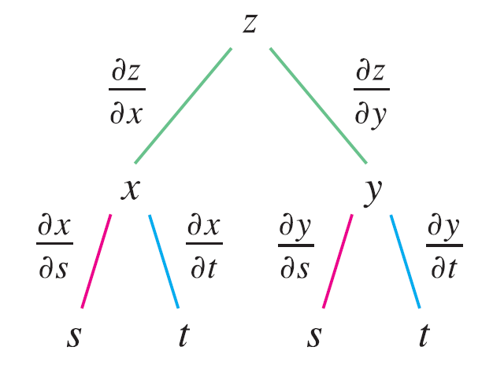

<page>

# Section Learning Outcomes

- Chain Rule for multivariable functions
--------
</page>

<page>

# The Chain Rule (Case 1)

Suppose that $z = f(x, y)$ is a differentiable function of $x$ and $y$, where $x = g(t)$ and $y = h(t)$ are both differentiable functions of $t$. Then $z$ is a differentiable function of $t$ and
$$ \frac{dz}{dt} = \frac{\partial f}{\partial x} \frac{dx}{dt} + \frac{\partial f}{\partial y} \frac{dy}{dt} $$

----------

**EXAMPLE 1** If $z = x^2y + 3xy^4$, where $x = \sin 2t$ and $y = \cos t$, find $dz/dt$ when $t = 0$.

<ans>

**SOLUTION** The Chain Rule gives
$$ \frac{dz}{dt} = \frac{\partial z}{\partial x} \frac{dx}{dt} + \frac{\partial z}{\partial y} \frac{dy}{dt} $$
$$ = (2xy + 3y^4)(2 \cos 2t) + (x^2 + 12xy^3)(-\sin t) $$

It's not necessary to substitute the expressions for x and y in terms of t. We simply observe that when $t = 0$, we have $x = \sin 0 = 0$ and $y = \cos 0 = 1$. Therefore
$$ \left. \frac{dz}{dt} \right|_{t=0} = (0 + 3)(2 \cos 0) + (0 + 0)(-\sin 0) = 6 $$

The derivative in this example can be interpreted as the rate of change of $z$ with respect to $t$ as the point $(x, y)$ moves along the curve C with parametric equations $x = \sin 2t, y = \cos t$. (See Figure 1). In particular, when $t = 0$, the point $(x, y)$ is $(0, 1)$ and $dz/dt = 6$ is the rate of increase as we move along the curve C through $(0, 1)$. If, for instance, $z = T(x, y) = x^2y + 3xy^4$ represents the temperature at the point $(x, y)$, then the composite function $z = T(\sin 2t, \cos t)$ represents the temperature at points on C and the derivative $dz/dt$ represents the rate at which the temperature changes along C.

</ans>

**EXAMPLE 2** The pressure P (in kilopascals), volume V (in liters), and temperature T (in kelvins) of a mole of an ideal gas are related by the equation $PV = 8.31T$. Find the rate at which the pressure is changing when the temperature is 300 K and increasing at a rate of 0.1 K/s and the volume is 100 L and increasing at a rate of 0.2 L/s.

<ans>

**SOLUTION** If t represents the time elapsed in seconds, then at the given instant we have $T = 300, dT/dt = 0.1, V = 100, dV/dt = 0.2$. Since
$$ P = 8.31 \frac{T}{V} $$
the Chain Rule gives
$$ \frac{dP}{dt} = \frac{\partial P}{\partial T} \frac{dT}{dt} + \frac{\partial P}{\partial V} \frac{dV}{dt} = \frac{8.31}{V} \frac{dT}{dt} - \frac{8.31T}{V^2} \frac{dV}{dt} $$
$$ = \frac{8.31}{100}(0.1) - \frac{8.31(300)}{100^2}(0.2) \approx -0.04155 $$
The pressure is decreasing at a rate of about 0.042 kPa/s.

</ans>

----------
</page>

<page>

# The Chain Rule (Case 2)

Suppose that $z = f(x, y)$ is a differentiable function of $x$ and $y$, where $x = g(s, t)$ and $y = h(s, t)$ are differentiable functions of $s$ and $t$. Then
$$ \frac{\partial z}{\partial s} = \frac{\partial z}{\partial x} \frac{\partial x}{\partial s} + \frac{\partial z}{\partial y} \frac{\partial y}{\partial s} $$
$$ \frac{\partial z}{\partial t} = \frac{\partial z}{\partial x} \frac{\partial x}{\partial t} + \frac{\partial z}{\partial y} \frac{\partial y}{\partial t} $$

**EXAMPLE 3** If $z = e^x \sin y$, where $x = st^2$ and $y = s^2t$, find $\partial z / \partial s$ and $\partial z / \partial t$.

<ans> 

**SOLUTION** Applying Case 2 of the Chain Rule, we get
$$ \frac{\partial z}{\partial s} = \frac{\partial z}{\partial x} \frac{\partial x}{\partial s} + \frac{\partial z}{\partial y} \frac{\partial y}{\partial s} = (e^x \sin y)(t^2) + (e^x \cos y)(2st) $$
$$ = t^2e^{st^2} \sin(s^2t) + 2ste^{st^2} \cos(s^2t) $$
$$ \frac{\partial z}{\partial t} = \frac{\partial z}{\partial x} \frac{\partial x}{\partial t} + \frac{\partial z}{\partial y} \frac{\partial y}{\partial t} = (e^x \sin y)(2st) + (e^x \cos y)(s^2) $$
$$ = 2ste^{st^2} \sin(s^2t) + s^2e^{st^2} \cos(s^2t) $$

</ans>

---------------
</page>

<page>

# Tree Diagram

To remember the Chain Rule, it's helpful to draw the **tree diagram**. 

We draw branches from the dependent variable $z$ to the intermediate variables $x$ and $y$ to indicate that $z$ is a function of $x$ and $y$. Then we draw branches from $x$ and $y$ to the independent variables $s$ and $t$. On each branch we write the corresponding partial derivative. To find $\partial z / \partial s$, we find the product of the partial derivatives along each path from $z$ to $s$ and then add these products:
$$ \frac{\partial z}{\partial s} = \frac{\partial z}{\partial x} \frac{\partial x}{\partial s} + \frac{\partial z}{\partial y} \frac{\partial y}{\partial s} $$
Similarly, we find $\partial z / \partial t$ by using the paths from $z$ to $t$.

Now we consider the general situation in which a dependent variable $u$ is a function of $n$ intermediate variables $x_1, ..., x_n$, each of which is, in turn, a function of $m$ independent variables $t_1, ..., t_m$. Notice that there are $n$ terms, one for each intermediate variable. The proof is similar to that of Case 1.

----

</page>

<page>

# Example with Tree Diagram

**EXAMPLE 4** Write out the Chain Rule for the case where $w = f(x, y, z, t)$ and $x = x(u, v), y = y(u, v), z = z(u, v)$, and $t = t(u, v)$.

<ans>

**SOLUTION** Figure shows the tree diagram. Although we haven't written the derivatives on the branches, it's understood that if a branch leads from $y$ to $u$, then the partial derivative for that branch is $\partial y / \partial u$. With the aid of the tree diagram, we can now write the required expressions:
$$ \frac{\partial w}{\partial u} = \frac{\partial w}{\partial x} \frac{\partial x}{\partial u} + \frac{\partial w}{\partial y} \frac{\partial y}{\partial u} + \frac{\partial w}{\partial z} \frac{\partial z}{\partial u} + \frac{\partial w}{\partial t} \frac{\partial t}{\partial u} $$
$$ \frac{\partial w}{\partial v} = \frac{\partial w}{\partial x} \frac{\partial x}{\partial v} + \frac{\partial w}{\partial y} \frac{\partial y}{\partial v} + \frac{\partial w}{\partial z} \frac{\partial z}{\partial v} + \frac{\partial w}{\partial t} \frac{\partial t}{\partial v} $$

</ans>

</page>

<page>

# Example

**EXAMPLE 5** If $u = x^4y + y^2z^3$, where $x = rse^t, y = rs^2e^{-t}$, and $z = r^2s \sin t$, find the value of $\partial u / \partial s$ when $r = 2, s = 1, t = 0$.

<ans>

**SOLUTION** With the help of the tree diagram in Figure 4, we have
$$ \frac{\partial u}{\partial s} = \frac{\partial u}{\partial x} \frac{\partial x}{\partial s} + \frac{\partial u}{\partial y} \frac{\partial y}{\partial s} + \frac{\partial u}{\partial z} \frac{\partial z}{\partial s} $$
$$ = (4x^3y)(re^t) + (x^4 + 2yz^3)(2rse^{-t}) + (3y^2z^2)(r^2 \sin t) $$
When $r = 2, s = 1$, and $t = 0$, we have $x = 2, y = 2$, and $z = 0$, so
$$ \frac{\partial u}{\partial s} = (64)(2) + (16)(4) + (0)(0) = 192 $$

</ans>

</page>

<page>

# EXAMPLE

If $g(s, t) = f(s^2 - t^2, t^2 - s^2)$ and $f$ is differentiable, show that $g$ satisfies the equation
$$ t \frac{\partial g}{\partial s} + s \frac{\partial g}{\partial t} = 0 $$

<ans>

**SOLUTION** Let $x = s^2 - t^2$ and $y = t^2 - s^2$. Then $g(s, t) = f(x, y)$ and the Chain Rule gives
$$ \frac{\partial g}{\partial s} = \frac{\partial f}{\partial x} \frac{\partial x}{\partial s} + \frac{\partial f}{\partial y} \frac{\partial y}{\partial s} = \frac{\partial f}{\partial x}(2s) + \frac{\partial f}{\partial y}(-2s) $$
$$ \frac{\partial g}{\partial t} = \frac{\partial f}{\partial x} \frac{\partial x}{\partial t} + \frac{\partial f}{\partial y} \frac{\partial y}{\partial t} = \frac{\partial f}{\partial x}(-2t) + \frac{\partial f}{\partial y}(2t) $$
Therefore
$$ t \frac{\partial g}{\partial s} + s \frac{\partial g}{\partial t} = t \left( 2s \frac{\partial f}{\partial x} - 2s \frac{\partial f}{\partial y} \right) + s \left( -2t \frac{\partial f}{\partial x} + 2t \frac{\partial f}{\partial y} \right) = 0 $$

</ans>

----------------
</page>

<page>

# Example

If $z = f(x, y)$ has continuous second-order partial derivatives and $x = r^2 + s^2$ and $y = 2rs$, find (a) $\partial z / \partial r$ and (b) $\partial^2 z / \partial r^2$.

<ans>

**SOLUTION**
(a) The Chain Rule gives
$$ \frac{\partial z}{\partial r} = \frac{\partial z}{\partial x} \frac{\partial x}{\partial r} + \frac{\partial z}{\partial y} \frac{\partial y}{\partial r} = \frac{\partial z}{\partial x}(2r) + \frac{\partial z}{\partial y}(2s) $$
(b) Applying the Product Rule to the expression in part (a), we get
$$ \frac{\partial^2 z}{\partial r^2} = \frac{\partial}{\partial r} \left( 2r \frac{\partial z}{\partial x} + 2s \frac{\partial z}{\partial y} \right) $$
$$ = 2 \frac{\partial z}{\partial x} + 2r \frac{\partial}{\partial r} \left( \frac{\partial z}{\partial x} \right) + 2s \frac{\partial}{\partial r} \left( \frac{\partial z}{\partial y} \right) $$
But, using the Chain Rule again (see Figure 5), we have
$$ \frac{\partial}{\partial r} \left( \frac{\partial z}{\partial x} \right) = \frac{\partial}{\partial x} \left( \frac{\partial z}{\partial x} \right) \frac{\partial x}{\partial r} + \frac{\partial}{\partial y} \left( \frac{\partial z}{\partial x} \right) \frac{\partial y}{\partial r} = \frac{\partial^2 z}{\partial x^2}(2r) + \frac{\partial^2 z}{\partial y \partial x}(2s) $$
$$ \frac{\partial}{\partial r} \left( \frac{\partial z}{\partial y} \right) = \frac{\partial}{\partial x} \left( \frac{\partial z}{\partial y} \right) \frac{\partial x}{\partial r} + \frac{\partial}{\partial y} \left( \frac{\partial z}{\partial y} \right) \frac{\partial y}{\partial r} = \frac{\partial^2 z}{\partial x \partial y}(2r) + \frac{\partial^2 z}{\partial y^2}(2s) $$
Putting these expressions into Equation 5 and using the equality of the mixed second-order derivatives, we obtain
$$ \frac{\partial^2 z}{\partial r^2} = 2 \frac{\partial z}{\partial x} + 2r \left( 2r \frac{\partial^2 z}{\partial x^2} + 2s \frac{\partial^2 z}{\partial y \partial x} \right) + 2s \left( 2r \frac{\partial^2 z}{\partial x \partial y} + 2s \frac{\partial^2 z}{\partial y^2} \right) $$
$$ = 2 \frac{\partial z}{\partial x} + 4r^2 \frac{\partial^2 z}{\partial x^2} + 8rs \frac{\partial^2 z}{\partial x \partial y} + 4s^2 \frac{\partial^2 z}{\partial y^2} $$

</ans>

-----------

</page>

<page>

# Implicit Differentiation

We suppose that an equation of the form $F(x, y) = 0$ defines $y$ implicitly as a differentiable function of $x$, that is, $y = f(x)$, where $F(x, f(x)) = 0$ for all $x$ in the domain of $f$. If $F$ is differentiable, we can apply Case 1 of the Chain Rule to differentiate both sides of the equation $F(x, y) = 0$ with respect to $x$. Since both $x$ and $y$ are functions of $x$, we obtain
$$ \frac{\partial F}{\partial x} \frac{dx}{dx} + \frac{\partial F}{\partial y} \frac{dy}{dx} = 0 $$
But $dx/dx = 1$, so if $\partial F / \partial y \ne 0$ we solve for $dy/dx$ and obtain
$$ \frac{dy}{dx} = - \frac{\partial F / \partial x}{\partial F / \partial y} = - \frac{F_x}{F_y} $$

**Note**

To derive this equation we assumed that $F(x, y) = 0$ defines $y$ implicitly as a function of $x$. The **Implicit Function Theorem**, proved in advanced calculus, gives conditions under which this assumption is valid: it states that if $F$ is defined on a disk containing $(a, b)$, where $F(a, b) = 0, F_y(a, b) \ne 0$, and $F_x$ and $F_y$ are continuous on the disk, then the equation $F(x, y) = 0$ defines $y$ as a function of $x$ near the point $(a, b)$ and the derivative of this function is given by Equation 6.

--------

**EXAMPLE 8** Find $y'$ if $x^3 + y^3 = 6xy$.

<ans>

**SOLUTION** The given equation can be written as
$$ F(x, y) = x^3 + y^3 - 6xy = 0 $$
so Equation 6 gives
$$ \frac{dy}{dx} = - \frac{F_x}{F_y} = - \frac{3x^2 - 6y}{3y^2 - 6x} = - \frac{x^2 - 2y}{y^2 - 2x} $$

</ans>

------------

Now we suppose that $z$ is given implicitly as a function $z = f(x, y)$ by an equation of the form $F(x, y, z) = 0$. This means that $F(x, y, f(x, y)) = 0$ for all $(x, y)$ in the domain of $f$. If $F$ and $f$ are differentiable, then we can use the Chain Rule to differentiate the equation $F(x, y, z) = 0$ as follows:
$$ \frac{\partial F}{\partial x} \frac{\partial x}{\partial x} + \frac{\partial F}{\partial y} \frac{\partial y}{\partial x} + \frac{\partial F}{\partial z} \frac{\partial z}{\partial x} = 0 $$
But
$$ \frac{\partial}{\partial x}(x) = 1 \quad \text{and} \quad \frac{\partial}{\partial x}(y) = 0 $$
so this equation becomes
$$ \frac{\partial F}{\partial x} + \frac{\partial F}{\partial z} \frac{\partial z}{\partial x} = 0 $$
If $\partial F / \partial z \ne 0$, we solve for $\partial z / \partial x$ and obtain the first formula in Equations 7. The formula for $\partial z / \partial y$ is obtained in a similar manner.
$$ \frac{\partial z}{\partial x} = - \frac{\partial F / \partial x}{\partial F / \partial z} \quad \frac{\partial z}{\partial y} = - \frac{\partial F / \partial y}{\partial F / \partial z} $$

Again, a version of the Implicit Function Theorem stipulates conditions under which our assumption is valid: if $F$ is defined within a sphere containing $(a, b, c)$, where $F(a, b, c) = 0, F_z(a, b, c) \ne 0$, and $F_x, F_y$, and $F_z$ are continuous inside the sphere, then the equation $F(x, y, z) = 0$ defines $z$ as a function of $x$ and $y$ near the point $(a, b, c)$ and this function is differentiable, with partial derivatives given by (7).

-----------

**EXAMPLE 9** Find $\frac{\partial z}{\partial x}$ and $\frac{\partial z}{\partial y}$ if $x^3 + y^3 + z^3 + 6xyz = 1$.

<ans>

**SOLUTION** Let $F(x, y, z) = x^3 + y^3 + z^3 + 6xyz - 1$. Then, from Equations 7, we have
$$ \frac{\partial z}{\partial x} = - \frac{F_x}{F_z} = - \frac{3x^2 + 6yz}{3z^2 + 6xy} = - \frac{x^2 + 2yz}{z^2 + 2xy} $$
$$ \frac{\partial z}{\partial y} = - \frac{F_y}{F_z} = - \frac{3y^2 + 6xz}{3z^2 + 6xy} = - \frac{y^2 + 2xz}{z^2 + 2xy} $$

</ans>

</page>

