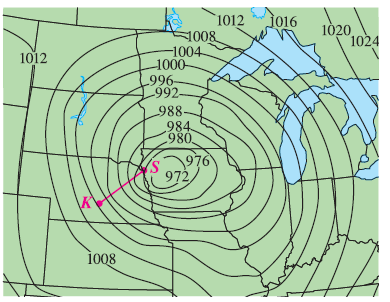
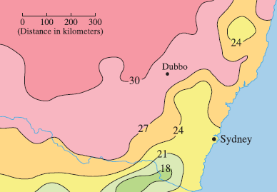
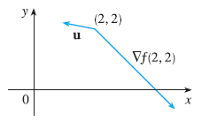
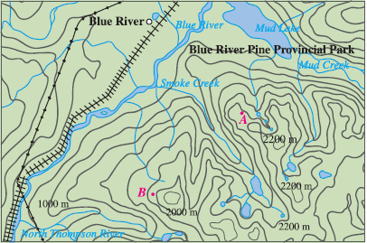
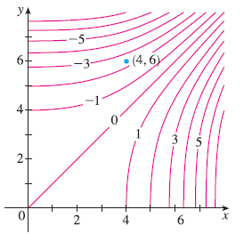

<page>

# Exercise 1

Level curves for barometric pressure (in millibars) are shown for 6:00 AM on a day in November. A deep low with pressure 972 mb is moving over northeast Iowa. The distance along the red line from K (Kearney, Nebraska) to S (Sioux City, Iowa) is 300 km. Estimate the value of the directional derivative of the pressure function at Kearney in the direction of Sioux City. What are the units of the directional derivative?

-----------------------
</page>
<page>

# Exercise 2

The contour map shows the average maximum temperature for November 2004 (in °C). Estimate the value of the directional derivative of this temperature function at Dubbo, New South Wales, in the direction of Sydney. What are the units?

-----------------------
</page>
<page>

# Exercise 3

A table of values for the wind-chill index $W = f(T, v)$ is given in Exercise 14.3.3 on page 923. Use the table to estimate the value of $D_u f(-20, 30)$, where $u = (i + j)/\sqrt{2}$.

-----------------------
</page>
<page>

# Exercise 4

Find the directional derivative of $f(x, y) = xy^3 - x^2$ at the point $(1, 2)$ in the direction indicated by the angle $\theta = \pi/3$.

-----------------------
</page>
<page>

# Exercise 5

Find the directional derivative of $f(x, y) = y \cos(xy)$ at the point $(0, 1)$ in the direction indicated by the angle $\theta = \pi/4$.

-----------------------
</page>
<page>

# Exercise 6

Find the directional derivative of $f(x, y) = \sqrt{2x + 3y}$ at the point $(3, 1)$ in the direction indicated by the angle $\theta = -\pi/6$.

-----------------------
</page>
<page>

# Exercise 7

For $f(x, y) = x/y$ at point $P(2, 1)$ with vector $u = \langle 5/13, 12/13 \rangle$:
(a) Find the gradient of f.
(b) Evaluate the gradient at the point P.
(c) Find the rate of change of f at P in the direction of the vector u.

-----------------------
</page>
<page>

# Exercise 8

For $f(x, y) = x^2 \ln y$ at point $P(3, 1)$ with vector $u = \langle 1/\sqrt{2}, -1/\sqrt{2} \rangle$:
(a) Find the gradient of f.
(b) Evaluate the gradient at the point P.
(c) Find the rate of change of f at P in the direction of the vector u.

-----------------------
</page>
<page>

# Exercise 9

For $f(x, y, z) = x^2yz - xyz^3$ at point $P(2, -1, 1)$ with vector $u = \langle 0, 4/5, -3/5 \rangle$:
(a) Find the gradient of f.
(b) Evaluate the gradient at the point P.
(c) Find the rate of change of f at P in the direction of the vector u.

-----------------------
</page>
<page>

# Exercise 10

For $f(x, y, z) = y^2e^{xyz}$ at point $P(0, 1, -1)$ with vector $u = \langle 3/13, 4/13, 12/13 \rangle$:
(a) Find the gradient of f.
(b) Evaluate the gradient at the point P.
(c) Find the rate of change of f at P in the direction of the vector u.

-----------------------
</page>
<page>

# Exercise 11

Find the directional derivative of the function $f(x, y) = e^x \sin y$ at the point $(0, \pi/3)$ in the direction of the vector $v = \langle -6, 8 \rangle$.

-----------------------
</page>
<page>

# Exercise 12

Find the directional derivative of the function $f(x, y) = \frac{x}{x^2 + y^2}$ at the point $(1, 2)$ in the direction of the vector $v = \langle 3, 5 \rangle$.

-----------------------
</page>
<page>

# Exercise 13

Find the directional derivative of the function $g(s, t) = s\sqrt{t}$ at the point $(2, 4)$ in the direction of the vector $v = 2i - j$.

-----------------------
</page>
<page>

# Exercise 14

Find the directional derivative of the function $g(u, v) = u^2e^{-v}$ at the point $(3, 0)$ in the direction of the vector $v = 3i + 4j$.

-----------------------
</page>
<page>

# Exercise 15

Find the directional derivative of the function $f(x, y, z) = \sqrt{x^2y + y^2z}$ at the point $(1, 2, 3)$ in the direction of the vector $v = \langle 2, -1, 2 \rangle$.

-----------------------
</page>
<page>

# Exercise 16

Find the directional derivative of the function $f(x, y, z) = xy^2 \tan^{-1}z$ at the point $(2, 1, 1)$ in the direction of the vector $v = \langle 1, 1, 1 \rangle$.

-----------------------
</page>
<page>

# Exercise 17

Find the directional derivative of the function $h(r, s, t) = \ln(3r + 6s + 9t)$ at the point $(1, 1, 1)$ in the direction of the vector $v = 4i + 12j + 6k$.

-----------------------
</page>
<page>

# Exercise 18

Use the figure to estimate $D_u f(2, 2)$.

-----------------------
</page>
<page>

# Exercise 19

Find the directional derivative of $f(x, y) = \sqrt{xy}$ at $P(2, 8)$ in the direction of $Q(5, 4)$.

-----------------------
</page>
<page>

# Exercise 20

Find the directional derivative of $f(x, y, z) = xy^2z^3$ at $P(2, 1, 1)$ in the direction of $Q(0, -3, 5)$.

-----------------------
</page>
<page>

# Exercise 21

Find the maximum rate of change of $f(x, y) = 4y\sqrt{x}$ at the point $(4, 1)$ and the direction in which it occurs.

-----------------------
</page>
<page>

# Exercise 22

Find the maximum rate of change of $f(s, t) = te^s$ at the point $(0, 2)$ and the direction in which it occurs.

-----------------------
</page>
<page>

# Exercise 23

Find the maximum rate of change of $f(x, y) = \sin(xy)$ at the point $(1, 0)$ and the direction in which it occurs.

-----------------------
</page>
<page>

# Exercise 24

Find the maximum rate of change of $f(x, y, z) = x \ln(yz)$ at the point $(1, 2, 1/2)$ and the direction in which it occurs.

-----------------------
</page>
<page>

# Exercise 25

Find the maximum rate of change of $f(x, y, z) = x/(y + z)$ at the point $(8, 1, 3)$ and the direction in which it occurs.

-----------------------
</page>
<page>

# Exercise 26

Find the maximum rate of change of $f(p, q, r) = \arctan(pqr)$ at the point $(1, 2, 1)$ and the direction in which it occurs.

-----------------------
</page>
<page>

# Exercise 27

(a) Show that a differentiable function $f$ decreases most rapidly at **x** in the direction opposite to the gradient vector, that is, in the direction of $-\nabla f(\mathbf{x})$.
(b) Use the result of part (a) to find the direction in which the function $f(x, y) = x^4y - x^2y^3$ decreases fastest at the point $(2, -3)$.

-----------------------
</page>
<page>

# Exercise 28

Find the directions in which the directional derivative of $f(x, y) = x^2 + \sin(xy)$ at the point $(1, 0)$ has the value 1.

-----------------------
</page>
<page>

# Exercise 29

Find all points at which the direction of fastest change of the function $f(x, y) = x^2 + y^2 - 2x - 4y$ is $\mathbf{i} + \mathbf{j}$.

-----------------------
</page>
<page>

# Exercise 30

Near a buoy, the depth of a lake at the point with coordinates $(x, y)$ is $z = 200 + 0.02x^2 - 0.001y^3$, where x, y, and z are measured in meters. A fisherman in a small boat starts at the point $(80, 60)$ and moves toward the buoy, which is located at $(0, 0)$. Is the water under the boat getting deeper or shallower when he departs? Explain.

-----------------------
</page>
<page>

# Exercise 31

The temperature T in a metal ball is inversely proportional to the distance from the center of the ball, which we take to be the origin. The temperature at the point $(1, 2, 2)$ is 120°.
(a) Find the rate of change of T at $(1, 2, 2)$ in the direction toward the point $(2, 1, 3)$.
(b) Show that at any point in the ball the direction of greatest increase in temperature is given by a vector that points toward the origin.

-----------------------
</page>
<page>

# Exercise 32

The temperature at a point $(x, y, z)$ is given by
$T(x, y, z) = 200e^{-x^2 - 3y^2 - 9z^2}$
where T is measured in °C and x, y, z in meters.
(a) Find the rate of change of temperature at the point $P(2, -1, 2)$ in the direction toward the point $(3, -3, 3)$.
(b) In which direction does the temperature increase fastest at P?
(c) Find the maximum rate of increase at P.

-----------------------
</page>
<page>

# Exercise 33

Suppose that over a certain region of space the electrical potential V is given by $V(x, y, z) = 5x^2 - 3xy + xyz$.
(a) Find the rate of change of the potential at $P(3, 4, 5)$ in the direction of the vector $\mathbf{v} = \mathbf{i} + \mathbf{j} - \mathbf{k}$.
(b) In which direction does V change most rapidly at P?
(c) What is the maximum rate of change at P?

-----------------------
</page>
<page>

# Exercise 34

Suppose you are climbing a hill whose shape is given by the equation $z = 1000 - 0.005x^2 - 0.01y^2$, where x, y, and z are measured in meters, and you are standing at a point with coordinates $(60, 40, 966)$. The positive x-axis points east and the positive y-axis points north.
(a) If you walk due south, will you start to ascend or descend? At what rate?
(b) If you walk northwest, will you start to ascend or descend? At what rate?
(c) In which direction is the slope largest? What is the rate of ascent in that direction? At what angle above the horizontal does the path in that direction begin?

-----------------------
</page>
<page>

# Exercise 35

Let f be a function of two variables that has continuous partial derivatives and consider the points A(1, 3), B(3, 3), C(1, 7), and D(6, 15). The directional derivative of f at A in the direction of the vector $\vec{AB}$ is 3 and the directional derivative at A in the direction of $\vec{AC}$ is 26. Find the directional derivative of f at A in the direction of the vector $\vec{AD}$.

-----------------------
</page>
<page>

# Exercise 36

Shown is a topographic map of Blue River Pine Provincial Park in British Columbia. Draw curves of steepest descent from point A (descending to Mud Lake) and from point B.

-----------------------
</page>
<page>

# Exercise 37

Show that the operation of taking the gradient of a function has the given property. Assume that u and v are differentiable functions of x and y and that a, b are constants.
(a) $\nabla(au + bv) = a\nabla u + b\nabla v$
(b) $\nabla(uv) = u\nabla v + v\nabla u$
(c) $\nabla(\frac{u}{v}) = \frac{v\nabla u - u\nabla v}{v^2}$
(d) $\nabla u^n = nu^{n-1}\nabla u$

-----------------------
</page>
<page>

# Exercise 38

Sketch the gradient vector $\nabla f(4, 6)$ for the function f whose level curves are shown. Explain how you chose the direction and length of this vector.

-----------------------
</page>
<page>

# Exercise 39

The second directional derivative of $f(x, y)$ is
$D^2_{\mathbf{u}}f(x, y) = D_{\mathbf{u}}[D_{\mathbf{u}}f(x, y)]$
If $f(x, y) = x^3 + 5x^2y + y^3$ and $\mathbf{u} = \langle \frac{3}{5}, \frac{4}{5} \rangle$, calculate $D^2_{\mathbf{u}}f(2, 1)$.

-----------------------
</page>
<page>

# Exercise 40

(a) If $\mathbf{u} = \langle a, b \rangle$ is a unit vector and f has continuous second partial derivatives, show that
$D^2_{\mathbf{u}}f = f_{xx}a^2 + 2f_{xy}ab + f_{yy}b^2$
(b) Find the second directional derivative of $f(x, y) = xe^{2y}$ in the direction of $\mathbf{v} = \langle 4, 6 \rangle$.

-----------------------
</page>
<page>

# Exercise 41

Find equations of (a) the tangent plane and (b) the normal line to the given surface $2(x - 2)^2 + (y - 1)^2 + (z - 3)^2 = 10$ at the specified point $(3, 3, 5)$.

-----------------------
</page>
<page>

# Exercise 42

Find equations of (a) the tangent plane and (b) the normal line to the given surface $x = y^2 + z^2 - 2$ at the specified point $(3, 1, -1)$.

-----------------------
</page>
<page>

# Exercise 43

Find equations of (a) the tangent plane and (b) the normal line to the given surface $xy^2z^3 = 8$ at the specified point $(2, 2, 1)$.

-----------------------
</page>
<page>

# Exercise 44

Find equations of (a) the tangent plane and (b) the normal line to the given surface $xy + yz + zx = 5$ at the specified point $(1, 2, 1)$.

-----------------------
</page>
<page>

# Exercise 45

Find equations of (a) the tangent plane and (b) the normal line to the given surface $x + y + z = e^{xyz}$ at the specified point $(0, 0, 1)$.

-----------------------
</page>
<page>

# Exercise 46

Find equations of (a) the tangent plane and (b) the normal line to the given surface $x^4 + y^4 + z^4 = 3x^2y^2z^2$ at the specified point $(1, 1, 1)$.

-----------------------
</page>
<page>

# Exercise 47

Use a computer to graph the surface, the tangent plane, and the normal line on the same screen for $xy + yz + zx = 3$ at $(1, 1, 1)$. Choose the domain carefully so that you avoid extraneous vertical planes. Choose the viewpoint so that you get a good view of all three objects.

-----------------------
</page>
<page>

# Exercise 48

Use a computer to graph the surface, the tangent plane, and the normal line on the same screen for $xyz = 6$ at $(1, 2, 3)$. Choose the domain carefully so that you avoid extraneous vertical planes. Choose the viewpoint so that you get a good view of all three objects.

-----------------------
</page>
<page>

# Exercise 49

If $f(x, y) = xy$, find the gradient vector $\nabla f(3, 2)$ and use it to find the tangent line to the level curve $f(x, y) = 6$ at the point $(3, 2)$. Sketch the level curve, the tangent line, and the gradient vector.

-----------------------
</page>
<page>

# Exercise 50

If $g(x, y) = x^2 + y^2 - 4x$, find the gradient vector $\nabla g(1, 2)$ and use it to find the tangent line to the level curve $g(x, y) = 1$ at the point $(1, 2)$. Sketch the level curve, the tangent line, and the gradient vector.

-----------------------
</page>
<page>

# Exercise 51

Show that the equation of the tangent plane to the ellipsoid $x^2/a^2 + y^2/b^2 + z^2/c^2 = 1$ at the point $(x_0, y_0, z_0)$ can be written as
$\frac{xx_0}{a^2} + \frac{yy_0}{b^2} + \frac{zz_0}{c^2} = 1$

-----------------------
</page>
<page>

# Exercise 52

Find the equation of the tangent plane to the hyperboloid $x^2/a^2 + y^2/b^2 - z^2/c^2 = 1$ at $(x_0, y_0, z_0)$ and express it in a form similar to the one in Exercise 51.

-----------------------
</page>
<page>

# Exercise 53

Show that the equation of the tangent plane to the elliptic paraboloid $z/c = x^2/a^2 + y^2/b^2$ at the point $(x_0, y_0, z_0)$ can be written as
$\frac{2xx_0}{a^2} + \frac{2yy_0}{b^2} = \frac{z + z_0}{c}$

-----------------------
</page>
<page>

# Exercise 54

At what point on the ellipsoid $x^2 + y^2 + 2z^2 = 1$ is the tangent plane parallel to the plane $x + 2y + z = 1$?

-----------------------
</page>
<page>

# Exercise 55

Are there any points on the hyperboloid $x^2 - y^2 - z^2 = 1$ where the tangent plane is parallel to the plane $z = x + y$?

-----------------------
</page>
<page>

# Exercise 56

Show that the ellipsoid $3x^2 + 2y^2 + z^2 = 9$ and the sphere $x^2 + y^2 + z^2 - 8x - 6y - 8z + 24 = 0$ are tangent to each other at the point $(1, 1, 2)$. (This means that they have a common tangent plane at the point.)

-----------------------
</page>
<page>

# Exercise 57

Show that every plane that is tangent to the cone $x^2 + y^2 = z^2$ passes through the origin.

-----------------------
</page>
<page>

# Exercise 58

Show that every normal line to the sphere $x^2 + y^2 + z^2 = r^2$ passes through the center of the sphere.

-----------------------
</page>
<page>

# Exercise 59

Where does the normal line to the paraboloid $z = x^2 + y^2$ at the point $(1, 1, 2)$ intersect the paraboloid a second time?

-----------------------
</page>
<page>

# Exercise 60

At what points does the normal line through the point $(1, 2, 1)$ on the ellipsoid $4x^2 + y^2 + 4z^2 = 12$ intersect the sphere $x^2 + y^2 + z^2 = 102$?

-----------------------
</page>
<page>

# Exercise 61

Show that the sum of the x-, y-, and z-intercepts of any tangent plane to the surface $\sqrt{x} + \sqrt{y} + \sqrt{z} = \sqrt{c}$ is a constant.

-----------------------
</page>
<page>

# Exercise 62

Show that the pyramids cut off from the first octant by any tangent planes to the surface $xyz = 1$ at points in the first octant must all have the same volume.

-----------------------
</page>
<page>

# Exercise 63

Find parametric equations for the tangent line to the curve of intersection of the paraboloid $z = x^2 + y^2$ and the ellipsoid $4x^2 + y^2 + z^2 = 9$ at the point $(-1, 1, 2)$.

-----------------------
</page>
<page>

# Exercise 64

(a) The plane $y + z = 3$ intersects the cylinder $x^2 + y^2 = 5$ in an ellipse. Find parametric equations for the tangent line to this ellipse at the point $(1, 2, 1)$.
(b) Graph the cylinder, the plane, and the tangent line on the same screen.

-----------------------
</page>
<page>

# Exercise 65

Where does the helix $\mathbf{r}(t) = \langle \cos(\pi t), \sin(\pi t), t \rangle$ intersect the paraboloid $z = x^2 + y^2$? What is the angle of intersection between the helix and the paraboloid? (This is the angle between the tangent vector to the curve and the tangent plane to the paraboloid.)

-----------------------
</page>
<page>

# Exercise 66

The helix $\mathbf{r}(t) = \langle \cos(\pi t/2), \sin(\pi t/2), t \rangle$ intersects the sphere $x^2 + y^2 + z^2 = 2$ in two points. Find the angle of intersection at each point.

-----------------------
</page>
<page>

# Exercise 67

(a) Two surfaces are called **orthogonal** at a point of intersection if their normal lines are perpendicular at that point. Show that surfaces with equations $F(x, y, z) = 0$ and $G(x, y, z) = 0$ are orthogonal at a point P where $\nabla F \neq \mathbf{0}$ and $\nabla G \neq \mathbf{0}$ if and only if
$F_x G_x + F_y G_y + F_z G_z = 0$ at P

(b) Use part (a) to show that the surfaces $z^2 = x^2 + y^2$ and $x^2 + y^2 + z^2 = r^2$ are orthogonal at every point of intersection. Can you see why this is true without using calculus?

-----------------------
</page>
<page>

# Exercise 68

(a) Show that the function $f(x, y) = \sqrt[3]{xy}$ is continuous and the partial derivatives $f_x$ and $f_y$ exist at the origin but the directional derivatives in all other directions do not exist.
(b) Graph f near the origin and comment on how the graph confirms part (a).

-----------------------
</page>
<page>

# Exercise 69

Suppose that the directional derivatives of $f(x, y)$ are known at a given point in two nonparallel directions given by unit vectors **u** and **v**. Is it possible to find $\nabla f$ at this point? If so, how would you do it?

-----------------------
</page>
<page>

# Exercise 70

Show that if $z = f(x, y)$ is differentiable at $\mathbf{x}_0 = (x_0, y_0)$, then
$\lim_{\mathbf{x} \to \mathbf{x}_0} \frac{f(\mathbf{x}) - f(\mathbf{x}_0) - \nabla f(\mathbf{x}_0) \cdot (\mathbf{x} - \mathbf{x}_0)}{|\mathbf{x} - \mathbf{x}_0|} = 0$

[Hint: Use Definition Directly]

-----------------------
</page>
