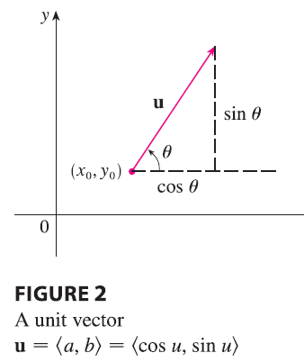
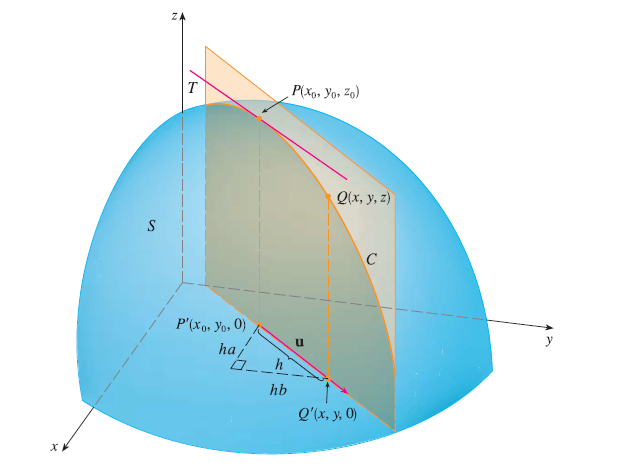
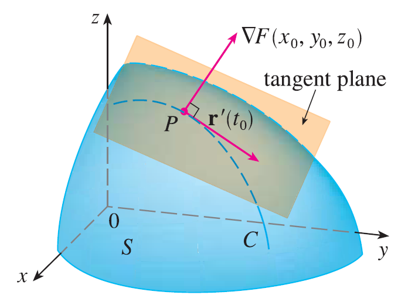

<page>

# Section Learning Outcomes

- Directional Derivatives
- Gradient Vectors

</page>

<page>

# Directional Derivatives

Recall that if $z = f(x, y)$, then the partial derivatives $f_x$ and $f_y$ are defined as

$f_x(x_0, y_0) = \lim_{h\to0} \frac{f(x_0 + h, y_0) - f(x_0, y_0)}{h}$

$f_y(x_0, y_0) = \lim_{h\to0} \frac{f(x_0, y_0 + h) - f(x_0, y_0)}{h}$

and represent the rates of change of $z$ in the x- and y-directions, that is, in the directions of the unit vectors **i** and **j**.

Suppose that we now wish to find the rate of change of $z$ at $(x_0, y_0)$ in the direction of an arbitrary unit vector $\mathbf{u} = \langle a, b \rangle$. To do this we consider the surface S with the equation $z = f(x, y)$ (the graph of f) and we let $z_0 = f(x_0, y_0)$. 

Then the point $P(x_0, y_0, z_0)$ lies on S. The vertical plane that passes through P in the direction of **u** intersects S in a curve C. The slope of the tangent line T to C at the point P is the rate of change of z in the direction of **u**.

If $Q(x, y, z)$ is another point on C and P', Q' are the projections of P, Q onto the xy-plane, then the vector $\vec{P'Q'}$ is parallel to **u** and so

$\vec{P'Q'} = h\mathbf{u} = \langle ha, hb \rangle$

for some scalar h. Therefore $x - x_0 = ha$, $y - y_0 = hb$, so $x = x_0 + ha$, $y = y_0 + hb$, and

$\frac{\Delta z}{h} = \frac{z - z_0}{h} = \frac{f(x_0 + ha, y_0 + hb) - f(x_0, y_0)}{h}$

If we take the limit as $h \to 0$, we obtain the rate of change of z (with respect to distance) in the direction of **u**, which is called the directional derivative of f in the direction of **u**.

---

**Definition** The directional derivative of $f$ at $(x_0, y_0)$ in the direction of a unit vector $\mathbf{u} = \langle a, b \rangle$ is

$D_{\mathbf{u}}f(x_0, y_0) = \lim_{h\to0} \frac{f(x_0 + ha, y_0 + hb) - f(x_0, y_0)}{h}$

if this limit exists.

---

**Theorem** If f is a differentiable function of x and y, then f has a directional derivative in the direction of any unit vector $\mathbf{u} = \langle a, b \rangle$ and

$$
D_{\mathbf{u}}f(x, y) = f_x(x, y)a + f_y(x, y)b
$$

**PROOF** If we define a function g of the single variable h by

$g(h) = f(x_0 + ha, y_0 + hb)$

then, by the definition of a derivative, we have

$g'(0) = \lim_{h\to0} \frac{g(h) - g(0)}{h} = \lim_{h\to0} \frac{f(x_0 + ha, y_0 + hb) - f(x_0, y_0)}{h} = D_{\mathbf{u}}f(x_0, y_0)$

On the other hand, we can write $g(h) = f(x, y)$, where $x = x_0 + ha$, $y = y_0 + hb$, so the Chain Rule gives

$g'(h) = \frac{\partial f}{\partial x}\frac{dx}{dh} + \frac{\partial f}{\partial y}\frac{dy}{dh} = f_x(x, y)a + f_y(x, y)b$

If we now put $h=0$, then $x = x_0$, $y = y_0$, and

$g'(0) = f_x(x_0, y_0)a + f_y(x_0, y_0)b$

Comparing the equations for $g'(0)$, we see that

$D_{\mathbf{u}}f(x_0, y_0) = f_x(x_0, y_0)a + f_y(x_0, y_0)b$

If the unit vector **u** makes an angle $\theta$ with the positive x-axis, then we can write $\mathbf{u} = \langle \cos\theta, \sin\theta \rangle$ and the formula in Theorem 3 becomes

$D_{\mathbf{u}}f(x, y) = f_x(x, y)\cos\theta + f_y(x, y)\sin\theta$

---

**EXAMPLE** Find the directional derivative $D_{\mathbf{u}}f(x, y)$ if

$f(x, y) = x^3 - 3xy + 4y^2$

and **u** is the unit vector given by angle $\theta = \pi/6$. What is $D_{\mathbf{u}}f(1, 2)$?

<ans>

**SOLUTION** The formula gives

$D_{\mathbf{u}}f(x, y) = f_x(x, y)\cos\frac{\pi}{6} + f_y(x, y)\sin\frac{\pi}{6}$
$= (3x^2 - 3y)\frac{\sqrt{3}}{2} + (-3x + 8y)\frac{1}{2}$
$= \frac{1}{2}[3\sqrt{3}x^2 - 3x + (8 - 3\sqrt{3})y]$

Therefore

$D_{\mathbf{u}}f(1, 2) = \frac{1}{2}[3\sqrt{3}(1)^2 - 3(1) + (8 - 3\sqrt{3})(2)] = \frac{13 - 3\sqrt{3}}{2}$

</ans>

</page>

----------

<page>

# The Gradient Vector

**Definition** If f is a function of two variables x and y, then the gradient of f is the vector function $\nabla f$ defined by

$$
\nabla f(x, y) = \langle f_x(x, y), f_y(x, y) \rangle = \frac{\partial f}{\partial x}\mathbf{i} + \frac{\partial f}{\partial y}\mathbf{j}
$$

---

**EXAMPLE** If $f(x, y) = \sin x + e^{xy}$, then

$\nabla f(x, y) = \langle f_x, f_y \rangle = \langle \cos x + ye^{xy}, xe^{xy} \rangle$

and

$\nabla f(0, 1) = \langle 2, 0 \rangle$

---

With this notation for the gradient vector, we can rewrite the equation for the directional derivative of a differentiable function as

$$
D_{\mathbf{u}}f(x, y) = \nabla f(x, y) \cdot \mathbf{u}
$$

This expresses the directional derivative in the direction of a unit vector **u** as the scalar projection of the gradient vector onto **u**.

---

**EXAMPLE** Find the directional derivative of the function $f(x, y) = x^2y^3 - 4y$ at the point $(2, -1)$ in the direction of the vector $\mathbf{v} = 2\mathbf{i} + 5\mathbf{j}$.

<ans>

**SOLUTION** We first compute the gradient vector at $(2, -1)$:

$\nabla f(x, y) = 2xy^3\mathbf{i} + (3x^2y^2 - 4)\mathbf{j}$
$\nabla f(2, -1) = -4\mathbf{i} + 8\mathbf{j}$

Note that **v** is not a unit vector, but since $|\mathbf{v}| = \sqrt{29}$, the unit vector in the direction of **v** is

$\mathbf{u} = \frac{\mathbf{v}}{|\mathbf{v}|} = \frac{2}{\sqrt{29}}\mathbf{i} + \frac{5}{\sqrt{29}}\mathbf{j}$

Therefore, we have

$D_{\mathbf{u}}f(2, -1) = \nabla f(2, -1) \cdot \mathbf{u} = (-4\mathbf{i} + 8\mathbf{j}) \cdot (\frac{2}{\sqrt{29}}\mathbf{i} + \frac{5}{\sqrt{29}}\mathbf{j}) = \frac{-4 \cdot 2 + 8 \cdot 5}{\sqrt{29}} = \frac{32}{\sqrt{29}}$

</ans>

</page>

-----------

<page>

# Gradients and Directional derivatives for functions of Three Variables

For functions of three variables we can define directional derivatives in a similar manner. Again $D_{\mathbf{u}}f(x, y, z)$ can be interpreted as the rate of change of the function in the direction of a unit vector **u**.

**Definition** The directional derivative of f at $(x_0, y_0, z_0)$ in the direction of a unit vector $\mathbf{u} = \langle a, b, c \rangle$ is

$D_{\mathbf{u}}f(x_0, y_0, z_0) = \lim_{h\to0} \frac{f(x_0 + ha, y_0 + hb, z_0 + hc) - f(x_0, y_0, z_0)}{h}$

if this limit exists.

---

**Gradients**

For a function f of three variables, the gradient vector, denoted by $\nabla f$ or grad f, is

$$
\nabla f = \langle f_x, f_y, f_z \rangle = \frac{\partial f}{\partial x}\mathbf{i} + \frac{\partial f}{\partial y}\mathbf{j} + \frac{\partial f}{\partial z}\mathbf{k}
$$

Then, just as with functions of two variables, the formula for the directional derivative can be rewritten as

$$
D_{\mathbf{u}}f(x, y, z) = \nabla f(x, y, z) \cdot \mathbf{u}
$$

---

**EXAMPLE** If $f(x, y, z) = x \sin(yz)$, (a) find the gradient of f and (b) find the directional derivative of f at $(1, 3, 0)$ in the direction of $\mathbf{v} = \mathbf{i} + 2\mathbf{j} - \mathbf{k}$.

<ans>

**SOLUTION**
(a) The gradient of f is

$\nabla f(x, y, z) = \langle f_x(x, y, z), f_y(x, y, z), f_z(x, y, z) \rangle = \langle \sin(yz), xz \cos(yz), xy \cos(yz) \rangle$

(b) At $(1, 3, 0)$ we have $\nabla f(1, 3, 0) = \langle 0, 0, 3 \rangle$. The unit vector in the direction of $\mathbf{v} = \mathbf{i} + 2\mathbf{j} - \mathbf{k}$ is

$\mathbf{u} = \frac{1}{\sqrt{6}}\mathbf{i} + \frac{2}{\sqrt{6}}\mathbf{j} - \frac{1}{\sqrt{6}}\mathbf{k}$

Therefore the equation gives

$D_{\mathbf{u}}f(1, 3, 0) = \nabla f(1, 3, 0) \cdot \mathbf{u} = 3\mathbf{k} \cdot (\frac{1}{\sqrt{6}}\mathbf{i} + \frac{2}{\sqrt{6}}\mathbf{j} - \frac{1}{\sqrt{6}}\mathbf{k}) = 3(-\frac{1}{\sqrt{6}}) = -\sqrt{\frac{3}{2}}$
</ans>

</page>

<page>

# Importance of Gradients: Maximizing the Directional Derivative

Suppose we have a function f of two or three variables and we consider all possible directional derivatives of f at a given point. These give the rates of change of f in all possible directions. We can then ask the questions: in which of these directions does f change fastest and what is the maximum rate of change? The answers are provided by the following theorem.

---

**Theorem** Suppose f is a differentiable function of two or three variables. The maximum value of the directional derivative $D_{\mathbf{u}}f(\mathbf{x})$ is $|\nabla f(\mathbf{x})|$ and it occurs when **u** has the same direction as the gradient vector $\nabla f(\mathbf{x})$.

**PROOF** From the equations we have

$D_{\mathbf{u}}f = \nabla f \cdot \mathbf{u} = |\nabla f||\mathbf{u}|\cos\theta = |\nabla f|\cos\theta$

where $\theta$ is the angle between $\nabla f$ and **u**. The maximum value of $\cos\theta$ is 1 and this occurs when $\theta = 0$. Therefore the maximum value of $D_{\mathbf{u}}f$ is $|\nabla f|$ and it occurs when $\theta = 0$, that is, when **u** has the same direction as $\nabla f$.

---

**EXAMPLE**
(a) If $f(x, y) = xe^y$, find the rate of change of f at the point P(2, 0) in the direction from P to Q(1/2, 2).
(b) In what direction does f have the maximum rate of change? What is this maximum rate of change?

<ans>

**SOLUTION**
(a) We first compute the gradient vector:

$\nabla f(x, y) = \langle f_x, f_y \rangle = \langle e^y, xe^y \rangle$
$\nabla f(2, 0) = \langle 1, 2 \rangle$

The unit vector in the direction of $\vec{PQ} = \langle -3/2, 2 \rangle$ is $\mathbf{u} = \langle -3/5, 4/5 \rangle$, so the rate of change of f in the direction from P to Q is

$D_{\mathbf{u}}f(2, 0) = \nabla f(2, 0) \cdot \mathbf{u} = \langle 1, 2 \rangle \cdot \langle -3/5, 4/5 \rangle = 1(-3/5) + 2(4/5) = 1$

(b) According to Theorem 15, f increases fastest in the direction of the gradient vector $\nabla f(2, 0) = \langle 1, 2 \rangle$. The maximum rate of change is

$|\nabla f(2, 0)| = |\langle 1, 2 \rangle| = \sqrt{5}$

</ans>

---
**EXAMPLE 7** Suppose that the temperature at a point (x, y, z) in space is given by $T(x, y, z) = 80/(1 + x^2 + 2y^2 + 3z^2)$, where T is measured in degrees Celsius and x, y, z in meters. In which direction does the temperature increase fastest at the point (1, 1, -2)? What is the maximum rate of increase?

<ans>

**SOLUTION** The gradient of T is

$\nabla T = \frac{\partial T}{\partial x}\mathbf{i} + \frac{\partial T}{\partial y}\mathbf{j} + \frac{\partial T}{\partial z}\mathbf{k}$
$= -\frac{160x}{(1 + x^2 + 2y^2 + 3z^2)^2}\mathbf{i} - \frac{320y}{(1 + x^2 + 2y^2 + 3z^2)^2}\mathbf{j} - \frac{480z}{(1 + x^2 + 2y^2 + 3z^2)^2}\mathbf{k}$
$= -\frac{160}{(1 + x^2 + 2y^2 + 3z^2)^2}(x\mathbf{i} + 2y\mathbf{j} + 3z\mathbf{k})$

At the point (1, 1, -2) the gradient vector is

$\nabla T(1, 1, -2) = -\frac{160}{256}(-\mathbf{i} - 2\mathbf{j} + 6\mathbf{k}) = \frac{5}{8}(-\mathbf{i} - 2\mathbf{j} + 6\mathbf{k})$

By Theorem 15 the temperature increases fastest in the direction of the gradient vector $\nabla T(1, 1, -2) = \frac{5}{8}(-\mathbf{i} - 2\mathbf{j} + 6\mathbf{k})$ or, equivalently, in the direction of $-\mathbf{i} - 2\mathbf{j} + 6\mathbf{k}$ or the unit vector $(-\mathbf{i} - 2\mathbf{j} + 6\mathbf{k})/\sqrt{41}$. The maximum rate of increase is the length of the gradient vector:

$|\nabla T(1, 1, -2)| = \frac{5}{8}|-\mathbf{i} - 2\mathbf{j} + 6\mathbf{k}| = \frac{5}{8}\sqrt{41}$

Therefore the maximum rate of increase of temperature is $\frac{5}{8}\sqrt{41} \approx 4^\circ C/m$.

</ans>

</page>

---
<page>

# Tangent Planes to Level Surfaces

Suppose S is a surface with equation $F(x, y, z) = k$, that is, it is a level surface of a function F of three variables, and let $P(x_0, y_0, z_0)$ be a point on S. Let C be any curve that lies on the surface S and passes through the point P. The curve C is described by a continuous vector function $\mathbf{r}(t) = \langle x(t), y(t), z(t) \rangle$. Let $t_0$ be the parameter value corresponding to P; that is, $\mathbf{r}(t_0) = \langle x_0, y_0, z_0 \rangle$. Since C lies on S, any point $(x(t), y(t), z(t))$ must satisfy the equation of S, that is,

$F(x(t), y(t), z(t)) = k$

If x, y, and z are differentiable functions of t and F is also differentiable, then we can use the Chain Rule to differentiate both sides of the equation as follows:

$\frac{\partial F}{\partial x}\frac{dx}{dt} + \frac{\partial F}{\partial y}\frac{dy}{dt} + \frac{\partial F}{\partial z}\frac{dz}{dt} = 0$

But, since $\nabla F = \langle F_x, F_y, F_z \rangle$ and $\mathbf{r}'(t) = \langle x'(t), y'(t), z'(t) \rangle$, the equation can be written in terms of a dot product as

$\nabla F \cdot \mathbf{r}'(t) = 0$

In particular, when $t = t_0$ we have $\mathbf{r}(t_0) = \langle x_0, y_0, z_0 \rangle$, so

$\nabla F(x_0, y_0, z_0) \cdot \mathbf{r}'(t_0) = 0$

This equation says that the gradient vector at P, $\nabla F(x_0, y_0, z_0)$, is perpendicular to the tangent vector $\mathbf{r}'(t_0)$ to any curve C on S that passes through P. If $\nabla F(x_0, y_0, z_0) \neq \mathbf{0}$, it is therefore natural to define the tangent plane to the level surface $F(x, y, z) = k$ at $P(x_0, y_0, z_0)$ as the plane that passes through P and has normal vector $\nabla F(x_0, y_0, z_0)$. Using the standard equation of a plane, we can write the equation of this tangent plane as

$F_x(x_0, y_0, z_0)(x - x_0) + F_y(x_0, y_0, z_0)(y - y_0) + F_z(x_0, y_0, z_0)(z - z_0) = 0$

The normal line to S at P is the line passing through P and perpendicular to the tangent plane. The direction of the normal line is therefore given by the gradient vector $\nabla F(x_0, y_0, z_0)$ and so, its symmetric equations are

$\frac{x - x_0}{F_x(x_0, y_0, z_0)} = \frac{y - y_0}{F_y(x_0, y_0, z_0)} = \frac{z - z_0}{F_z(x_0, y_0, z_0)}$

In the special case in which the equation of a surface S is of the form $z = f(x, y)$, we can rewrite the equation as

$F(x, y, z) = f(x, y) - z = 0$

and regard S as a level surface (with $k = 0$) of F. Then

$F_x(x_0, y_0, z_0) = f_x(x_0, y_0)$
$F_y(x_0, y_0, z_0) = f_y(x_0, y_0)$
$F_z(x_0, y_0, z_0) = -1$

so the equation becomes

$f_x(x_0, y_0)(x - x_0) + f_y(x_0, y_0)(y - y_0) - (z - z_0) = 0$

which is equivalent to our previous definition of a tangent plane. Thus our new, more general, definition of a tangent plane is consistent with the definition that was given for the special case.

---

**EXAMPLE** Find the equations of the tangent plane and normal line at the point $(-2, 1, -3)$ to the ellipsoid

$\frac{x^2}{4} + y^2 + \frac{z^2}{9} = 3$

<ans>

**SOLUTION** The ellipsoid is the level surface (with $k = 3$) of the function

$F(x, y, z) = \frac{x^2}{4} + y^2 + \frac{z^2}{9}$

Therefore we have

$F_x(x, y, z) = \frac{x}{2}$
$F_y(x, y, z) = 2y$
$F_z(x, y, z) = \frac{2z}{9}$

$F_x(-2, 1, -3) = -1$
$F_y(-2, 1, -3) = 2$
$F_z(-2, 1, -3) = -\frac{2}{3}$

Then the equation of the tangent plane at $(-2, 1, -3)$ is

$-1(x + 2) + 2(y - 1) - \frac{2}{3}(z + 3) = 0$

which simplifies to $3x - 6y + 2z + 18 = 0$.

By the equation, symmetric equations of the normal line are

$\frac{x + 2}{-1} = \frac{y - 1}{2} = \frac{z + 3}{-2/3}$

</ans>

</page>

