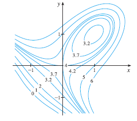
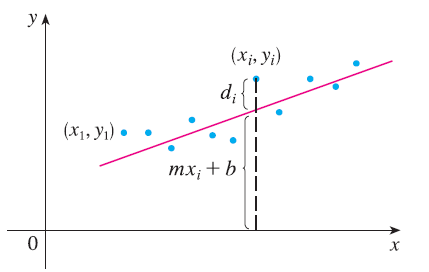

<page>

# Exercise 1

Suppose (1, 1) is a critical point of a function f with continuous second derivatives. In each case, what can you say about f?
(a) $f_{xx}(1, 1) = 4$, $f_{xy}(1, 1) = 1$, $f_{yy}(1, 1) = 2$
(b) $f_{xx}(1, 1) = 4$, $f_{xy}(1, 1) = 3$, $f_{yy}(1, 1) = 2$

</page>
<page>

# Exercise 2

Suppose (0, 2) is a critical point of a function g with continuous second derivatives. In each case, what can you say about g?
(a) $g_{xx}(0, 2) = -1$, $g_{xy}(0, 2) = 6$, $g_{yy}(0, 2) = 1$
(b) $g_{xx}(0, 2) = -1$, $g_{xy}(0, 2) = 2$, $g_{yy}(0, 2) = -8$
(c) $g_{xx}(0, 2) = 4$, $g_{xy}(0, 2) = 6$, $g_{yy}(0, 2) = 9$

</page>
<page>

# Exercise 3

Use the level curves in the figure to predict the location of the critical points of $f(x, y) = 4 + x^3 + y^3 - 3xy$ and whether f has a saddle point or a local maximum or minimum at each critical point. Explain your reasoning. Then use the Second Derivatives Test to confirm your predictions.

</page>
<page>

# Exercise 4

Use the level curves in the figure to predict the location of the critical points of $f(x, y) = 3x - x^3 - 2y^2 + y^4$ and whether f has a saddle point or a local maximum or minimum at each critical point. Explain your reasoning. Then use the Second Derivatives Test to confirm your predictions.

</page>
<page>

# Exercise 5

Find the local maximum and minimum values and saddle point(s) of the function $f(x, y) = x^2 + xy + y^2 + y$. If you have three-dimensional graphing software, graph the function with a domain and viewpoint that reveal all the important aspects of the function.

</page>
<page>

# Exercise 6

Find the local maximum and minimum values and saddle point(s) of the function $f(x, y) = xy - 2x - 2y - x^2 - y^2$. If you have three-dimensional graphing software, graph the function with a domain and viewpoint that reveal all the important aspects of the function.

</page>
<page>

# Exercise 7

Find the local maximum and minimum values and saddle point(s) of the function $f(x, y) = (x - y)(1 - xy)$. If you have three-dimensional graphing software, graph the function with a domain and viewpoint that reveal all the important aspects of the function.

</page>
<page>

# Exercise 8

Find the local maximum and minimum values and saddle point(s) of the function $f(x, y) = y(e^x - 1)$. If you have three-dimensional graphing software, graph the function with a domain and viewpoint that reveal all the important aspects of the function.

</page>
<page>

# Exercise 9

Find the local maximum and minimum values and saddle point(s) of the function $f(x, y) = x^3y + 12x^2 - 8y$. If you have three-dimensional graphing software, graph the function with a domain and viewpoint that reveal all the important aspects of the function.

</page>
<page>

# Exercise 10

Find the local maximum and minimum values and saddle point(s) of the function $f(x, y) = 2x^3 + xy^2 + 5x^2 + y^2$. If you have three-dimensional graphing software, graph the function with a domain and viewpoint that reveal all the important aspects of the function.

</page>
<page>

# Exercise 11

Find the local maximum and minimum values and saddle point(s) of the function $f(x, y) = x^3 - 3x + 3xy^2$. If you have three-dimensional graphing software, graph the function with a domain and viewpoint that reveal all the important aspects of the function.

</page>
<page>

# Exercise 12

Find the local maximum and minimum values and saddle point(s) of the function $f(x, y) = x^4 + y^4 - 4x^2 - 2y^2$. If you have three-dimensional graphing software, graph the function with a domain and viewpoint that reveal all the important aspects of the function.

</page>
<page>

# Exercise 13

Find the local maximum and minimum values and saddle point(s) of the function $f(x, y) = x^4 - 2x^2 + y^3 - 3y$. If you have three-dimensional graphing software, graph the function with a domain and viewpoint that reveal all the important aspects of the function.

</page>
<page>

# Exercise 14

Find the local maximum and minimum values and saddle point(s) of the function $f(x, y) = y \cos x$. If you have three-dimensional graphing software, graph the function with a domain and viewpoint that reveal all the important aspects of the function.

</page>
<page>

# Exercise 15

Find the local maximum and minimum values and saddle point(s) of the function $f(x, y) = e^x \cos y$. If you have three-dimensional graphing software, graph the function with a domain and viewpoint that reveal all the important aspects of the function.

</page>
<page>

# Exercise 16

Find the local maximum and minimum values and saddle point(s) of the function $f(x, y) = xye^{-(x^2+y^2)/2}$. If you have three-dimensional graphing software, graph the function with a domain and viewpoint that reveal all the important aspects of the function.

</page>
<page>

# Exercise 17

Find the local maximum and minimum values and saddle point(s) of the function $f(x, y) = xy + e^{-xy}$. If you have three-dimensional graphing software, graph the function with a domain and viewpoint that reveal all the important aspects of the function.

</page>
<page>

# Exercise 18

Find the local maximum and minimum values and saddle point(s) of the function $f(x, y) = (x^2 + y^2)e^{y^2-x^2}$. If you have three-dimensional graphing software, graph the function with a domain and viewpoint that reveal all the important aspects of the function.

</page>
<page>

# Exercise 19

Find the local maximum and minimum values and saddle point(s) of the function $f(x, y) = y^2 - 2y \cos x$, $-1 \le x \le 7$. If you have three-dimensional graphing software, graph the function with a domain and viewpoint that reveal all the important aspects of the function.

</page>
<page>

# Exercise 20

Find the local maximum and minimum values and saddle point(s) of the function $f(x, y) = \sin x \sin y$, $-\pi < x < \pi$, $-\pi < y < \pi$. If you have three-dimensional graphing software, graph the function with a domain and viewpoint that reveal all the important aspects of the function.

</page>
<page>

# Exercise 21

Show that $f(x, y) = x^2 + 4y^2 - 4xy + 2$ has an infinite number of critical points and that $D = 0$ at each one. Then show that $f$ has a local (and absolute) minimum at each critical point.

</page>
<page>

# Exercise 22

Show that $f(x, y) = x^2ye^{-x^2-y^2}$ has maximum values at $(\pm 1, 1/\sqrt{2})$ and minimum values at $(\pm 1, -1/\sqrt{2})$. Show also that $f$ has infinitely many other critical points and $D = 0$ at each of them. Which of them give rise to maximum values? Minimum values? Saddle points?

</page>
<page>

# Exercise 23

Use a graph or level curves or both to estimate the local maximum and minimum values and saddle point(s) of the function $f(x, y) = x^2 + y^2 + x^{-2}y^{-2}$. Then use calculus to find these values precisely.

</page>
<page>

# Exercise 24

Use a graph or level curves or both to estimate the local maximum and minimum values and saddle point(s) of the function $f(x, y) = (x - y)e^{-x^2-y^2}$. Then use calculus to find these values precisely.

</page>
<page>

# Exercise 25

Use a graph or level curves or both to estimate the local maximum and minimum values and saddle point(s) of the function $f(x, y) = \sin x + \sin y + \sin(x + y)$, $0 \le x \le 2\pi$, $0 \le y \le 2\pi$. Then use calculus to find these values precisely.

</page>
<page>

# Exercise 26

Use a graph or level curves or both to estimate the local maximum and minimum values and saddle point(s) of the function $f(x, y) = \sin x + \sin y + \cos(x + y)$, $0 \le x \le \pi/4$, $0 \le y \le \pi/4$. Then use calculus to find these values precisely.

</page>
<page>

# Exercise 27

Use a graphing device as in Example 4 (or Newton's method or solve numerically using a calculator or computer) to find the critical points of $f(x, y) = x^4 + y^4 - 4x^2y + 2y$ correct to three decimal places. Then classify the critical points and find the highest or lowest points on the graph, if any.

</page>
<page>

# Exercise 28

Use a graphing device as in Example 4 (or Newton's method or solve numerically using a calculator or computer) to find the critical points of $f(x, y) = y^6 - 2y^4 + x^2 - y^2 + y$ correct to three decimal places. Then classify the critical points and find the highest or lowest points on the graph, if any.

</page>
<page>

# Exercise 29

Use a graphing device as in Example 4 (or Newton's method or solve numerically using a calculator or computer) to find the critical points of $f(x, y) = x^4 + y^3 - 3x^2 + y^2 + x - 2y + 1$ correct to three decimal places. Then classify the critical points and find the highest or lowest points on the graph, if any.

</page>
<page>

# Exercise 30

Use a graphing device as in Example 4 (or Newton's method or solve numerically using a calculator or computer) to find the critical points of $f(x, y) = 20e^{-x^2-y^2} \sin 3x \cos 3y$, $|x| \le 1$, $|y| \le 1$ correct to three decimal places. Then classify the critical points and find the highest or lowest points on the graph, if any.

</page>
<page>

# Exercise 31

Find the absolute maximum and minimum values of $f(x, y) = x^2 + y^2 - 2x$ on the set D, where D is the closed triangular region with vertices (2, 0), (0, 2), and (0, -2).

</page>
<page>

# Exercise 32

Find the absolute maximum and minimum values of $f(x, y) = x + y - xy$ on the set D, where D is the closed triangular region with vertices (0, 0), (0, 2), and (4, 0).

</page>
<page>

# Exercise 33

Find the absolute maximum and minimum values of $f(x, y) = x^2 + y^2 + x^2y + 4$ on the set $D = \{(x, y) | |x| \le 1, |y| \le 1\}$.

</page>
<page>

# Exercise 34

(Different from book)

Find the absolute maximum and minimum values of $f(x, y) = 4x + 6y - x^2 - y^2$ on the set $D = \{(x, y) | 0 \le x \le 4, 0 \le y \le 5\}$.

</page>
<page>

# Exercise 35

Find the absolute maximum and minimum values of $f(x, y) = x^2 + 2y^2 - 2x - 4y + 1$ on the set $D = \{(x, y) | 0 \le x \le 2, 0 \le y \le 3\}$.

</page>
<page>

# Exercise 36

Find the absolute maximum and minimum values of $f(x, y) = xy^2$ on the set $D = \{(x, y) | x \ge 0, y \ge 0, x^2 + y^2 \le 3\}$.

</page>
<page>

# Exercise 37

Find the absolute maximum and minimum values of $f(x, y) = 2x^3 + y^4$ on the set $D = \{(x, y) | x^2 + y^2 \le 1\}$.

</page>
<page>

# Exercise 38

Find the absolute maximum and minimum values of $f(x, y) = x^3 - 3x - y^3 + 12y$ on the set D, where D is the quadrilateral whose vertices are (-2, 3), (2, 3), (2, 2), and (-2, -2).

</page>
<page>

# Exercise 39

For functions of one variable it is impossible for a continuous function to have two local maxima and no local minimum. But for functions of two variables such functions exist. Show that the function
$f(x, y) = -(x^2 - 1)^2 - (x^2y - x - 1)^2$
has only two critical points, but has local maxima at both of them. Then use a computer to produce a graph with a carefully chosen domain and viewpoint to see how this is possible.

</page>
<page>

# Exercise 40

If a function of one variable is continuous on an interval and has only one critical number, then a local maximum has to be an absolute maximum. But this is not true for functions of two variables. Show that the function
$f(x, y) = 3xe^y - x^3 - e^{3y}$
has exactly one critical point, and that f has a local maximum there that is not an absolute maximum. Then use a computer to produce a graph with a carefully chosen domain and viewpoint to see how this is possible.

</page>
<page>

# Exercise 41

Find the shortest distance from the point (2, 0, -3) to the plane $x + y + z = 1$.

</page>
<page>

# Exercise 42

Find the point on the plane $x - 2y + 3z = 6$ that is closest to the point (0, 1, 1).

</page>
<page>

# Exercise 43

Find the points on the cone $z^2 = x^2 + y^2$ that are closest to the point (4, 2, 0).

</page>
<page>

# Exercise 44

Find the points on the surface $y^2 = 9 + xz$ that are closest to the origin.

</page>
<page>

# Exercise 45

Find three positive numbers whose sum is 100 and whose product is a maximum.

</page>
<page>

# Exercise 46

Find three positive numbers whose sum is 12 and the sum of whose squares is as small as possible.

</page>
<page>

# Exercise 47

Find the maximum volume of a rectangular box that is inscribed in a sphere of radius r.

</page>
<page>

# Exercise 48

Find the dimensions of the box with volume 1000 cm$^3$ that has minimal surface area.

</page>
<page>

# Exercise 49

Find the volume of the largest rectangular box in the first octant with three faces in the coordinate planes and one vertex in the plane $x + 2y + 3z = 6$.

</page>
<page>

# Exercise 50

Find the dimensions of the rectangular box with largest volume if the total surface area is given as 64 cm$^2$.

</page>
<page>

# Exercise 51

Find the dimensions of a rectangular box of maximum volume such that the sum of the lengths of its 12 edges is a constant c.

</page>
<page>

# Exercise 52

The base of an aquarium with given volume V is made of slate and the sides are made of glass. If slate costs five times as much (per unit area) as glass, find the dimensions of the aquarium that minimize the cost of the materials.

</page>
<page>

# Exercise 53

A cardboard box without a lid is to have a volume of 32,000 cm$^3$. Find the dimensions that minimize the amount of cardboard used.

</page>
<page>

# Exercise 54

A rectangular building is being designed to minimize heat loss. The east and west walls lose heat at a rate of 10 units/m$^2$ per day, the north and south walls at a rate of 8 units/m$^2$ per day, the floor at a rate of 1 unit/m$^2$ per day, and the roof at a rate of 5 units/m$^2$ per day. Each wall must be at least 30 m long, the height must be at least 4 m, and the volume must be exactly 4000 m$^3$.
(a) Find and sketch the domain of the heat loss as a function of the lengths of the sides.
(b) Find the dimensions that minimize heat loss. (Check both the critical points and the points on the boundary of the domain.)
(c) Could you design a building with even less heat loss if the restrictions on the lengths of the walls were removed?

</page>
<page>

# Exercise 55

If the length of the diagonal of a rectangular box must be L, what is the largest possible volume?

</page>
<page>

# Exercise 56

A model for the yield Y of an agricultural crop as a function of the nitrogen level N and phosphorus level P in the soil (measured in appropriate units) is
$Y(N, P) = k N P e^{-N-P}$
where k is a positive constant. What levels of nitrogen and phosphorus result in the best yield?

</page>
<page>

# Exercise 57

The Shannon index is a measure of diversity in an ecosystem. For the case of three species, it is defined as
$H = -p_1 \ln p_1 - p_2 \ln p_2 - p_3 \ln p_3$
where $p_i$ is the proportion of species i in the ecosystem.
(a) Express H as a function of two variables $p_1$ and $p_2$ using the fact that $p_1 + p_2 + p_3 = 1$.
(b) What is the domain of H?
(c) Find the maximum value of H. For what values of $p_1, p_2, p_3$ does it occur?

</page>
<page>

# Exercise 58

Three alleles (alternative versions of a gene) A, B, and O determine the four blood types A (AA or AO), B (BB or BO), O (OO), and AB. The Hardy-Weinberg Law states that the proportion of individuals in a population who carry two different alleles is
$P = 2pq + 2pr + 2rq$
where p, q, and r are the proportions of A, B, and O in the population. Use the fact that $p + q + r = 1$ to show that P is at most 2/3.

</page>
<page>

# Exercise 59

Suppose that a scientist has reason to believe that two quantities x and y are related linearly, that is, $y = mx + b$, at least approximately, for some values of m and b. The scientist performs an experiment and collects data in the form of points $(x_1, y_1), (x_2, y_2), ..., (x_n, y_n)$, and then plots these points. The points don't lie exactly on a straight line, so the scientist wants to find constants m and b so that the line $y = mx + b$ "fits" the points as well as possible.

Let $d_i = y_i - (mx_i + b)$ be the vertical deviation of the point $(x_i, y_i)$ from the line. The method of least squares determines m and b so as to minimize $\sum_{i=1}^n d_i^2$, the sum of the squares of these deviations. Show that, according to this method, the line of best fit is obtained when
$m \sum_{i=1}^n x_i + bn = \sum_{i=1}^n y_i$
and
$m \sum_{i=1}^n x_i^2 + b \sum_{i=1}^n x_i = \sum_{i=1}^n x_i y_i$
Thus the line is found by solving these two equations in the two unknowns m and b.

</page>
<page>

# Exercise 60

Find an equation of the plane that passes through the point (1, 2, 3) and cuts off the smallest volume in the first octant.

</page>
