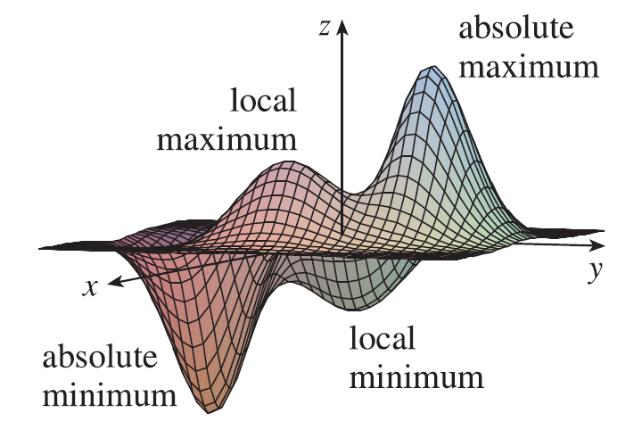
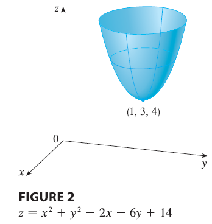
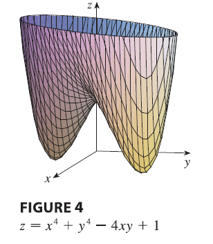
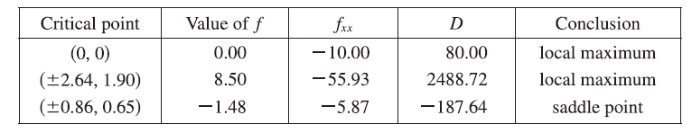
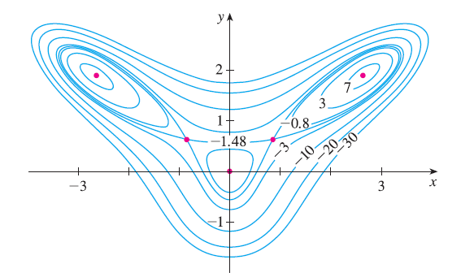
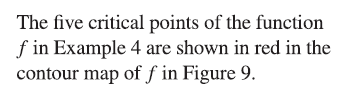
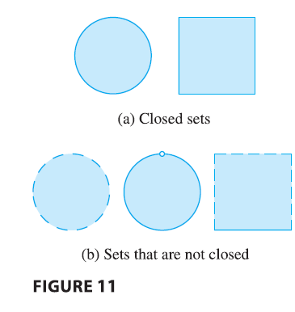
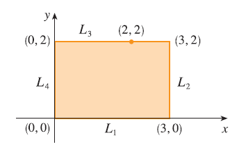
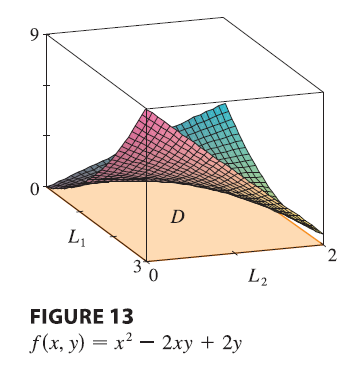

<page>

# Learning Outcomes: Maximum and Minimum Values

- In this section we will learn to use partial derivatives to solve max-min problems

</page>

<page>

# Introduction 

Look at the hills and valleys in the graph of $f$ shown in Figure There are two points $(a, b)$ where $f$ has a **local maximum**, that is, where $f(a, b)$ is larger than nearby values of $f(x, y)$. The larger of these two values is the **absolute maximum**. Likewise, $f$ has two **local minima**, where $f(a, b)$ is smaller than nearby values. The smaller of these two values is the **absolute minimum**.

---
**Definition: Local maximum & minimum:** A function of two variables has a **local maximum** at $(a, b)$ if $f(x, y) \le f(a, b)$ when $(x, y)$ is near $(a, b)$. [This means that $f(x, y) \le f(a, b)$ for all points $(x, y)$ in some disk with center $(a, b)$.] The number $f(a, b)$ is called a **local maximum value**. If $f(x, y) \ge f(a, b)$ when $(x, y)$ is near $(a, b)$, then $f$ has a **local minimum** at $(a, b)$ and $f(a, b)$ is a **local minimum value**.

If the inequalities in Definition hold for all points $(x, y)$ in the domain of $f$, then $f$ has an **absolute maximum** (or **absolute minimum**) at $(a, b)$.

</page>

<page>

# How to find max/min? 

**Theorem** If $f$ has a local maximum or minimum at $(a, b)$ and the first-order partial derivatives of $f$ exist there, then $f_x(a, b) = 0$ and $f_y(a, b) = 0$.

**PROOF** Let $g(x) = f(x, b)$. If $f$ has a local maximum (or minimum) at $(a, b)$, then $g$ has a local maximum (or minimum) at $a$, so $g'(a) = 0$ by Fermat's Theorem. But $g'(a) = f_x(a, b)$ and so $f_x(a, b) = 0$. Similarly, by applying Fermat's Theorem to the function $G(y) = f(a, y)$, we obtain $f_y(a, b) = 0$.

--------

Notice that the conclusion of Theorem 2 can be stated in the notation of gradient vectors as $\nabla f(a, b) = \mathbf{0}$.

If we put $f_x(a, b) = 0$ and $f_y(a, b) = 0$ in the equation of a tangent plane, we get $z = z_0$. Thus the geometric interpretation of Theorem 2 is that if the graph of $f$ has a tangent plane at a local maximum or minimum, then the tangent plane must be horizontal.

</page>

<page>

# Critical Points

A point $(a, b)$ is called a **critical point** (or stationary point) of $f$ if $f_x(a, b) = 0$ and $f_y(a, b) = 0$, or if one of these partial derivatives does not exist. 

Theorem says that if $f$ has a local maximum or minimum at $(a, b)$, then $(a, b)$ is a critical point of $f$. However, as in single-variable calculus, not all critical points give rise to maxima or minima. At a critical point, a function could have a local maximum or a local minimum or neither.

-----------

**EXAMPLE** Let $f(x, y) = x^2 + y^2 - 2x - 6y + 14$. Then
$$
f_x(x, y) = 2x - 2 \quad f_y(x, y) = 2y - 6
$$
These partial derivatives are equal to 0 when $x = 1$ and $y = 3$, so the only critical point is $(1, 3)$. By completing the square, we find that
$$
f(x, y) = 4 + (x - 1)^2 + (y - 3)^2
$$
Since $(x - 1)^2 \ge 0$ and $(y - 3)^2 \ge 0$, we have $f(x, y) \ge 4$ for all values of $x$ and $y$. Therefore $f(1, 3) = 4$ is a local minimum, and in fact it is the absolute minimum of $f$. This can be confirmed geometrically from the graph of $f$, which is the elliptic paraboloid with vertex $(1, 3, 4)$ shown in Figure 2.

------

**EXAMPLE 2** Find the extreme values of $f(x, y) = y^2 - x^2$.

<ans>

**SOLUTION** Since $f_x = -2x$ and $f_y = 2y$, the only critical point is $(0, 0)$. Notice that for points on the x-axis we have $y = 0$, so $f(x, 0) = -x^2 < 0$ (if $x \neq 0$). However, for points on the y-axis we have $x = 0$, so $f(0, y) = y^2 > 0$ (if $y \neq 0$). Thus every disk with center $(0, 0)$ contains points where $f$ takes positive values as well as points where $f$ takes negative values. Therefore $f(0, 0) = 0$ can't be an extreme value for $f$, so $f$ has no extreme value.

</ans>

Example illustrates the fact that a function need not have a maximum or minimum value at a critical point. Figure 3 shows how this is possible. The graph of $f$ is the hyperbolic paraboloid $z = y^2 - x^2$, which has a horizontal tangent plane ($z = 0$) at the origin. You can see that $f(0, 0) = 0$ is a maximum in the direction of the x-axis but a minimum in the direction of the y-axis. Near the origin the graph has the shape of a saddle and so $(0, 0)$ is called a **saddle point** of $f$.

</page>

<page>

# Second derivative Test

We need to be able to determine whether or not a function has an extreme value at a critical point. The following test, which is proved at the end of this section, is analogous to the Second Derivative Test for functions of one variable.

**Second Derivatives Test** Suppose the second partial derivatives of $f$ are continuous on a disk with center $(a, b)$, and suppose that $f_x(a, b) = 0$ and $f_y(a, b) = 0$ [that is, $(a, b)$ is a critical point of $f$]. Let
$$
D = D(a, b) = f_{xx}(a, b)f_{yy}(a, b) - [f_{xy}(a, b)]^2
$$
(a) If $D > 0$ and $f_{xx}(a, b) > 0$, then $f(a, b)$ is a local minimum.
(b) If $D > 0$ and $f_{xx}(a, b) < 0$, then $f(a, b)$ is a local maximum.
(c) If $D < 0$, then $f(a, b)$ is not a local maximum or minimum.

---

**NOTE 1** In case (c) the point $(a, b)$ is called a **saddle point** of $f$ and the graph of $f$ crosses its tangent plane at $(a, b)$.
**NOTE 2** If $D = 0$, the test gives no information: $f$ could have a local maximum or local minimum at $(a, b)$, or $(a, b)$ could be a saddle point of $f$.
**NOTE 3** To remember the formula for $D$, it's helpful to write it as a determinant:
$$
D = \begin{vmatrix} f_{xx} & f_{xy} \\ f_{yx} & f_{yy} \end{vmatrix} = f_{xx}f_{yy} - (f_{xy})^2
$$

----------

**EXAMPLE** Find the local maximum and minimum values and saddle points of $f(x, y) = x^4 + y^4 - 4xy + 1$.

<ans>

**SOLUTION** We first locate the critical points:
$$
f_x = 4x^3 - 4y \quad f_y = 4y^3 - 4x
$$
Setting these partial derivatives equal to 0, we obtain the equations
$$
x^3 - y = 0 \quad \text{and} \quad y^3 - x = 0
$$
To solve these equations we substitute $y = x^3$ from the first equation into the second one. This gives
$$
0 = x^9 - x = x(x^8 - 1) = x(x^4 - 1)(x^4 + 1) = x(x^2 - 1)(x^2 + 1)(x^4 + 1)
$$
so there are three real roots: $x = 0, 1, -1$. The three critical points are $(0, 0)$, $(1, 1)$, and $(-1, -1)$.

Next we calculate the second partial derivatives and $D(x, y)$:
$$
f_{xx} = 12x^2 \quad f_{xy} = -4 \quad f_{yy} = 12y^2
$$
$$
D(x, y) = f_{xx}f_{yy} - (f_{xy})^2 = 144x^2y^2 - 16
$$
Since $D(0, 0) = -16 < 0$, it follows from case (c) of the Second Derivatives Test that the origin is a saddle point; that is, $f$ has no local maximum or minimum at $(0, 0)$.
Since $D(1, 1) = 128 > 0$ and $f_{xx}(1, 1) = 12 > 0$, we see from case (a) of the test that $f(1, 1) = -1$ is a local minimum. Similarly, we have $D(-1, -1) = 128 > 0$ and $f_{xx}(-1, -1) = 12 > 0$, so $f(-1, -1) = -1$ is also a local minimum.
The graph of $f$ is shown in this Figure.

</ans>

---------------

**EXAMPLE** Find and classify the critical points of the function
$$
f(x, y) = 10x^2y - 5x^2 - 4y^2 - x^4 - 2y^4
$$
Also find the highest point on the graph of $f$.

<ans>

**SOLUTION** The first-order partial derivatives are
$$
f_x = 20xy - 10x - 4x^3 \quad f_y = 10x^2 - 8y - 8y^3
$$
So to find the critical points we need to solve the equations
$$
2x(10y - 5 - 2x^2) = 0
$$
$$
5x^2 - 4y - 4y^3 = 0
$$
From the first equation we see that either
$$
x = 0 \quad \text{or} \quad 10y - 5 - 2x^2 = 0
$$
In the first case ($x = 0$), the second equation becomes $-4y(1 + y^2) = 0$, so $y = 0$ and we have the critical point $(0, 0)$.

In the second case ($10y - 5 - 2x^2 = 0$), we get
$$
x^2 = 5y - 2.5
$$
and, putting this in the second equation, we have $25y - 12.5 - 4y - 4y^3 = 0$. So we have to solve the cubic equation
$$
4y^3 - 21y + 12.5 = 0
$$
Using a graphing calculator or computer to graph the function
$$
g(y) = 4y^3 - 21y + 12.5
$$
as in Figure 6, we see that the equation has three real roots. By zooming in, we can find the roots to four decimal places:
$$
y \approx -2.5452 \quad y \approx 0.6468 \quad y \approx 1.8984
$$
From $x^2 = 5y - 2.5$, the corresponding $x$-values are given by
$$
x = \pm\sqrt{5y - 2.5}
$$
If $y \approx -2.5452$, then $x$ has no corresponding real values. If $y \approx 0.6468$, then $x \approx \pm 0.8567$. If $y \approx 1.8984$, then $x \approx \pm 2.6442$. So we have a total of five critical points, which are analyzed in the following chart. All quantities are rounded to two decimal places.

</ans>
</page>

<page>

# Sample Application Problem

**EXAMPLE** Find the shortest distance from the point $(1, 0, -2)$ to the plane $x + 2y + z = 4$.

<ans>

**SOLUTION** The distance from any point $(x, y, z)$ to the point $(1, 0, -2)$ is
$$
d = \sqrt{(x - 1)^2 + y^2 + (z + 2)^2}
$$
but if $(x, y, z)$ lies on the plane $x + 2y + z = 4$, then $z = 4 - x - 2y$ and so we have $d = \sqrt{(x - 1)^2 + y^2 + (6 - x - 2y)^2}$. We can minimize $d$ by minimizing the simpler expression
$$
d^2 = f(x, y) = (x - 1)^2 + y^2 + (6 - x - 2y)^2
$$
By solving the equations
$$
f_x = 2(x - 1) - 2(6 - x - 2y) = 4x + 4y - 14 = 0
$$
$$
f_y = 2y - 4(6 - x - 2y) = 4x + 10y - 24 = 0
$$
we find that the only critical point is $(11/6, 5/3)$. Since $f_{xx} = 4$, $f_{xy} = 4$, and $f_{yy} = 10$, we have $D(x, y) = f_{xx}f_{yy} - (f_{xy})^2 = 24 > 0$ and $f_{xx} > 0$, so by the Second Derivatives Test $f$ has a local minimum at $(11/6, 5/3)$. Intuitively, we can see that this local minimum is actually an absolute minimum because there must be a point on the given plane that is closest to $(1, 0, -2)$. If $x = 11/6$ and $y = 5/3$, then
$$
d = \sqrt{(11/6 - 1)^2 + (5/3)^2 + (6 - 11/6 - 10/3)^2} = \sqrt{(5/6)^2 + (10/6)^2 + (5/6)^2} = \frac{\sqrt{150}}{6} = \frac{5\sqrt{6}}{6}
$$
The shortest distance from $(1, 0, -2)$ to the plane $x + 2y + z = 4$ is $5\sqrt{6}/6$.

</ans>

</page>

<page>

# Sample Application Problem

**EXAMPLE** A rectangular box without a lid is to be made from 12 m$^2$ of cardboard. Find the maximum volume of such a box.

<ans>

**SOLUTION** Let the length, width, and height of the box (in meters) be $x, y$, and $z$. Then the volume of the box is
$$
V = xyz
$$
We can express $V$ as a function of just two variables $x$ and $y$ by using the fact that the area of the four sides and the bottom of the box is
$$
2xz + 2yz + xy = 12
$$
Solving this equation for $z$, we get $z = (12 - xy)/[2(x + y)]$, so the expression for $V$ becomes
$$
V = xy \frac{12 - xy}{2(x + y)} = \frac{12xy - x^2y^2}{2(x + y)}
$$
We compute the partial derivatives:
$$
\frac{\partial V}{\partial x} = \frac{y^2(12 - 2xy - x^2)}{2(x + y)^2} \quad \frac{\partial V}{\partial y} = \frac{x^2(12 - 2xy - y^2)}{2(x + y)^2}
$$
If $V$ is a maximum, then $\partial V/\partial x = \partial V/\partial y = 0$, but $x = 0$ or $y = 0$ gives $V = 0$, so we must solve the equations
$$
12 - 2xy - x^2 = 0 \quad 12 - 2xy - y^2 = 0
$$
These imply that $x^2 = y^2$ and so $x = y$. (Note that $x$ and $y$ must both be positive in this problem.) If we put $x = y$ in either equation we get $12 - 3x^2 = 0$, which gives $x = 2$, $y = 2$, and $z = (12 - 2 \cdot 2)/[2(2 + 2)] = 1$.
We could use the Second Derivatives Test to show that this gives a local maximum of $V$, or we could simply argue from the physical nature of this problem that there must be an absolute maximum volume, which has to occur at a critical point of $V$, so it must occur when $x = 2, y = 2, z = 1$. Then $V = 2 \cdot 2 \cdot 1 = 4$, so the maximum volume of the box is 4 m$^3$.

</ans>

</page>

<page>

# Absolute Maximum and Minimum Values

For a function $f$ of one variable, the Extreme Value Theorem says that if $f$ is continuous on a closed interval $[a, b]$, then $f$ has an absolute minimum value and an absolute maximum value. According to the Closed Interval Method, we found these by evaluating $f$ not only at the critical numbers but also at the endpoints $a$ and $b$.

There is a similar situation for functions of two variables. Just as a closed interval contains its endpoints, a **closed set** in $\mathbb{R}^2$ is one that contains all its boundary points. [A **boundary point** of $D$ is a point $(a, b)$ such that every disk with center $(a, b)$ contains points in $D$ and also points not in $D$.] For instance, the disk

$$
D = \{(x, y) | x^2 + y^2 \le 1\}
$$

which consists of all points on or inside the circle $x^2 + y^2 = 1$, is a closed set because it contains all of its boundary points (which are the points on the circle $x^2 + y^2 = 1$). But if even one point on the boundary curve were omitted, the set would not be closed.

A **bounded set** in $\mathbb{R}^2$ is one that is contained within some disk. In other words, it is finite in extent. Then, in terms of closed and bounded sets, we can state the following counterpart of the Extreme Value Theorem in two dimensions.

---

**Extreme Value Theorem for Functions of Two Variables** If $f$ is continuous on a closed, bounded set $D$ in $\mathbb{R}^2$, then $f$ attains an absolute maximum value $f(x_1, y_1)$ and an absolute minimum value $f(x_2, y_2)$ at some points $(x_1, y_1)$ and $(x_2, y_2)$ in $D$.

---

To find the extreme values guaranteed by Theorem, we note that, by a previous Theorem , if $f$ has an extreme value at $(x_1, y_1)$, then $(x_1, y_1)$ is either a critical point of $f$ or a boundary point of $D$. Thus we have the following extension of the Closed Interval Method.

---

**Steps to find Absolute Min-max** 

To find the absolute maximum and minimum values of a continuous function $f$ on a closed, bounded set $D$:
1. Find the values of $f$ at the critical points of $f$ in $D$.
2. Find the extreme values of $f$ on the boundary of $D$.
3. The largest of the values from steps 1 and 2 is the absolute maximum value; the smallest of these values is the absolute minimum value.

</page>

<page>

# Example absolute min-max problem

**EXAMPLE** Find the absolute maximum and minimum values of the function $f(x, y) = x^2 - 2xy + 2y$ on the rectangle $D = \{(x, y) | 0 \le x \le 3, 0 \le y \le 2\}$.

<ans>

**SOLUTION** Since $f$ is a polynomial, it is continuous on the closed, bounded rectangle $D$, so Theorem 8 tells us there is both an absolute maximum and an absolute minimum. According to step 1, we first find the critical points. These occur when
$$
f_x = 2x - 2y = 0 \quad f_y = -2x + 2 = 0
$$
so the only critical point is $(1, 1)$, and the value of $f$ there is $f(1, 1) = 1$.
In step 2 we look at the values of $f$ on the boundary of $D$, which consists of the four line segments $L_1, L_2, L_3, L_4$.
On $L_1$ we have $y = 0$ and
$$
f(x, 0) = x^2 \quad 0 \le x \le 3
$$
This is an increasing function of $x$, so its minimum value is $f(0, 0) = 0$ and its maximum value is $f(3, 0) = 9$.
On $L_2$ we have $x = 3$ and
$$
f(3, y) = 9 - 4y \quad 0 \le y \le 2
$$
This is a decreasing function of $y$, so its maximum value is $f(3, 0) = 9$ and its minimum value is $f(3, 2) = 1$.
On $L_3$ we have $y = 2$ and
$$
f(x, 2) = x^2 - 4x + 4 \quad 0 \le x \le 3
$$
By observing that $f(x, 2) = (x - 2)^2$, we see that the minimum value of this function is $f(2, 2) = 0$ and the maximum value is $f(0, 2) = 4$.
Finally, on $L_4$ we have $x = 0$ and
$$
f(0, y) = 2y \quad 0 \le y \le 2
$$
with maximum value $f(0, 2) = 4$ and minimum value $f(0, 0) = 0$. Thus, on the boundary, the minimum value of $f$ is 0 and the maximum is 9.
In step 3 we compare these values with the value $f(1, 1) = 1$ at the critical point and conclude that the absolute maximum value of $f$ on $D$ is $f(3, 0) = 9$ and the absolute minimum value is $f(0, 0) = f(2, 2) = 0$. Figure shows the graph of $f$.

</ans>

</page>

