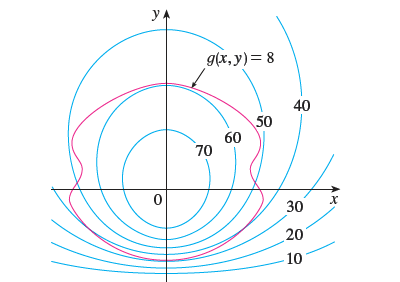

<page>

# Exercise 1

Pictured are a contour map of $f$ and a curve with equation $g(x, y) = 8$. Estimate the maximum and minimum values of $f$ subject to the constraint that $g(x, y) = 8$. Explain your reasoning.

</page>
<page>

# Exercise 2

(a) Use a graphing calculator or computer to graph the curve with equation $x^3 + y^3 = 3xy$. At what point on the curve does it seem that the tangent line is horizontal?
(b) Use the method of Lagrange multipliers to find the exact coordinates of the point in part (a).

</page>
<page>

# Exercise 3

Find the extreme values of $f(x, y) = x^2 + y^2$ subject to the constraint $xy = 1$.

</page>
<page>

# Exercise 4

Find the extreme values of $f(x, y) = xy$ subject to the constraint $x^2 + y^2 = 1$.

</page>
<page>

# Exercise 5

Find the extreme values of $f(x, y) = x^2 + 2y^2$ subject to the constraint $x^2 + y^2 = 1$.

</page>
<page>

# Exercise 6

Find the extreme values of $f(x, y) = x^2 - y^2$ subject to the constraint $x^2 + y^2 = 1$.

</page>
<page>

# Exercise 7

Find the extreme values of $f(x, y, z) = 2x + 2y + z$ subject to the constraint $x^2 + y^2 + z^2 = 9$.

</page>
<page>

# Exercise 8

Find the extreme values of $f(x, y, z) = x^2 + y^2 + z^2$ subject to the constraint $x + y + z = 12$.

</page>
<page>

# Exercise 9

Find the extreme values of $f(x, y, z) = xyz$ subject to the constraint $x^2 + 2y^2 + 3z^2 = 6$.

</page>
<page>

# Exercise 10

Find the extreme values of $f(x, y, z) = x^2y^2z^2$ subject to the constraint $x^2 + y^2 + z^2 = 1$.

</page>
<page>

# Exercise 11

Find the extreme values of $f(x, y, z) = x^4 + y^4 + z^4$ subject to the constraint $x^2 + y^2 + z^2 = 1$.

</page>
<page>

# Exercise 12

Find the extreme values of $f(x, y, z, t) = x + y + z + t$ subject to the constraint $x^2 + y^2 + z^2 + t^2 = 1$.

</page>
<page>

# Exercise 13

Find the extreme values of $f(x_1, x_2, ..., x_n) = x_1 + x_2 + ... + x_n$ subject to the constraint $x_1^2 + x_2^2 + ... + x_n^2 = 1$.

</page>
<page>

# Exercise 14

Find the extreme values of $f(x_1, x_2, ..., x_n) = x_1^2 + x_2^2 + ... + x_n^2$ subject to the constraint $x_1 + x_2 + ... + x_n = 1$.

</page>
<page>

# Exercise 15

The method of Lagrange multipliers assumes that the extreme values exist, but that is not always the case. Show that the problem of finding the minimum value of $f(x, y) = x$ subject to the constraint $y^2 + x^4 - x^3 = 0$ can be solved using Lagrange multipliers, but $f$ does not have a maximum value with that constraint.

</page>
<page>

# Exercise 16

Find the maximum value of $f(x, y) = e^{xy}$ subject to the constraint $x^3 + y^3 = 16$. Show that $f$ has no minimum value with this constraint.

</page>
<page>

# Exercise 17

Find the extreme values of $f(x, y) = x^2 + y^2$ subject to both constraints $x^2 + y^2 = 1$ and $x + y = 1$.

</page>
<page>

# Exercise 18

Find the extreme values of $f(x, y, z) = x^2 + y^2 + z^2$ subject to both constraints $x^2 + y^2 + z^2 = 1$ and $x + y + z = 1$.

</page>
<page>

# Exercise 19

Find the extreme values of $f(x, y, z) = yz + xy$ subject to both constraints $xy = 1$ and $y^2 + z^2 = 1$.

</page>
<page>

# Exercise 20

Find the extreme values of $f(x, y, z) = x^2 + y^2 + z^2$ subject to both constraints $z^2 = x^2 + y^2$ and $x + y - z = -1$.

</page>
<page>

# Exercise 21

Find the absolute maximum and minimum values of $f(x, y) = x^2y$ on the ellipse $x^2 + 2y^2 = 6$.

</page>
<page>

# Exercise 22

Find the absolute maximum and minimum values of $f(x, y) = x^2 + 4x + y^2 - 4y$ on the disk $x^2 + y^2 \le 9$.

</page>
<page>

# Exercise 23

Find the absolute maximum and minimum values of $f(x, y) = 2x^2 + 3y^2 - 4x - 5$ on the disk $x^2 + y^2 \le 16$.

</page>
<page>

# Exercise 24

Find the absolute maximum and minimum values of $f(x, y) = e^{-x^2-y^2}(x^2 + 2y^2)$ on the disk $x^2 + y^2 \le 4$.

</page>
<page>

# Exercise 25

Consider the problem of maximizing the function $f(x, y) = 2x + 3y$ subject to the constraint $\sqrt{x} + \sqrt{y} = 5$.
(a) Try using Lagrange multipliers to solve the problem.
(b) Does $f(25, 0)$ give a larger value than the one in part (a)?
(c) Solve the problem by graphing the constraint curve and several level curves of $f$.
(d) Explain why the method of Lagrange multipliers fails to solve the problem.
(e) What is the significance of $f(9, 4)$?

</page>
<page>

# Exercise 26

(a) Use a computer algebra system to solve the system of equations that arises in using Lagrange multipliers to maximize $f(x, y, z) = x^2y^2z^2$ subject to the constraint $x^2 + y^2 + z^2 = 1$.
(b) Solve the problem in part (a) with the aid of a graph and level surfaces. Use your CAS to solve the equations numerically. Compare your answers with those in part (a).

</page>
<page>

# Exercise 27

The total production P of a certain product depends on the amount L of labor used and the amount K of capital investment. In Sections 14.1 and 14.3 we discussed how the Cobb-Douglas model $P = bL^\alpha K^{1-\alpha}$ follows from certain economic assumptions, where b and $\alpha$ are positive constants and $\alpha < 1$. If the cost of a unit of labor is m and the cost of a unit of capital is n, and the company can spend only p dollars as its total budget, then maximizing the production P is subject to the constraint $mL + nK = p$. Show that the maximum production occurs when
$L = \frac{\alpha p}{m}$ and $K = \frac{(1-\alpha)p}{n}$

</page>
<page>

# Exercise 28

Referring to Exercise 27, we now suppose that the production is fixed at $bL^\alpha K^{1-\alpha} = Q$, where Q is a constant. What values of L and K minimize the cost function $C(L, K) = mL + nK$?

</page>
<page>

# Exercise 29

Use Lagrange multipliers to prove that the rectangle with maximum area that has a given perimeter p is a square.

</page>
<page>

# Exercise 30

Use Lagrange multipliers to prove that the triangle with maximum area that has a given perimeter p is equilateral.
[Hint: Use Heron's formula for the area: $A = \sqrt{s(s-x)(s-y)(s-z)}$, where $s = p/2$ and $x, y, z$ are the lengths of the sides.]

</page>
<page>

# Exercise 31

Find the shortest distance from the point $(2, 1, -1)$ to the plane $x + y - z = 1$.

</page>
<page>

# Exercise 32

Find the points on the cone $z^2 = x^2 + y^2$ that are closest to the point $(4, 2, 0)$.

</page>
<page>

# Exercise 33

Find the point on the sphere $x^2 + y^2 + z^2 = 4$ that is closest to the point $(3, 1, -1)$.

</page>
<page>

# Exercise 34

Find the point on the sphere $x^2 + y^2 + z^2 = 1$ that is closest to the point $(2, 1, 2)$.

</page>
<page>

# Exercise 35

Find the points on the surface $y^2 = 9 + xz$ that are closest to the origin.

</page>
<page>

# Exercise 36

Find the points on the surface $x^2y^2z = 1$ that are closest to the origin.

</page>
<page>

# Exercise 37

Find three positive numbers whose sum is 100 and whose product is a maximum.

</page>
<page>

# Exercise 38

Find three positive numbers whose sum is 12 and the sum of whose squares is a minimum.

</page>
<page>

# Exercise 39

Find the rectangular box with largest volume that is inscribed in a sphere of radius r.

</page>
<page>

# Exercise 40

Find the dimensions of the box with volume 1000 cm$^3$ that has minimal surface area.

</page>
<page>

# Exercise 41

Find the dimensions of the rectangular box with largest volume if the total surface area is given as 64 cm$^2$.

</page>
<page>

# Exercise 42

Find the dimensions of the rectangular box of maximum volume such that the sum of the lengths of its 12 edges is a constant c.

</page>
<page>

# Exercise 43

The base of an aquarium with given volume V is made of slate and the sides are made of glass. If slate costs five times as much per unit area as glass, find the dimensions of the aquarium that minimize the cost of the materials.

</page>
<page>

# Exercise 44

Find the maximum and minimum volumes of a rectangular box whose surface area is 1500 cm$^2$ and whose total edge length is 200 cm.

</page>
<page>

# Exercise 45

The plane $x + y + 2z = 2$ intersects the paraboloid $z = x^2 + y^2$. Find the points on this ellipse that are nearest to and farthest from the origin.

</page>
<page>

# Exercise 46

The plane $4x - 3y + 8z = 5$ intersects the cone $z^2 = x^2 + y^2$. Find the points on this ellipse that are nearest to and farthest from the origin.

</page>
<page>

# Exercise 47

Find the maximum and minimum values of $f(x, y, z) = x^2 + y^2 + z^2$ subject to the given constraints. Use a computer algebra system to solve the system of equations that arises in using Lagrange multipliers. (If your CAS finds only one solution, you may need to use additional commands.)
$f(x, y, z) = 3x + 2y + 4z$; $x^2 + 2y^2 + 6z^2 = 1$

</page>
<page>

# Exercise 48

Find the maximum and minimum values of $f(x, y, z) = x^2 + y^2 + z^2$ subject to the given constraints. Use a computer algebra system to solve the system of equations that arises in using Lagrange multipliers. (If your CAS finds only one solution, you may need to use additional commands.)
$f(x, y, z) = x^2 + y^2 + z^2$; $x^4 + y^4 + z^4 = 1$

</page>
<page>

# Exercise 49

Find the maximum value of
$f(x_1, x_2, ..., x_n) = \sqrt[n]{x_1 x_2 ... x_n}$
given that $x_1, x_2, ..., x_n$ are positive numbers and $\sum_{i=1}^n x_i = c$, where c is a constant.
Deduce from part (a) that if $x_1, x_2, ..., x_n$ are positive numbers, then
$\sqrt[n]{x_1 x_2 ... x_n} \le \frac{x_1 + x_2 + ... + x_n}{n}$
This inequality says that the geometric mean of n numbers is no larger than the arithmetic mean of the numbers. Under what circumstances are these two means equal?

</page>
<page>

# Exercise 50

(a) Maximize $\sum_{i=1}^n x_i y_i$ subject to the constraints $\sum_{i=1}^n x_i^2 = 1$ and $\sum_{i=1}^n y_i^2 = 1$.
(b) Put $x_i = \frac{a_i}{\sqrt{\sum a_j^2}}$ and $y_i = \frac{b_i}{\sqrt{\sum b_j^2}}$ to show that
$\sum a_i b_i \le \sqrt{\sum a_i^2} \sqrt{\sum b_i^2}$
for any numbers $a_1, ..., a_n, b_1, ..., b_n$. This inequality is known as the Cauchy-Schwarz Inequality.

</page>