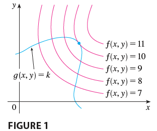
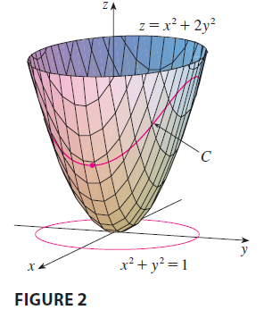
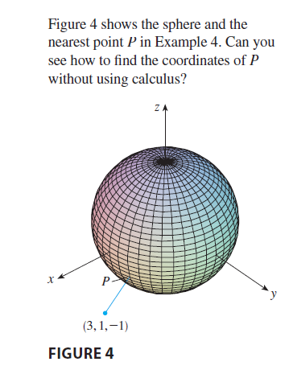
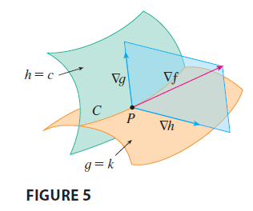
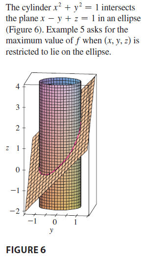

<page>

# Section Learning outcomes

- Use of Lagrange Multipliers to optimize a function over curves and surfaces

</page>

<page>

# Lagrange Multipliers Theory

In a previous example, we maximized a volume function $V = xyz$ subject to the constraint $2xz + 2yz + xy = 12$, which expressed the side condition that the surface area was 12 m$^2$. 

In this section we present Lagrange's method for maximizing or minimizing a general function $f(x, y, z)$ subject to a constraint (or side condition) of the form $g(x, y, z) = k$.

It's easier to explain the geometric basis of Lagrange's method for functions of two variables. So we start by trying to find the extreme values of $f(x, y)$ subject to a constraint of the form $g(x, y) = k$. In other words, we seek the extreme values of $f(x, y)$ when the point $(x, y)$ is restricted to lie on the level curve $g(x, y) = k$. 

Figure 1 shows this curve together with several level curves of $f$. These have the equations $f(x, y) = c$, where $c = 7, 8, 9, 10, 11$. To maximize $f(x, y)$ subject to $g(x, y) = k$ is to find the largest value of $c$ such that the level curve $f(x, y) = c$ intersects $g(x, y) = k$. It appears from Figure 1 that this happens when these curves just touch each other, that is, when they have a common tangent line. (Otherwise, the value of $c$ could be increased further.) This means that the normal lines at the point $(x_0, y_0)$ where they touch are identical. So the gradient vectors are parallel; that is, $\nabla f(x_0, y_0) = \lambda \nabla g(x_0, y_0)$ for some scalar $\lambda$.

This kind of argument also applies to the problem of finding the extreme values of $f(x, y, z)$ subject to the constraint $g(x, y, z) = k$. Thus the point $(x, y, z)$ is restricted to lie on the level surface $S$ with equation $g(x, y, z) = k$. Instead of the level curves in Figure 1, we consider the level surfaces $f(x, y, z) = c$ and argue that if the maximum value of $f$ is $f(x_0, y_0, z_0) = c$, then the level surface $f(x, y, z) = c$ is tangent to the level surface $g(x, y, z) = k$ and so the corresponding gradient vectors are parallel.

This intuitive argument can be made precise as follows. Suppose that a function $f$ has an extreme value at a point $P(x_0, y_0, z_0)$ on the surface $S$ and let $C$ be a curve with vector equation $\mathbf{r}(t) = \langle x(t), y(t), z(t) \rangle$ that lies on $S$ and passes through $P$. If $t_0$ is the parameter value corresponding to the point $P$, then $\mathbf{r}(t_0) = \langle x_0, y_0, z_0 \rangle$. The composite function $h(t) = f(x(t), y(t), z(t))$ represents the values that $f$ takes on the curve $C$. Since $f$ has an extreme value at $(x_0, y_0, z_0)$, it follows that $h$ has an extreme value at $t_0$, so $h'(t_0) = 0$. But if $f$ is differentiable, we can use the Chain Rule to write
$$
0 = h'(t_0) = f_x(x_0, y_0, z_0)x'(t_0) + f_y(x_0, y_0, z_0)y'(t_0) + f_z(x_0, y_0, z_0)z'(t_0) = \nabla f(x_0, y_0, z_0) \cdot \mathbf{r}'(t_0)
$$
This shows that the gradient vector $\nabla f(x_0, y_0, z_0)$ is orthogonal to the tangent vector $\mathbf{r}'(t_0)$ to every such curve $C$. But we already know that the gradient vector of $g$, $\nabla g(x_0, y_0, z_0)$, is also orthogonal to $\mathbf{r}'(t_0)$ for every such curve. This means that the gradient vectors $\nabla f(x_0, y_0, z_0)$ and $\nabla g(x_0, y_0, z_0)$ must be parallel. Therefore, if $\nabla g(x_0, y_0, z_0) \neq \mathbf{0}$, there is a number $\lambda$ such that
$$
\nabla f(x_0, y_0, z_0) = \lambda \nabla g(x_0, y_0, z_0)
$$
The number $\lambda$ in Equation 1 is called a **Lagrange multiplier**. The procedure is described the next page.

</page>

<page>

# Method of Lagrange Multipliers

**Method of Lagrange Multipliers** To find the maximum and minimum values of $f(x, y, z)$ subject to the constraint $g(x, y, z) = k$ [assuming that these extreme values exist and $\nabla g \neq \mathbf{0}$ on the surface $g(x, y, z) = k$]:
(a) Find all values of $x, y, z$, and $\lambda$ such that
$$
\nabla f(x, y, z) = \lambda \nabla g(x, y, z)
$$
and
$$
g(x, y, z) = k
$$
(b) Evaluate $f$ at all the points $(x, y, z)$ that result from step (a). The largest of these values is the maximum value of $f$; the smallest is the minimum value of $f$.

---

If we write the vector equation $\nabla f = \lambda \nabla g$ in terms of components, then the equations in step (a) become
$$
f_x = \lambda g_x \quad f_y = \lambda g_y \quad f_z = \lambda g_z \quad g(x, y, z) = k
$$
This is a system of four equations in the four unknowns $x, y, z$, and $\lambda$, but it is not necessary to find explicit values for $\lambda$.

For functions of two variables the method of Lagrange multipliers is similar to the method just described. To find the extreme values of $f(x, y)$ subject to the constraint $g(x, y) = k$, we look for values of $x, y$, and $\lambda$ such that
$$
\nabla f(x, y) = \lambda \nabla g(x, y) \quad \text{and} \quad g(x, y) = k
$$
This amounts to solving three equations in three unknowns:
$$
f_x = \lambda g_x \quad f_y = \lambda g_y \quad g(x, y) = k
$$

</page>

<page>

# Lagrange Multiplier - Example

**EXAMPLE 1** A rectangular box without a lid is to be made from 12 m$^2$ of cardboard. Find the maximum volume of such a box.

<ans>

**SOLUTION** As in Example 14.7.6, we let $x, y$, and $z$ be the length, width, and height, respectively, of the box in meters. Then we wish to maximize
$$
V = xyz
$$
subject to the constraint
$$
g(x, y, z) = 2xz + 2yz + xy = 12
$$
Using the method of Lagrange multipliers, we look for values of $x, y, z$, and $\lambda$ such that $\nabla V = \lambda \nabla g$ and $g(x, y, z) = 12$. This gives the equations
$$
V_x = \lambda g_x \quad V_y = \lambda g_y \quad V_z = \lambda g_z \quad 2xz + 2yz + xy = 12
$$
which become
$$
yz = \lambda(2z + y)
$$
$$
xz = \lambda(2z + x)
$$
$$
xy = \lambda(2x + 2y)
$$
$$
2xz + 2yz + xy = 12
$$
There are no general rules for solving systems of equations. Sometimes some ingenuity is required. In the present example you might notice that if we multiply (2) by $x$, (3) by $y$, and (4) by $z$, then the left sides of these equations will be identical. Doing this, we have
$$
xyz = \lambda x(2z + y)
$$
$$
xyz = \lambda y(2z + x)
$$
$$
xyz = \lambda z(2x + 2y)
$$
We observe that $\lambda \neq 0$ because $\lambda = 0$ would imply $yz = xz = xy = 0$ from (2), (3), and (4) and this would contradict (5). Therefore, from (6) and (7), we have
$$
x(2z + y) = y(2z + x) \implies 2xz + xy = 2yz + xy \implies xz = yz
$$
But $z \neq 0$ (since $z = 0$ would give $V = 0$), so $x = y$. From (7) and (8) we have
$$
y(2z + x) = z(2x + 2y) \implies 2yz + xy = 2xz + 2yz \implies xy = 2xz
$$
Since $x \neq 0$, we have $y = 2z$. If we now put $x = y = 2z$ in (5), we get
$$
(2z)(2z) + 2(2z)z + 2(2z)z = 12 \implies 4z^2 + 4z^2 + 4z^2 = 12 \implies 12z^2 = 12
$$
Since $x, y$, and $z$ are all positive, we therefore have $z = 1$ and so $x = 2$ and $y = 2$. This agrees with our answer in Section 14.7.

</ans>
</page>

<page>

# Example 2

**EXAMPLE 2** Find the extreme values of the function $f(x, y) = x^2 + 2y^2$ on the circle $x^2 + y^2 = 1$.

<ans>

**SOLUTION** We are asked for the extreme values of $f$ subject to the constraint $g(x, y) = x^2 + y^2 = 1$. Using Lagrange multipliers, we solve the equations $\nabla f = \lambda \nabla g$ and $g(x, y) = 1$, which can be written as
$$
f_x = \lambda g_x \quad f_y = \lambda g_y \quad g(x, y) = 1
$$
or as
$$
2x = 2x\lambda
$$
$$
4y = 2y\lambda
$$
$$
x^2 + y^2 = 1
$$
From (9) we have $x = 0$ or $\lambda = 1$. If $x = 0$, then (11) gives $y = \pm 1$. If $\lambda = 1$, then $y = 0$ from (10), so then (11) gives $x = \pm 1$. Therefore $f$ has possible extreme values at the points $(0, 1), (0, -1), (1, 0),$ and $(-1, 0)$. Evaluating $f$ at these four points, we find that
$$
f(0, 1) = 2 \quad f(0, -1) = 2 \quad f(1, 0) = 1 \quad f(-1, 0) = 1
$$
Therefore the maximum value of $f$ on the circle $x^2 + y^2 = 1$ is $f(0, \pm 1) = 2$ and the minimum value is $f(\pm 1, 0) = 1$.

</ans>
</page>

<page>

# Example: Optimize a function over bounded domain

**EXAMPLE 3** Find the extreme values of $f(x, y) = x^2 + 2y^2$ on the disk $x^2 + y^2 \le 1$.

<ans>

**SOLUTION** According to the procedure of Lagrange Multipliers, we compare the values of $f$ at the critical points with values at the points on the boundary. Since $f_x = 2x$ and $f_y = 4y$, the only critical point is $(0, 0)$. We compare the value of $f$ at that point with the extreme values on the boundary from Example 2:
$$
f(0, 0) = 0 \quad f(\pm 1, 0) = 1 \quad f(0, \pm 1) = 2
$$
Therefore the maximum value of $f$ on the disk $x^2 + y^2 \le 1$ is $f(0, \pm 1) = 2$ and the minimum value is $f(0, 0) = 0$.

</ans>
</page>

<page>

# Example: Optimize a function over bounded domain

**EXAMPLE 4** Find the points on the sphere $x^2 + y^2 + z^2 = 4$ that are closest to and farthest from the point $(3, 1, -1)$.

<ans>

**SOLUTION** The distance from a point $(x, y, z)$ to the point $(3, 1, -1)$ is
$$
d = \sqrt{(x - 3)^2 + (y - 1)^2 + (z + 1)^2}
$$
but the algebra is simpler if we instead maximize and minimize the square of the distance:
$$
d^2 = f(x, y, z) = (x - 3)^2 + (y - 1)^2 + (z + 1)^2
$$
The constraint is that the point $(x, y, z)$ lies on the sphere, that is,
$$
g(x, y, z) = x^2 + y^2 + z^2 = 4
$$
According to the method of Lagrange multipliers, we solve $\nabla f = \lambda \nabla g, g = 4$. This gives
$$
2(x - 3) = 2x\lambda
$$
$$
2(y - 1) = 2y\lambda
$$
$$
2(z + 1) = 2z\lambda
$$
$$
x^2 + y^2 + z^2 = 4
$$
The simplest way to solve these equations is to solve for $x, y,$ and $z$ in terms of $\lambda$ from (12), (13), and (14), and then substitute these values into (15). From (12) we have
$$
x - 3 = x\lambda \implies x(1 - \lambda) = 3 \implies x = \frac{3}{1 - \lambda}
$$
[Note that $1 - \lambda \neq 0$ because $\lambda = 1$ is impossible from (12).] Similarly, (13) and (14) give
$$
y = \frac{1}{1 - \lambda} \quad z = \frac{-1}{1 - \lambda}
$$
Therefore, from (15), we have
$$
\frac{3^2}{(1 - \lambda)^2} + \frac{1^2}{(1 - \lambda)^2} + \frac{(-1)^2}{(1 - \lambda)^2} = 4
$$
which gives $(1 - \lambda)^2 = 11/4$, $1 - \lambda = \pm \sqrt{11}/2$, so
$$
\lambda = 1 \mp \frac{\sqrt{11}}{2}
$$
These values of $\lambda$ then give the corresponding points $(x, y, z)$:
$$
\left(\frac{6}{\sqrt{11}}, \frac{2}{\sqrt{11}}, -\frac{2}{\sqrt{11}}\right) \quad \text{and} \quad \left(-\frac{6}{\sqrt{11}}, -\frac{2}{\sqrt{11}}, \frac{2}{\sqrt{11}}\right)
$$
It's easy to see that $f$ has a smaller value at the first of these points, so the closest point is $(6/\sqrt{11}, 2/\sqrt{11}, -2/\sqrt{11})$ and the farthest is $(-6/\sqrt{11}, -2/\sqrt{11}, 2/\sqrt{11})$.

</ans>
</page>

<page>

# Two constraint - Lagrange Multipliers

Suppose now that we want to find the maximum and minimum values of a function $f(x, y, z)$ subject to **two** constraints (side conditions) of the form $g(x, y, z) = k$ and $h(x, y, z) = c$. Geometrically, this means that we are looking for the extreme values of $f$ when $(x, y, z)$ is restricted to lie on the curve of intersection $C$ of the level surfaces $g(x, y, z) = k$ and $h(x, y, z) = c$. Suppose $f$ has such an extreme value at a point $P(x_0, y_0, z_0)$. We know that $\nabla f$ is orthogonal to $C$ at $P$. But we also know that $\nabla g$ and $\nabla h$ are orthogonal to $C$ at $P$. This means that the gradient vector $\nabla f(x_0, y_0, z_0)$ is in the plane determined by $\nabla g(x_0, y_0, z_0)$ and $\nabla h(x_0, y_0, z_0)$. (We assume that these gradient vectors are not zero and not parallel.) So there are numbers $\lambda$ and $\mu$ (called Lagrange multipliers) such that
$$
\nabla f(x_0, y_0, z_0) = \lambda \nabla g(x_0, y_0, z_0) + \mu \nabla h(x_0, y_0, z_0)
$$
In this case Lagrange's method is to look for extreme values by solving five equations in the five unknowns $x, y, z, \lambda,$ and $\mu$. These equations are obtained by writing Equation 16 in terms of its components and using the constraint equations:
$$
f_x = \lambda g_x + \mu h_x
$$
$$
f_y = \lambda g_y + \mu h_y
$$
$$
f_z = \lambda g_z + \mu h_z
$$
$$
g(x, y, z) = k
$$
$$
h(x, y, z) = c
$$

</page>

<page>

# Example: Two constraint Lagrange Multipliers

**EXAMPLE 5** Find the maximum value of the function $f(x, y, z) = x + 2y + 3z$ on the curve of intersection of the plane $x - y + z = 1$ and the cylinder $x^2 + y^2 = 1$.

---------------------

----------------

<ans>

**SOLUTION** We maximize the function $f(x, y, z) = x + 2y + 3z$ subject to the constraints $g(x, y, z) = x - y + z = 1$ and $h(x, y, z) = x^2 + y^2 = 1$. The Lagrange condition is $\nabla f = \lambda \nabla g + \mu \nabla h$, so we solve the equations
$$
1 = \lambda + 2x\mu
$$
$$
2 = -\lambda + 2y\mu
$$
$$
3 = \lambda
$$
$$
x - y + z = 1
$$
$$
x^2 + y^2 = 1
$$
Putting $\lambda = 3$ [from (19)] in (17), we get $2x\mu = -2$, so $x = -1/\mu$. Similarly, (18) gives $y = 5/(2\mu)$. Substitution in (21) then gives
$$
\frac{1}{\mu^2} + \frac{25}{4\mu^2} = 1
$$
and so $\mu^2 = 29/4$, $\mu = \pm \sqrt{29}/2$. Then $x = \mp 2/\sqrt{29}$, $y = \pm 5/\sqrt{29}$, and, from (20), $z = 1 - x + y = 1 \mp (-2/\sqrt{29}) + (\pm 5/\sqrt{29}) = 1 \pm 7/\sqrt{29}$. The corresponding values of $f$ are
$$
\left(\mp \frac{2}{\sqrt{29}}\right) + 2\left(\pm \frac{5}{\sqrt{29}}\right) + 3\left(1 \pm \frac{7}{\sqrt{29}}\right) = 3 \pm \sqrt{29}
$$
Therefore the maximum value of $f$ on the given curve is $3 + \sqrt{29}$.

</ans>

</page>