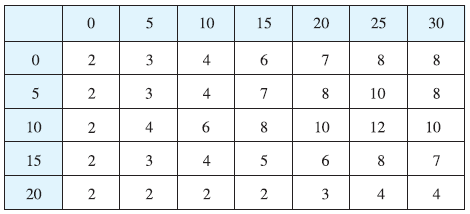
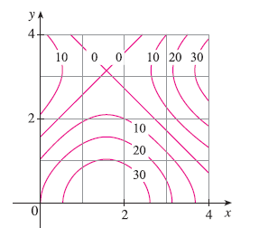

<page>

# Exercise 1

(a) Estimate the volume of the solid that lies below the surface $z = xy$ and above the rectangle $R = \{(x, y) | 0 \le x \le 6, 0 \le y \le 4\}$. Use a Riemann sum with $m = 3$, $n = 2$, and take the sample point to be the upper right corner of each square.
(b) Use the Midpoint Rule to estimate the volume of the solid in part (a).

</page>
<page>

# Exercise 2

If $R = [0, 4] \times [-1, 2]$, use a Riemann sum with $m = 2$, $n = 3$ to estimate the value of $\iint_R (1 - xy^2) dA$. Take the sample points to be (a) the lower right corners and (b) the upper left corners of the rectangles.

</page>
<page>

# Exercise 3

(a) Use a Riemann sum with $m = n = 2$ to estimate the value of $\iint_R xe^{-xy} dA$, where $R = [0, 2] \times [0, 1]$. Take the sample points to be upper right corners.
(b) Use the Midpoint Rule to estimate the integral in part (a).

</page>
<page>

# Exercise 4

(a) Estimate the volume of the solid that lies below the surface $z = 1 + x^2 + 3y$ and above the rectangle $R = [1, 2] \times [0, 3]$. Use a Riemann sum with $m = n = 2$ and choose the sample points to be lower left corners.
(b) Use the Midpoint Rule to estimate the volume in part (a).

</page>
<page>

# Exercise 5

Let V be the volume of the solid that lies under the graph of $f(x, y) = \sqrt{52 - x^2 - y^2}$ and above the rectangle given by $2 \le x \le 4$, $2 \le y \le 6$. Use the lines $x = 3$ and $y = 4$ to divide R into subrectangles. Let L and U be the Riemann sums computed using lower left corners and upper right corners, respectively. Without calculating the numbers V, L, and U, arrange them in increasing order and explain your reasoning.

</page>
<page>

# Exercise 6

A 20-ft-by-30-ft swimming pool is filled with water. The depth is measured at 5-ft intervals, starting at one corner of the pool, and the values are recorded in the table. Estimate the volume of water in the pool.

</page>
<page>

# Exercise 7

A contour map is shown for a function $f$ on the square $R = [0, 4] \times [0, 4]$.
(a) Use the Midpoint Rule with $m = n = 2$ to estimate the value of $\iint_R f(x, y) dA$.
(b) Estimate the average value of $f$.

</page>
<page>

# Exercise 8

The contour map shows the temperature, in degrees Fahrenheit, at 4:00 PM on February 26, 2007, in Colorado. (The state measures 388 mi west to east and 276 mi south to north.) Use the Midpoint Rule with $m = n = 4$ to estimate the average temperature in Colorado at that time.

</page>
<page>

# Exercise 9

Evaluate the double integral $\iint_R \sqrt{2} dA$, where $R = \{(x, y) | 2 \le x \le 6, -1 \le y \le 5\}$ by first identifying it as the volume of a solid.

</page>
<page>

# Exercise 10

Evaluate the double integral $\iint_R (2x + 1) dA$, where $R = \{(x, y) | 0 \le x \le 2, 0 \le y \le 4\}$ by first identifying it as the volume of a solid.

</page>
<page>

# Exercise 11

Evaluate the double integral $\iint_R (4 - 2y) dA$, where $R = [0, 1] \times [0, 1]$ by first identifying it as the volume of a solid.

</page>
<page>

# Exercise 12

The integral $\iint_R \sqrt{9 - y^2} dA$, where $R = [0, 4] \times [0, 2]$, represents the volume of a solid. Sketch the solid.

</page>
<page>

# Exercise 13

Find $\int_0^5 f(x, y) dx$ and $\int_0^1 f(x, y) dy$ for $f(x, y) = x + 3x^2y^2$.

</page>
<page>

# Exercise 14

Find $\int_0^5 f(x, y) dx$ and $\int_0^1 f(x, y) dy$ for $f(x, y) = y\sqrt{x} + 2$.

</page>
<page>

# Exercise 15

Calculate the iterated integral $\int_1^4 \int_0^2 (6x^2y - 2x) dy dx$.

</page>
<page>

# Exercise 16

Calculate the iterated integral $\int_0^1 \int_1^2 (x + e^{-y})^2 dx dy$.

</page>
<page>

# Exercise 17

Calculate the iterated integral $\int_0^1 \int_0^1 (x + e^y) dx dy$.

</page>
<page>

# Exercise 18

Calculate the iterated integral $\int_0^{\pi/6} \int_0^{\pi/2} (\sin x + \sin y) dy dx$.

</page>
<page>

# Exercise 19

Calculate the iterated integral $\int_0^3 \int_{-2}^0 (y^2 + y^3 \cos x) dx dy$.

</page>
<page>

# Exercise 20

Calculate the iterated integral $\int_1^4 \int_1^2 (\frac{x}{y} + \frac{y}{x}) dy dx$.

</page>
<page>

# Exercise 21

Calculate the iterated integral $\int_1^2 \int_0^1 \frac{x}{y} dy dx$.

</page>
<page>

# Exercise 22

Calculate the iterated integral $\int_0^1 \int_0^1 ye^{xy} dx dy$.

</page>
<page>

# Exercise 23

Calculate the iterated integral $\int_0^{\pi/2} \int_0^{\pi/2} \sin \theta \cos \phi d\theta d\phi$.

</page>
<page>

# Exercise 24

Calculate the iterated integral $\int_0^1 \int_0^1 xy\sqrt{x^2 + y^2} dy dx$.

</page>
<page>

# Exercise 25

Calculate the iterated integral $\int_0^1 \int_0^1 \sqrt{u + v^2} du dv$.

</page>
<page>

# Exercise 26

Calculate the iterated integral $\int_0^1 \int_0^1 \frac{1}{\sqrt{s+t}} ds dt$.

</page>
<page>

# Exercise 27

Calculate the double integral $\iint_R x \sec^2 y dA$, where $R = \{(x, y) | 0 \le x \le 2, 0 \le y \le \pi/4\}$.

</page>
<page>

# Exercise 28

Calculate the double integral $\iint_R (y + xy^{-2}) dA$, where $R = \{(x, y) | 0 \le x \le 2, 1 \le y \le 2\}$.

</page>
<page>

# Exercise 29

Calculate the double integral $\iint_R \frac{xy^2}{x^2 + 1} dA$, where $R = \{(x, y) | 0 \le x \le 1, -3 \le y \le 3\}$.

</page>
<page>

# Exercise 30

Calculate the double integral $\iint_R \frac{\tan \theta}{\sqrt{1 - t^2}} dA$, where $R = \{(\theta, t) | 0 \le \theta \le \pi/3, 0 \le t \le 1/2\}$.

</page>
<page>

# Exercise 31

Calculate the double integral $\iint_R x \sin(x + y) dA$, where $R = [0, \pi/6] \times [0, \pi/3]$.

</page>
<page>

# Exercise 32

Calculate the double integral $\iint_R \frac{x}{1 + xy} dA$, where $R = [0, 1] \times [0, 1]$.

</page>
<page>

# Exercise 33

Calculate the double integral $\iint_R ye^{xy} dA$, where $R = [0, 2] \times [0, 3]$.

</page>
<page>

# Exercise 34

Calculate the double integral $\iint_R \frac{1}{1 + x + y} dA$, where $R = [1, 3] \times [1, 2]$.

</page>
<page>

# Exercise 35

Sketch the solid whose volume is given by the iterated integral $\int_0^1 \int_0^1 (4 - x - 2y) dx dy$.

</page>
<page>

# Exercise 36

Sketch the solid whose volume is given by the iterated integral $\int_0^1 \int_0^1 (2 - x^2 - y^2) dy dx$.

</page>
<page>

# Exercise 37

Find the volume of the solid that lies under the plane $4x + 6y - 2z + 15 = 0$ and above the rectangle $R = \{(x, y) | -1 \le x \le 2, -1 \le y \le 1\}$.

</page>
<page>

# Exercise 38

Find the volume of the solid that lies under the hyperbolic paraboloid $z = 3y^2 - x^2 + 2$ and above the rectangle $R = [-1, 1] \times [1, 2]$.

</page>
<page>

# Exercise 39

Find the volume of the solid lying under the elliptic paraboloid $x^2/4 + y^2/9 + z = 1$ and above the rectangle $R = [-1, 1] \times [-2, 2]$.

</page>
<page>

# Exercise 40

Find the volume of the solid enclosed by the surface $z = x^2 + xy^2$ and the planes $z = 0, x = 0, x = 5,$ and $y = \pm 2$.

</page>
<page>

# Exercise 41

Find the volume of the solid enclosed by the surface $z = 1 + e^x \sin y$ and the planes $z = 0, x = \pm 1, y = 0,$ and $y = \pi$.

</page>
<page>

# Exercise 42

Find the volume of the solid in the first octant bounded by the cylinder $z = 16 - x^2$ and the plane $y = 5$.

</page>
<page>

# Exercise 43

Find the volume of the solid enclosed by the paraboloid $z = 2 + x^2 + (y - 2)^2$ and the planes $z = 1, x = 1, x = -1, y = 0,$ and $y = 4$.

</page>
<page>

# Exercise 44

Graph the solid that lies between the surface $z = 2xy/(x^2 + 1)$ and the plane $z = x + 2y$ and is bounded by the planes $x = 0, x = 2, y = 0,$ and $y = 4$. Then find its volume.

</page>
<page>

# Exercise 45

Use a computer algebra system to find the exact value of the integral $\iint_R x^5y^3e^{xy} dA$, where $R = [0, 1] \times [0, 1]$. Then use the CAS to draw the solid whose volume is given by the integral.

</page>
<page>

# Exercise 46

Graph the solid that lies between the surfaces $z = e^{-x^2} \cos(x^2 + y^2)$ and $z = 2 - x^2 - y^2$ for $|x| \le 1, |y| \le 1$. Use a computer algebra system to approximate the volume of this solid correct to four decimal places.

</page>
<page>

# Exercise 47

Find the average value of $f(x, y) = x^2y$ over the rectangle R with vertices $(-1, 0), (-1, 5), (1, 5), (1, 0)$.

</page>
<page>

# Exercise 48

Find the average value of $f(x, y) = e^y\sqrt{x + e^y}$ over the rectangle $R = [0, 4] \times [0, 1]$.

</page>
<page>

# Exercise 49

Use symmetry to evaluate the double integral $\iint_R \frac{xy}{1 + x^4} dA$, where $R = \{(x, y) | -1 \le x \le 1, 0 \le y \le 1\}$.

</page>
<page>

# Exercise 50

Use symmetry to evaluate the double integral $\iint_R (1 + x^2 \sin y + y^2 \sin x) dA$, where $R = [-\pi, \pi] \times [-\pi, \pi]$.

</page>
<page>

# Exercise 51

Use a CAS to compute the iterated integrals
$\int_0^1 \int_0^1 \frac{x - y}{(x + y)^3} dy dx$ and $\int_0^1 \int_0^1 \frac{x - y}{(x + y)^3} dx dy$.
Do the answers contradict Fubini’s Theorem? Explain what is happening.

</page>
<page>

# Exercise 52

(a) In what way are the theorems of Fubini and Clairaut similar?
(b) If $f(x, y)$ is continuous on $[a, b] \times [c, d]$ and
$g(x, y) = \int_a^x \int_c^y f(s, t) dt ds$
for $a < x < b, c < y < d$, show that $g_{xy} = g_{yx} = f(x, y)$.

</page>
