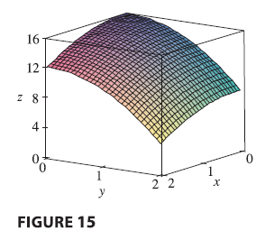

<page>

# Multiple Integrals Learning Outcomes

- Multiple variable integration

</page>

<page>

# Review of the Definite Integral in One variable

First let’s recall the basic facts concerning definite integrals of functions of a single variable. If $f(x)$ is defined for $a \le x \le b$, we start by dividing the interval $[a, b]$ into $n$ subintervals $[x_{i-1}, x_i]$ of equal width $\Delta x = (b - a)/n$ and we choose sample points $x_i^*$ in these subintervals. Then we form the Riemann sum
$$
\sum_{i=1}^{n} f(x_i^*) \Delta x
\tag{1}
$$
and take the limit of such sums as $n \to \infty$ to obtain the definite integral of $f$ from $a$ to $b$:

$$
\int_a^b f(x) dx = \lim_{n \to \infty} \sum_{i=1}^{n} f(x_i^*) \Delta x
\tag{2}
$$ 
In the special case where $f(x) \ge 0$, the Riemann sum can be interpreted as the sum of the areas of the approximating rectangles in Figure 1, and $\int_a^b f(x) dx$ represents the area under the curve $y = f(x)$ from $a$ to $b$.

</page>

<page>

# Volumes and Double Integrals

We consider a function $f$ of two variables defined on a closed rectangle
$$
R = [a, b] \times [c, d] = \{(x, y) \in \mathbb{R}^2 | a \le x \le b, c \le y \le d\}
$$
and we first suppose that $f(x, y) \ge 0$. The graph of $f$ is a surface with equation $z = f(x, y)$. 

Let $S$ be the solid that lies above $R$ and under the graph of $f$, that is,
$$
S = \{(x, y, z) \in \mathbb{R}^3 | 0 \le z \le f(x, y), (x, y) \in R\}
$$
(See Figure 2.) Our goal is to find the volume of $S$.

The first step is to divide the rectangle $R$ into subrectangles. We accomplish this by dividing the interval $[a, b]$ into $m$ subintervals $[x_{i-1}, x_i]$ of equal width $\Delta x = (b - a)/m$ and dividing $[c, d]$ into $n$ subintervals $[y_{j-1}, y_j]$ of equal width $\Delta y = (d - c)/n$. By drawing lines parallel to the coordinate axes through the endpoints of these subintervals, as in Figure 3, we form the subrectangles

$$
R_{ij} = [x_{i-1}, x_i] \times [y_{j-1}, y_j] = \{(x, y) | x_{i-1} \le x \le x_i, y_{j-1} \le y \le y_j\}
$$
each with area $\Delta A = \Delta x \Delta y$.

If we choose a sample point $(x_{ij}^*, y_{ij}^*)$ in each $R_{ij}$, then we can approximate the part of $S$ that lies above each $R_{ij}$ by a thin rectangular box (or “column”) with base $R_{ij}$ and height $f(x_{ij}^*, y_{ij}^*)$ as shown in Figure 4. The volume of this box is the height of the box times the area of the base rectangle:
$$
f(x_{ij}^*, y_{ij}^*) \Delta A
$$

If we follow this procedure for all the rectangles and add the volumes of the corresponding boxes, we get an approximation to the total volume of $S$:

$$ \tag{3}
V \approx \sum_{i=1}^{m} \sum_{j=1}^{n} f(x_{ij}^*, y_{ij}^*) \Delta A
$$

(See Figure 5.) This double sum means that for each subrectangle we evaluate $f$ at the chosen point and multiply by the area of the subrectangle, and then we add the results.

Our intuition tells us that the approximation given in (Eq 3) becomes better as $m$ and $n$ become larger and so we would expect that

$$ \tag{4}
V = \lim_{m, n \to \infty} \sum_{i=1}^{m} \sum_{j=1}^{n} f(x_{ij}^*, y_{ij}^*) \Delta A
$$

We use the expression in Equation (4) to define the volume of the solid $S$ that lies under the graph of $f$ and above the rectangle $R$.

This dicussion leads to the following definition.

**Definition** The **double integral** of $f$ over the rectangle $R$ is
$$ \tag{5}
\iint_R f(x, y) dA = \lim_{m, n \to \infty} \sum_{i=1}^{m} \sum_{j=1}^{n} f(x_{ij}^*, y_{ij}^*) \Delta A
$$
if this limit exists.

---

The precise meaning of the limit in Definition 5 is that for every number $\varepsilon > 0$ there is an integer $N$ such that
$$
\left| \iint_R f(x, y) dA - \sum_{i=1}^{m} \sum_{j=1}^{n} f(x_{ij}^*, y_{ij}^*) \Delta A \right| < \varepsilon
$$
for all integers $m$ and $n$ greater than $N$ and for any choice of sample points $(x_{ij}^*, y_{ij}^*)$ in $R_{ij}$.

----

A function $f$ is called **integrable** if the limit in Definition exists. 

- It is shown in courses on advanced calculus that all continuous functions are integrable. In fact, the double integral of $f$ exists provided that $f$ is “not too discontinuous.” In particular, if $f$ is bounded on $R$, [that is, there is a constant $M$ such that $|f(x, y)| \le M$ for all $(x, y)$ in $R$], and $f$ is continuous there, except on a finite number of smooth curves, then $f$ is integrable over $R$.

The sample point $(x_{ij}^*, y_{ij}^*)$ can be chosen to be any point in the subrectangle $R_{ij}$, but if we choose it to be the upper right-hand corner of $R_{ij}$ [namely $(x_i, y_j)$, see Figure 3], then the expression for the double integral looks simpler:

$$ \tag{6}
\iint_R f(x, y) dA = \lim_{m, n \to \infty} \sum_{i=1}^{m} \sum_{j=1}^{n} f(x_i, y_j) \Delta A
$$

-----

We see that a volume can be written as a double integral:

If $f(x, y) \ge 0$, then the volume $V$ of the solid that lies above the rectangle $R$ and below the surface $z = f(x, y)$ is
$$
V = \iint_R f(x, y) dA
$$

The sum in Definition 5,
$$
\sum_{i=1}^{m} \sum_{j=1}^{n} f(x_{ij}^*, y_{ij}^*) \Delta A
$$
is called a **double Riemann sum** and is used as an approximation to the value of the double integral. If $f$ happens to be a positive function, then the double Riemann sum represents the sum of volumes of columns, as in Figure 5, and is an approximation to the volume under the graph of $f$.

---------

</page>

</page>

# Example

**EXAMPLE 1** Estimate the volume of the solid that lies above the square $R = [0, 2] \times [0, 2]$ and below the elliptic paraboloid $z = 16 - x^2 - 2y^2$. Divide $R$ into four equal squares and choose the sample point to be the upper right corner of each square $R_{ij}$. Sketch the solid and the approximating rectangular boxes.

<ans>

**SOLUTION** The squares are shown in Figure 6. The paraboloid is the graph of $f(x, y) = 16 - x^2 - 2y^2$ and the area of each square is $\Delta A = 1$. Approximating the volume by the Riemann sum with $m = n = 2$, we have
$$
V \approx \sum_{i=1}^{2} \sum_{j=1}^{2} f(x_i, y_j) \Delta A = f(1, 1)\Delta A + f(1, 2)\Delta A + f(2, 1)\Delta A + f(2, 2)\Delta A
$$
$$
= 13(1) + 7(1) + 10(1) + 4(1) = 34
$$
This is the volume of the approximating rectangular boxes shown in Figure 7.

We get better approximations to the volume in Example 1 if we increase the number of squares. Figure 8 shows how the columns start to look more like the actual solid and the corresponding approximations become more accurate when we use 16, 64, and 256 squares. In Example 7 we will be able to show that the exact volume is 48.

</ans>
</page>

<page>

# Example

**EXAMPLE 2** If $R = \{(x, y) | -1 \le x \le 1, -2 \le y \le 2\}$, evaluate the integral $\iint_R \sqrt{1 - x^2} dA$.

<ans>

**SOLUTION** It would be very difficult to evaluate this integral directly from Definition 5 but, because $\sqrt{1 - x^2} \ge 0$, we can compute the integral by interpreting it as a volume. If $z = \sqrt{1 - x^2}$, then $x^2 + z^2 = 1$ and $z \ge 0$, so the given double integral represents the volume of the solid $S$ that lies below the circular cylinder $x^2 + z^2 = 1$ and above the rectangle $R$. The volume of $S$ is the area of a semicircle with radius 1 times the length of the cylinder. Thus
$$
\iint_R \sqrt{1 - x^2} dA = \frac{1}{2}\pi(1)^2 \times 4 = 2\pi
$$

</ans>
</page>

<page>

# The Midpoint Rule

The methods that we used for approximating single integrals (the Midpoint Rule, the Trapezoidal Rule, Simpson’s Rule) all have counterparts for double integrals. Here we consider only the Midpoint Rule for double integrals. This means that we use a double Riemann sum to approximate the double integral, where the sample point $(x_{ij}^*, y_{ij}^*)$ in $R_{ij}$ is chosen to be the center $(\bar{x}_i, \bar{y}_j)$ of $R_{ij}$. In other words, $\bar{x}_i$ is the midpoint of $[x_{i-1}, x_i]$ and $\bar{y}_j$ is the midpoint of $[y_{j-1}, y_j]$.

---
**Midpoint Rule for Double Integrals**
$$
\iint_R f(x, y) dA \approx \sum_{i=1}^{m} \sum_{j=1}^{n} f(\bar{x}_i, \bar{y}_j) \Delta A
$$
where $\bar{x}_i$ is the midpoint of $[x_{i-1}, x_i]$ and $\bar{y}_j$ is the midpoint of $[y_{j-1}, y_j]$.

</page>

<page>

# Example: midpoint rule

**EXAMPLE 3** Use the Midpoint Rule with $m = n = 2$ to estimate the value of the integral $\iint_R (x - 3y^2) dA$, where $R = \{(x, y) | 0 \le x \le 2, 1 \le y \le 2\}$.

<ans>

**SOLUTION** In using the Midpoint Rule with $m = n = 2$, we evaluate $f(x, y) = x - 3y^2$ at the centers of the four subrectangles shown in Figure 10. So $\bar{x}_1 = 1/2, \bar{x}_2 = 3/2, \bar{y}_1 = 5/4,$ and $\bar{y}_2 = 7/4$. The area of each subrectangle is $\Delta A = 1/2$. Thus
$$
\iint_R (x - 3y^2) dA \approx \sum_{i=1}^{2} \sum_{j=1}^{2} f(\bar{x}_i, \bar{y}_j) \Delta A
$$
$$
= f(\bar{x}_1, \bar{y}_1)\Delta A + f(\bar{x}_1, \bar{y}_2)\Delta A + f(\bar{x}_2, \bar{y}_1)\Delta A + f(\bar{x}_2, \bar{y}_2)\Delta A
$$
$$
= f(1/2, 5/4)\Delta A + f(1/2, 7/4)\Delta A + f(3/2, 5/4)\Delta A + f(3/2, 7/4)\Delta A
$$
$$
= \left(-\frac{67}{16}\right)\frac{1}{2} + \left(-\frac{139}{16}\right)\frac{1}{2} + \left(-\frac{51}{16}\right)\frac{1}{2} + \left(-\frac{123}{16}\right)\frac{1}{2} = -\frac{1}{32}(67+139+51+123) = -\frac{380}{32} = -11.875
$$
Thus we have
$$
\iint_R (x - 3y^2) dA \approx -11.875
$$

</ans>
</page>

<page>

# Iterated Integrals

Recall that it is usually difficult to evaluate single integrals directly from the definition of an integral, but the Fundamental Theorem of Calculus provides a much easier method. The evaluation of double integrals from first principles is even more difficult, but here we see how to express a double integral as an **iterated integral**, which can then be evaluated by calculating two single integrals.

Suppose that $f$ is a function of two variables that is integrable on the rectangle $R = [a, b] \times [c, d]$. We use the notation $\int_c^d f(x, y) dy$ to mean that $x$ is held fixed and $f(x, y)$ is integrated with respect to $y$ from $y = c$ to $y = d$. This procedure is called **partial integration with respect to y**. Now $\int_c^d f(x, y) dy$ is a number that depends on the value of $x$, so it defines a function of $x$:
$$
A(x) = \int_c^d f(x, y) dy
$$
If we now integrate the function $A$ with respect to $x$ from $x = a$ to $x = b$, we get

$$ \tag{7}
\int_a^b A(x) dx = \int_a^b \left[ \int_c^d f(x, y) dy \right] dx
$$

The integral on the right side of Equation (7)) is called an **iterated integral**. Usually the brackets are omitted. Thus

$$ \tag{8}
\int_a^b \int_c^d f(x, y) dy dx = \int_a^b \left[ \int_c^d f(x, y) dy \right] dx
$$
means that we first integrate with respect to $y$ from $c$ to $d$ and then with respect to $x$ from $a$ to $b$.

--------

Similarly, the iterated integral
$$ \tag{eq:9}
\int_c^d \int_a^b f(x, y) dx dy = \int_c^d \left[ \int_a^b f(x, y) dx \right] dy
$$
means that we first integrate with respect to $x$ (holding $y$ fixed) from $x = a$ to $x = b$ and then we integrate the resulting function of $y$ with respect to $y$ from $y = c$ to $y = d$.

Notice that in both Equations (8) and (9) we work from the inside out.

</page>

<page>

# Example - Iterated Integrals

**EXAMPLE 4** Evaluate the iterated integrals.
(a) $\int_0^3 \int_1^2 x^2y dy dx$
(b) $\int_1^2 \int_0^3 x^2y dx dy$

<ans>

**SOLUTION**
(a) Regarding $x$ as a constant, we obtain
$$
\int_1^2 x^2y dy = \left[ x^2 \frac{y^2}{2} \right]_{y=1}^{y=2} = x^2\left(\frac{2^2}{2}\right) - x^2\left(\frac{1^2}{2}\right) = \frac{3}{2}x^2
$$
Thus the function $A$ in the preceding discussion is given by $A(x) = \frac{3}{2}x^2$ in this example. We now integrate this function of $x$ from 0 to 3:
$$
\int_0^3 \int_1^2 x^2y dy dx = \int_0^3 \left[ \int_1^2 x^2y dy \right] dx = \int_0^3 \frac{3}{2}x^2 dx = \frac{3}{2} \left[ \frac{x^3}{3} \right]_0^3 = \frac{3}{2} \frac{27}{3} = \frac{27}{2}
$$
(b) Here we first integrate with respect to $x$:
$$
\int_1^2 \int_0^3 x^2y dx dy = \int_1^2 \left[ \int_0^3 x^2y dx \right] dy = \int_1^2 \left[ \frac{x^3}{3}y \right]_{x=0}^{x=3} dy = \int_1^2 9y dy = 9 \left[ \frac{y^2}{2} \right]_1^2 = \frac{27}{2}
$$

Notice that in Example 4 we obtained the same answer whether we integrated with respect to $y$ or $x$ first. In general, it turns out (see Theorem 10) that the two iterated integrals in Equations (\ref{eq:8}) and (\ref{eq:9}) are always equal; that is, the order of integration does not matter.

</ans>

</page>

<page>

# Fubini's Theorem

The following theorem gives a practical method for evaluating a double integral by expressing it as an iterated integral (in either order).

**10 Fubini’s Theorem** If $f$ is continuous on the rectangle $R = \{(x, y) | a \le x \le b, c \le y \le d\}$, then
$$
\iint_R f(x, y) dA = \int_a^b \int_c^d f(x, y) dy dx = \int_c^d \int_a^b f(x, y) dx dy
$$
More generally, this is true if we assume that $f$ is bounded on $R$, $f$ is discontinuous only on a finite number of smooth curves, and the iterated integrals exist.

</page>

<page>

# More Example

**EXAMPLE 5** Evaluate the double integral $\iint_R (x - 3y^2) dA$, where $R = \{(x, y) | 0 \le x \le 2, 1 \le y \le 2\}$.

<ans>

**SOLUTION 1** Fubini’s Theorem gives
$$
\iint_R (x - 3y^2) dA = \int_0^2 \int_1^2 (x - 3y^2) dy dx = \int_0^2 [xy - y^3]_{y=1}^{y=2} dx
$$
$$
= \int_0^2 (2x - 8) - (x - 1) dx = \int_0^2 (x - 7) dx = \left[ \frac{x^2}{2} - 7x \right]_0^2 = 2 - 14 = -12
$$
**SOLUTION 2** Again applying Fubini’s Theorem, but this time integrating with respect to $x$ first, we have
$$
\iint_R (x - 3y^2) dA = \int_1^2 \int_0^2 (x - 3y^2) dx dy = \int_1^2 \left[ \frac{x^2}{2} - 3xy^2 \right]_{x=0}^{x=2} dy
$$
$$
= \int_1^2 (2 - 6y^2) dy = \left[ 2y - 2y^3 \right]_1^2 = (4 - 16) - (2 - 2) = -12
$$

</ans>

</page>

<page>

# Example

**EXAMPLE 6** Evaluate $\iint_R y \sin(xy) dA$, where $R = [1, 2] \times [0, \pi]$.

<ans>

**SOLUTION** If we first integrate with respect to $x$, we get
$$
\iint_R y \sin(xy) dA = \int_0^\pi \int_1^2 y \sin(xy) dx dy = \int_0^\pi [-\cos(xy)]_{x=1}^{x=2} dy
$$
$$
= \int_0^\pi (-\cos 2y + \cos y) dy = \left[ -\frac{1}{2}\sin 2y + \sin y \right]_0^\pi = 0
$$
NOTE If we reverse the order of integration and first integrate with respect to $y$ in Example 6, we get
$$
\iint_R y \sin(xy) dA = \int_1^2 \int_0^\pi y \sin(xy) dy dx
$$
but this order of integration is much more difficult than the method given in the example because it involves integration by parts twice. Therefore, when we evaluate double integrals it is wise to choose the order of integration that gives simpler integrals.

</ans>

</page>

<page>

# Example 

**EXAMPLE 7** Find the volume of the solid $S$ that is bounded by the elliptic paraboloid $x^2 + 2y^2 + z = 16$, the planes $x = 2$ and $y = 2$, and the three coordinate planes.

<ans>

**SOLUTION** We first observe that $S$ is the solid that lies under the surface $z = 16 - x^2 - 2y^2$ and above the square $R = [0, 2] \times [0, 2]$. This solid was considered in Example 1, but we are now in a position to evaluate the double integral using Fubini’s Theorem. Therefore
$$
V = \iint_R (16 - x^2 - 2y^2) dA = \int_0^2 \int_0^2 (16 - x^2 - 2y^2) dy dx
$$
$$
= \int_0^2 \left[ 16y - x^2y - \frac{2}{3}y^3 \right]_{y=0}^{y=2} dx = \int_0^2 \left( 32 - 2x^2 - \frac{16}{3} \right) dx
$$
$$
= \int_0^2 \left( \frac{80}{3} - 2x^2 \right) dx = \left[ \frac{80}{3}x - \frac{2}{3}x^3 \right]_0^2 = \frac{160}{3} - \frac{16}{3} = \frac{144}{3} = 48
$$

In the special case where $f(x, y)$ can be factored as the product of a function of $x$ only and a function of $y$ only, the double integral of $f$ can be written in a particularly simple form. To be specific, suppose that $f(x, y) = g(x)h(y)$ and $R = [a, b] \times [c, d]$. Then Fubini’s Theorem gives
$$
\iint_R f(x, y) dA = \int_c^d \int_a^b g(x)h(y) dx dy = \int_c^d \left[ \int_a^b g(x)h(y) dx \right] dy
$$
In the inner integral, $y$ is a constant, so $h(y)$ is a constant and we can write
$$
\int_a^b g(x)h(y) dx = h(y) \int_a^b g(x) dx
$$
since $\int_a^b g(x) dx$ is a constant. Therefore, in this case the double integral of $f$ can be written as the product of two single integrals:
$$ \tag{eq:11}
\iint_R g(x)h(y) dA = \left( \int_a^b g(x) dx \right) \left( \int_c^d h(y) dy \right) \quad \text{where } R = [a, b] \times [c, d]
$$

</ans>
</page>

<page>

<page>

# Average Value

Recall from one variable calculs that the average value of a functio $f$ of one variable defined on an interval $[a, b]$ is
$$
f_{ave} = \frac{1}{b-a} \int_a^b f(x) dx
$$
In a similar fashion we define the **average value** of a function $f$ of two variables defined on a rectangle $R$ to be
$$
f_{ave} = \frac{1}{A(R)} \iint_R f(x, y) dA
$$
where $A(R)$ is the area of $R$.
If $f(x, y) \ge 0$, the equation
$$
A(R) \times f_{ave} = \iint_R f(x, y) dA
$$
says that the box with base $R$ and height $f_{ave}$ has the same volume as the solid that lies under the graph of $f$.

</page>

