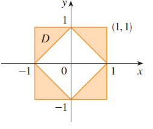
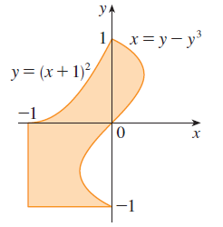

<page>

# Exercise 1

Evaluate the iterated integral $\int_0^3 \int_0^1 (8x - 2y) dy dx$.

</page>
<page>

# Exercise 2

Evaluate the iterated integral $\int_0^2 \int_0^4 x^2y dx dy$.

</page>
<page>

# Exercise 3

Evaluate the iterated integral $\int_0^1 \int_0^1 xe^{y^2} dx dy$.

</page>
<page>

# Exercise 4

Evaluate the iterated integral $\int_0^{\pi/2} \int_0^{1/2} x \sin y dy dx$.

</page>
<page>

# Exercise 5

Evaluate the iterated integral $\int_0^1 \int_0^1 \cos(s^3) dt ds$.

</page>
<page>

# Exercise 6

Evaluate the iterated integral $\int_0^1 \int_0^1 \sqrt{1 + e^v} dw dv$.

</page>
<page>

# Exercise 7

Evaluate the double integral $\iint_D \frac{y}{x^2 + 1} dA$, where $D = \{(x, y) | 0 \le x \le 4, 0 \le y \le \sqrt{x}\}$.

</page>
<page>

# Exercise 8

Evaluate the double integral $\iint_D (2x + y) dA$, where $D = \{(x, y) | 1 \le y \le 2, y - 1 \le x \le 1\}$.

</page>
<page>

# Exercise 9

Evaluate the double integral $\iint_D e^{-y^2} dA$, where $D = \{(x, y) | 0 \le y \le 3, 0 \le x \le y\}$.

</page>
<page>

# Exercise 10

Evaluate the double integral $\iint_D y\sqrt{x^2 - y^2} dA$, where $D = \{(x, y) | 0 \le x \le 2, 0 \le y \le x\}$.

</page>
<page>

# Exercise 11

Draw an example of a region that is
(a) type I but not type II
(b) type II but not type I

</page>
<page>

# Exercise 12

Draw an example of a region that is
(a) both type I and type II
(b) neither type I nor type II

</page>
<page>

# Exercise 13

Express $D$ as a region of type I and also as a region of type II. Then evaluate the double integral $\iint_D x dA$ in two ways, where $D$ is enclosed by the lines $y = x, y = 0, x = 1$.

</page>
<page>

# Exercise 14

Express $D$ as a region of type I and also as a region of type II. Then evaluate the double integral $\iint_D xy dA$ in two ways, where $D$ is enclosed by the curves $y = \sqrt{x}, y = 3x$.

</page>
<page>

# Exercise 15

Set up iterated integrals for both orders of integration. Then evaluate the double integral $\iint_D y dA$ using the easier order and explain why it's easier, where $D$ is bounded by $y = x - 2, x = y^2$.

</page>
<page>

# Exercise 16

Set up iterated integrals for both orders of integration. Then evaluate the double integral $\iint_D y^2e^{xy} dA$ using the easier order and explain why it's easier, where $D$ is bounded by $y = x, y = 4, x = 0$.

</page>
<page>

# Exercise 17

Evaluate the double integral $\iint_D x \cos y dA$, where $D$ is bounded by $y = 0, y = x^2, x = 1$.

</page>
<page>

# Exercise 18

Evaluate the double integral $\iint_D (x^2 + 2y) dA$, where $D$ is bounded by $y = x, y = x^3, x \ge 0$.

</page>
<page>

# Exercise 19

Evaluate the double integral $\iint_D y^2 dA$, where $D$ is the triangular region with vertices $(0, 1), (1, 2), (4, 1)$.

</page>
<page>

# Exercise 20

Evaluate the double integral $\iint_D xy dA$, where $D$ is enclosed by the quarter-circle $y = \sqrt{1 - x^2}, x \ge 0$, and the axes.

</page>
<page>

# Exercise 21

Evaluate the double integral $\iint_D (2x - y) dA$, where $D$ is bounded by the circle with center the origin and radius 2.

</page>
<page>

# Exercise 22

Evaluate the double integral $\iint_D y dA$, where $D$ is the triangular region with vertices $(0, 0), (1, 1),$ and $(4, 0)$.

</page>
<page>

# Exercise 23

Find the volume of the solid under the plane $3x + 2y - z = 0$ and above the region enclosed by the parabolas $y = x^2$ and $x = y^2$.

</page>
<page>

# Exercise 24

Find the volume of the solid under the surface $z = 1 + x^2y^2$ and above the region enclosed by $x = y^2$ and $x = 4$.

</page>
<page>

# Exercise 25

Find the volume of the solid under the surface $z = xy$ and above the triangle with vertices $(1, 1), (4, 1),$ and $(1, 2)$.

</page>
<page>

# Exercise 26

Find the volume of the solid enclosed by the paraboloid $z = x^2 + y^2 + 1$ and the planes $x = 0, y = 0, z = 0,$ and $x + y = 2$.

</page>
<page>

# Exercise 27

Find the volume of the tetrahedron enclosed by the coordinate planes and the plane $2x + y + z = 4$.

</page>
<page>

# Exercise 28

Find the volume of the solid bounded by the planes $z = x, y = x, x + y = 2,$ and $z = 0$.

</page>
<page>

# Exercise 29

Find the volume of the solid enclosed by the cylinders $z = x^2, y = x^2$ and the planes $z = 0, y = 4$.

</page>
<page>

# Exercise 30

Find the volume of the solid bounded by the cylinder $y^2 + z^2 = 4$ and the planes $x = 2y, x = 0, z = 0$ in the first octant.

</page>
<page>

# Exercise 31

Find the volume of the solid bounded by the cylinder $x^2 + y^2 = 1$ and the planes $y = z, x = 0, z = 0$ in the first octant.

</page>
<page>

# Exercise 32

Find the volume of the solid bounded by the cylinders $x^2 + y^2 = r^2$ and $y^2 + z^2 = r^2$.

</page>
<page>

# Exercise 33

Use a graphing calculator or computer to estimate the x-coordinates of the points of intersection of the curves $y = x^4$ and $y = 3x - x^2$. If $D$ is the region bounded by these curves, estimate $\iint_D x dA$.

</page>
<page>

# Exercise 34

Find the approximate volume of the solid in the first octant that is bounded by the planes $y = x, z = 0,$ and $z = x$ and the cylinder $y = \cos x$. (Use a graphing device to estimate the points of intersection.)

</page>
<page>

# Exercise 35

Find the volume of the solid by subtracting two volumes. The solid enclosed by the parabolic cylinders $y = 1 - x^2, y = x^2 - 1$ and the planes $x + y + z = 2, 2x + 2y - z + 10 = 0$.

</page>
<page>

# Exercise 36

Find the volume of the solid by subtracting two volumes. The solid enclosed by the parabolic cylinder $y = x^2$ and the planes $z = 3y, z = 2 + y$.

</page>
<page>

# Exercise 37

Find the volume of the solid by subtracting two volumes. The solid under the plane $z = 3$, above the plane $z = y$, and between the parabolic cylinders $y = x^2$ and $y = 1 - x^2$.

</page>
<page>

# Exercise 38

Find the volume of the solid by subtracting two volumes. The solid in the first octant under the plane $z = x + y$, above the surface $z = xy$, and enclosed by the surfaces $x = 0, y = 0,$ and $x^2 + y^2 = 4$.

</page>
<page>

# Exercise 39

Sketch the solid whose volume is given by the iterated integral $\int_0^1 \int_0^{1-x} (1 - x - y) dy dx$.

</page>
<page>

# Exercise 40

Sketch the solid whose volume is given by the iterated integral $\int_0^1 \int_0^{1-x^2} (1 - x) dy dx$.

</page>
<page>

# Exercise 41

Use a computer algebra system to find the exact volume of the solid under the surface $z = x^3y^4 + xy^2$ and above the region bounded by the curves $y = x^3 - x$ and $y = x^2 + x$ for $x \ge 0$.

</page>
<page>

# Exercise 42

Use a computer algebra system to find the exact volume of the solid between the paraboloids $z = 2x^2 + y^2$ and $z = 8 - x^2 - 2y^2$ and inside the cylinder $x^2 + y^2 = 1$.

</page>
<page>

# Exercise 43

Use a computer algebra system to find the exact volume of the solid enclosed by $z = 1 - x^2 - y^2$ and $z = 0$.

</page>
<page>

# Exercise 44

Use a computer algebra system to find the exact volume of the solid enclosed by $z = x^2 + y^2$ and $z = 2y$.

</page>
<page>

# Exercise 45

Sketch the region of integration and change the order of integration. $\int_0^4 \int_0^{\sqrt{x}} f(x, y) dy dx$.

</page>
<page>

# Exercise 46

Sketch the region of integration and change the order of integration. $\int_0^1 \int_{x^2}^1 f(x, y) dy dx$.

</page>
<page>

# Exercise 47

Sketch the region of integration and change the order of integration. $\int_0^{\pi/2} \int_0^{\cos x} f(x, y) dy dx$.

</page>
<page>

# Exercise 48

Sketch the region of integration and change the order of integration. $\int_{-2}^2 \int_0^{\sqrt{4-y^2}} f(x, y) dx dy$.

</page>
<page>

# Exercise 49

Sketch the region of integration and change the order of integration. $\int_1^2 \int_0^{\ln x} f(x, y) dy dx$.

</page>
<page>

# Exercise 50

Sketch the region of integration and change the order of integration. $\int_0^1 \int_{\arctan x}^{\pi/4} f(x, y) dy dx$.

</page>
<page>

# Exercise 51

Evaluate the integral by reversing the order of integration. $\int_0^1 \int_{3y}^3 e^{x^2} dx dy$.

</page>
<page>

# Exercise 52

Evaluate the integral by reversing the order of integration. $\int_0^1 \int_{\sqrt{y}}^1 \sqrt{x^3 + 1} dx dy$.

</page>
<page>

# Exercise 53

Evaluate the integral by reversing the order of integration. $\int_0^3 \int_{y^2}^9 y \cos(x^2) dx dy$.

</page>
<page>

# Exercise 54

Evaluate the integral by reversing the order of integration. $\int_0^1 \int_{\arcsin y}^{\pi/2} \cos x \sqrt{1 + \cos^2 x} dx dy$.

</page>
<page>

# Exercise 55

Evaluate the integral by reversing the order of integration. $\int_0^8 \int_{\sqrt[3]{y}}^2 e^{x^4} dx dy$.

</page>
<page>

# Exercise 56

Evaluate the integral by reversing the order of integration. $\int_0^1 \int_x^1 e^{y^2} dy dx$.

</page>
<page>

# Exercise 57

Express $D$ as a union of regions of type I or type II and evaluate the integral $\iint_D x^2 dA$. 

</page>
<page>

# Exercise 58

Express $D$ as a union of regions of type I or type II and evaluate the integral $\iint_D y dA$. 

</page>
<page>

# Exercise 59

Use Property 11 to estimate the value of the integral $\iint_S \sqrt{4 - x^2y^2} dA$, where $S = \{(x, y) | x^2 + y^2 \le 1, x \ge 0\}$.

</page>
<page>

# Exercise 60

Use Property 11 to estimate the value of the integral $\iint_T \sin^4(x + y) dA$, where $T$ is the triangle enclosed by the lines $y = 0, y = 2x,$ and $x = 1$.

</page>
<page>

# Exercise 61

Find the average value of $f(x, y) = xy$ over the region $D$, where $D$ is the triangle with vertices $(0, 0), (1, 0),$ and $(1, 3)$.

</page>
<page>

# Exercise 62

Find the average value of $f(x, y) = x \sin y$ over the region $D$, where $D$ is enclosed by the curves $y = 0, y = x^2,$ and $x = 1$.

</page>
<page>

# Exercise 63

Prove Property 11.

</page>
<page>

# Exercise 64

In evaluating a double integral over a region $D$, a sum of iterated integrals was obtained as follows:
$\iint_D f(x, y) dA = \int_0^1 \int_0^{2y} f(x, y) dx dy + \int_1^3 \int_0^{3-y} f(x, y) dx dy$.
Sketch the region $D$ and express the double integral as an iterated integral with reversed order of integration.

</page>
<page>

# Exercise 65

Use geometry or symmetry, or both, to evaluate the double integral $\iint_D (x + 2) dA$, where $D = \{(x, y) | 0 \le y \le \sqrt{9 - x^2}\}$.

</page>
<page>

# Exercise 66

Use geometry or symmetry, or both, to evaluate the double integral $\iint_D \sqrt{R^2 - x^2 - y^2} dA$, where $D$ is the disk with center the origin and radius $R$.

</page>
<page>

# Exercise 67

Use geometry or symmetry, or both, to evaluate the double integral $\iint_D (2x + 3y) dA$, where $D$ is the rectangle $0 \le x \le a, 0 \le y \le b$.

</page>
<page>

# Exercise 68

Use geometry or symmetry, or both, to evaluate the double integral $\iint_D (2 + x^2y^3 - y^2\sin x) dA$, where $D = \{(x, y) | |x| + |y| \le 1\}$.

</page>
<page>

# Exercise 69

Use geometry or symmetry, or both, to evaluate the double integral $\iint_D (ax^3 + by^3 + \sqrt{a^2 - x^2}) dA$, where $D = [-a, a] \times [-b, b]$.

</page>
<page>

# Exercise 70

Graph the solid bounded by the plane $x + y + z = 1$ and the paraboloid $z = 4 - x^2 - y^2$ and find its exact volume. (Use your CAS to do the graphing, to find the equations of the boundary curves of the region of integration, and to evaluate the double integral.)

</page>
