<page>

# Learning outcomes:

- Double Integration over general (non-rectangular) regions

</page>

<page>

# Definition of integral over general region

For single integrals, the region over which we integrate is always an interval. But for double integrals, we want to be able to integrate a function $f$ not just over rectangles but also over regions $D$ of more general shape, such as the one illustrated in Figure 1. 

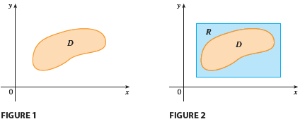

We suppose that $D$ is a bounded region, which means that $D$ can be enclosed in a rectangular region $R$ as in Figure 2. Then we define a new function $F$ with domain $R$ by
$$
F(x, y) =
\begin{cases}
f(x, y) & \text{if } (x, y) \text{ is in } D \\
0 & \text{if } (x, y) \text{ is in } R \text{ but not in } D
\end{cases}
\tag{1}
$$

If $F$ is integrable over $R$, then we define the **double integral of f over D** by
$$
\iint_D f(x, y) dA = \iint_R F(x, y) dA
\tag{2}
$$
where F is given by Equation 1.

In the case where $f(x, y) \ge 0$, we can still interpret $\iint_D f(x, y) dA$ as the volume of the solid that lies above $D$ and under the surface $z = f(x, y)$ (the graph of $f$). You can see that this is reasonable by comparing the graphs of $f$ and $F$ in Figures 3 and 4 and remembering that $\iint_R F(x, y) dA$ is the volume under the graph of $F$.

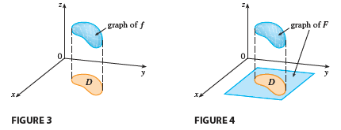

Figure 4 also shows that $F$ is likely to have discontinuities at the boundary points of $D$. Nonetheless, if $f$ is continuous on $D$ and the boundary curve of $D$ is “well behaved” (in a sense outside the scope of this book), then it can be shown that $\iint_R F(x, y) dA$ exists and therefore $\iint_D f(x, y) dA$ exists. In particular, this is the case for the following two types of regions.

</page>

<page>

# Type 1 - region

A plane region $D$ is said to be of **type I** if it lies between the graphs of two continuous functions of $x$, that is,
$$
D = \{(x, y) | a \le x \le b, g_1(x) \le y \le g_2(x)\}
$$
where $g_1$ and $g_2$ are continuous on $[a, b]$. Some examples of type I regions are shown in Figure below.

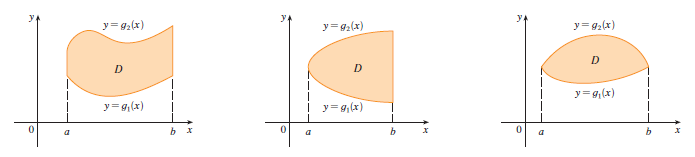

In order to evaluate $\iint_D f(x, y) dA$ when $D$ is a region of type I, we choose a rectangle $R = [a, b] \times [c, d]$ that contains $D$, as in Figure 6, and we let $F$ be the function given by Equation 1; that is, $F$ agrees with $f$ on $D$ and $F$ is 0 outside $D$. Then, by Fubini’s Theorem,
$$
\iint_D f(x, y) dA = \iint_R F(x, y) dA = \int_a^b \int_c^d F(x, y) dy dx
$$
Observe that $F(x, y) = 0$ if $y < g_1(x)$ or $y > g_2(x)$ because $(x, y)$ then lies outside $D$. Therefore
$$
\int_c^d F(x, y) dy = \int_{g_1(x)}^{g_2(x)} F(x, y) dy = \int_{g_1(x)}^{g_2(x)} f(x, y) dy
$$
because $F(x, y) = f(x, y)$ when $g_1(x) \le y \le g_2(x)$. Thus we have the following formula that enables us to evaluate the double integral as an iterated integral.

If f is continuous on a type I region $D$ such that  

$$
D = \{(x, y) | a \le x \le b, g_1(x) \le y \le g_2(x)\},
$$
then
$$
\iint_D f(x, y) dA = \int_a^b \int_{g_1(x)}^{g_2(x)} f(x, y) dy dx
\tag{3}
$$
The integral on the right side of (3) is an iterated integral that is similar to the ones we considered in the preceding section, except that in the inner integral we regard $x$ as being constant not only in $f(x, y)$ but also in the limits of integration, $g_1(x)$ and $g_2(x)$.

</page>

<page>

# Type II region

We also consider plane regions of **type II**, which can be expressed as
$$
D = \{(x, y) | c \le y \le d, h_1(y) \le x \le h_2(y)\}
\tag{4}
$$
where $h_1$ and $h_2$ are continuous. Two such regions are illustrated in Figure 7.

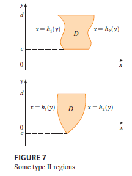

Using the same methods that were used in establishing (3), we can show that
$$
\iint_D f(x, y) dA = \int_c^d \int_{h_1(y)}^{h_2(y)} f(x, y) dx dy
\tag{5}
$$
where $D$ is a type II region given by Equation 4.

</page>

<page>

# Example - Type I

**EXAMPLE 1** Evaluate $\iint_D (x + 2y) dA$, where $D$ is the region bounded by the parabolas $y = 2x^2$ and $y = 1 + x^2$.

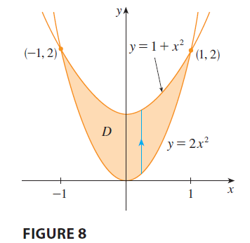

<ans>

**SOLUTION** The parabolas intersect when $2x^2 = 1 + x^2$, that is, $x^2 = 1$, so $x = \pm 1$. We note that the region $D$, sketched in Figure 8, is a type I region but not a type II region and we can write
$$
D = \{(x, y) | -1 \le x \le 1, 2x^2 \le y \le 1 + x^2\}
$$
Since the lower boundary is $y = 2x^2$ and the upper boundary is $y = 1 + x^2$, Equation 3 gives
$$
\iint_D (x + 2y) dA = \int_{-1}^1 \int_{2x^2}^{1+x^2} (x + 2y) dy dx
$$
$$
= \int_{-1}^1 [xy + y^2]_{y=2x^2}^{y=1+x^2} dx
$$
$$
= \int_{-1}^1 [x(1+x^2) + (1+x^2)^2 - x(2x^2) - (2x^2)^2] dx
$$
$$
= \int_{-1}^1 (-3x^4 - x^3 + 2x^2 + x + 1) dx
$$
$$
= \left[ -3\frac{x^5}{5} - \frac{x^4}{4} + 2\frac{x^3}{3} + \frac{x^2}{2} + x \right]_{-1}^1 = \frac{32}{15}
$$

**NOTE** When we set up a double integral as in Example 1, it is essential to draw a diagram. Often it is helpful to draw a vertical arrow as in Figure 8. Then the limits of integration for the inner integral can be read from the diagram as follows: The arrow starts at the lower boundary $y = g_1(x)$, which gives the lower limit in the integral, and the arrow ends at the upper boundary $y = g_2(x)$, which gives the upper limit of integration. For a type II region the arrow is drawn horizontally from the left boundary to the right boundary.

</ans>
</page>

<page>

# Example

**EXAMPLE 2** Find the volume of the solid that lies under the paraboloid $z = x^2 + y^2$ and above the region $D$ in the $xy$-plane bounded by the line $y = 2x$ and the parabola $y = x^2$.

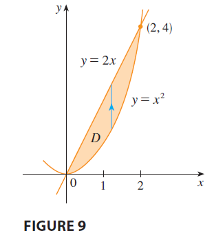

**Type 1 Solution**

<ans>

**SOLUTION 1** From Figure 9 we see that $D$ is a type I region and
$$
D = \{(x, y) | 0 \le x \le 2, x^2 \le y \le 2x\}
$$
Therefore the volume under $z = x^2 + y^2$ and above $D$ is
$$
V = \iint_D (x^2 + y^2) dA = \int_0^2 \int_{x^2}^{2x} (x^2 + y^2) dy dx
$$
$$
= \int_0^2 \left[ x^2y + \frac{y^3}{3} \right]_{y=x^2}^{y=2x} dx = \int_0^2 \left[ x^2(2x) + \frac{(2x)^3}{3} - x^2(x^2) - \frac{(x^2)^3}{3} \right] dx
$$
$$
= \int_0^2 \left( 2x^3 + \frac{8x^3}{3} - x^4 - \frac{x^6}{3} \right) dx = \int_0^2 \left( \frac{14x^3}{3} - x^4 - \frac{x^6}{3} \right) dx
$$
$$
= \left[ \frac{14}{3}\frac{x^4}{4} - \frac{x^5}{5} - \frac{x^7}{21} \right]_0^2 = \frac{7(16)}{6} - \frac{32}{5} - \frac{128}{21} = \frac{216}{35}
$$
</ans>

-----------

**Type II Solution**

<ans>

**SOLUTION 2** From Figure 11 we see that $D$ can also be written as a type II region:
$$
D = \{(x, y) | 0 \le y \le 4, \frac{y}{2} \le x \le \sqrt{y}\}
$$
Therefore another expression for $V$ is
$$
V = \iint_D (x^2 + y^2) dA = \int_0^4 \int_{y/2}^{\sqrt{y}} (x^2 + y^2) dx dy
$$
$$
= \int_0^4 \left[ \frac{x^3}{3} + y^2x \right]_{x=y/2}^{x=\sqrt{y}} dy = \int_0^4 \left( \frac{y^{3/2}}{3} + y^{5/2} - \frac{y^3}{24} - \frac{y^3}{2} \right) dy
$$
$$
= \int_0^4 \left( \frac{y^{3/2}}{3} + y^{5/2} - \frac{13y^3}{24} \right) dy = \left[ \frac{2y^{5/2}}{15} + \frac{2y^{7/2}}{7} - \frac{13y^4}{96} \right]_0^4 = \frac{216}{35}
$$

</ans>
</page>

<page>

# Example 

**EXAMPLE 3** Evaluate $\iint_D xy dA$, where $D$ is the region bounded by the line $y = x - 1$ and the parabola $y^2 = 2x + 6$.

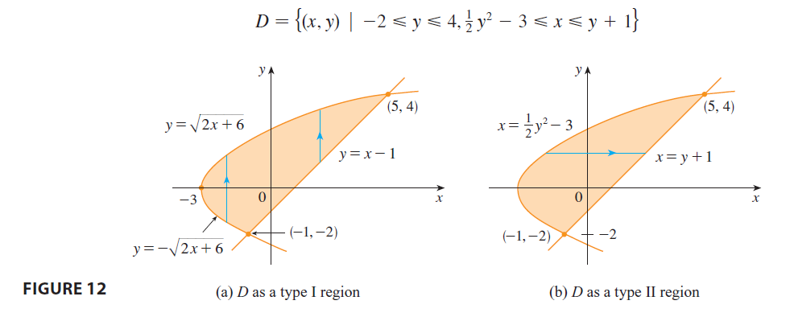

<ans>

**SOLUTION** The region $D$ is shown in Figure 12. Again $D$ is both type I and type II, but the description of $D$ as a type I region is more complicated because the lower boundary consists of two parts. Therefore we prefer to express $D$ as a type II region:
$$
D = \{(x, y) | -2 \le y \le 4, \frac{1}{2}y^2 - 3 \le x \le y + 1\}
$$
Then (5) gives
$$
\iint_D xy dA = \int_{-2}^4 \int_{\frac{1}{2}y^2-3}^{y+1} xy dx dy = \int_{-2}^4 \left[ \frac{x^2}{2}y \right]_{x=\frac{1}{2}y^2-3}^{x=y+1} dy
$$
$$
= \frac{1}{2} \int_{-2}^4 y[(y+1)^2 - (\frac{1}{2}y^2-3)^2] dy = \frac{1}{2} \int_{-2}^4 y\left(y^2+2y+1 - (\frac{1}{4}y^4-3y^2+9)\right) dy
$$
$$
= \frac{1}{2} \int_{-2}^4 \left(-\frac{1}{4}y^5 + 4y^3 + 2y^2 - 8y\right) dy = \frac{1}{2} \left[ -\frac{y^6}{24} + y^4 + \frac{2y^3}{3} - 4y^2 \right]_{-2}^4 = 36
$$
If we had expressed $D$ as a type I region using Figure 12(a), then we would have obtained
$$
\iint_D xy dA = \int_{-3}^{-1} \int_{-\sqrt{2x+6}}^{\sqrt{2x+6}} xy dy dx + \int_{-1}^5 \int_{x-1}^{\sqrt{2x+6}} xy dy dx
$$
but this would have involved more work than the other method.

</ans>

</page>

<page>

# Example: 

**EXAMPLE 4** Find the volume of the tetrahedron bounded by the planes $x + 2y + z = 2, x = 2y, x = 0,$ and $z = 0$.

<ans>

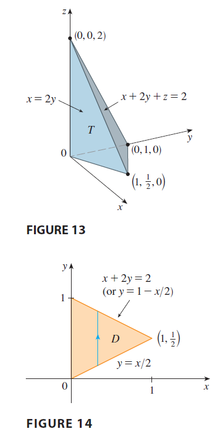

**SOLUTION** In a question such as this, it’s wise to draw two diagrams: one of the three-dimensional solid and another of the plane region $D$ over which it lies. Figure 13 shows the tetrahedron $T$ bounded by the coordinate planes $x = 0, z = 0$, the vertical plane $x = 2y$, and the plane $x + 2y + z = 2$. Since the plane $x + 2y + z = 2$ intersects the $xy$-plane (whose equation is $z = 0$) in the line $x + 2y = 2$, we see that $T$ lies above the triangular region $D$ in the $xy$-plane bounded by the lines $x = 2y, x + 2y = 2,$ and $x = 0$. (See Figure 14.)
The plane $x + 2y + z = 2$ can be written as $z = 2 - x - 2y$, so the required volume lies under the graph of the function $z = 2 - x - 2y$ and above
$$
D = \{(x, y) | 0 \le x \le 1, x/2 \le y \le 1 - x/2\}
$$
Therefore
$$
V = \iint_D (2 - x - 2y) dA = \int_0^1 \int_{x/2}^{1-x/2} (2 - x - 2y) dy dx
$$
$$
= \int_0^1 [2y - xy - y^2]_{y=x/2}^{y=1-x/2} dx
$$
$$
= \int_0^1 \left[ 2(1 - \frac{x}{2}) - x(1 - \frac{x}{2}) - (1 - \frac{x}{2})^2 - (x - \frac{x^2}{2} - \frac{x^2}{4}) \right] dx
$$
$$
= \int_0^1 (x^2 - 2x + 1) dx = \left[ \frac{x^3}{3} - x^2 + x \right]_0^1 = \frac{1}{3}
$$

</ans>

</page>

<page>

# Example - Change order of integration

**EXAMPLE 5** Evaluate the iterated integral $\int_0^1 \int_x^1 \sin(y^2) dy dx$.

<ans>

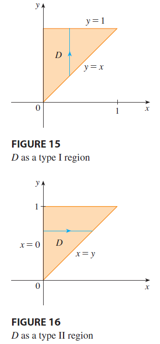

**SOLUTION** If we try to evaluate the integral as it stands, we are faced with the task of first evaluating $\int \sin(y^2) dy$. But it’s impossible to do so in finite terms since $\int \sin(y^2) dy$ is not an elementary function. So we must change the order of integration. This is accomplished by first expressing the given iterated integral as a double integral. Using (3) backward, we have
$$
\int_0^1 \int_x^1 \sin(y^2) dy dx = \iint_D \sin(y^2) dA
$$
where
$$
D = \{(x, y) | 0 \le x \le 1, x \le y \le 1\}
$$
We sketch this region $D$ in Figure 15. Then from Figure 16 we see that an alternative description of $D$ is
$$
D = \{(x, y) | 0 \le y \le 1, 0 \le x \le y\}
$$
This enables us to use (5) to express the double integral as an iterated integral in the reverse order:
$$
\int_0^1 \int_x^1 \sin(y^2) dy dx = \iint_D \sin(y^2) dA = \int_0^1 \int_0^y \sin(y^2) dx dy
$$
$$
= \int_0^1 [x \sin(y^2)]_{x=0}^{x=y} dy = \int_0^1 y \sin(y^2) dy = \left[ -\frac{1}{2}\cos(y^2) \right]_0^1 = \frac{1}{2}(1 - \cos 1)
$$

</ans>

</page>

<page>

# Properties of Double Integrals

General regions the properties follow from Definition.

$$
\iint_D [f(x, y) + g(x, y)] dA = \iint_D f(x, y) dA + \iint_D g(x, y) dA
\tag{6}
$$

$$
\iint_D cf(x, y) dA = c \iint_D f(x, y) dA \quad \text{where c is a constant}
\tag{7}
$$

If $f(x, y) \ge g(x, y)$ for all $(x, y)$ in $D$, then

$$
\iint_D f(x, y) dA \ge \iint_D g(x, y) dA
\tag{8}
$$

The next property of double integrals is similar to the property of single integrals given by the equation $\int_a^c f(x) dx = \int_a^b f(x) dx + \int_b^c f(x) dx$.
If $D = D_1 \cup D_2$, where $D_1$ and $D_2$ don’t overlap except perhaps on their boundaries (see Figure 17), then

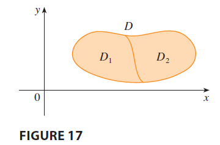

$$
\iint_D f(x, y) dA = \iint_{D_1} f(x, y) dA + \iint_{D_2} f(x, y) dA
\tag{9}
$$
Property 9 can be used to evaluate double integrals over regions $D$ that are neither type I nor type II but can be expressed as a union of regions of type I or type II. Figure 18 illustrates this procedure.

</page>

<page>

# Using double integration to find area

If we integrate the constant function $f(x, y) = 1$ over a region $D$, we get the area of $D$:
$$
\iint_D 1 dA = A(D)
\tag{10}
$$

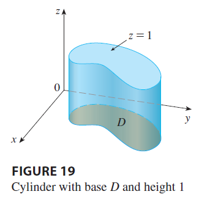

Figure 19 illustrates why Equation 10 is true: A solid cylinder whose base is $D$ and whose height is 1 has volume $A(D) \cdot 1 = A(D)$, but we know that we can also write its volume as $\iint_D 1 dA$.

</page>

<page>

# Lower and upper bounds on integration

If  $m \le f(x, y) \le M$  for all  $(x, y) \text{ in } D$ , then 

$$
mA(D) \le \iint_D f(x, y) dA \le MA(D)
\tag{11}
$$

-------

**EXAMPLE 6** Use Property 11 to estimate the integral $\iint_D e^{\sin x \cos y} dA$, where $D$ is the disk with center the origin and radius 2.

<ans>

**SOLUTION** Since $-1 \le \sin x \le 1$ and $-1 \le \cos y \le 1$, we have $-1 \le \sin x \cos y \le 1$ and therefore
$$
e^{-1} \le e^{\sin x \cos y} \le e^1 = e
$$
Thus, using $m = e^{-1} = 1/e$, $M = e$, and $A(D) = \pi(2)^2 = 4\pi$ in Property 11, we obtain
$$
\frac{4\pi}{e} \le \iint_D e^{\sin x \cos y} dA \le 4\pi e
$$

</ans>

</page>