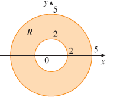
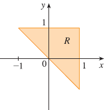
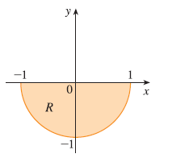
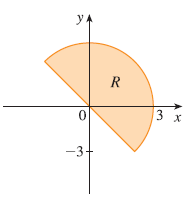

<page>

# Exercise 1

A region R is shown. Decide whether to use polar coordinates or rectangular coordinates and write $\iint_R f(x, y) dA$ as an iterated integral, where $f$ is an arbitrary continuous function on R. 

</page>
<page>

# Exercise 2

A region R is shown. Decide whether to use polar coordinates or rectangular coordinates and write $\iint_R f(x, y) dA$ as an iterated integral, where $f$ is an arbitrary continuous function on R. 

</page>
<page>

# Exercise 3

A region R is shown. Decide whether to use polar coordinates or rectangular coordinates and write $\iint_R f(x, y) dA$ as an iterated integral, where $f$ is an arbitrary continuous function on R. 

</page>
<page>

# Exercise 4

A region R is shown. Decide whether to use polar coordinates or rectangular coordinates and write $\iint_R f(x, y) dA$ as an iterated integral, where $f$ is an arbitrary continuous function on R. 

</page>
<page>

# Exercise 5

Sketch the region whose area is given by the integral $\int_{\pi/4}^{3\pi/4} \int_1^2 r dr d\theta$ and evaluate the integral.

</page>
<page>

# Exercise 6

Sketch the region whose area is given by the integral $\int_{\pi/2}^{\pi} \int_0^{2\sin\theta} r dr d\theta$ and evaluate the integral.

</page>
<page>

# Exercise 7

Evaluate the given integral by changing to polar coordinates: $\iint_D x^2y dA$, where $D$ is the top half of the disk with center the origin and radius 5.

</page>
<page>

# Exercise 8

Evaluate the given integral by changing to polar coordinates: $\iint_R (2x - y) dA$, where $R$ is the region in the first quadrant enclosed by the circle $x^2 + y^2 = 4$ and the lines $x = 0$ and $y = x$.

</page>
<page>

# Exercise 9

Evaluate the given integral by changing to polar coordinates: $\iint_R \sin(x^2 + y^2) dA$, where $R$ is the region in the first quadrant between the circles with center the origin and radii 1 and 3.

</page>
<page>

# Exercise 10

Evaluate the given integral by changing to polar coordinates: $\iint_R \frac{y^2}{x^2 + y^2} dA$, where $R$ is the region that lies between the circles $x^2 + y^2 = a^2$ and $x^2 + y^2 = b^2$ with $0 < a < b$.

</page>
<page>

# Exercise 11

Evaluate the given integral by changing to polar coordinates: $\iint_D e^{-x^2-y^2} dA$, where $D$ is the region bounded by the semicircle $x = \sqrt{4 - y^2}$ and the y-axis.

</page>
<page>

# Exercise 12

Evaluate the given integral by changing to polar coordinates: $\iint_D \cos\sqrt{x^2 + y^2} dA$, where $D$ is the disk with center the origin and radius 2.

</page>
<page>

# Exercise 13

Evaluate the given integral by changing to polar coordinates: $\iint_R \arctan(y/x) dA$, where $R = \{(x, y) | 1 \le x^2 + y^2 \le 4, 0 \le y \le x\}$.

</page>
<page>

# Exercise 14

Evaluate the given integral by changing to polar coordinates: $\iint_D x dA$, where $D$ is the region in the first quadrant that lies between the circles $x^2 + y^2 = 4$ and $x^2 + y^2 = 2x$.

</page>
<page>

# Exercise 15

Use a double integral to find the area of the region. One loop of the rose $r = \cos 3\theta$.

</page>
<page>

# Exercise 16

Use a double integral to find the area of the region enclosed by both of the cardioids $r = 1 + \cos\theta$ and $r = 1 - \cos\theta$.

</page>
<page>

# Exercise 17

Use a double integral to find the area of the region inside the circle $(x - 1)^2 + y^2 = 1$ and outside the circle $x^2 + y^2 = 1$.

</page>
<page>

# Exercise 18

Use a double integral to find the area of the region inside the cardioid $r = 1 + \cos\theta$ and outside the circle $r = 3 \cos\theta$.

</page>
<page>

# Exercise 19

Use polar coordinates to find the volume of the solid under the paraboloid $z = x^2 + y^2$ and above the disk $x^2 + y^2 \le 25$.

</page>
<page>

# Exercise 20

Use polar coordinates to find the volume of the solid below the cone $z = \sqrt{x^2 + y^2}$ and above the ring $1 \le x^2 + y^2 \le 4$.

</page>
<page>

# Exercise 21

Use polar coordinates to find the volume of the solid below the plane $2x + y + z = 4$ and above the disk $x^2 + y^2 \le 1$.

</page>
<page>

# Exercise 22

Use polar coordinates to find the volume of the solid inside the sphere $x^2 + y^2 + z^2 = 16$ and outside the cylinder $x^2 + y^2 = 4$.

</page>
<page>

# Exercise 23

Use polar coordinates to find the volume of a sphere of radius $a$.

</page>
<page>

# Exercise 24

Use polar coordinates to find the volume of the solid bounded by the paraboloid $z = 1 + 2x^2 + 2y^2$ and the plane $z = 7$ in the first octant.

</page>
<page>

# Exercise 25

Use polar coordinates to find the volume of the solid above the cone $z = \sqrt{x^2 + y^2}$ and below the sphere $x^2 + y^2 + z^2 = 1$.

</page>
<page>

# Exercise 26

Use polar coordinates to find the volume of the solid bounded by the paraboloids $z = 6 - x^2 - y^2$ and $z = 2x^2 + 2y^2$.

</page>
<page>

# Exercise 27

Use polar coordinates to find the volume of the solid inside both the cylinder $x^2 + y^2 = 4$ and the ellipsoid $4x^2 + 4y^2 + z^2 = 64$.

</page>
<page>

# Exercise 28

(a) A cylindrical drill with radius $r_1$ is used to bore a hole through the center of a sphere of radius $r_2$. Find the volume of the ring-shaped solid that remains.
(b) Express the volume in part (a) in terms of the height $h$ of the ring. Notice that the volume depends only on $h$, not on $r_1$ or $r_2$.

</page>
<page>

# Exercise 29

Evaluate the iterated integral by converting to polar coordinates: $\int_{-2}^2 \int_0^{\sqrt{4-x^2}} e^{-x^2-y^2} dy dx$.

</page>
<page>

# Exercise 30

Evaluate the iterated integral by converting to polar coordinates: $\int_0^a \int_{-\sqrt{a^2-y^2}}^{\sqrt{a^2-y^2}} (2x + y) dx dy$.

</page>
<page>

# Exercise 31

Evaluate the iterated integral by converting to polar coordinates: $\int_0^{1/2} \int_{\sqrt{3}y}^{\sqrt{1-y^2}} xy^2 dx dy$.

</page>
<page>

# Exercise 32

Evaluate the iterated integral by converting to polar coordinates: $\int_0^2 \int_0^{\sqrt{2x-x^2}} \sqrt{x^2 + y^2} dy dx$.

</page>
<page>

# Exercise 33

Express the double integral $\iint_D e^{(x^2+y^2)^2} dA$ in terms of a single integral with respect to $r$, where $D$ is the disk with center the origin and radius 1. Then use your calculator to evaluate the integral correct to four decimal places.

</page>
<page>

# Exercise 34

Express the double integral $\iint_D xy\sqrt{1 + x^2 + y^2} dA$ in terms of a single integral with respect to $r$, where $D$ is the portion of the disk $x^2 + y^2 \le 1$ that lies in the first quadrant. Then use your calculator to evaluate the integral correct to four decimal places.

</page>
<page>

# Exercise 35

A swimming pool is circular with a 40-ft diameter. The depth is constant along east-west lines and increases linearly from 2 ft at the south end to 7 ft at the north end. Find the volume of water in the pool.

</page>
<page>

# Exercise 36

An agricultural sprinkler distributes water in a circular pattern of radius 100 ft. It supplies water to a depth of $e^{-r}$ feet per hour at a distance of $r$ feet from the sprinkler.
(a) If $0 < R \le 100$, what is the total amount of water supplied per hour to the region inside the circle of radius $R$ centered at the sprinkler?
(b) Determine an expression for the average amount of water per hour per square foot supplied to the region inside the circle of radius $R$.

</page>
<page>

# Exercise 37

Find the average value of the function $f(x, y) = 1/\sqrt{x^2 + y^2}$ on the annular region $a^2 \le x^2 + y^2 \le b^2$, where $0 < a < b$.

</page>
<page>

# Exercise 38

Let $D$ be the disk with center the origin and radius $a$. What is the average distance from points in $D$ to the origin?

</page>
<page>

# Exercise 39

Use polar coordinates to combine the sum
$$ \int_{1/\sqrt{2}}^1 \int_{\sqrt{1-x^2}}^x xy dy dx + \int_1^{\sqrt{2}} \int_0^x xy dy dx + \int_{\sqrt{2}}^2 \int_0^{\sqrt{4-x^2}} xy dy dx $$
into one double integral. Then evaluate the double integral.

</page>
<page>

# Exercise 40

(a) We define the improper integral (over the entire plane $\mathbb{R}^2$)
$I = \iint_{\mathbb{R}^2} e^{-(x^2+y^2)} dA = \int_{-\infty}^\infty \int_{-\infty}^\infty e^{-(x^2+y^2)} dy dx = \lim_{a \to \infty} \iint_{D_a} e^{-(x^2+y^2)} dA$
where $D_a$ is the disk with radius $a$ and center the origin. Show that
$\int_{-\infty}^\infty \int_{-\infty}^\infty e^{-(x^2+y^2)} dA = \pi$.
(b) An equivalent definition of the improper integral in part (a) is
$\iint_{\mathbb{R}^2} e^{-(x^2+y^2)} dA = \lim_{a \to \infty} \iint_{S_a} e^{-(x^2+y^2)} dA$
where $S_a$ is the square with vertices $(\pm a, \pm a)$. Use this to show that
$\int_{-\infty}^\infty e^{-x^2} dx \int_{-\infty}^\infty e^{-y^2} dy = \pi$.
(c) Deduce that 
$$
\int_{-\infty}^{\infty} e^{-x^2} dx = \sqrt{\pi}.
$$
(d) By making the change of variable $t = \sqrt{2}x$, show that $\int_{-\infty}^\infty e^{-x^2/2} dx = \sqrt{2\pi}$. (This is a fundamental result for probability and statistics.)

</page>
<page>

# Exercise 41

Use the result of Exercise 40 part (c) to evaluate the following integrals.
(a) $\int_0^\infty x^2e^{-x^2} dx$
(b) $\int_0^\infty \sqrt{x}e^{-x} dx$

</page>
