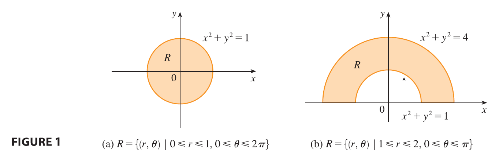
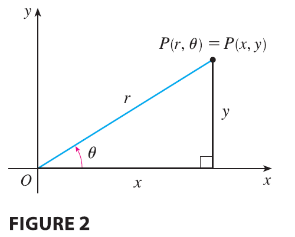
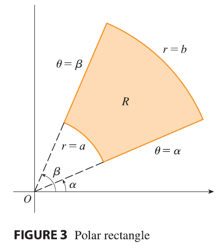
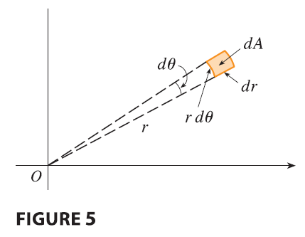
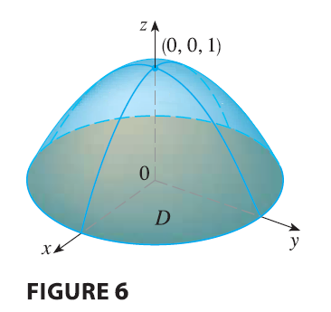
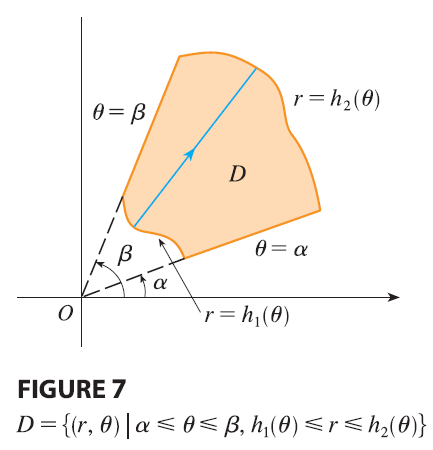
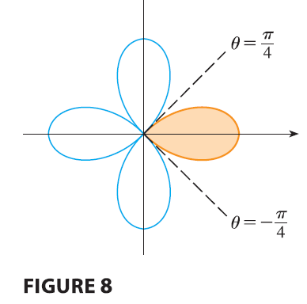
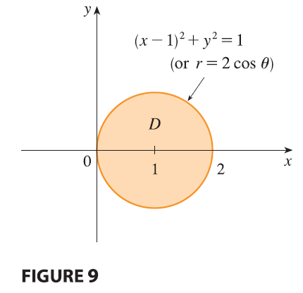
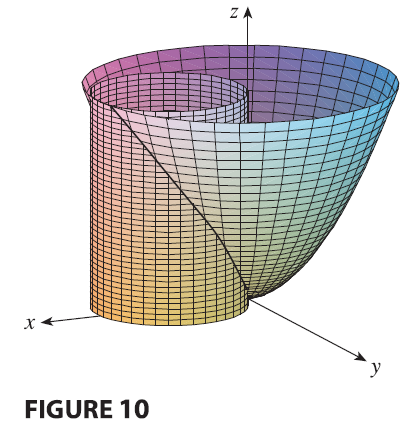

<page>

# Polar Coordinates Review

Suppose that we want to evaluate a double integral $\iint_R f(x, y) dA$, where $R$ is one of the regions shown in Figure 1. 

In either case the description of $R$ in terms of rectangular coordinates is rather complicated, but $R$ is easily described using polar coordinates.

Recall from Figur2 that the polar coordinates $(r, \theta)$ of a point are related to the rectangular coordinates $(x, y)$ by the equations
$$
r^2 = x^2 + y^2 \quad x = r \cos \theta \quad y = r \sin \theta
$$

The regions in Figure 1 are special cases of a **polar rectangle**
$$
R = \{(r, \theta) | a \le r \le b, \alpha \le \theta \le \beta\}
$$
which is shown in Figure 3. 

------------

</page>

<page>

# Change to Polar Coodinates in a Double Integral 

If $f$ is continuous on a polar rectangle $R$ given by $0 \le a \le r \le b, \alpha \le \theta \le \beta$, where $0 \le \beta - \alpha \le 2\pi$, then
$$
\iint_R f(x, y) dA = \int_\alpha^\beta \int_a^b f(r \cos \theta, r \sin \theta) r dr d\theta
\tag{2}
$$

---

The formula in (2) says that we convert from rectangular to polar coordinates in a double integral by writing $x = r \cos \theta$ and $y = r \sin \theta$, using the appropriate limits of integration for $r$ and $\theta$, and replacing $dA$ by $r dr d\theta$. Be careful not to forget the additional factor $r$ on the right side of Formula 2. A classical method for remembering this is shown in Figure 5, where the “infinitesimal” polar rectangle can be thought of as an ordinary rectangle with dimensions $r d\theta$ and $dr$ and therefore has “area” $dA = r dr d\theta$.

</page>

<page>

# Example: Integration in polar coordinates

**EXAMPLE 1** Evaluate $\iint_R (3x + 4y^2) dA$, where $R$ is the region in the upper half-plane bounded by the circles $x^2 + y^2 = 1$ and $x^2 + y^2 = 4$.

<ans>

**SOLUTION** The region $R$ can be described as
$$
R = \{(x, y) | y \ge 0, 1 \le x^2 + y^2 \le 4\}
$$
It is the half-ring shown in Figure 1(b), and in polar coordinates it is given by $1 \le r \le 2, 0 \le \theta \le \pi$. Therefore, by Formula 2,
$$
\iint_R (3x + 4y^2) dA = \int_0^\pi \int_1^2 (3r \cos \theta + 4r^2 \sin^2 \theta) r dr d\theta
$$
$$
= \int_0^\pi \int_1^2 (3r^2 \cos \theta + 4r^3 \sin^2 \theta) dr d\theta
$$

$$
= \int_0^{\pi} \left[r^3 \cos \theta + r^4 \sin^2 \theta \right]_{r=1}^{r=2} d\theta = \int_0^\pi (7 \cos \theta + 15 \sin^2 \theta) d\theta
$$
$$
= \int_0^\pi \left[ 7 \cos \theta + \frac{15}{2}(1 - \cos 2\theta) \right] d\theta
$$
$$
= \left[ 7 \sin \theta + \frac{15\theta}{2} - \frac{15}{4}\sin 2\theta \right]_0^\pi = \frac{15\pi}{2}
$$

</ans>
</page>

<page>

# Example: Integration as volume under graph

**EXAMPLE 2** Find the volume of the solid bounded by the plane $z = 0$ and the paraboloid $z = 1 - x^2 - y^2$.

<ans>

**SOLUTION** If we put $z = 0$ in the equation of the paraboloid, we get $x^2 + y^2 = 1$. This means that the plane intersects the paraboloid in the circle $x^2 + y^2 = 1$, so the solid lies under the paraboloid and above the circular disk $D$ given by $x^2 + y^2 \le 1$. In polar coordinates $D$ is given by $0 \le r \le 1, 0 \le \theta \le 2\pi$. Since $1 - x^2 - y^2 = 1 - r^2$, the volume is
$$
V = \iint_D (1 - x^2 - y^2) dA = \int_0^{2\pi} \int_0^1 (1 - r^2) r dr d\theta
$$
$$
= \int_0^{2\pi} d\theta \int_0^1 (r - r^3) dr = 2\pi \left[ \frac{r^2}{2} - \frac{r^4}{4} \right]_0^1 = \frac{\pi}{2}
$$
If we had used rectangular coordinates instead of polar coordinates, then we would have obtained
$$
V = \iint_D (1 - x^2 - y^2) dA = \int_{-1}^1 \int_{-\sqrt{1-x^2}}^{\sqrt{1-x^2}} (1 - x^2 - y^2) dy dx
$$
which is not easy to evaluate because it involves finding $\int (1 - x^2)^{3/2} dx$.

</ans>

</page>

<page>

# Polar coordinates in non-trival region

What we have done so far can be extended to the more complicated type of region shown in Figure 7. It’s similar to the type II rectangular regions considered in Section 15.2. In fact, by combining Formula 2 in this section with Formula 15.2.5, we obtain the following formula.

---
If $f$ is continuous on a polar region of the form
$$
D = \{(r, \theta) | \alpha \le \theta \le \beta, h_1(\theta) \le r \le h_2(\theta)\}
$$
then
$$
\iint_D f(x, y) dA = \int_\alpha^\beta \int_{h_1(\theta)}^{h_2(\theta)} f(r \cos \theta, r \sin \theta) r dr d\theta
\tag{3}
$$

---

In particular, taking $f(x, y) = 1, h_1(\theta) = 0,$ and $h_2(\theta) = h(\theta)$ in this formula, we see that the area of the region $D$ bounded by $\theta = \alpha, \theta = \beta,$ and $r = h(\theta)$ is
$$
A(D) = \iint_D 1 dA = \int_\alpha^\beta \int_0^{h(\theta)} r dr d\theta = \int_\alpha^\beta \left[ \frac{r^2}{2} \right]_0^{h(\theta)} d\theta = \int_\alpha^\beta \frac{1}{2}[h(\theta)]^2 d\theta
$$
and this agrees with Formula 10.4.3.

</page>

<page>

# Example

**EXAMPLE 3** Use a double integral to find the area enclosed by one loop of the four-leaved rose $r = \cos 2\theta$.

<ans>

**SOLUTION** From the sketch of the curve in Figure 8, we see that a loop is given by the region
$$
D = \{(r, \theta) | -\pi/4 \le \theta \le \pi/4, 0 \le r \le \cos 2\theta\}
$$
So the area is
$$
A(D) = \iint_D dA = \int_{-\pi/4}^{\pi/4} \int_0^{\cos 2\theta} r dr d\theta = \int_{-\pi/4}^{\pi/4} \left[ \frac{r^2}{2} \right]_0^{\cos 2\theta} d\theta
$$
$$
= \frac{1}{2} \int_{-\pi/4}^{\pi/4} \cos^2 2\theta d\theta = \frac{1}{4} \int_{-\pi/4}^{\pi/4} (1 + \cos 4\theta) d\theta = \frac{1}{4} \left[ \theta + \frac{1}{4}\sin 4\theta \right]_{-\pi/4}^{\pi/4} = \frac{\pi}{8}
$$

</ans>
</page>

<page>

# Example 

**EXAMPLE 4** Find the volume of the solid that lies under the paraboloid $z = x^2 + y^2$, above the $xy$-plane, and inside the cylinder $x^2 + y^2 = 2x$.

<ans>

**SOLUTION** The solid lies above the disk $D$ whose boundary circle has equation $x^2 + y^2 = 2x$ or, after completing the square,
$$
(x - 1)^2 + y^2 = 1
$$
In polar coordinates we have $x^2 + y^2 = r^2$ and $x = r \cos \theta$, so the boundary circle becomes $r^2 = 2r \cos \theta$, or $r = 2 \cos \theta$. Thus the disk $D$ is given by
$$
D = \{(r, \theta) | -\pi/2 \le \theta \le \pi/2, 0 \le r \le 2 \cos \theta\}
$$
and, by Formula 3, we have
$$
V = \iint_D (x^2 + y^2) dA = \int_{-\pi/2}^{\pi/2} \int_0^{2 \cos \theta} r^2 r dr d\theta = \int_{-\pi/2}^{\pi/2} \left[ \frac{r^4}{4} \right]_0^{2 \cos \theta} d\theta
$$
$$
= \int_{-\pi/2}^{\pi/2} 4 \cos^4 \theta d\theta = 8 \int_0^{\pi/2} \cos^4 \theta d\theta = 8 \int_0^{\pi/2} \left( \frac{1 + \cos 2\theta}{2} \right)^2 d\theta
$$
$$
= 2 \int_0^{\pi/2} [1 + 2 \cos 2\theta + \cos^2 2\theta] d\theta = 2 \int_0^{\pi/2} \left[ 1 + 2 \cos 2\theta + \frac{1}{2}(1 + \cos 4\theta) \right] d\theta
$$
$$
= 2 \left[ \frac{3}{2}\theta + \sin 2\theta + \frac{1}{8}\sin 4\theta \right]_0^{\pi/2} = 2\left(\frac{3}{2}\right)\left(\frac{\pi}{2}\right) = \frac{3\pi}{2}
$$

</ans>

</page>
