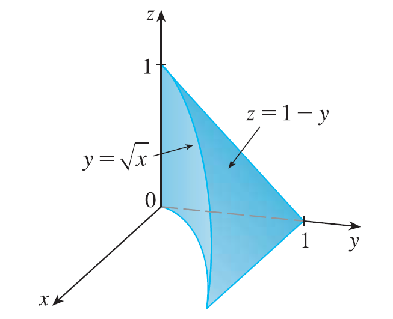
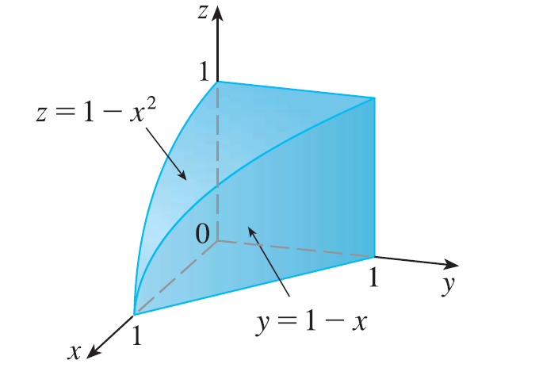

<page>

# Exercise 2

Evaluate the integral $\iiint_E (xy + z^2) dV$, where $E = \{(x, y, z) | 0 \le x \le 2, 0 \le y \le 1, 0 \le z \le 3\}$ using three different orders of integration.
</page>
<page>

# Exercise 3

Evaluate the iterated integral $\int_0^1 \int_0^z \int_0^{x+z} (2x - y) dy dx dz$.

</page>
<page>

# Exercise 4

Evaluate the iterated integral $\int_0^1 \int_y^{2y} \int_0^{x+y} 6xy dz dx dy$.

</page>
<page>

# Exercise 5

Evaluate the iterated integral $\int_1^2 \int_0^{2z} \int_0^{\ln x} xe^{-y} dy dx dz$.

</page>
<page>

# Exercise 6

Evaluate the iterated integral $\int_0^1 \int_0^z \int_0^{\sqrt{1-z^2}} \frac{z}{y+1} dx dz dy$.

</page>
<page>

# Exercise 7

Evaluate the iterated integral $\int_0^{\pi/2} \int_0^y \int_0^x z \sin x dy dz dx$.

</page>
<page>

# Exercise 8

Evaluate the iterated integral $\int_0^{\sqrt{\pi}} \int_0^x \int_0^{xz} x^2 \sin y dy dz dx$.

</page>
<page>

# Exercise 9

Evaluate the triple integral $\iiint_E y dV$, where $E = \{(x, y, z) | 0 \le x \le 3, 0 \le y \le x, x - y \le z \le x + y\}$.

</page>
<page>

# Exercise 10

Evaluate the triple integral $\iiint_E e^{z/y} dV$, where $E = \{(x, y, z) | 0 \le y \le 1, y \le x \le 1, 0 \le z \le xy\}$.

</page>
<page>

# Exercise 11

Evaluate the triple integral $\iiint_E \frac{z}{x^2 + z^2} dV$, where $E = \{(x, y, z) | 1 \le y \le 4, y \le z \le 4, 0 \le x \le z\}$.

</page>
<page>

# Exercise 12

Evaluate the triple integral $\iiint_E \sin y dV$, where E lies below the plane $z = x$ and above the triangular region with vertices $(0, 0, 0), (\pi, 0, 0),$ and $(0, \pi, 0)$.

</page>
<page>

# Exercise 13

Evaluate the triple integral $\iiint_E 6xy dV$, where E lies under the plane $z = 1 + x + y$ and above the region in the xy-plane bounded by the curves $y = \sqrt{x}, y = 0,$ and $x = 1$.

</page>
<page>

# Exercise 14

Evaluate the triple integral $\iiint_E (x - y) dV$, where E is enclosed by the surfaces $z = x^2 - 1, z = 1 - x^2, y = 0,$ and $y = 2$.

</page>
<page>

# Exercise 15

Evaluate the triple integral $\iiint_T xy^2 dV$, where T is the solid tetrahedron with vertices $(0, 0, 0), (2, 0, 0), (0, 2, 0),$ and $(0, 0, 2)$.

</page>
<page>

# Exercise 16

Evaluate the triple integral $\iiint_T xz dV$, where T is the solid tetrahedron with vertices $(0, 0, 0), (1, 0, 1), (0, 1, 1),$ and $(0, 0, 1)$.

</page>
<page>

# Exercise 17

Evaluate the triple integral $\iiint_E x dV$, where E is bounded by the paraboloid $x = 4y^2 + 4z^2$ and the plane $x = 4$.

</page>
<page>

# Exercise 18

Evaluate the triple integral $\iiint_E z dV$, where E is bounded by the cylinder $y^2 + z^2 = 9$ and the planes $x = 0, y = 3x,$ and $z = 0$ in the first octant.

</page>
<page>

# Exercise 19

Use a triple integral to find the volume of the tetrahedron enclosed by the coordinate planes and the plane $2x + y + z = 4$.

</page>
<page>

# Exercise 20

Use a triple integral to find the volume of the solid enclosed by the paraboloids $y = x^2 + z^2$ and $y = 8 - x^2 - z^2$.

</page>
<page>

# Exercise 21

Use a triple integral to find the volume of the solid enclosed by the cylinder $y = x^2$ and the planes $z = 0$ and $y + z = 1$.

</page>
<page>

# Exercise 22

Use a triple integral to find the volume of the solid enclosed by the cylinder $x^2 + z^2 = 4$ and the planes $y = -1$ and $y + z = 4$.

</page>
<page>

# Exercise 23

(a) Express the volume of the wedge in the first octant that is cut from the cylinder $y^2 + z^2 = 1$ by the planes $y = x$ and $x = 1$ as a triple integral.
(b) Use either the Table of Integrals or a computer algebra system to find the exact value of the triple integral in part (a).

</page>
<page>

# Exercise 24

(a) In the Midpoint Rule for triple integrals we use a triple Riemann sum to approximate a triple integral over a box B, where $f(x, y, z)$ is evaluated at the center $(\bar{x}_i, \bar{y}_j, \bar{z}_k)$ of the box $B_{ijk}$. Use the Midpoint Rule to estimate $\iiint_B \sqrt{x^2 + y^2 + z^2} dV$, where B is the cube defined by $0 \le x \le 4, 0 \le y \le 4, 0 \le z \le 4$. Divide B into eight cubes of equal size.
(b) Use a computer algebra system to approximate the integral in part (a) correct to the nearest integer. Compare with the answer to part (a).

</page>
<page>

# Exercise 25

Use the Midpoint Rule for triple integrals (Exercise 24) to estimate the value of the integral. Divide B into eight sub-boxes of equal size.
$\iiint_B \cos(xyz) dV$, where $B = \{(x, y, z) | 0 \le x \le 1, 0 \le y \le 1, 0 \le z \le 1\}$.

</page>
<page>

# Exercise 26

Use the Midpoint Rule for triple integrals (Exercise 24) to estimate the value of the integral. Divide B into eight sub-boxes of equal size.
$\iiint_B \sqrt{x}e^{xyz} dV$, where $B = \{(x, y, z) | 0 \le x \le 4, 0 \le y \le 1, 0 \le z \le 2\}$.

</page>
<page>

# Exercise 27

Sketch the solid whose volume is given by the iterated integral $\int_0^1 \int_0^{1-x} \int_0^{2-2z} dy dz dx$.

</page>
<page>

# Exercise 28

Sketch the solid whose volume is given by the iterated integral $\int_0^2 \int_0^{2-y} \int_0^{4-y^2} dx dz dy$.

</page>
<page>

# Exercise 29

Express the integral $\iiint_E f(x, y, z) dV$ as an iterated integral in six different ways, where E is the solid bounded by the surfaces $y = 4 - x^2 - 4z^2, y = 0$.

</page>
<page>

# Exercise 30

Express the integral $\iiint_E f(x, y, z) dV$ as an iterated integral in six different ways, where E is the solid bounded by the surfaces $y^2 + z^2 = 9, x = -2, x = 2$.

</page>
<page>

# Exercise 31

Express the integral $\iiint_E f(x, y, z) dV$ as an iterated integral in six different ways, where E is the solid bounded by the surfaces $y = x^2, z = 0, y + 2z = 4$.

</page>
<page>

# Exercise 32

Express the integral $\iiint_E f(x, y, z) dV$ as an iterated integral in six different ways, where E is the solid bounded by the surfaces $x = 2, y = 2, z = 0, x + y - 2z = 2$.

</page>
<page>

# Exercise 33

The figure shows the region of integration for the integral $\int_0^1 \int_{\sqrt{x}}^1 \int_0^{1-y} f(x, y, z) dz dy dx$. Rewrite this integral as an equivalent iterated integral in the five other orders.

</page>
<page>

# Exercise 34

The figure shows the region of integration for the integral $\int_0^1 \int_0^{1-x^2} \int_0^{1-x} f(x, y, z) dy dz dx$. Rewrite this integral as an equivalent iterated integral in the five other orders.

</page>
<page>

# Exercise 35

Write five other iterated integrals that are equal to the given iterated integral $\int_0^1 \int_y^1 \int_0^y f(x, y, z) dz dx dy$.

</page>
<page>

# Exercise 36

Write five other iterated integrals that are equal to the given iterated integral $\int_0^1 \int_0^{x^2} \int_0^y f(x, y, z) dz dy dx$.

</page>
<page>

# Exercise 37

Evaluate the triple integral $\iiint_C (4 + 5x^2yz^2) dV$, where C is the cylindrical region $x^2 + y^2 \le 4, -2 \le z \le 2$, using only geometric interpretation and symmetry.

</page>
<page>

# Exercise 38

Evaluate the triple integral $\iiint_B (z^3 + \sin y + 3) dV$, where B is the unit ball $x^2 + y^2 + z^2 \le 1$, using only geometric interpretation and symmetry.

</page>
<page>

# Exercise 39

Find the mass and center of mass of the solid E with the given density function $\rho$. E lies above the xy-plane and below the paraboloid $z = 1 - x^2 - y^2$; $\rho(x, y, z) = 3$.

</page>
<page>

# Exercise 40

Find the mass and center of mass of the solid E with the given density function $\rho$. E is bounded by the parabolic cylinder $z = 1 - y^2$ and the planes $x + z = 1, x = 0,$ and $z = 0$; $\rho(x, y, z) = 4$.

</page>
<page>

# Exercise 41

Find the mass and center of mass of the solid E with the given density function $\rho$. E is the cube given by $0 \le x \le a, 0 \le y \le a, 0 \le z \le a$; $\rho(x, y, z) = x^2 + y^2 + z^2$.

</page>
<page>

# Exercise 42

Find the mass and center of mass of the solid E with the given density function $\rho$. E is the tetrahedron bounded by the planes $x = 0, y = 0, z = 0, x + y + z = 1$; $\rho(x, y, z) = y$.

</page>
<page>

# Exercise 43

Assume that the solid has constant density $k$. Find the moments of inertia for a cube with side length L if one vertex is located at the origin and three edges lie along the coordinate axes.

</page>
<page>

# Exercise 44

Assume that the solid has constant density $k$. Find the moments of inertia for a rectangular brick with dimensions a, b, and c and mass M if the center of the brick is situated at the origin and the edges are parallel to the coordinate axes.

</page>
<page>

# Exercise 45

Assume that the solid has constant density $k$. Find the moment of inertia about the z-axis of the solid cylinder $x^2 + y^2 \le a^2, 0 \le z \le h$.

</page>
<page>

# Exercise 46

Assume that the solid has constant density $k$. Find the moment of inertia about the z-axis of the solid cone $\sqrt{x^2 + y^2} \le z \le h$.

</page>
<page>

# Exercise 47

Set up, but do not evaluate, integral expressions for (a) the mass, (b) the center of mass, and (c) the moment of inertia about the z-axis. The solid of Exercise 21; $\rho(x, y, z) = \sqrt{x^2 + y^2}$.

</page>
<page>

# Exercise 48

Set up, but do not evaluate, integral expressions for (a) the mass, (b) the center of mass, and (c) the moment of inertia about the z-axis. The hemisphere $x^2 + y^2 + z^2 \le 1, z \ge 0$; $\rho(x, y, z) = \sqrt{x^2 + y^2 + z^2}$.

</page>
<page>

# Exercise 49

Let E be the solid in the first octant bounded by the cylinder $x^2 + y^2 = 1$ and the planes $y = z, x = 0,$ and $z = 0$ with the density function $\rho(x, y, z) = 1 + x + y + z$. Use a computer algebra system to find the exact values of the following quantities for E.
(a) The mass
(b) The center of mass
(c) The moment of inertia about the z-axis

</page>
<page>

# Exercise 50

If E is the solid of Exercise 18 with density function $\rho(x, y, z) = x^2 + y^2$, find the following quantities, correct to three decimal places.
(a) The mass
(b) The center of mass
(c) The moment of inertia about the z-axis

</page>
<page>

# Exercise 51

The joint density function for random variables X, Y, and Z is $f(x, y, z) = Cxyz$ if $0 \le x \le 2, 0 \le y \le 2, 0 \le z \le 2$, and $f(x, y, z) = 0$ otherwise.
(a) Find the value of the constant C.
(b) Find $P(X \le 1, Y \le 1, Z \le 1)$.
(c) Find $P(X + Y + Z \le 1)$.

</page>
<page>

# Exercise 52

Suppose X, Y, and Z are random variables with joint density function $f(x, y, z) = Ce^{-(0.5x+0.2y+0.1z)}$ if $x \ge 0, y \ge 0, z \ge 0$, and $f(x, y, z) = 0$ otherwise.
(a) Find the value of the constant C.
(b) Find $P(X \le 1, Y \le 1)$.
(c) Find $P(X \le 1, Y \le 1, Z \le 1)$.

</page>
<page>

# Exercise 53

The average value of a function $f(x, y, z)$ over a solid region E is defined to be
$f_{ave} = \frac{1}{V(E)} \iiint_E f(x, y, z) dV$
where $V(E)$ is the volume of E. For instance, if $\rho$ is a density function, then $\rho_{ave}$ is the average density of E.
Find the average value of the function $f(x, y, z) = xyz$ over the cube with side length L that lies in the first octant with one vertex at the origin and edges parallel to the coordinate axes.

</page>
<page>

# Exercise 54

Find the average height of the points in the solid hemisphere $x^2 + y^2 + z^2 \le 1, z \ge 0$.

</page>
<page>

# Exercise 55

(a) Find the region E for which the triple integral $\iiint_E (1 - x^2 - 2y^2 - 3z^2) dV$ is a maximum.
(b) Use a computer algebra system to calculate the exact maximum value of the triple integral in part (a).

</page>
