<page>

# Triple Integrals - Integration over volume

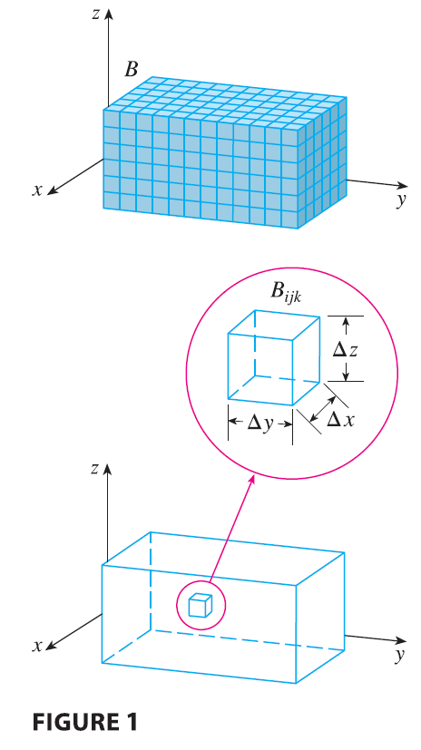

Just as we defined single integrals for functions of one variable and double integrals for functions of two variables, so we can define triple integrals for functions of three variables. Let’s first deal with the simplest case where $f$ is defined on a rectangular box:
$$
B = \{(x, y, z) | a \le x \le b, c \le y \le d, r \le z \le s\}
\tag{1}
$$
The first step is to divide $B$ into sub-boxes. We do this by dividing the interval $[a, b]$ into $l$ subintervals $[x_{i-1}, x_i]$ of equal width $\Delta x$, dividing $[c, d]$ into $m$ subintervals of width $\Delta y$, and dividing $[r, s]$ into $n$ subintervals of width $\Delta z$. The planes through the endpoints of these subintervals parallel to the coordinate planes divide the box $B$ into $lmn$ sub-boxes
$$
B_{ijk} = [x_{i-1}, x_i] \times [y_{j-1}, y_j] \times [z_{k-1}, z_k]
$$
which are shown in Figure 1. Each sub-box has volume $\Delta V = \Delta x \Delta y \Delta z$.

Then we form the **triple Riemann sum**
$$
\sum_{i=1}^l \sum_{j=1}^m \sum_{k=1}^n f(x_{ijk}^*, y_{ijk}^*, z_{ijk}^*) \Delta V
\tag{2}
$$
where the sample point $(x_{ijk}^*, y_{ijk}^*, z_{ijk}^*)$ is in $B_{ijk}$. By analogy with the definition of a double integral (15.1.5), we define the triple integral as the limit of the triple Riemann sums in (2).

**Definition 3** The **triple integral** of $f$ over the box $B$ is
$$
\iiint_B f(x, y, z) dV = \lim_{l,m,n \to \infty} \sum_{i=1}^l \sum_{j=1}^m \sum_{k=1}^n f(x_{ijk}^*, y_{ijk}^*, z_{ijk}^*) \Delta V
$$
if this limit exists.

---

Again, the triple integral always exists if $f$ is continuous. We can choose the sample point to be any point in the sub-box, but if we choose it to be the point $(x_i, y_j, z_k)$ we get a simpler-looking expression for the triple integral:
$$
\iiint_B f(x, y, z) dV = \lim_{l,m,n \to \infty} \sum_{i=1}^l \sum_{j=1}^m \sum_{k=1}^n f(x_i, y_j, z_k) \Delta V
$$
Just as for double integrals, the practical method for evaluating triple integrals is to express them as iterated integrals as follows.

</page>

<page>

# Working Rule - Fubini’s Theorem for Triple Integrals

If $f$ is continuous on the rectangular box $B = [a, b] \times [c, d] \times [r, s]$, then
$$
\iiint_B f(x, y, z) dV = \int_r^s \int_c^d \int_a^b f(x, y, z) dx dy dz
$$

---

The iterated integral on the right side of Fubini’s Theorem means that we integrate first with respect to $x$ (keeping $y$ and $z$ fixed), then we integrate with respect to $y$ (keeping $z$ fixed), and finally we integrate with respect to $z$. There are five other possible orders in which we can integrate, all of which give the same value. For instance, if we integrate with respect to $y$, then $z$, and then $x$, we have
$$
\iiint_B f(x, y, z) dV = \int_a^b \int_r^s \int_c^d f(x, y, z) dy dz dx
$$

</page>

<page>

# Example - Triple Integration

**EXAMPLE 1** Evaluate the triple integral $\iiint_B xyz^2 dV$, where $B$ is the rectangular box given by
$$
B = \{(x, y, z) | 0 \le x \le 1, -1 \le y \le 2, 0 \le z \le 3\}
$$

<ans>

**SOLUTION** We could use any of the six possible orders of integration. If we choose to integrate with respect to $x$, then $y$, and then $z$, we obtain
$$
\iiint_B xyz^2 dV = \int_0^3 \int_{-1}^2 \int_0^1 xyz^2 dx dy dz = \int_0^3 \int_{-1}^2 \left[ \frac{x^2yz^2}{2} \right]_{x=0}^{x=1} dy dz
$$
$$
= \int_0^3 \int_{-1}^2 \frac{yz^2}{2} dy dz = \int_0^3 \left[ \frac{y^2z^2}{4} \right]_{y=-1}^{y=2} dz = \int_0^3 \frac{3z^2}{4} dz = \left[ \frac{z^3}{4} \right]_0^3 = \frac{27}{4}
$$

</ans>
</page>

<page>

# Theory: Triple Integration over general region 

We define the triple integral over a general bounded region $E$ in three-dimensional space (a solid) by much the same procedure that we used for double integrals (15.2.2). We enclose $E$ in a box $B$ of the type given by Equation 1. Then we define $F$ so that it agrees with $f$ on $E$ but is 0 for points in $B$ that are outside $E$. By definition,
$$
\iiint_E f(x, y, z) dV = \iiint_B F(x, y, z) dV
$$
This integral exists if $f$ is continuous and the boundary of $E$ is “reasonably smooth.” The triple integral has essentially the same properties as the double integral (Properties 6–9 in Section 15.2).

We restrict our attention to continuous functions $f$ and to certain simple types of regions. A solid region $E$ is said to be of **type 1** if it lies between the graphs of two continuous functions of $x$ and $y$, that is,
$$
E = \{(x, y, z) | (x, y) \in D, u_1(x, y) \le z \le u_2(x, y)\}
\tag{5}
$$

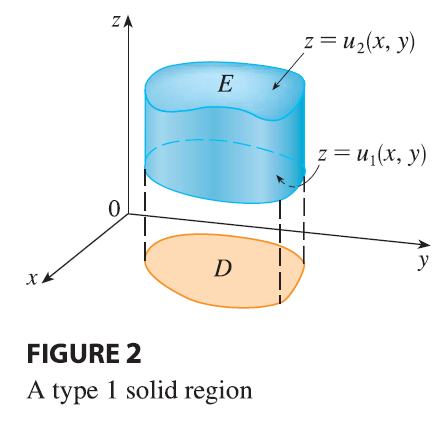

where $D$ is the projection of $E$ onto the $xy$-plane as shown in Figure 2. Notice that the upper boundary of the solid $E$ is the surface with equation $z = u_2(x, y)$, while the lower boundary is the surface $z = u_1(x, y)$.

By the same sort of argument that led to (15.2.3), it can be shown that if $E$ is a type 1 region given by Equation 5, then
$$
\iiint_E f(x, y, z) dV = \iint_D \left[ \int_{u_1(x,y)}^{u_2(x,y)} f(x, y, z) dz \right] dA
\tag{6}
$$
The meaning of the inner integral on the right side of Equation 6 is that $x$ and $y$ are held fixed, and therefore $u_1(x, y)$ and $u_2(x, y)$ are regarded as constants, while $f(x, y, z)$ is integrated with respect to $z$.

In particular, if the projection $D$ of $E$ onto the $xy$-plane is a type I plane region (as in Figure 3), then

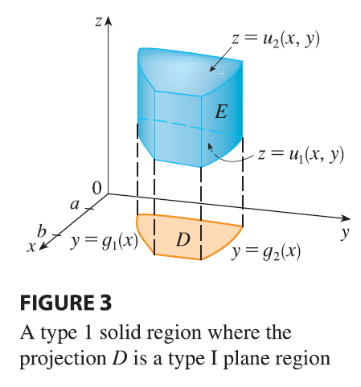

$$
E = \{(x, y, z) | a \le x \le b, g_1(x) \le y \le g_2(x), u_1(x, y) \le z \le u_2(x, y)\}
$$
and Equation 6 becomes
$$
\iiint_E f(x, y, z) dV = \int_a^b \int_{g_1(x)}^{g_2(x)} \int_{u_1(x,y)}^{u_2(x,y)} f(x, y, z) dz dy dx
\tag{7}
$$
If, on the other hand, $D$ is a type II plane region (as in Figure 4), then

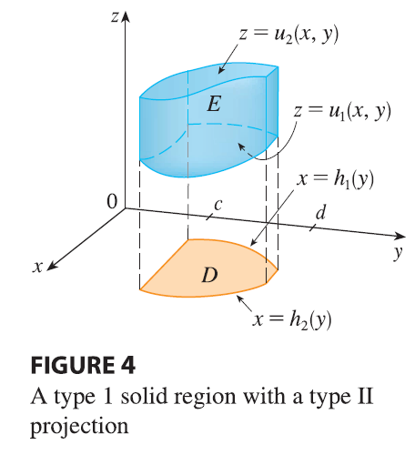

$$
E = \{(x, y, z) | c \le y \le d, h_1(y) \le x \le h_2(y), u_1(x, y) \le z \le u_2(x, y)\}
$$
and Equation 6 becomes
$$
\iiint_E f(x, y, z) dV = \int_c^d \int_{h_1(y)}^{h_2(y)} \int_{u_1(x,y)}^{u_2(x,y)} f(x, y, z) dz dx dy
\tag{8}
$$

</page>

<page>

# Example

**EXAMPLE 2** Evaluate $\iiint_E z dV$, where $E$ is the solid tetrahedron bounded by the four planes $x = 0, y = 0, z = 0,$ and $x + y + z = 1$.

<ans>

**SOLUTION** When we set up a triple integral it’s wise to draw two diagrams: one of the solid region $E$ (see Figure 5) and one of its projection $D$ onto the $xy$-plane (see Figure 6). The lower boundary of the tetrahedron is the plane $z = 0$ and the upper boundary is the plane $x + y + z = 1$ (or $z = 1 - x - y$), so we use $u_1(x, y) = 0$ and $u_2(x, y) = 1 - x - y$ in Formula 7. Notice that the planes $x + y + z = 1$ and $z = 0$ intersect in the line $x + y = 1$ (or $y = 1 - x$) in the $xy$-plane. So the projection of $E$ is the triangular region shown in Figure 6, and we have

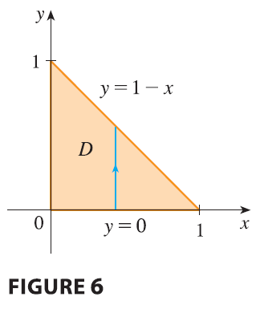

$$
E = \{(x, y, z) | 0 \le x \le 1, 0 \le y \le 1 - x, 0 \le z \le 1 - x - y\}
\tag{9}
$$
This description of $E$ as a type 1 region enables us to evaluate the integral as follows:
$$
\iiint_E z dV = \int_0^1 \int_0^{1-x} \int_0^{1-x-y} z dz dy dx = \int_0^1 \int_0^{1-x} \left[ \frac{z^2}{2} \right]_{z=0}^{z=1-x-y} dy dx
$$
$$
= \frac{1}{2} \int_0^1 \int_0^{1-x} (1 - x - y)^2 dy dx = \frac{1}{2} \int_0^1 \left[ -\frac{(1 - x - y)^3}{3} \right]_{y=0}^{y=1-x} dx
$$
$$
= \frac{1}{6} \int_0^1 (1 - x)^3 dx = \frac{1}{6} \left[ -\frac{(1 - x)^4}{4} \right]_0^1 = \frac{1}{24}
$$

</ans>

</page>

<page>

# Type 2 - volume

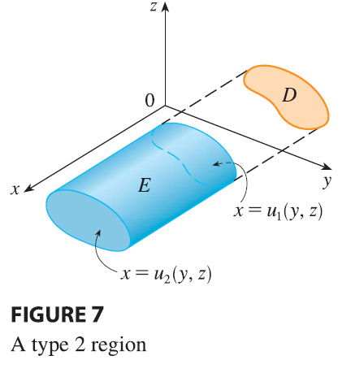

A solid region $E$ is of **type 2** if it is of the form
$$
E = \{(x, y, z) | (y, z) \in D, u_1(y, z) \le x \le u_2(y, z)\}
$$
where, this time, $D$ is the projection of $E$ onto the $yz$-plane (see Figure 7). The back surface is $x = u_1(y, z)$, the front surface is $x = u_2(y, z)$, and we have
$$
\iiint_E f(x, y, z) dV = \iint_D \left[ \int_{u_1(y,z)}^{u_2(y,z)} f(x, y, z) dx \right] dA
\tag{10}
$$

</page>

<page>

# Type 3 volume

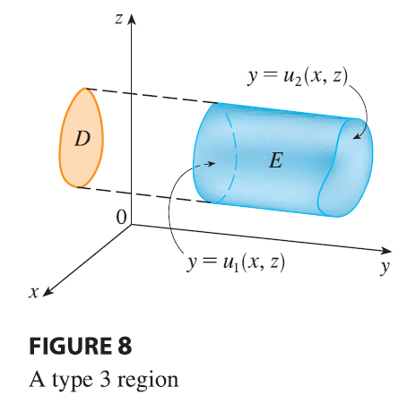

Finally, a **type 3** region is of the form
$$
E = \{(x, y, z) | (x, z) \in D, u_1(x, z) \le y \le u_2(x, z)\}
$$
where $D$ is the projection of $E$ onto the $xz$-plane, $y = u_1(x, z)$ is the left surface, and $y = u_2(x, z)$ is the right surface (see Figure 8). For this type of region we have
$$
\iiint_E f(x, y, z) dV = \iint_D \left[ \int_{u_1(x,z)}^{u_2(x,z)} f(x, y, z) dy \right] dA
\tag{11}
$$
In each of Equations 10 and 11 there may be two possible expressions for the integral depending on whether $D$ is a type I or type II plane region (and corresponding to Equations 7 and 8).

</page>

<page>

# Example 

**EXAMPLE 3** Evaluate $\iiint_E \sqrt{x^2 + z^2} dV$, where $E$ is the region bounded by the paraboloid $y = x^2 + z^2$ and the plane $y = 4$.

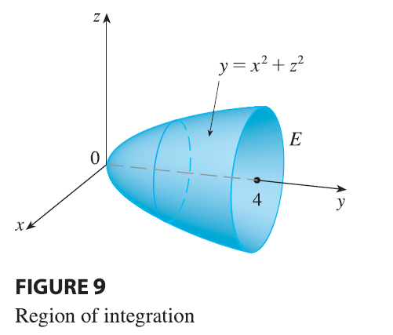

<ans>

**SOLUTION** The solid $E$ is shown in Figure 9. If we regard it as a type 1 region, then we need to consider its projection $D_1$ onto the $xy$-plane, which is the parabolic region in Figure 10.
From $y = x^2 + z^2$ we obtain $z = \pm\sqrt{y - x^2}$, so the lower boundary surface of $E$ is $z = -\sqrt{y - x^2}$ and the upper surface is $z = \sqrt{y - x^2}$. Therefore the description of $E$ as a type 1 region is

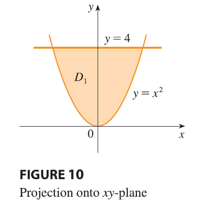

$$
E = \{(x, y, z) | -2 \le x \le 2, x^2 \le y \le 4, -\sqrt{y - x^2} \le z \le \sqrt{y - x^2}\}
$$
and so we obtain
$$
\iiint_E \sqrt{x^2 + z^2} dV = \int_{-2}^2 \int_{x^2}^4 \int_{-\sqrt{y-x^2}}^{\sqrt{y-x^2}} \sqrt{x^2 + z^2} dz dy dx
$$
Although this expression is correct, it is extremely difficult to evaluate. So let’s instead consider $E$ as a type 3 region. As such, its projection $D_3$ onto the $xz$-plane is the disk $x^2 + z^2 \le 4$ shown in Figure 11.

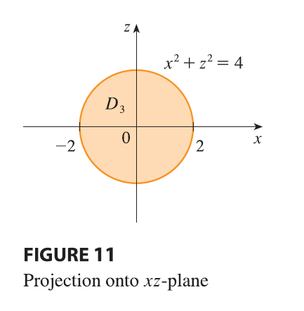

Then the left boundary of $E$ is the paraboloid $y = x^2 + z^2$ and the right boundary is the plane $y = 4$, so taking $u_1(x, z) = x^2 + z^2$ and $u_2(x, z) = 4$ in Equation 11, we have
$$
\iiint_E \sqrt{x^2 + z^2} dV = \iint_{D_3} \left[ \int_{x^2+z^2}^4 \sqrt{x^2 + z^2} dy \right] dA = \iint_{D_3} (4 - x^2 - z^2)\sqrt{x^2 + z^2} dA
$$
Although this integral could be written as
$$
\int_{-2}^2 \int_{-\sqrt{4-x^2}}^{\sqrt{4-x^2}} (4 - x^2 - z^2)\sqrt{x^2 + z^2} dz dx
$$
it’s easier to convert to polar coordinates in the $xz$-plane: $x = r \cos \theta, z = r \sin \theta$. This gives
$$
\iiint_E \sqrt{x^2 + z^2} dV = \iint_{D_3} (4 - x^2 - z^2)\sqrt{x^2 + z^2} dA
$$
$$
= \int_0^{2\pi} \int_0^2 (4 - r^2)r \cdot r dr d\theta = \int_0^{2\pi} d\theta \int_0^2 (4r^2 - r^4) dr
$$
$$
= 2\pi \left[ \frac{4r^3}{3} - \frac{r^5}{5} \right]_0^2 = 2\pi \left( \frac{32}{3} - \frac{32}{5} \right) = \frac{128\pi}{15}
$$

</ans>
</page>

<page>

# Example 

**EXAMPLE 4** Express the iterated integral $\int_0^1 \int_0^{x^2} \int_0^y f(x, y, z) dz dy dx$ as a triple integral and then rewrite it as an iterated integral in a different order, integrating first with respect to $x$, then $z$, and then $y$.

<ans>

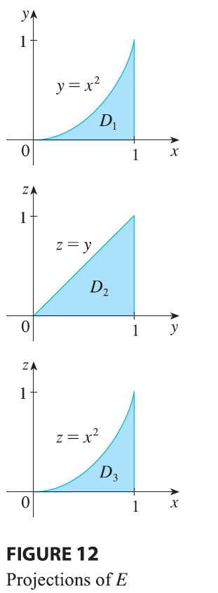

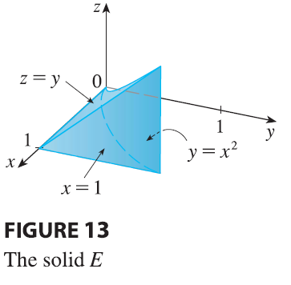

**SOLUTION** We can write
$$
\int_0^1 \int_0^{x^2} \int_0^y f(x, y, z) dz dy dx = \iiint_E f(x, y, z) dV
$$
where $E = \{(x, y, z) | 0 \le x \le 1, 0 \le y \le x^2, 0 \le z \le y\}$. This description of $E$ enables us to write projections onto the three coordinate planes as follows:
on the $xy$-plane: $D_1 = \{(x, y) | 0 \le x \le 1, 0 \le y \le x^2\} = \{(x, y) | 0 \le y \le 1, \sqrt{y} \le x \le 1\}$
on the $yz$-plane: $D_2 = \{(y, z) | 0 \le y \le 1, 0 \le z \le y\}$
on the $xz$-plane: $D_3 = \{(x, z) | 0 \le x \le 1, 0 \le z \le x^2\}$
From the resulting sketches of the projections in Figure 12 we sketch the solid $E$ in Figure 13. We see that it is the solid enclosed by the planes $z = 0, x = 1, y = z$ and the parabolic cylinder $y = x^2$ (or $x = \sqrt{y}$).
If we integrate first with respect to $x$, then $z$, and then $y$, we use an alternate description of $E$:
$$
E = \{(x, y, z) | 0 \le y \le 1, 0 \le z \le y, \sqrt{y} \le x \le 1\}
$$
Thus
$$
\iiint_E f(x, y, z) dV = \int_0^1 \int_0^y \int_{\sqrt{y}}^1 f(x, y, z) dx dz dy
$$

</ans>
</page>

<page>

# Applications of Triple Integrals

Recall that if $f(x) \ge 0$, then the single integral $\int_a^b f(x) dx$ represents the area under the curve $y = f(x)$ from $a$ to $b$, and if $f(x, y) \ge 0$, then the double integral $\iint_D f(x, y) dA$ represents the volume under the surface $z = f(x, y)$ and above $D$. The corresponding interpretation of a triple integral $\iiint_E f(x, y, z) dV$, where $f(x, y, z) \ge 0$, is not very useful because it would be the “hypervolume” of a four-dimensional object and, of course, that is very difficult to visualize. Nonetheless, the triple integral $\iiint_E f(x, y, z) dV$ can be interpreted in different ways in different physical situations, depending on the physical interpretations of $x, y, z,$ and $f(x, y, z)$.

Let’s begin with the special case where $f(x, y, z) = 1$ for all points in $E$. Then the triple integral does represent the volume of $E$:
$$
V(E) = \iiint_E dV
\tag{12}
$$
For example, you can see this in the case of a type 1 region by putting $f(x, y, z) = 1$ in Formula 6:
$$
\iiint_E 1 dV = \iint_D \left[ \int_{u_1(x,y)}^{u_2(x,y)} dz \right] dA = \iint_D [u_2(x, y) - u_1(x, y)] dA
$$
and from Section 15.2 we know this represents the volume that lies between the surfaces $z = u_1(x, y)$ and $z = u_2(x, y)$.

</page>

<page>

# Example 

**EXAMPLE 5** Use a triple integral to find the volume of the tetrahedron $T$ bounded by the planes $x + 2y + z = 2, x = 2y, x = 0,$ and $z = 0$.

<ans>

**SOLUTION** The tetrahedron $T$ and its projection $D$ onto the $xy$-plane are shown in Figures 14 and 15. The lower boundary of $T$ is the plane $z = 0$ and the upper boundary is the plane $x + 2y + z = 2$, that is, $z = 2 - x - 2y$.
Therefore we have
$$
V(T) = \iiint_T dV = \int_0^1 \int_{x/2}^{1-x/2} \int_0^{2-x-2y} dz dy dx
$$
$$
= \int_0^1 \int_{x/2}^{1-x/2} (2 - x - 2y) dy dx = \frac{1}{3}
$$
by the same calculation as in Example 15.2.4.

</ans>
</page>

<page>

# Other Applications of Triple integrations

All the applications of double integrals in Section 15.4 can be immediately extended to triple integrals. For example, if the density function of a solid object that occupies the region $E$ is $\rho(x, y, z)$, in units of mass per unit volume, at any given point $(x, y, z)$, then its **mass** is
$$
m = \iiint_E \rho(x, y, z) dV
\tag{13}
$$
and its **moments** about the three coordinate planes are
$$
M_{yz} = \iiint_E x\rho(x, y, z) dV \quad M_{xz} = \iiint_E y\rho(x, y, z) dV
\tag{14}
$$
$$
M_{xy} = \iiint_E z\rho(x, y, z) dV
$$
The **center of mass** is located at the point $(\bar{x}, \bar{y}, \bar{z})$, where
$$
\bar{x} = \frac{M_{yz}}{m} \quad \bar{y} = \frac{M_{xz}}{m} \quad \bar{z} = \frac{M_{xy}}{m}
\tag{15}
$$
If the density is constant, the center of mass of the solid is called the **centroid** of $E$. The **moments of inertia** about the three coordinate axes are
$$
I_x = \iiint_E (y^2 + z^2)\rho(x, y, z) dV \quad I_y = \iiint_E (x^2 + z^2)\rho(x, y, z) dV
\tag{16}
$$
$$
I_z = \iiint_E (x^2 + y^2)\rho(x, y, z) dV
$$
As in Section 15.4, the total **electric charge** on a solid object occupying a region $E$ and having charge density $\sigma(x, y, z)$ is
$$
Q = \iiint_E \sigma(x, y, z) dV
$$
If we have three continuous random variables $X, Y,$ and $Z$, their **joint density function** is a function of three variables such that the probability that $(X, Y, Z)$ lies in $E$ is
$$
P((X, Y, Z) \in E) = \iiint_E f(x, y, z) dV
$$
In particular,
$$
P(a \le X \le b, c \le Y \le d, r \le Z \le s) = \int_a^b \int_c^d \int_r^s f(x, y, z) dz dy dx
$$
The joint density function satisfies
$$
f(x, y, z) \ge 0 \quad \int_{-\infty}^\infty \int_{-\infty}^\infty \int_{-\infty}^\infty f(x, y, z) dz dy dx = 1
$$

</page>

<page>

# Example 

**EXAMPLE 6** Find the center of mass of a solid of constant density that is bounded by the parabolic cylinder $x = y^2$ and the planes $x = z, z = 0,$ and $x = 1$.

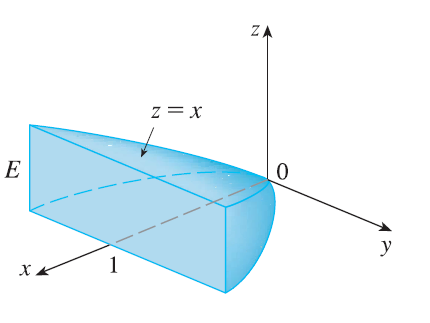

<ans>

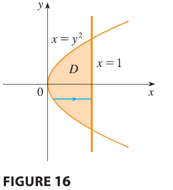

**SOLUTION** The solid $E$ and its projection onto the $xy$-plane are shown in Figure 16. The lower and upper surfaces of $E$ are the planes $z = 0$ and $z = x$, so we describe $E$ as a type 1 region:
$$
E = \{(x, y, z) | -1 \le y \le 1, y^2 \le x \le 1, 0 \le z \le x\}
$$
Then, if the density is $\rho(x, y, z) = \rho$, the mass is
$$
m = \iiint_E \rho dV = \int_{-1}^1 \int_{y^2}^1 \int_0^x \rho dz dx dy = \rho \int_{-1}^1 \int_{y^2}^1 x dx dy
$$
$$
= \rho \int_{-1}^1 \left[ \frac{x^2}{2} \right]_{x=y^2}^{x=1} dy = \frac{\rho}{2} \int_{-1}^1 (1 - y^4) dy = \rho \int_0^1 (1 - y^4) dy = \rho \left[ y - \frac{y^5}{5} \right]_0^1 = \frac{4\rho}{5}
$$
Because of the symmetry of $E$ and $\rho$ about the $xz$-plane, we can immediately say that $M_{xz} = 0$ and therefore $\bar{y} = 0$. The other moments are
$$
M_{yz} = \iiint_E x\rho dV = \int_{-1}^1 \int_{y^2}^1 \int_0^x x\rho dz dx dy = \rho \int_{-1}^1 \int_{y^2}^1 x^2 dx dy
$$
$$
= \rho \int_{-1}^1 \left[ \frac{x^3}{3} \right]_{x=y^2}^{x=1} dy = \frac{2\rho}{3} \int_0^1 (1 - y^6) dy = \frac{2\rho}{3} \left[ y - \frac{y^7}{7} \right]_0^1 = \frac{4\rho}{7}
$$
$$
M_{xy} = \iiint_E z\rho dV = \int_{-1}^1 \int_{y^2}^1 \int_0^x z\rho dz dx dy = \rho \int_{-1}^1 \int_{y^2}^1 \left[ \frac{z^2}{2} \right]_{z=0}^{z=x} dx dy
$$
$$
= \frac{\rho}{2} \int_{-1}^1 \int_{y^2}^1 x^2 dx dy = \frac{\rho}{2} \frac{4}{7} = \frac{2\rho}{7}
$$
Therefore the center of mass is
$$
(\bar{x}, \bar{y}, \bar{z}) = \left( \frac{M_{yz}}{m}, \frac{M_{xz}}{m}, \frac{M_{xy}}{m} \right) = \left( \frac{4\rho/7}{4\rho/5}, 0, \frac{2\rho/7}{4\rho/5} \right) = \left( \frac{5}{7}, 0, \frac{5}{14} \right)
$$

</ans>

</page>

