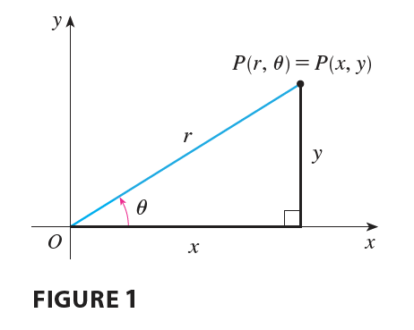
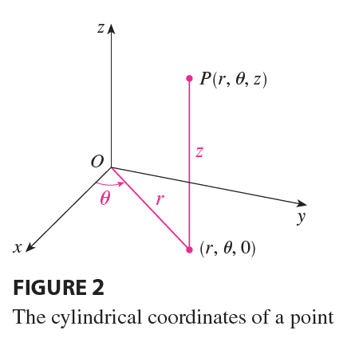
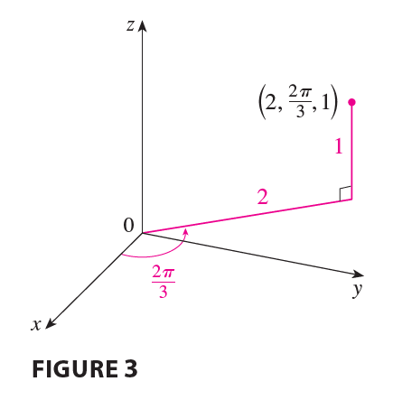
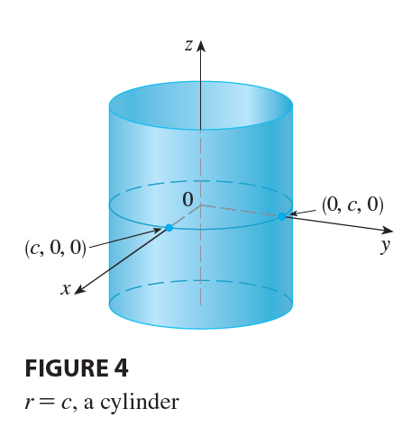
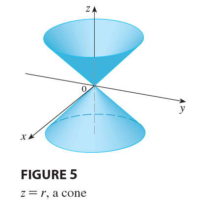
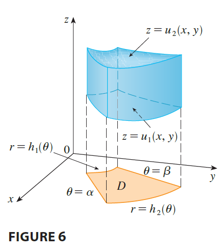
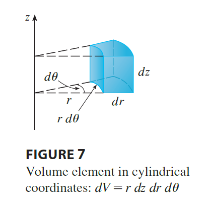
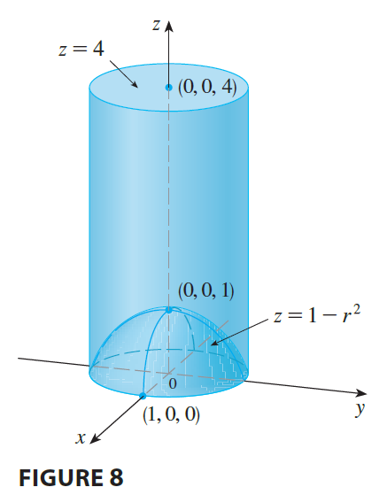
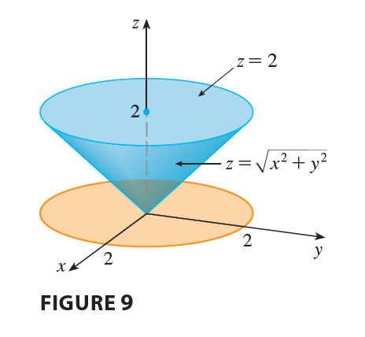

<page>

# Cylindrical Coordinates

In plane geometry the polar coordinate system is used to give a convenient description of certain curves and regions. (See Section 10.3.) 

Figure 1 enables us to recall the connection between polar and Cartesian coordinates. If the point P has Cartesian coordinates $(x, y)$ and polar coordinates $(r, \theta)$, then, from the figure,

$$
x = r \cos \theta \qquad y = r \sin \theta
$$

$$
r^2 = x^2 + y^2 \qquad \tan \theta = \frac{y}{x}
$$

In three dimensions there is a coordinate system, called **cylindrical coordinates**, that is similar to polar coordinates and gives convenient descriptions of some commonly occurring surfaces and solids. As we will see, some triple integrals are much easier to evaluate in cylindrical coordinates.

## Cylindrical Coordinates

In the cylindrical coordinate system, a point P in three-dimensional space is represented by the ordered triple $(r, \theta, z)$, where r and $\theta$ are polar coordinates of the projection of P onto the xy-plane and z is the directed distance from the xy-plane to P. (See Figure 2.)

To convert from cylindrical to rectangular coordinates, we use the equations

$$
x = r \cos \theta \qquad y = r \sin \theta \qquad z = z \tag{1}
$$

whereas to convert from rectangular to cylindrical coordinates, we use

$$
r^2 = x^2 + y^2 \qquad \tan \theta = \frac{y}{x} \qquad z = z \tag{2}
$$

--------

**EXAMPLE 1** 
(a) Plot the point with cylindrical coordinates $(2, 2\pi/3, 1)$ and find its rectangular coordinates.
(b) Find cylindrical coordinates of the point with rectangular coordinates $(3, -3, -7)$.

<ans>

**SOLUTION**

(a) The point with cylindrical coordinates $(2, 2\pi/3, 1)$ is plotted in Figure 3. From Equations 1, its rectangular coordinates are
$$
x = 2 \cos \frac{2\pi}{3} = 2\left(-\frac{1}{2}\right) = -1
$$
$$
y = 2 \sin \frac{2\pi}{3} = 2\left(\frac{\sqrt{3}}{2}\right) = \sqrt{3}
$$
$$
z = 1
$$
So the point is $(-1, \sqrt{3}, 1)$ in rectangular coordinates.
(b) From Equations 2 we have
$$
r = \sqrt{3^2 + (-3)^2} = 3\sqrt{2}
$$
$$
\tan \theta = \frac{-3}{3} = -1 \quad \text{so} \quad \theta = \frac{7\pi}{4} + 2n\pi
$$
$$
z = -7
$$
Therefore one set of cylindrical coordinates is $(3\sqrt{2}, 7\pi/4, -7)$. Another is $(3\sqrt{2}, -\pi/4, -7)$. As with polar coordinates, there are infinitely many choices.

</ans>

</page>

<page>

# Equation of surfaces in Cylindrical Coordinates

Cylindrical coordinates are useful in problems that involve symmetry about an axis, and the z-axis is chosen to coincide with this axis of symmetry. For instance, the axis of the circular cylinder with Cartesian equation $x^2 + y^2 = c^2$ is the z-axis. In cylindrical coordinates this cylinder has the very simple equation $r=c$. (See Figure 4.) This is the reason for the name "cylindrical" coordinates.

-------------

**EXAMPLE 2** Describe the surface whose equation in cylindrical coordinates is $z=r$.

<ans>

**SOLUTION** 

The equation says that the z-value, or height, of each point on the surface is the same as r, the distance from the point to the z-axis. Because $\theta$ doesn't appear, it can vary. So any horizontal trace in the plane $z=k$ ($k>0$) is a circle of radius k. These traces suggest that the surface is a cone. This prediction can be confirmed by converting the equation into rectangular coordinates. From the first equation in (2) we have
$$
z^2 = r^2 = x^2 + y^2
$$
We recognize the equation $z^2 = x^2 + y^2$ (by comparison with Table 1 in Section 12.6) as being a circular cone whose axis is the z-axis (see Figure 5).

</ans>

</page>

<page>

# Evaluating Triple Integrals with Cylindrical Coordinates

Suppose that E is a type 1 region whose projection D onto the xy-plane is conveniently described in polar coordinates (see Figure 6). 

In particular, suppose that f is continuous and
$$
E = \{(x, y, z) | (x, y) \in D, u_1(x, y) \le z \le u_2(x, y)\}
$$
where D is given in polar coordinates by
$$
D = \{(r, \theta) | \alpha \le \theta \le \beta, h_1(\theta) \le r \le h_2(\theta)\}
$$
We know from Equation 15.6.6 that

$$
\iiint_E f(x, y, z) dV = \iint_D \left[ \int_{u_1(x,y)}^{u_2(x,y)} f(x, y, z) dz \right] dA \tag{3}
$$

But we also know how to evaluate double integrals in polar coordinates. In fact, combining Equation 3 with Equation 15.3.3, we obtain

>$$
\iiint_E f(x, y, z) dV = \int_\alpha^\beta \int_{h_1(\theta)}^{h_2(\theta)} \int_{u_1(r\cos\theta, r\sin\theta)}^{u_2(r\cos\theta, r\sin\theta)} f(r\cos\theta, r\sin\theta, z) r dz dr d\theta \tag{4}
$$

Formula 4 is the formula for triple integration in cylindrical coordinates. It says that we convert a triple integral from rectangular to cylindrical coordinates by writing $x = r\cos\theta$, $y = r\sin\theta$, leaving z as it is, using the appropriate limits of integration for z, r, and $\theta$, and replacing dV by $r dz dr d\theta$. (Figure 7 shows how to remember this.) It is worthwhile to use this formula when E is a solid region easily described in cylindrical coordinates, and especially when the function $f(x, y, z)$ involves the expression $x^2 + y^2$.

-------

**EXAMPLE 3** A solid E lies within the cylinder $x^2 + y^2 = 1$, below the plane $z=4$, and above the paraboloid $z = 1 - x^2 - y^2$. (See Figure 8.) The density at any point is proportional to its distance from the axis of the cylinder. Find the mass of E.

<ans>

**SOLUTION** In cylindrical coordinates the cylinder is $r=1$ and the paraboloid is $z = 1 - r^2$, so we can write
$$
E = \{(r, \theta, z) | 0 \le \theta \le 2\pi, 0 \le r \le 1, 1-r^2 \le z \le 4\}
$$
Since the density at $(x, y, z)$ is proportional to the distance from the z-axis, the density function is
$$
f(x, y, z) = K\sqrt{x^2+y^2} = Kr
$$
where K is the proportionality constant. Therefore, from Formula 15.6.13, the mass of E is
$$
m = \iiint_E K\sqrt{x^2+y^2} dV = \int_0^{2\pi} \int_0^1 \int_{1-r^2}^4 (Kr) r dz dr d\theta
$$
$$
= \int_0^{2\pi} \int_0^1 Kr^2[z]_{1-r^2}^4 dr d\theta = \int_0^{2\pi} \int_0^1 Kr^2[4-(1-r^2)] dr d\theta
$$
$$
= K \int_0^{2\pi} d\theta \int_0^1 (3r^2+r^4) dr = 2\pi K \left[r^3 + \frac{r^5}{5}\right]_0^1 = 2\pi K \left(1 + \frac{1}{5}\right) = \frac{12\pi K}{5}
$$

</ans>

--------------

**EXAMPLE 4** Evaluate $\int_{-2}^2 \int_{-\sqrt{4-x^2}}^{\sqrt{4-x^2}} \int_{\sqrt{x^2+y^2}}^2 (x^2+y^2) dz dy dx$.

<ans>

**SOLUTION** This iterated integral is a triple integral over the solid region
$$
E = \{(x, y, z) | -2 \le x \le 2, -\sqrt{4-x^2} \le y \le \sqrt{4-x^2}, \sqrt{x^2+y^2} \le z \le 2\}
$$
and the projection of E onto the xy-plane is the disk $x^2+y^2 \le 4$. The lower surface of E is the cone $z = \sqrt{x^2+y^2}$ and its upper surface is the plane $z=2$. (See Figure 9.) 

This region has a much simpler description in cylindrical coordinates:
$$
E = \{(r, \theta, z) | 0 \le \theta \le 2\pi, 0 \le r \le 2, r \le z \le 2\}
$$
Therefore we have
$$
\int_{-2}^2 \int_{-\sqrt{4-x^2}}^{\sqrt{4-x^2}} \int_{\sqrt{x^2+y^2}}^2 (x^2+y^2) dz dy dx = \iiint_E (x^2+y^2) dV
$$
$$
= \int_0^{2\pi} \int_0^2 \int_r^2 r^2 r dz dr d\theta = \int_0^{2\pi} \int_0^2 r^3[z]_r^2 dr d\theta
$$
$$
= \int_0^{2\pi} d\theta \int_0^2 r^3(2-r) dr = 2\pi \left[ \frac{1}{2}r^4 - \frac{1}{5}r^5 \right]_0^2 = 2\pi\left(8 - \frac{32}{5}\right) = \frac{16\pi}{5}
$$

</ans>

</page>