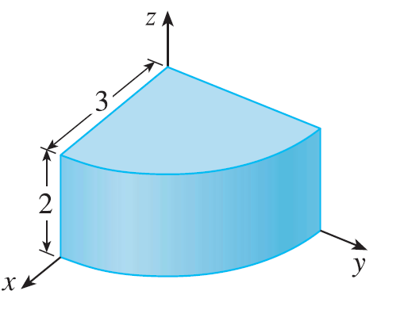
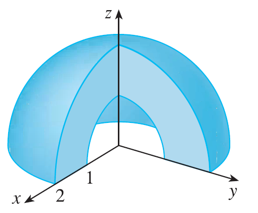
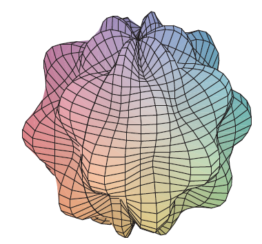

<page>

# Exercise 1

Plot the point whose spherical coordinates are given. Then find the rectangular coordinates of the point.
(a) $(6, \pi/3, \pi/6)$
(b) $(3, \pi/2, 3\pi/4)$

</page>

<page>

# Exercise 2

Plot the point whose spherical coordinates are given. Then find the rectangular coordinates of the point.
(a) $(2, \pi/2, \pi/2)$
(b) $(4, -\pi/4, \pi/3)$

</page>

<page>

# Exercise 3

Change from rectangular to spherical coordinates.
(a) $(0, -2, 0)$
(b) $(-1, 1, -\sqrt{2})$

</page>

<page>

# Exercise 4

Change from rectangular to spherical coordinates.
(a) $(1, 0, \sqrt{3})$
(b) $(\sqrt{3}, -1, 2\sqrt{3})$

</page>

<page>

# Exercise 5

Describe in words the surface whose equation is given.
$\phi = \pi/3$

</page>

<page>

# Exercise 6

Describe in words the surface whose equation is given.
$\rho^2 - 3\rho + 2 = 0$

</page>

<page>

# Exercise 7

Identify the surface whose equation is given.
$\rho\cos\phi = 1$

</page>

<page>

# Exercise 8

Identify the surface whose equation is given.
$\rho = \cos\phi$

</page>

<page>

# Exercise 9

Write the equation in spherical coordinates.
(a) $x^2+y^2+z^2 = 9$
(b) $x^2-y^2-z^2 = 1$

</page>

<page>

# Exercise 10

Write the equation in spherical coordinates.
(a) $z = x^2+y^2$
(b) $z = x^2-y^2$

</page>

<page>

# Exercise 11

Sketch the solid described by the given inequalities.
$\rho \le 1, 0 \le \phi \le \pi/6, 0 \le \theta \le \pi$

</page>

<page>

# Exercise 12

Sketch the solid described by the given inequalities.
$1 \le \rho \le 2, \pi/2 \le \phi \le \pi$

</page>

<page>

# Exercise 13

Sketch the solid described by the given inequalities.
$2 \le \rho \le 4, 0 \le \phi \le \pi/3, 0 \le \theta \le \pi$

</page>

<page>

# Exercise 14

Sketch the solid described by the given inequalities.
$\rho \le 2, \rho \le \csc\phi$

</page>

<page>

# Exercise 15

A solid lies above the cone $z = \sqrt{x^2+y^2}$ and below the sphere $x^2+y^2+z^2=z$. Write a description of the solid in terms of inequalities involving spherical coordinates.

</page>

<page>

# Exercise 16

(a) Find inequalities that describe a hollow ball with diameter 30 cm and thickness 0.5 cm. Explain how you have positioned the coordinate system that you have chosen.
(b) Suppose the ball is cut in half. Write inequalities that describe one of the halves.

</page>

<page>

# Exercise 17

Sketch the solid whose volume is given by the integral and evaluate the integral.
$$ \int_0^{\pi/6} \int_0^{\pi/2} \int_0^3 \rho^2 \sin\phi \, d\rho \, d\theta \, d\phi $$

</page>

<page>

# Exercise 18

Sketch the solid whose volume is given by the integral and evaluate the integral.
$$ \int_0^{\pi/4} \int_0^{2\pi} \int_0^{\sec\phi} \rho^2 \sin\phi \, d\rho \, d\theta \, d\phi $$

</page>

<page>

# Exercise 19

Set up the triple integral of an arbitrary continuous function $f(x, y, z)$ in cylindrical or spherical coordinates over the solid shown.

</page>

<page>

# Exercise 20

Set up the triple integral of an arbitrary continuous function $f(x, y, z)$ in cylindrical or spherical coordinates over the solid shown.

</page>

<page>

# Exercise 21

Use spherical coordinates.
Evaluate $\iiint_B (x^2+y^2+z^2)^2 dV$, where B is the ball with center the origin and radius 5.

</page>

<page>

# Exercise 22

Use spherical coordinates.
Evaluate $\iiint_E y^2z^2 dV$, where E lies above the cone $\phi = \pi/3$ and below the sphere $\rho=1$.

</page>

<page>

# Exercise 23

Use spherical coordinates.
Evaluate $\iiint_E (x^2+y^2) dV$, where E lies between the spheres $x^2+y^2+z^2=4$ and $x^2+y^2+z^2=9$.

</page>

<page>

# Exercise 24

Use spherical coordinates.
Evaluate $\iiint_E y^2 dV$, where E is the solid hemisphere $x^2+y^2+z^2 \le 9, y \ge 0$.

</page>

<page>

# Exercise 25

Use spherical coordinates.
Evaluate $\iiint_E xe^{x^2+y^2+z^2} dV$, where E is the portion of the unit ball $x^2+y^2+z^2 \le 1$ that lies in the first octant.

</page>

<page>

# Exercise 26

Use spherical coordinates.
Evaluate $\iiint_E \sqrt{x^2+y^2+z^2} dV$, where E lies above the cone $z=\sqrt{x^2+y^2}$ and between the spheres $x^2+y^2+z^2=1$ and $x^2+y^2+z^2=4$.

</page>

<page>

# Exercise 27

Find the volume of the part of the ball $\rho \le a$ that lies between the cones $\phi = \pi/6$ and $\phi = \pi/3$.

</page>

<page>

# Exercise 28

Find the average distance from a point in a ball of radius a to its center.

</page>

<page>

# Exercise 29

(a) Find the volume of the solid that lies above the cone $\phi = \pi/3$ and below the sphere $\rho = 4\cos\phi$.
(b) Find the centroid of the solid in part (a).

</page>

<page>

# Exercise 30

Find the volume of the solid that lies within the sphere $x^2+y^2+z^2=4$, above the xy-plane, and below the cone $z=\sqrt{x^2+y^2}$.

</page>

<page>

# Exercise 31

(a) Find the centroid of the solid in Example 4. (Assume constant density K.)
(b) Find the moment of inertia about the z-axis for this solid.

</page>

<page>

# Exercise 32

Let H be a solid hemisphere of radius a whose density at any point is proportional to its distance from the center of the base.
(a) Find the mass of H.
(b) Find the center of mass of H.
(c) Find the moment of inertia of H about its axis.

</page>

<page>

# Exercise 33

(a) Find the centroid of a solid homogeneous hemisphere of radius a.
(b) Find the moment of inertia of the solid in part (a) about a diameter of its base.

</page>

<page>

# Exercise 34

Find the mass and center of mass of a solid hemisphere of radius a if the density at any point is proportional to its distance from the base.

</page>

<page>

# Exercise 35

Use cylindrical or spherical coordinates, whichever seems more appropriate.
Find the volume and centroid of the solid E that lies above the cone $z=\sqrt{x^2+y^2}$ and below the sphere $x^2+y^2+z^2=1$.

</page>

<page>

# Exercise 36

Use cylindrical or spherical coordinates, whichever seems more appropriate.
Find the volume of the smaller wedge cut from a sphere of radius a by two planes that intersect along a diameter at an angle of $\pi/6$.

</page>

<page>

# Exercise 37

Use cylindrical or spherical coordinates, whichever seems more appropriate.
A solid cylinder with constant density has base radius a and height h.
(a) Find the moment of inertia of the cylinder about its axis.
(b) Find the moment of inertia of the cylinder about a diameter of its base.

</page>

<page>

# Exercise 38

Use cylindrical or spherical coordinates, whichever seems more appropriate.
A solid right circular cone with constant density has base radius a and height h.
(a) Find the moment of inertia of the cone about its axis.
(b) Find the moment of inertia of the cone about a diameter of its base.

</page>

<page>

# Exercise 39

Evaluate $\iiint_E z \, dV$, where E lies above the paraboloid $z=x^2+y^2$ and below the plane $z=2y$. Use either the Table of Integrals (on Reference Pages 6-10) or a computer algebra system to evaluate the integral.

</page>

<page>

# Exercise 40

(a) Find the volume enclosed by the torus $\rho = \sin\phi$.
(b) Use a computer to draw the torus.

</page>

<page>

# Exercise 41

Evaluate the integral by changing to spherical coordinates.
$$ \int_0^1 \int_0^{\sqrt{1-x^2}} \int_{\sqrt{x^2+y^2}}^{\sqrt{2-x^2-y^2}} xy \, dz \, dy \, dx $$

</page>

<page>

# Exercise 42

Evaluate the integral by changing to spherical coordinates.
$$ \int_{-a}^a \int_{-\sqrt{a^2-y^2}}^{\sqrt{a^2-y^2}} \int_{-\sqrt{a^2-x^2-y^2}}^{\sqrt{a^2-x^2-y^2}} (x^2z + y^2z + z^3) \, dz \, dx \, dy $$

</page>

<page>

# Exercise 43

Evaluate the integral by changing to spherical coordinates.
$$ \int_{-2}^2 \int_{-\sqrt{4-x^2}}^{\sqrt{4-x^2}} \int_{2-\sqrt{4-x^2-y^2}}^{2+\sqrt{4-x^2-y^2}} (x^2+y^2+z^2)^{3/2} \, dz \, dy \, dx $$

</page>

<page>

# Exercise 44

A model for the density $\delta$ of the earth's atmosphere near its surface is
$$ \delta = 619.09 - 0.000097\rho $$
where $\rho$ (the distance from the center of the earth) is measured in meters and $\delta$ is measured in kilograms per cubic meter. If we take the surface of the earth to be a sphere with radius 6370 km, then this model is a reasonable one for $6.370 \times 10^6 \le \rho \le 6.375 \times 10^6$. Use this model to estimate the mass of the atmosphere between the ground and an altitude of 5 km.

</page>

<page>

# Exercise 45

Use a graphing device to draw a silo consisting of a cylinder with radius 3 and height 10 surmounted by a hemisphere.

</page>

<page>

# Exercise 46

The latitude and longitude of a point P in the Northern Hemisphere are related to spherical coordinates $\rho, \theta, \phi$ as follows. We take the origin to be the center of the earth and the positive z-axis to pass through the North Pole. The positive x-axis passes through the point where the prime meridian (the meridian through Greenwich, England) intersects the equator. Then the latitude of P is $\alpha = 90^\circ - \phi^\circ$ and the longitude is $\beta = 360^\circ - \theta^\circ$. Find the great-circle distance from Los Angeles (lat. 34.06 N, long. 118.25 W) to Montreal (lat. 45.50 N, long. 73.60 W). Take the radius of the earth to be 3960 mi. (A great circle is the circle of intersection of a sphere and a plane through the center of the sphere.)

</page>

<page>

# Exercise 47

The surfaces $\rho = 1 + \frac{1}{5}\sin(m\theta)\sin(n\phi)$ have been used as models for tumors. The "bumpy sphere" with $m=6$ and $n=5$ is shown. Use a computer algebra system to find the volume it encloses.

</page>

<page>

# Exercise 48

Show that
$$ \int_{-\infty}^\infty \int_{-\infty}^\infty \int_{-\infty}^\infty \sqrt{x^2+y^2+z^2} e^{-(x^2+y^2+z^2)} \, dx \, dy \, dz = 2\pi $$
(The improper triple integral is defined as the limit of a triple integral over a solid sphere as the radius of the sphere increases indefinitely.)

</page>

<page>

# Exercise 49

(a) Use cylindrical coordinates to show that the volume of the solid bounded above by the sphere $r^2+z^2=a^2$ and below by the cone $z=r\cot\phi_0$ (or $\phi=\phi_0$), where $0 < \phi_0 < \pi/2$, is
$$ V = \frac{2\pi a^3}{3}(1-\cos\phi_0) $$
(b) Deduce a that the volume of the spherical wedge given by $\rho_1 \le \rho \le \rho_2, \theta_1 \le \theta \le \theta_2, \phi_1 \le \phi \le \phi_2$ is
$$ \Delta V = \frac{\rho_2^3 - \rho_1^3}{3}(\cos\phi_1 - \cos\phi_2)(\theta_2 - \theta_1). $$
(c) Use the Mean Value Theorem to show that the volume in part (b) can be written as
$$ \Delta V = \tilde{\rho}^2 \sin\tilde{\phi} \, \Delta\rho \, \Delta\theta \, \Delta\phi $$
where $\tilde{\rho}$ lies between $\rho_1$ and $\rho_2$, $\tilde{\phi}$ lies between $\phi_1$ and $\phi_2$, $\Delta\rho = \rho_2 - \rho_1$, $\Delta\theta = \theta_2 - \theta_1$, and $\Delta\phi = \phi_2 - \phi_1$.

</page>
