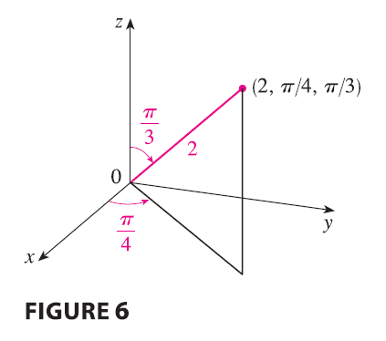

<page>

# Spherical Coordinates

Another useful coordinate system in three dimensions is the **spherical coordinate system**. It simplifies the evaluation of triple integrals over regions bounded by spheres or cones.

The **spherical coordinates** $(\rho, \theta, \phi)$ of a point P in space are shown in Figure 1, where $\rho = |OP|$ is the distance from the origin to P, $\theta$ is the same angle as in cylindrical coordinates, and $\phi$ is the angle between the positive z-axis and the line segment OP. Note that
$$
\rho \ge 0 \qquad 0 \le \phi \le \pi
$$

The spherical coordinate system is especially useful in problems where there is symmetry about a point, and the origin is placed at this point. For example, the sphere with center the origin and radius c has the simple equation $\rho = c$ (see Figure 2); this is the reason for the name "spherical" coordinates. 

The graph of the equation $\theta = c$ is a vertical half-plane (see Figure 3), and the equation $\phi = c$ represents a half-cone with the z-axis as its axis (see Figure 4).

</page>

<page>

# Relationship between Spherical and Rectangular coordinates

The relationship between rectangular and spherical coordinates can be seen from Figure 5.

From triangles OPQ and OPP' we have
$$
z = \rho \cos \phi \qquad r = \rho \sin \phi
$$
But $x = r \cos \theta$ and $y = r \sin \theta$, so to convert from spherical to rectangular coordinates, we use the equations

$$
x = \rho \sin \phi \cos \theta \qquad y = \rho \sin \phi \sin \theta \qquad z = \rho \cos \phi \tag{1}
$$

Also, the distance formula shows that

$$
\rho^2 = x^2 + y^2 + z^2 \tag{2}
$$

We use this equation in converting from rectangular to spherical coordinates.

---------

**EXAMPLE 1** The point $(2, \pi/4, \pi/3)$ is given in spherical coordinates. Plot the point and find its rectangular coordinates.

<ans>

**SOLUTION** We plot the point in Figure 6. From Equations 1 we have
$$
x = \rho \sin \phi \cos \theta = 2 \sin \frac{\pi}{3} \cos \frac{\pi}{4} = 2\left(\frac{\sqrt{3}}{2}\right)\left(\frac{1}{\sqrt{2}}\right) = \sqrt{\frac{3}{2}}
$$
$$
y = \rho \sin \phi \sin \theta = 2 \sin \frac{\pi}{3} \sin \frac{\pi}{4} = 2\left(\frac{\sqrt{3}}{2}\right)\left(\frac{1}{\sqrt{2}}\right) = \sqrt{\frac{3}{2}}
$$
$$
z = \rho \cos \phi = 2 \cos \frac{\pi}{3} = 2\left(\frac{1}{2}\right) = 1
$$
Thus the point $(2, \pi/4, \pi/3)$ is $(\sqrt{3/2}, \sqrt{3/2}, 1)$ in rectangular coordinates.

</ans>

-----------

**EXAMPLE 2** The point $(0, 2\sqrt{3}, -2)$ is given in rectangular coordinates. Find spherical coordinates for this point.

<ans>

**SOLUTION** From Equation 2 we have
$$
\rho = \sqrt{x^2+y^2+z^2} = \sqrt{0 + 12 + 4} = 4
$$
and so Equations 1 give
$$
\cos \phi = \frac{z}{\rho} = \frac{-2}{4} = -\frac{1}{2} \qquad \phi = \frac{2\pi}{3}
$$
$$
\cos \theta = \frac{x}{\rho \sin \phi} = 0 \qquad \theta = \frac{\pi}{2}
$$
(Note that $\theta \neq 3\pi/2$ because $y = 2\sqrt{3} > 0$.) Therefore spherical coordinates of the given point are $(4, \pi/2, 2\pi/3)$.

</ans>

</page>

<page>

# Triple Integrals with Spherical Coordinates

In the spherical coordinate system the counterpart of a rectangular box is a **spherical wedge**
$$
E = \{(\rho, \theta, \phi) | a \le \rho \le b, \alpha \le \theta \le \beta, c \le \phi \le d\}
$$
where $a \ge 0$ and $\beta - \alpha \le 2\pi$, and $d-c \le \pi$. Although we defined triple integrals by dividing solids into small boxes, it can be shown that dividing a solid into small spherical wedges always gives the same result. So we divide E into smaller spherical wedges $E_{ijk}$ by means of equally spaced spheres $\rho = \rho_i$, half-planes $\theta = \theta_j$, and half-cones $\phi = \phi_k$. 

Figure 7 shows that $E_{ijk}$ is approximately a rectangular box with dimensions $\Delta\rho$, $\rho_i \Delta\phi$ (arc of a circle with radius $\rho_i$, angle $\Delta\phi$), and $\rho_i \sin\phi_k \Delta\theta$ (arc of a circle with radius $\rho_i \sin\phi_k$, angle $\Delta\theta$). So an approximation to the volume of $E_{ijk}$ is given by
$$
\Delta V_{ijk} \approx (\Delta\rho)(\rho_i \Delta\phi)(\rho_i \sin\phi_k \Delta\theta) = \rho_i^2 \sin\phi_k \Delta\rho \Delta\theta \Delta\phi
$$
In fact, it can be shown, with the aid of the Mean Value Theorem (Exercise 49), that the volume of $E_{ijk}$ is given exactly by
$$
\Delta V_{ijk} = \tilde{\rho_i}^2 \sin\tilde{\phi_k} \Delta\rho \Delta\theta \Delta\phi
$$
where $(\tilde{\rho_i}, \tilde{\theta_j}, \tilde{\phi_k})$ is some point in $E_{ijk}$. Let $(x_{ijk}, y_{ijk}, z_{ijk})$ be the rectangular coordinates of this point. Then
$$
\iiint_E f(x, y, z) dV = \lim_{l,m,n \to \infty} \sum_{i=1}^l \sum_{j=1}^m \sum_{k=1}^n f(x_{ijk}, y_{ijk}, z_{ijk}) \Delta V_{ijk}
$$
$$
= \lim_{l,m,n \to \infty} \sum_{i=1}^l \sum_{j=1}^m \sum_{k=1}^n f(\tilde{\rho_i}\sin\tilde{\phi_k}\cos\tilde{\theta_j}, \tilde{\rho_i}\sin\tilde{\phi_k}\sin\tilde{\theta_j}, \tilde{\rho_i}\cos\tilde{\phi_k}) \tilde{\rho_i}^2 \sin\tilde{\phi_k} \Delta\rho \Delta\theta \Delta\phi
$$
But this sum is a Riemann sum for the function
$$
F(\rho, \theta, \phi) = f(\rho\sin\phi\cos\theta, \rho\sin\phi\sin\theta, \rho\cos\phi)\rho^2\sin\phi
$$

> Consequently, we have arrived at the following formula for triple integration in spherical coordinates.
$$
\iiint_E f(x, y, z) dV = \int_c^d \int_\alpha^\beta \int_a^b f(\rho\sin\phi\cos\theta, \rho\sin\phi\sin\theta, \rho\cos\phi)\rho^2\sin\phi d\rho d\theta d\phi \tag{3}
$$
where E is a spherical wedge given by
$$
E = \{(\rho, \theta, \phi) | a \le \rho \le b, \alpha \le \theta \le \beta, c \le \phi \le d\}
$$

Formula 3 says that we convert a triple integral from rectangular coordinates to spherical coordinates by writing
$$
x = \rho\sin\phi\cos\theta \qquad y = \rho\sin\phi\sin\theta \qquad z = \rho\cos\phi
$$
using the appropriate limits of integration, and replacing dV by $\rho^2\sin\phi d\rho d\theta d\phi$. This is illustrated in Figure 8.

-------------

This formula can be extended to include more general spherical regions such as
$$
E = \{(\rho, \theta, \phi) | \alpha \le \theta \le \beta, c \le \phi \le d, g_1(\theta, \phi) \le \rho \le g_2(\theta, \phi)\}
$$
In this case the formula is the same as in (3) except that the limits of integration for $\rho$ are $g_1(\theta, \phi)$ and $g_2(\theta, \phi)$.
Usually, spherical coordinates are used in triple integrals when surfaces such as cones and spheres form the boundary of the region of integration.

---------

**EXAMPLE 3** Evaluate $\iiint_B e^{(x^2+y^2+z^2)^{3/2}} dV$, where B is the unit ball:
$$
B = \{(x, y, z) | x^2+y^2+z^2 \le 1\}
$$

<ans>

**SOLUTION** Since the boundary of B is a sphere, we use spherical coordinates:
$$
B = \{(\rho, \theta, \phi) | 0 \le \rho \le 1, 0 \le \theta \le 2\pi, 0 \le \phi \le \pi\}
$$
In addition, spherical coordinates are appropriate because
$$
x^2+y^2+z^2 = \rho^2
$$
Thus (3) gives
$$
\iiint_B e^{(x^2+y^2+z^2)^{3/2}} dV = \int_0^\pi \int_0^{2\pi} \int_0^1 e^{(\rho^2)^{3/2}} \rho^2 \sin\phi d\rho d\theta d\phi
$$
$$
= \int_0^\pi \sin\phi d\phi \int_0^{2\pi} d\theta \int_0^1 \rho^2 e^{\rho^3} d\rho
$$
$$
= [-\cos\phi]_0^\pi (2\pi) [\frac{1}{3}e^{\rho^3}]_0^1 = 2(2\pi)\frac{1}{3}(e-1) = \frac{4\pi}{3}(e-1)
$$

> **NOTE** It would have been extremely awkward to evaluate the integral in Example 3 without spherical coordinates. In rectangular coordinates the iterated integral would have been
> $$
> \int_{-1}^1 \int_{-\sqrt{1-x^2}}^{\sqrt{1-x^2}} \int_{-\sqrt{1-x^2-y^2}}^{\sqrt{1-x^2-y^2}} e^{(x^2+y^2+z^2)^{3/2}} dz dy dx
> $$

</ans>

----------

**EXAMPLE 4** Use spherical coordinates to find the volume of the solid that lies above the cone $z = \sqrt{x^2+y^2}$ and below the sphere $x^2+y^2+z^2=z$. (See Figure 9.)

<ans>

**SOLUTION** Notice that the sphere passes through the origin and has center $(0, 0, 1/2)$. We write the equation of the sphere in spherical coordinates as
$$
\rho^2 = \rho\cos\phi \quad \text{or} \quad \rho = \cos\phi
$$
The equation of the cone can be written as
$$
\rho\cos\phi = \sqrt{\rho^2\sin^2\phi\cos^2\theta + \rho^2\sin^2\phi\sin^2\theta} = \rho\sin\phi
$$
This gives $\sin\phi = \cos\phi$, or $\phi = \pi/4$. Therefore the description of the solid E in spherical coordinates is
$$
E = \{(\rho, \theta, \phi) | 0 \le \theta \le 2\pi, 0 \le \phi \le \pi/4, 0 \le \rho \le \cos\phi\}
$$

Figure 11 shows how E is swept out if we integrate first with respect to $\rho$, then $\phi$, and then $\theta$. The volume of E is
$$
V(E) = \iiint_E dV = \int_0^{2\pi} \int_0^{\pi/4} \int_0^{\cos\phi} \rho^2 \sin\phi d\rho d\phi d\theta
$$
$$
= \int_0^{2\pi} d\theta \int_0^{\pi/4} \sin\phi \left[ \frac{\rho^3}{3} \right]_0^{\cos\phi} d\phi = 2\pi \int_0^{\pi/4} \sin\phi \frac{\cos^3\phi}{3} d\phi
$$
$$
= \frac{2\pi}{3} \left[ -\frac{\cos^4\phi}{4} \right]_0^{\pi/4} = \frac{2\pi}{3} \left( -\frac{1}{4}(\frac{1}{\sqrt{2}})^4 + \frac{1}{4} \right) = \frac{2\pi}{3}\left(-\frac{1}{16}+\frac{1}{4}\right) = \frac{\pi}{8}
$$

</ans>

</page>