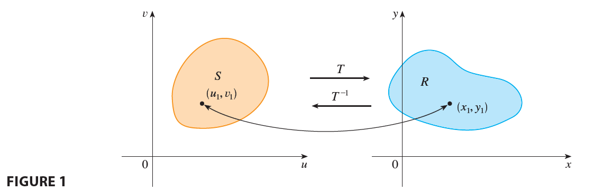
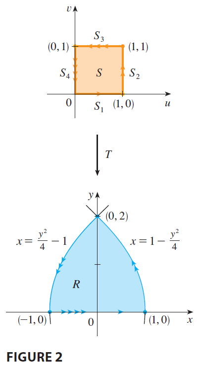
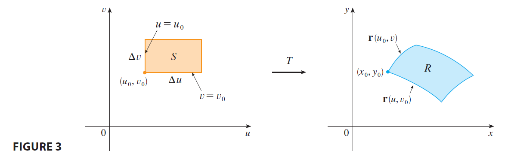
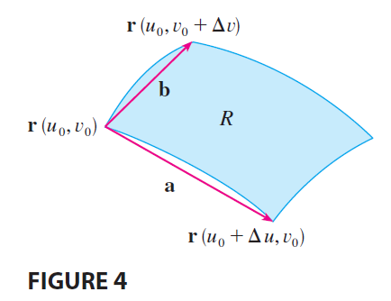
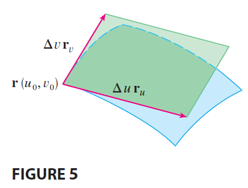
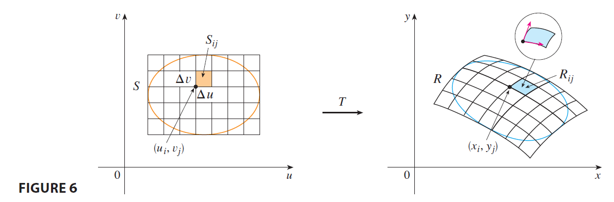
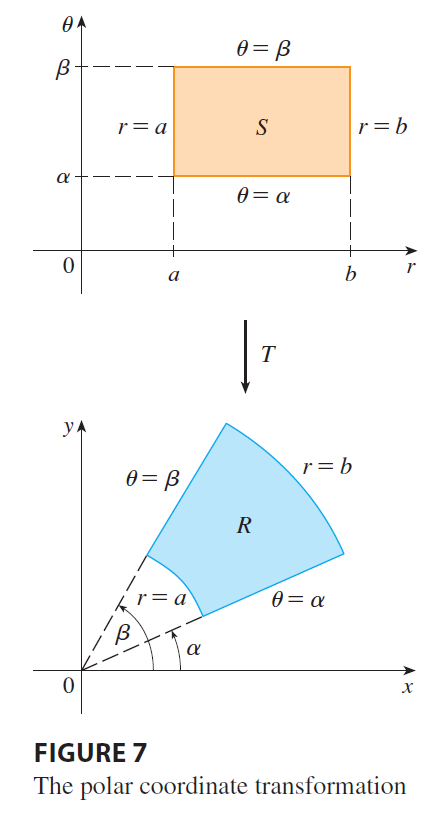
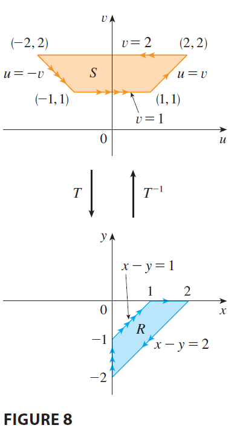

<page>

# Change of Variables in Multiple Integrals

In one-dimensional calculus we often use a change of variable (a substitution) to simplify an integral. By reversing the roles of x and u, we can write the Substitution Rule (5.5.6) as

$$
\int_a^b f(x) dx = \int_c^d f(g(u)) g'(u) du \tag{1}
$$

where $x = g(u)$ and $a = g(c)$, $b = g(d)$. Another way of writing Formula 1 is as follows:

$$
\int_a^b f(x) dx = \int_c^d f(x(u)) \frac{dx}{du} du \tag{2}
$$

A change of variables can also be useful in double integrals. We have already seen one example of this: conversion to polar coordinates. The new variables r and $\theta$ are related to the old variables x and y by the equations
$$
x = r \cos \theta \qquad y = r \sin \theta
$$
and the change of variables formula (15.3.2) can be written as
$$
\iint_R f(x, y) dA = \iint_S f(r\cos\theta, r\sin\theta) r dr d\theta
$$
where S is the region in the $r\theta$-plane that corresponds to the region R in the xy-plane.

</page>

<page>

# Shape transformation map

More generally, we consider a change of variables that is given by a transformation T from the uv-plane to the xy-plane:
$$
T(u, v) = (x, y)
$$
where x and y are related to u and v by the equations

$$
x = g(u, v) \qquad y = h(u, v) \tag{3}
$$

or, as we sometimes write,
$$
x = x(u, v) \qquad y = y(u, v)
$$
We usually assume that T is a $C^1$ transformation, which means that g and h have continuous first-order partial derivatives.

A transformation T is really just a function whose domain and range are both subsets of $\mathbb{R}^2$. If $T(u_1, v_1) = (x_1, y_1)$, then the point $(x_1, y_1)$ is called the image of the point $(u_1, v_1)$. If no two points have the same image, T is called one-to-one. 

Figure 1 shows the effect of a transformation T on a region S in the uv-plane. T transforms S into a region R in the xy-plane called the image of S, consisting of the images of all points in S.

If T is a one-to-one transformation, then it has an inverse transformation $T^{-1}$ from the xy-plane to the uv-plane and it may be possible to solve Equations 3 for u and v in terms of x and y:
$$
u = G(x, y) \qquad v = H(x, y)
$$

----------

**EXAMPLE 1** A transformation is defined by the equations
$$
x = u^2 - v^2 \qquad y = 2uv
$$
Find the image of the square $S = \{(u, v) | 0 \le u \le 1, 0 \le v \le 1\}$.

<ans>

**SOLUTION** The transformation maps the boundary of S into the boundary of the image. So we begin by finding the images of the sides of S. The first side, $S_1$, is given by $v=0$ ($0 \le u \le 1$). (See Figure 2.) From the given equations we have $x = u^2, y = 0$, and so $0 \le x \le 1$. Thus $S_1$ is mapped into the line segment from $(0, 0)$ to $(1, 0)$ in the xy-plane. The second side, $S_2$, is $u=1$ ($0 \le v \le 1$) and, putting $u=1$ in the given equations, we get
$$
x = 1 - v^2 \qquad y = 2v
$$
Eliminating v, we obtain
$$
x = 1 - \frac{y^2}{4} \qquad 0 \le x \le 1 \tag{4}
$$
which is part of a parabola. Similarly, $S_3$ is given by $v=1$ ($0 \le u \le 1$), whose image is the parabolic arc
$$
x = u^2 - 1 \qquad y = 2u \quad \text{or} \quad x = \frac{y^2}{4} - 1 \qquad -1 \le x \le 0 \tag{5}
$$
Finally, $S_4$ is given by $u=0$ ($0 \le v \le 1$) whose image is $x = -v^2, y = 0$, that is, $-1 \le x \le 0$. (Notice that as we move around the square in the counterclockwise direction, we also move around the parabolic region in the counterclockwise direction.) The image of S is the region R (shown in Figure 2) bounded by the x-axis and the parabolas given by Equations 4 and 5.

</ans>

</page>

<page>

# Jacobian

Now let's see how a change of variables affects a double integral. We start with a small rectangle S in the uv-plane whose lower left corner is the point $(u_0, v_0)$ and whose dimensions are $\Delta u$ and $\Delta v$. (See Figure 3.)

The image of S is a region R in the xy-plane, one of whose boundary points is $(x_0, y_0) = T(u_0, v_0)$. The vector
$$
\mathbf{r}(u, v) = g(u, v)\mathbf{i} + h(u, v)\mathbf{j}
$$
is the position vector of the image of the point $(u, v)$. The equation of the lower side of S is $v=v_0$, whose image curve is given by the vector function $\mathbf{r}(u, v_0)$. The tangent vector at $(x_0, y_0)$ to this image curve is
$$
\mathbf{r}_u = g_u(u_0, v_0)\mathbf{i} + h_u(u_0, v_0)\mathbf{j} = \frac{\partial x}{\partial u}\mathbf{i} + \frac{\partial y}{\partial u}\mathbf{j}
$$
Similarly, the tangent vector at $(x_0, y_0)$ to the image curve of the left side of S (namely, $u=u_0$) is
$$
\mathbf{r}_v = g_v(u_0, v_0)\mathbf{i} + h_v(u_0, v_0)\mathbf{j} = \frac{\partial x}{\partial v}\mathbf{i} + \frac{\partial y}{\partial v}\mathbf{j}
$$
We can approximate the image region $R = T(S)$ by a parallelogram determined by the secant vectors
$$
\mathbf{a} = \mathbf{r}(u_0+\Delta u, v_0) - \mathbf{r}(u_0, v_0) \qquad \mathbf{b} = \mathbf{r}(u_0, v_0+\Delta v) - \mathbf{r}(u_0, v_0)
$$
shown in Figure 4. But

--------

-------

$$
\mathbf{r}_u = \lim_{\Delta u \to 0} \frac{\mathbf{r}(u_0+\Delta u, v_0) - \mathbf{r}(u_0, v_0)}{\Delta u}
$$
and so
$$
\mathbf{r}(u_0+\Delta u, v_0) - \mathbf{r}(u_0, v_0) \approx \Delta u \mathbf{r}_u
$$
Similarly
$$
\mathbf{r}(u_0, v_0+\Delta v) - \mathbf{r}(u_0, v_0) \approx \Delta v \mathbf{r}_v
$$
This means that we can approximate R by a parallelogram determined by the vectors $\Delta u \mathbf{r}_u$ and $\Delta v \mathbf{r}_v$. (See Figure 5.) 

Therefore we can approximate the area of R by the area of this parallelogram, which, from Section 12.4, is

$$
|(\Delta u \mathbf{r}_u) \times (\Delta v \mathbf{r}_v)| = |\mathbf{r}_u \times \mathbf{r}_v| \Delta u \Delta v \tag{6}
$$

Computing the cross product, we obtain
$$
\mathbf{r}_u \times \mathbf{r}_v = \begin{vmatrix} \mathbf{i} & \mathbf{j} & \mathbf{k} \\ \frac{\partial x}{\partial u} & \frac{\partial y}{\partial u} & 0 \\ \frac{\partial x}{\partial v} & \frac{\partial y}{\partial v} & 0 \end{vmatrix} = \begin{vmatrix} \frac{\partial x}{\partial u} & \frac{\partial y}{\partial u} \\ \frac{\partial x}{\partial v} & \frac{\partial y}{\partial v} \end{vmatrix} \mathbf{k} = \left( \frac{\partial x}{\partial u}\frac{\partial y}{\partial v} - \frac{\partial y}{\partial u}\frac{\partial x}{\partial v} \right) \mathbf{k}
$$
The determinant that arises in this calculation is called the **Jacobian** of the transformation and is given a special notation.

> **Definition 7** The **Jacobian** of the transformation T given by $x=g(u, v)$ and $y=h(u, v)$ is
> $$
> \frac{\partial(x, y)}{\partial(u, v)} = \begin{vmatrix} \frac{\partial x}{\partial u} & \frac{\partial x}{\partial v} \\ \frac{\partial y}{\partial u} & \frac{\partial y}{\partial v} \end{vmatrix} = \frac{\partial x}{\partial u}\frac{\partial y}{\partial v} - \frac{\partial x}{\partial v}\frac{\partial y}{\partial u}
> $$

With this notation we can use Equation 6 to give an approximation to the area $\Delta A$ of R:

$$
\Delta A \approx \left| \frac{\partial(x, y)}{\partial(u, v)} \right| \Delta u \Delta v \tag{8}
$$

where the Jacobian is evaluated at $(u_0, v_0)$.

Next we divide a region S in the uv-plane into rectangles $S_{ij}$ and call their images in the xy-plane $R_{ij}$. (See Figure 6.)

Applying the approximation (8) to each $R_{ij}$, we approximate the double integral of f over R as follows:
$$
\iint_R f(x, y) dA \approx \sum_{i=1}^m \sum_{j=1}^n f(x_i, y_j) \Delta A_{ij}
$$
$$
\approx \sum_{i=1}^m \sum_{j=1}^n f(g(u_i, v_j), h(u_i, v_j)) \left| \frac{\partial(x, y)}{\partial(u, v)} \right| \Delta u \Delta v
$$
where the Jacobian is evaluated at $(u_i, v_j)$. Notice that this double sum is a Riemann sum for the integral
$$
\iint_S f(g(u, v), h(u, v)) \left| \frac{\partial(x, y)}{\partial(u, v)} \right| du dv
$$
The foregoing argument suggests that the following theorem is true. (A full proof is given in books on advanced calculus.)

> **9 Change of Variables in a Double Integral** Suppose that T is a $C^1$ transformation whose Jacobian is nonzero and that T maps a region S in the uv-plane onto a region R in the xy-plane. Suppose that f is continuous on R and that R and S are type I or type II plane regions. Suppose also that T is one-to-one, except perhaps on the boundary of S. Then
> $$
> \iint_R f(x, y) dA = \iint_S f(x(u, v), y(u, v)) \left| \frac{\partial(x, y)}{\partial(u, v)} \right| du dv
> $$

Theorem 9 says that we change from an integral in x and y to an integral in u and v by expressing x and y in terms of u and v and writing
$$
dA = \left| \frac{\partial(x, y)}{\partial(u, v)} \right| du dv
$$
Notice the similarity between Theorem 9 and the one-dimensional formula in Equation 2. Instead of the derivative $dx/du$, we have the absolute value of the Jacobian, that is, $|\partial(x, y)/\partial(u, v)|$.

As a first illustration of Theorem 9, we show that the formula for integration in polar coordinates is just a special case. Here the transformation T from the $r\theta$-plane to the xy-plane is given by
$$
x = g(r, \theta) = r\cos\theta \qquad y = h(r, \theta) = r\sin\theta
$$
and the geometry of the transformation is shown in Figure 7. T maps an ordinary rectangle in the $r\theta$-plane to a polar rectangle in the xy-plane. The Jacobian of T is
$$
\frac{\partial(x, y)}{\partial(r, \theta)} = \begin{vmatrix} \frac{\partial x}{\partial r} & \frac{\partial x}{\partial \theta} \\ \frac{\partial y}{\partial r} & \frac{\partial y}{\partial \theta} \end{vmatrix} = \begin{vmatrix} \cos\theta & -r\sin\theta \\ \sin\theta & r\cos\theta \end{vmatrix} = r\cos^2\theta + r\sin^2\theta = r > 0
$$

Thus Theorem 9 gives
$$
\iint_R f(x, y) dx dy = \iint_S f(r\cos\theta, r\sin\theta) \left| \frac{\partial(x, y)}{\partial(r, \theta)} \right| dr d\theta
$$
$$
= \int_\alpha^\beta \int_a^b f(r\cos\theta, r\sin\theta) r dr d\theta
$$
which is the same as Formula 15.3.2.

-----------

**EXAMPLE 2** Use the change of variables $x = u^2 - v^2, y = 2uv$ to evaluate the integral $\iint_R y dA$, where R is the region bounded by the x-axis and the parabolas $y^2 = 4-4x$ and $y^2 = 4+4x, y \ge 0$.

<ans>

**SOLUTION** The region R is pictured in Figure 2 (on page 1054). In Example 1 we discovered that $T(S) = R$, where S is the square $ \times$. Indeed, the reason for making the change of variables to evaluate the integral is that S is a much simpler region than R. First we need to compute the Jacobian:
$$
\frac{\partial(x, y)}{\partial(u, v)} = \begin{vmatrix} \frac{\partial x}{\partial u} & \frac{\partial x}{\partial v} \\ \frac{\partial y}{\partial u} & \frac{\partial y}{\partial v} \end{vmatrix} = \begin{vmatrix} 2u & -2v \\ 2v & 2u \end{vmatrix} = 4u^2 + 4v^2 > 0
$$
Therefore, by Theorem 9,
$$
\iint_R y dA = \iint_S 2uv \left| \frac{\partial(x, y)}{\partial(u, v)} \right| dA = \int_0^1 \int_0^1 (2uv)4(u^2+v^2) du dv
$$
$$
= 8 \int_0^1 \int_0^1 (u^3v + uv^3) du dv = 8 \int_0^1 \left[ \frac{1}{4}u^4v + \frac{1}{2}u^2v^3 \right]_{u=0}^{u=1} dv
$$
$$
= 8 \int_0^1 (\frac{1}{4}v + \frac{1}{2}v^3) dv = 8 \left[ \frac{1}{8}v^2 + \frac{1}{8}v^4 \right]_0^1 = 2
$$

> **NOTE** Example 2 was not a very difficult problem to solve because we were given a suitable change of variables. If we are not supplied with a transformation, then the first step is to think of an appropriate change of variables. If $f(x, y)$ is difficult to integrate, then the form of $f(x, y)$ may suggest a transformation. If the region of integration R is awkward, then the transformation should be chosen so that the corresponding region S in the uv-plane has a convenient description.

</ans>

--------------------

**EXAMPLE 3** Evaluate the integral $\iint_R e^{(x+y)/(x-y)} dA$, where R is the trapezoidal region with vertices $(1, 0), (2, 0), (0, -2),$ and $(0, -1)$.

<ans>

**SOLUTION** Since it isn't easy to integrate $e^{(x+y)/(x-y)}$, we make a change of variables suggested by the form of this function:

$$
u = x+y \qquad v = x-y \tag{10}
$$

These equations define a transformation $T^{-1}$ from the xy-plane to the uv-plane. Theorem 9 talks about a transformation T from the uv-plane to the xy-plane. It is obtained by solving Equations 10 for x and y:

$$
x = \frac{1}{2}(u+v) \qquad y = \frac{1}{2}(u-v) \tag{11}
$$

The Jacobian of T is
$$
\frac{\partial(x, y)}{\partial(u, v)} = \begin{vmatrix} \frac{\partial x}{\partial u} & \frac{\partial x}{\partial v} \\ \frac{\partial y}{\partial u} & \frac{\partial y}{\partial v} \end{vmatrix} = \begin{vmatrix} 1/2 & 1/2 \\ 1/2 & -1/2 \end{vmatrix} = -\frac{1}{2}
$$
To find the region S in the uv-plane corresponding to R, we note that the sides of R lie on the lines
$$
y=0 \qquad x-y=2 \qquad x=0 \qquad x-y=1
$$
and, from either Equations 10 or Equations 11, the image lines in the uv-plane are
$$
u=v \qquad v=2 \qquad u=-v \qquad v=1
$$
Thus the region S is the trapezoidal region with vertices $(1, 1), (2, 2), (-2, 2),$ and $(-1, 1)$ shown in Figure 8.

Since
$$
S = \{(u, v) | 1 \le v \le 2, -v \le u \le v\}
$$
Theorem 9 gives
$$
\iint_R e^{(x+y)/(x-y)} dA = \iint_S e^{u/v} \left| \frac{\partial(x, y)}{\partial(u, v)} \right| du dv
$$
$$
= \int_1^2 \int_{-v}^v e^{u/v} (\frac{1}{2}) du dv = \frac{1}{2} \int_1^2 [ve^{u/v}]_{-v}^v dv = \frac{1}{2} \int_1^2 v(e-e^{-1}) dv = \frac{1}{2}(e-e^{-1})[\frac{v^2}{2}]_1^2 = \frac{3}{4}(e-e^{-1})
$$

</ans>

</page>

<page>

# Change of Variables in Triple Integrals

There is a similar change of variables formula for triple integrals. Let T be a transformation that maps a region S in uvw-space onto a region R in xyz-space by means of the equations
$$
x = g(u, v, w) \qquad y = h(u, v, w) \qquad z = k(u, v, w)
$$
The **Jacobian** of T is the following $3 \times 3$ determinant:

$$
\frac{\partial(x, y, z)}{\partial(u, v, w)} = \begin{vmatrix} \frac{\partial x}{\partial u} & \frac{\partial x}{\partial v} & \frac{\partial x}{\partial w} \\ \frac{\partial y}{\partial u} & \frac{\partial y}{\partial v} & \frac{\partial y}{\partial w} \\ \frac{\partial z}{\partial u} & \frac{\partial z}{\partial v} & \frac{\partial z}{\partial w} \end{vmatrix} \tag{12}
$$

Under hypotheses similar to those in Theorem 9, we have the following formula for triple integrals:

$$
\iiint_R f(x, y, z) dV = \iiint_S f(x(u,v,w), y(u,v,w), z(u,v,w)) \left| \frac{\partial(x,y,z)}{\partial(u,v,w)} \right| du dv dw \tag{13}
$$

----------

**EXAMPLE 4** Use Formula 13 to derive the formula for triple integration in spherical coordinates.

<ans>

**SOLUTION** Here the change of variables is given by
$$
x = \rho\sin\phi\cos\theta \qquad y = \rho\sin\phi\sin\theta \qquad z = \rho\cos\phi
$$
We compute the Jacobian as follows:
$$
\frac{\partial(x, y, z)}{\partial(\rho, \theta, \phi)} = \begin{vmatrix} \sin\phi\cos\theta & -\rho\sin\phi\sin\theta & \rho\cos\phi\cos\theta \\ \sin\phi\sin\theta & \rho\sin\phi\cos\theta & \rho\cos\phi\sin\theta \\ \cos\phi & 0 & -\rho\sin\phi \end{vmatrix}
$$
$$
= \cos\phi \begin{vmatrix} -\rho\sin\phi\sin\theta & \rho\cos\phi\cos\theta \\ \rho\sin\phi\cos\theta & \rho\cos\phi\sin\theta \end{vmatrix} - \rho\sin\phi \begin{vmatrix} \sin\phi\cos\theta & -\rho\sin\phi\sin\theta \\ \sin\phi\sin\theta & \rho\sin\phi\cos\theta \end{vmatrix}
$$
$$
= \cos\phi(-\rho^2\sin\phi\cos\phi\sin^2\theta - \rho^2\sin\phi\cos\phi\cos^2\theta) - \rho\sin\phi(\rho\sin^2\phi\cos^2\theta + \rho\sin^2\phi\sin^2\theta)
$$
$$
= -\rho^2\sin\phi\cos^2\phi - \rho^2\sin^3\phi = -\rho^2\sin\phi
$$
Since $0 \le \phi \le \pi$, we have $\sin\phi \ge 0$. Therefore
$$
\left| \frac{\partial(x, y, z)}{\partial(\rho, \theta, \phi)} \right| = |-\rho^2\sin\phi| = \rho^2\sin\phi
$$
and Formula 13 gives
$$
\iiint_R f(x, y, z) dV = \iiint_S f(\rho\sin\phi\cos\theta, \rho\sin\phi\sin\theta, \rho\cos\phi) \rho^2\sin\phi d\rho d\theta d\phi
$$
which is equivalent to Formula 15.8.3.

</ans>
</page>
