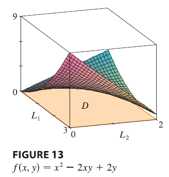

<page>

# Learning outcome

- we wil learn about functions
- we will learn about domains

Some dummy content

</page>

<page>

# A dummy exercise

Q. What is $f(x) =  x^2?$

<ans>

A. A parabola

</ans>

</page>

