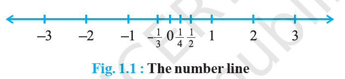
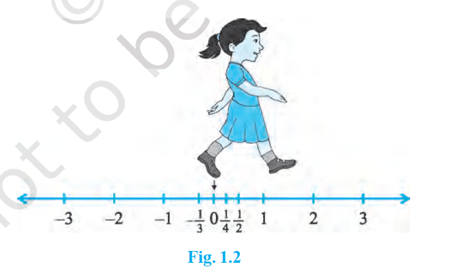
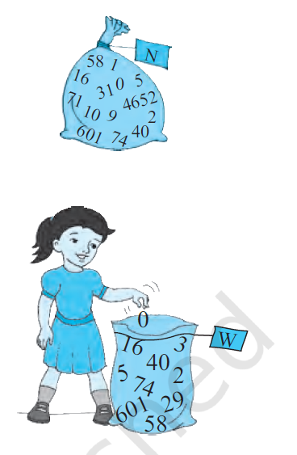
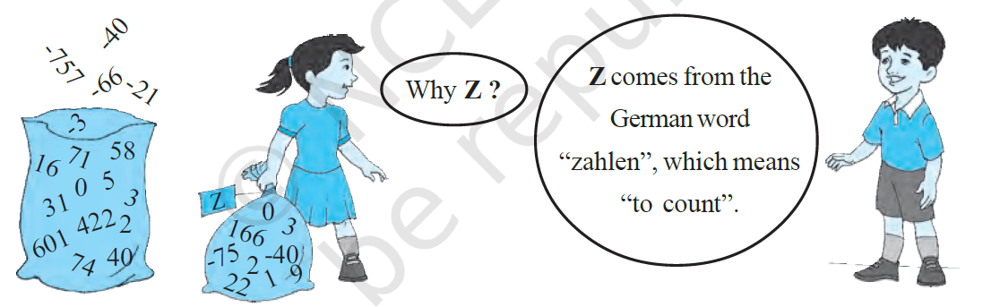

# CHAPTER 1
# NUMBER SYSTEMS

## 1.1 Introduction

In your earlier classes, you have learnt about the number line and how to represent various types of numbers on it (see Fig. 1.1).

Just imagine you start from zero and go on walking along this number line in the positive direction. As far as your eyes can see, there are numbers, numbers and numbers!

Now suppose you start walking along the number line, and collecting some of the numbers. Get a bag ready to store them!

You might begin with picking up only natural numbers like 1, 2, 3, and so on. You know that this list goes on for ever. (Why is this true?) So, now your bag contains infinitely many natural numbers! Recall that we denote this collection by the symbol **N**.

Now turn and walk all the way back, pick up zero and put it into the bag. You now have the collection of *whole numbers* which is denoted by the symbol **W**.

Now, stretching in front of you are many, many negative integers. Put all the negative integers into your bag. What is your new collection? Recall that it is the collection of all *integers*, and it is denoted by the symbol **Z**. Z comes from the German word "zahlen", which means "to count".

Are there some numbers still left on the line? Of course! There are numbers like $\frac{1}{2}$, $\frac{3}{4}$, or even $\frac{-2005}{2006}$. If you put all such numbers also into the bag, it will now be the collection of **rational numbers**. The collection of rational numbers is denoted by **Q**. 'Rational' comes from the word 'ratio', and Q comes from the word 'quotient'.

You may recall the definition of rational numbers:
A number 'r' is called a **rational number**, if it can be written in the form $\frac{p}{q}$, where $p$ and $q$ are integers and $q \neq 0$. (Why do we insist that $q \neq 0$?)

Notice that all the numbers now in the bag can be written in the form $\frac{p}{q}$, where $p$ and $q$ are integers and $q \neq 0$. For example, -25 can be written as $\frac{-25}{1}$; here $p = -25$ and $q = 1$. Therefore, the rational numbers also include the natural numbers, whole numbers and integers.

You also know that the rational numbers do not have a unique representation in the form $\frac{p}{q}$, where $p$ and $q$ are integers and $q \neq 0$. For example, $\frac{1}{2} = \frac{2}{4} = \frac{10}{20} = \frac{25}{50} = \frac{47}{94}$, and so on. These are **equivalent rational numbers** (or fractions). However, when we say that $\frac{p}{q}$ is a rational number, or when we represent $\frac{p}{q}$ on the number line, we assume that $q \neq 0$ and that $p$ and $q$ have no common factors other than 1 (that is, $p$ and $q$ are **co-prime**). So, on the number line, among the infinitely many fractions equivalent to $\frac{1}{2}$, we will choose $\frac{1}{2}$ to represent all of them.

Now, let us solve some examples about the different types of numbers, which you have studied in earlier classes.

</page>

<page>

# Example

**Example 1** : Are the following statements true or false? Give reasons for your answers.
(i) Every whole number is a natural number.
(ii) Every integer is a rational number.
(iii) Every rational number is an integer.

<ans>

**Solution** : (i) False, because zero is a whole number but not a natural number.
(ii) True, because every integer $m$ can be expressed in the form $\frac{m}{1}$, and so it is a rational number.
(iii) False, because $\frac{3}{5}$ is not an integer.

</ans>
</page>

<page>

# Example

**Example 2** : Find five rational numbers between 1 and 2.

We can approach this problem in at least two ways.

<ans>

**Solution 1** : Recall that to find a rational number between $r$ and $s$, you can add $r$ and $s$ and divide the sum by 2, that is $\frac{r+s}{2}$ lies between $r$ and $s$. So, $\frac{3}{2}$ is a number between 1 and 2. You can proceed in this manner to find four more rational numbers between 1 and 2. These four numbers are $\frac{5}{4}, \frac{11}{8}, \frac{13}{8}$ and $\frac{7}{4}$.

**Solution 2** : The other option is to find all the five rational numbers in one step. Since we want five numbers, we write 1 and 2 as rational numbers with denominator $5 + 1$, i.e., $1 = \frac{6}{6}$ and $2 = \frac{12}{6}$. Then you can check that $\frac{7}{6}, \frac{8}{6}, \frac{9}{6}, \frac{10}{6}$ and $\frac{11}{6}$ are all rational numbers between 1 and 2. So, the five numbers are $\frac{7}{6}, \frac{4}{3}, \frac{3}{2}, \frac{5}{3}$ and $\frac{11}{6}$.

</ans> 

**Remark** : Notice that in Example 2, you were asked to find five rational numbers between 1 and 2. But, you must have realised that in fact there are **infinitely many** rational numbers between 1 and 2. In general, **there are infinitely many rational numbers between any two given rational numbers.**

</page>

<page>

# More theory

Let us take a look at the number line again. Have you picked up all the numbers? Not, yet. The fact is that there are infinitely many more numbers left on the number line! There are gaps in between the places of the numbers you picked up, and not just one or two but infinitely many. The amazing thing is that there are infinitely many numbers lying between any two of these gaps too!

So we are left with the following questions:
1. What are the numbers, that are left on the number line, called?
2. How do we recognise them? That is, how do we distinguish them from the rationals (rational numbers)?

These questions will be answered in the next section.

---
### EXERCISE 1.1

1. Is zero a rational number? Can you write it in the form $\frac{p}{q}$, where $p$ and $q$ are integers and $q \neq 0$?
2. Find six rational numbers between 3 and 4.
3. Find five rational numbers between $\frac{3}{5}$ and $\frac{4}{5}$.
4. State whether the following statements are true or false. Give reasons for your answers.
   (i) Every natural number is a whole number.
   (ii) Every integer is a whole number.
   (iii) Every rational number is a whole number.

---

## 1.2 Irrational Numbers

We saw, in the previous section, that there may be numbers on the number line that are not rationals. In this section, we are going to investigate these numbers. So far, all the numbers you have come across, are of the form $\frac{p}{q}$, where $p$ and $q$ are integers and $q \neq 0$. So, you may ask: are there numbers which are not of this form? There are indeed such numbers.

The Pythagoreans in Greece, followers of the famous mathematician and philosopher Pythagoras, were the first to discover the numbers which were not rationals, around 400 BC. These numbers are called **irrational numbers** (irrationals), because they cannot be written in the form of a ratio of integers. There are many myths surrounding the discovery of irrational numbers by the Pythagorean, Hippacus of Croton. In all the myths, Hippacus has an unfortunate end, either for discovering that $\sqrt{2}$ is irrational or for disclosing the secret about $\sqrt{2}$ to people outside the secret Pythagorean sect!

Let us formally define these numbers.
A number ‘s’ is called **irrational**, if it cannot be written in the form $\frac{p}{q}$, where $p$ and $q$ are integers and $q \neq 0$.

You already know that there are infinitely many rationals. It turns out that there are infinitely many irrational numbers too. Some examples are:
$$ \sqrt{2}, \sqrt{3}, \sqrt{15}, \pi, 0.10110111011110... $$

**Remark** : Recall that when we use the symbol $\sqrt{\phantom{x}}$, we assume that it is the **positive** square root of the number. So $\sqrt{4} = 2$, though both 2 and –2 are square roots of 4.

Some of the irrational numbers listed above are familiar to you. For example, you have already come across many of the square roots listed above and the number $\pi$.

The Pythagoreans proved that $\sqrt{2}$ is irrational. Later in approximately 425 BC, Theodorus of Cyrene showed that $\sqrt{3}, \sqrt{5}, \sqrt{6}, \sqrt{7}, \sqrt{10}, \sqrt{11}, \sqrt{12}, \sqrt{13}, \sqrt{14}, \sqrt{15}$ and $\sqrt{17}$ are also irrationals. Proofs of irrationality of $\sqrt{2}, \sqrt{3}, \sqrt{5}$, etc., shall be discussed in Class X. As to $\pi$, it was known to various cultures for thousands of years, it was proved to be irrational by Lambert and Legendre only in the late 1700s. In the next section, we will discuss why $0.10110111011110...$ and $\pi$ are irrational.

Let us return to the questions raised at the end of the previous section. Remember the bag of rational numbers. If we now put all irrational numbers into the bag, will there be any number left on the number line? The answer is no! It turns out that the collection of all rational numbers and irrational numbers together make up what we call the collection of **real numbers**, which is denoted by **R**. Therefore, a real number is either rational or irrational. So, we can say that **every real number is represented by a unique point on the number line. Also, every point on the number line represents a unique real number.** This is why we call the number line, the **real number line**.

In the 1870s two German mathematicians, Cantor and Dedekind, showed that : Corresponding to every real number, there is a point on the real number line, and corresponding to every point on the number line, there exists a unique real number.

Let us see how we can locate some of the irrational numbers on the number line.

**Example 3** : Locate $\sqrt{2}$ on the number line.
**Solution** : It is easy to see how the Greeks might have discovered $\sqrt{2}$. Consider a square OABC, with each side 1 unit in length (see Fig. 1.6). Then you can see by the Pythagoras theorem that $OB = \sqrt{1^2 + 1^2} = \sqrt{2}$. How do we represent $\sqrt{2}$ on the number line? This is easy. Transfer Fig. 1.6 onto the number line making sure that the vertex O coincides with zero (see Fig. 1.7).

We have just seen that $OB = \sqrt{2}$. Using a compass with centre O and radius OB, draw an arc intersecting the number line at the point P. Then P corresponds to $\sqrt{2}$ on the number line.

**Example 4** : Locate $\sqrt{3}$ on the number line.
**Solution** : Let us return to Fig. 1.7.
Construct BD of unit length perpendicular to OB (as in Fig. 1.8). Then using the Pythagoras theorem, we see that $OD = \sqrt{(\sqrt{2})^2 + 1^2} = \sqrt{3}$. Using a compass, with centre O and radius OD, draw an arc which intersects the number line at the point Q. Then Q corresponds to $\sqrt{3}$.

In the same way, you can locate $\sqrt{n}$ for any positive integer $n$, after $\sqrt{n-1}$ has been located.

---
### EXERCISE 1.2

1. State whether the following statements are true or false. Justify your answers.
   (i) Every irrational number is a real number.
   (ii) Every point on the number line is of the form $\sqrt{m}$, where $m$ is a natural number.
   (iii) Every real number is an irrational number.
2. Are the square roots of all positive integers irrational? If not, give an example of the square root of a number that is a rational number.
3. Show how $\sqrt{5}$ can be represented on the number line.
4. **Classroom activity (Constructing the ‘square root spiral’)** : Take a large sheet of paper and construct the ‘square root spiral’ in the following fashion. Start with a point O and draw a line segment $OP_1$ of unit length. Draw a line segment $P_1P_2$ perpendicular to $OP_1$ of unit length (see Fig. 1.9). Now draw a line segment $P_2P_3$ perpendicular to $OP_2$. Then draw a line segment $P_3P_4$ perpendicular to $OP_3$. Continuing in this manner, you can get the line segment $P_{n-1}P_n$ by drawing a line segment of unit length perpendicular to $OP_{n-1}$. In this manner, you will have created the points $P_2, P_3, ..., P_n, ...$ , and joined them to create a beautiful spiral depicting $\sqrt{2}, \sqrt{3}, \sqrt{4}, ...$

---

## 1.3 Real Numbers and their Decimal Expansions

In this section, we are going to study rational and irrational numbers from a different point of view. We will look at the decimal expansions of real numbers and see if we can use the expansions to distinguish between rationals and irrationals. We will also explain how to visualise the representation of real numbers on the number line using their decimal expansions. Since rationals are more familiar to us, let us start with them. Let us take three examples : $\frac{10}{3}, \frac{7}{8}, \frac{1}{7}$.

Pay special attention to the remainders and see if you can find any pattern.

**Example 5** : Find the decimal expansions of $\frac{10}{3}, \frac{7}{8}$ and $\frac{1}{7}$.
**Solution** :
$\frac{10}{3} = 3.333...$
$\frac{7}{8} = 0.875$
$\frac{1}{7} = 0.142857...$

Remainders for $\frac{10}{3}$: 1, 1, 1, 1, ... Divisor: 3
Remainders for $\frac{7}{8}$: 6, 4, 0 Divisor: 8
Remainders for $\frac{1}{7}$: 3, 2, 6, 4, 5, 1, 3, 2, 6, 4, 5, 1, ... Divisor: 7

What have you noticed? You should have noticed at least three things:
(i) The remainders either become 0 after a certain stage, or start repeating themselves.
(ii) The number of entries in the repeating string of remainders is less than the divisor (in $\frac{10}{3}$ one number repeats itself and the divisor is 3, in $\frac{1}{7}$ there are six entries in the repeating string of remainders and 7 is the divisor).
(iii) If the remainders repeat, then we get a repeating block of digits in the quotient (for $\frac{10}{3}$, 3 repeats in the quotient and for $\frac{1}{7}$, we get the repeating block 142857 in the quotient).

Although we have noticed this pattern using only the examples above, it is true for all rationals of the form $\frac{p}{q}$ ($q \neq 0$). On division of $p$ by $q$, two main things happen – either the remainder becomes zero or never becomes zero and we get a repeating string of remainders. Let us look at each case separately.

**Case (i) : The remainder becomes zero**
In the example of $\frac{7}{8}$, we found that the remainder becomes zero after some steps and the decimal expansion of $\frac{7}{8} = 0.875$. Other examples are $\frac{1}{2} = 0.5$, $\frac{639}{250} = 2.556$. In all these cases, the decimal expansion terminates or ends after a finite number of steps. We call the decimal expansion of such numbers **terminating**.

**Case (ii) : The remainder never becomes zero**
In the examples of $\frac{10}{3}$ and $\frac{1}{7}$, we notice that the remainders repeat after a certain stage forcing the decimal expansion to go on for ever. In other words, we have a repeating block of digits in the quotient. We say that this expansion is **non-terminating recurring**. For example, $\frac{10}{3} = 3.3333...$ and $\frac{1}{7} = 0.142857142857...$
The usual way of showing that 3 repeats in the quotient of $\frac{10}{3}$ is to write it as $3.\bar{3}$. Similarly, since the block of digits 142857 repeats in the quotient of $\frac{1}{7}$, we write $\frac{1}{7}$ as $0.\overline{142857}$, where the bar above the digits indicates the block of digits that repeats. Also $3.57272...$ can be written as $3.5\bar{72}$. So, all these examples give us **non-terminating recurring (repeating) decimal expansions**.

Thus, we see that the decimal expansion of rational numbers have only two choices: either they are terminating or non-terminating recurring.

Now suppose, on the other hand, on your walk on the number line, you come across a number like 3.142678 whose decimal expansion is terminating or a number like $1.272727...$ that is, $1.\bar{27}$, whose decimal expansion is non-terminating recurring, can you conclude that it is a rational number? The answer is yes!

We will not prove it but illustrate this fact with a few examples. The terminating cases are easy.

**Example 6** : Show that 3.142678 is a rational number. In other words, express 3.142678 in the form $\frac{p}{q}$, where $p$ and $q$ are integers and $q \neq 0$.
**Solution** : We have $3.142678 = \frac{3142678}{1000000}$, and hence is a rational number.

Now, let us consider the case when the decimal expansion is non-terminating recurring.

**Example 7** : Show that $0.3333... = 0.\bar{3}$ can be expressed in the form $\frac{p}{q}$, where $p$ and $q$ are integers and $q \neq 0$.
**Solution** : Since we do not know what $0.\bar{3}$ is, let us call it ‘x’ and so
$x = 0.3333...$
Now here is where the trick comes in. Look at
$10x = 10 \times (0.333...) = 3.333...$
Now, $3.333... = 3 + x$, since $x = 0.3333...$
Therefore, $10x = 3 + x$
Solving for $x$, we get $9x = 3$, i.e., $x = \frac{1}{3}$.

**Example 8** : Show that $1.272727... = 1.\bar{27}$ can be expressed in the form $\frac{p}{q}$, where $p$ and $q$ are integers and $q \neq 0$.
**Solution** : Let $x = 1.272727...$ Since two digits are repeating, we multiply $x$ by 100 to get
$100x = 127.2727...$
So, $100x = 126 + 1.272727... = 126 + x$
Therefore, $100x - x = 126$, i.e., $99x = 126$
i.e., $x = \frac{126}{99} = \frac{14}{11}$
You can check the reverse that $\frac{14}{11} = 1.\bar{27}$.

**Example 9** : Show that $0.2353535... = 0.2\bar{35}$ can be expressed in the form $\frac{p}{q}$, where $p$ and $q$ are integers and $q \neq 0$.
**Solution** : Let $x = 0.23535...$ Over here, note that 2 does not repeat, but the block 35 repeats. Since two digits are repeating, we multiply $x$ by 100 to get
$100x = 23.53535...$
So, $100x = 23.3 + 0.23535... = 23.3 + x$
Therefore, $99x = 23.3$
i.e., $99x = \frac{233}{10}$, which gives $x = \frac{233}{990}$
You can also check the reverse that $\frac{233}{990} = 0.2\bar{35}$.

So, every number with a non-terminating recurring decimal expansion can be expressed in the form $\frac{p}{q}$ ($q \neq 0$), where $p$ and $q$ are integers. Let us summarise our results in the following form :
**The decimal expansion of a rational number is either terminating or non-terminating recurring. Moreover, a number whose decimal expansion is terminating or non-terminating recurring is rational.**

So, now we know what the decimal expansion of a rational number can be. What about the decimal expansion of irrational numbers? Because of the property above, we can conclude that their decimal expansions are **non-terminating non-recurring**.
So, the property for irrational numbers, similar to the property stated above for rational numbers, is
**The decimal expansion of an irrational number is non-terminating non-recurring. Moreover, a number whose decimal expansion is non-terminating non-recurring is irrational.**

Recall $s = 0.10110111011110...$ from the previous section. Notice that it is non-terminating and non-recurring. Therefore, from the property above, it is irrational. Moreover, notice that you can generate infinitely many irrationals similar to $s$.

What about the famous irrationals $\sqrt{2}$ and $\pi$? Here are their decimal expansions up to a certain stage.
$\sqrt{2} = 1.4142135623730950488016887242096...$
$\pi = 3.14159265358979323846264338327950...$
(Note that, we often take $\frac{22}{7}$ as an approximate value for $\pi$, but $\pi \neq \frac{22}{7}$.)

Over the years, mathematicians have developed various techniques to produce more and more digits in the decimal expansions of irrational numbers. For example, you might have learnt to find digits in the decimal expansion of $\sqrt{2}$ by the division method. Interestingly, in the Sulbasutras (rules of chord), a mathematical treatise of the Vedic period (800 BC - 500 BC), you find an approximation of $\sqrt{2}$ as follows:
$$ \sqrt{2} = 1 + \frac{1}{3} + \frac{1}{3 \cdot 4} - \frac{1}{3 \cdot 4 \cdot 34} = 1.4142156 $$
Notice that it is the same as the one given above for the first five decimal places. The history of the hunt for digits in the decimal expansion of $\pi$ is very interesting.

The Greek genius Archimedes was the first to compute digits in the decimal expansion of $\pi$. He showed $3.140845 < \pi < 3.142857$. Aryabhatta (476 – 550 C.E.), the great Indian mathematician and astronomer, found the value of $\pi$ correct to four decimal places (3.1416). Using high speed computers and advanced algorithms, $\pi$ has been computed to over 1.24 trillion decimal places!

Now, let us see how to obtain irrational numbers.

**Example 10** : Find an irrational number between $\frac{1}{7}$ and $\frac{2}{7}$.
**Solution** : We saw that $\frac{1}{7} = 0.\overline{142857}$. So, you can easily calculate $\frac{2}{7} = 0.\overline{285714}$.
To find an irrational number between $\frac{1}{7}$ and $\frac{2}{7}$, we find a number which is non-terminating non-recurring lying between them. Of course, you can find infinitely many such numbers.
An example of such a number is $0.150150015000150000...$

---
### EXERCISE 1.3

1.  Write the following in decimal form and say what kind of decimal expansion each has :
    (i) $\frac{36}{100}$
    (ii) $\frac{1}{11}$
    (iii) $4\frac{1}{8}$
    (iv) $\frac{3}{13}$
    (v) $\frac{2}{11}$
    (vi) $\frac{329}{400}$

2.  You know that $\frac{1}{7} = 0.\overline{142857}$. Can you predict what the decimal expansions of $\frac{2}{7}, \frac{3}{7}, \frac{4}{7}, \frac{5}{7}, \frac{6}{7}$ are, without actually doing the long division? If so, how?
    [**Hint** : Study the remainders while finding the value of $\frac{1}{7}$ carefully.]

3.  Express the following in the form $\frac{p}{q}$, where $p$ and $q$ are integers and $q \neq 0$.
    (i) $0.\bar{6}$
    (ii) $0.4\bar{7}$
    (iii) $0.\overline{001}$

4.  Express $0.99999...$ in the form $\frac{p}{q}$. Are you surprised by your answer? With your teacher and classmates discuss why the answer makes sense.

5.  What can the maximum number of digits be in the repeating block of digits in the decimal expansion of $\frac{1}{17}$? Perform the division to check your answer.

6.  Look at several examples of rational numbers in the form $\frac{p}{q}$ ($q \neq 0$), where $p$ and $q$ are integers with no common factors other than 1 and having terminating decimal representations (expansions). Can you guess what property $q$ must satisfy?

7.  Write three numbers whose decimal expansions are non-terminating non-recurring.

8.  Find three different irrational numbers between the rational numbers $\frac{5}{7}$ and $\frac{9}{11}$.

9.  Classify the following numbers as rational or irrational :
    (i) $\sqrt{23}$
    (ii) $\sqrt{225}$
    (iii) $0.3796$
    (iv) $7.478478...$
    (v) $1.101001000100001...$

---

## 1.4 Operations on Real Numbers

You have learnt, in earlier classes, that rational numbers satisfy the commutative, associative and distributive laws for addition and multiplication. Moreover, if we add, subtract, multiply or divide (except by zero) two rational numbers, we still get a rational number (that is, rational numbers are ‘closed’ with respect to addition, subtraction, multiplication and division). It turns out that irrational numbers also satisfy the commutative, associative and distributive laws for addition and multiplication. However, the sum, difference, quotients and products of irrational numbers are not always irrational. For example, $(\sqrt{6}) + (-\sqrt{6})$, $(\sqrt{2}) - (\sqrt{2})$, $(\sqrt{3}) \cdot (\sqrt{3})$ and $\frac{\sqrt{17}}{\sqrt{17}}$ are rationals.

Let us look at what happens when we add and multiply a rational number with an irrational number. For example, $\sqrt{3}$ is irrational. What about $2 + \sqrt{3}$ and $2\sqrt{3}$? Since $\sqrt{3}$ has a non-terminating non-recurring decimal expansion, the same is true for $2 + \sqrt{3}$ and $2\sqrt{3}$. Therefore, both $2 + \sqrt{3}$ and $2\sqrt{3}$ are also irrational numbers.

**Example 11** : Check whether $7\sqrt{5}, \frac{7}{\sqrt{5}}, \sqrt{2} + 21, \pi - 2$ are irrational numbers or not.
**Solution** : $\sqrt{5} = 2.236..., \sqrt{2} = 1.4142..., \pi = 3.1415...$
Then $7\sqrt{5} = 15.652..., \frac{7}{\sqrt{5}} = \frac{7\sqrt{5}}{5} = 3.1304...$
$\sqrt{2} + 21 = 22.4142..., \pi - 2 = 1.1415...$
All these are non-terminating non-recurring decimals. So, all these are irrational numbers.

Now, let us see what generally happens if we add, subtract, multiply, divide, take square roots and even nth roots of these irrational numbers, where $n$ is any natural number. Let us look at some examples.

**Example 12** : Add $2\sqrt{2} + 5\sqrt{3}$ and $\sqrt{2} - 3\sqrt{3}$.
**Solution** : $(2\sqrt{2} + 5\sqrt{3}) + (\sqrt{2} - 3\sqrt{3}) = (2\sqrt{2} + \sqrt{2}) + (5\sqrt{3} - 3\sqrt{3}) = (2+1)\sqrt{2} + (5-3)\sqrt{3} = 3\sqrt{2} + 2\sqrt{3}$.

**Example 13** : Multiply $6\sqrt{5}$ by $2\sqrt{5}$.
**Solution** : $6\sqrt{5} \times 2\sqrt{5} = 6 \times 2 \times \sqrt{5} \times \sqrt{5} = 12 \times 5 = 60$.

**Example 14** : Divide $8\sqrt{15}$ by $2\sqrt{3}$.
**Solution** : $8\sqrt{15} \div 2\sqrt{3} = \frac{8\sqrt{3} \times \sqrt{5}}{2\sqrt{3}} = 4\sqrt{5}$.

These examples may lead you to expect the following facts, which are true:
(i) The sum or difference of a rational number and an irrational number is irrational.
(ii) The product or quotient of a non-zero rational number with an irrational number is irrational.
(iii) If we add, subtract, multiply or divide two irrationals, the result may be rational or irrational.

We now turn our attention to the operation of taking square roots of real numbers. Recall that, if $a$ is a natural number, then $\sqrt{a} = b$ means $b^2 = a$ and $b > 0$. The same definition can be extended for positive real numbers.
Let $a > 0$ be a real number. Then $\sqrt{a} = b$ means $b^2 = a$ and $b > 0$.

In Section 1.2, we saw how to represent $\sqrt{n}$ for any positive integer $n$ on the number line. We now show how to find $\sqrt{x}$ for any given positive real number $x$ geometrically. For example, let us find it for $x = 3.5$, i.e., we find $\sqrt{3.5}$ geometrically.

Mark the distance 3.5 units from a fixed point A on a given line to obtain a point B such that AB = 3.5 units (see Fig. 1.11). From B, mark a distance of 1 unit and mark the new point as C. Find the mid-point of AC and mark that point as O. Draw a semicircle with centre O and radius OC. Draw a line perpendicular to AC passing through B and intersecting the semicircle at D. Then, $BD = \sqrt{3.5}$.

More generally, to find $\sqrt{x}$, for any positive real number $x$, we mark B so that AB = $x$ units, and, as in Fig. 1.12, mark C so that BC = 1 unit. Then, as we have done for the case $x = 3.5$, we find $BD = \sqrt{x}$ (see Fig. 1.12). We can prove this result using the Pythagoras Theorem.

Notice that, in Fig. 1.12, $\triangle OBD$ is a right-angled triangle. Also, the radius of the circle is $\frac{x+1}{2}$ units.
Therefore, $OC = OD = OA = \frac{x+1}{2}$ units.
Now, $OB = x - \frac{x+1}{2} = \frac{x-1}{2}$.
So, by the Pythagoras Theorem, we have
$BD^2 = OD^2 - OB^2 = \left(\frac{x+1}{2}\right)^2 - \left(\frac{x-1}{2}\right)^2 = \frac{x^2+2x+1 - (x^2-2x+1)}{4} = \frac{4x}{4} = x$.
This shows that $BD = \sqrt{x}$.

This construction gives us a

visual, and geometric way of showing that $\sqrt{x}$ exists for all real numbers $x > 0$. If you want to know the position of $\sqrt{x}$ on the number line, then let us treat the line BC as the number line, with B as zero, C as 1, and so on. Draw an arc with centre B and radius BD, which intersects the number line in E (see Fig. 1.13). Then, E represents $\sqrt{x}$.

We would like to now extend the idea of square roots to cube roots, fourth roots, and in general *n*th roots, where *n* is a positive integer. Recall your understanding of square roots and cube roots from earlier classes.

What is $\sqrt[3]{8}$? Well, we know it has to be some positive number whose cube is 8, and you must have guessed $\sqrt[3]{8} = 2$. Let us try $\sqrt[5]{243}$. Do you know some number *b* such that $b^5 = 243$? The answer is 3. Therefore, $\sqrt[5]{243} = 3$.

From these examples, can you define $\sqrt[n]{a}$ for a real number $a > 0$ and a positive integer *n*?

Let $a > 0$ be a real number and *n* be a positive integer. Then $\sqrt[n]{a} = b$, if $b^n = a$ and $b > 0$. Note that the symbol ‘$\sqrt{\phantom{x}}$’ used in $\sqrt{2}, \sqrt[3]{8}, \sqrt[n]{a}$, etc. is called the **radical sign**.

We now list some identities relating to square roots, which are useful in various ways. You are already familiar with some of these from your earlier classes. The remaining ones follow from the distributive law of multiplication over addition of real numbers, and from the identity $(x + y)(x - y) = x^2 - y^2$, for any real numbers *x* and *y*. Let *a* and *b* be positive real numbers. Then
(i) $\sqrt{ab} = \sqrt{a}\sqrt{b}$
(ii) $\sqrt{\frac{a}{b}} = \frac{\sqrt{a}}{\sqrt{b}}$
(iii) $(\sqrt{a} + \sqrt{b})(\sqrt{a} - \sqrt{b}) = a - b$
(iv) $(a + \sqrt{b})(a - \sqrt{b}) = a^2 - b$
(v) $(\sqrt{a} + \sqrt{b})(\sqrt{c} + \sqrt{d}) = \sqrt{ac} + \sqrt{ad} + \sqrt{bc} + \sqrt{bd}$
(vi) $(\sqrt{a} + \sqrt{b})^2 = a + 2\sqrt{ab} + b$

Let us look at some particular cases of these identities.

**Example 15** : Simplify the following expressions:
(i) $(5 + \sqrt{7})(2 + \sqrt{5})$
(ii) $(5 + \sqrt{5})(5 - \sqrt{5})$
(iii) $(\sqrt{3} + \sqrt{7})^2$
(iv) $(\sqrt{11} - \sqrt{7})(\sqrt{11} + \sqrt{7})$

**Solution** :
(i) $(5 + \sqrt{7})(2 + \sqrt{5}) = 10 + 5\sqrt{5} + 2\sqrt{7} + \sqrt{35}$
(ii) $(5 + \sqrt{5})(5 - \sqrt{5}) = 5^2 - (\sqrt{5})^2 = 25 - 5 = 20$
(iii) $(\sqrt{3} + \sqrt{7})^2 = (\sqrt{3})^2 + 2\sqrt{3}\sqrt{7} + (\sqrt{7})^2 = 3 + 2\sqrt{21} + 7 = 10 + 2\sqrt{21}$
(iv) $(\sqrt{11} - \sqrt{7})(\sqrt{11} + \sqrt{7}) = (\sqrt{11})^2 - (\sqrt{7})^2 = 11 - 7 = 4$

**Remark** : Note that ‘simplify’ in the example above has been used to mean that the expression should be written as the sum of a rational and an irrational number.

We end this section by considering the following problem. Look at $\frac{1}{\sqrt{2}}$. Can you tell where it shows up on the number line? You know that it is irrational. May be it is easier to handle if the denominator is a rational number. Let us see, if we can ‘rationalise’ the denominator, that is, to make the denominator into a rational number. To do so, we need the identities involving square roots. Let us see how.

**Example 16** : Rationalise the denominator of $\frac{1}{\sqrt{2}}$.
**Solution** : We want to write $\frac{1}{\sqrt{2}}$ as an equivalent expression in which the denominator is a rational number. We know that $\sqrt{2} \cdot \sqrt{2} = 2$, which is rational. We also know that multiplying $\frac{1}{\sqrt{2}}$ by $\frac{\sqrt{2}}{\sqrt{2}}$ will give us an equivalent expression, since $\frac{\sqrt{2}}{\sqrt{2}} = 1$. So, we put these two facts together to get
$$ \frac{1}{\sqrt{2}} = \frac{1}{\sqrt{2}} \times \frac{\sqrt{2}}{\sqrt{2}} = \frac{\sqrt{2}}{2} $$
In this form, it is easy to locate $\frac{1}{\sqrt{2}}$ on the number line. It is half way between 0 and $\sqrt{2}$.

**Example 17** : Rationalise the denominator of $\frac{1}{2 + \sqrt{3}}$.
**Solution** : We use the Identity (iv) given earlier. Multiply and divide $\frac{1}{2 + \sqrt{3}}$ by $2 - \sqrt{3}$ to get $\frac{1}{2 + \sqrt{3}} \times \frac{2 - \sqrt{3}}{2 - \sqrt{3}} = \frac{2 - \sqrt{3}}{4 - 3} = 2 - \sqrt{3}$.

**Example 18** : Rationalise the denominator of $\frac{5}{\sqrt{3} - \sqrt{5}}$.
**Solution** : Here we use the Identity (iii) given earlier.
So, $\frac{5}{\sqrt{3} - \sqrt{5}} = \frac{5}{\sqrt{3} - \sqrt{5}} \times \frac{\sqrt{3} + \sqrt{5}}{\sqrt{3} + \sqrt{5}} = \frac{5(\sqrt{3} + \sqrt{5})}{3 - 5} = \left(\frac{-5}{2}\right)(\sqrt{3} + \sqrt{5})$.

**Example 19** : Rationalise the denominator of $\frac{1}{7 + 3\sqrt{2}}$.
**Solution** : $\frac{1}{7 + 3\sqrt{2}} = \frac{1}{7 + 3\sqrt{2}} \times \left(\frac{7 - 3\sqrt{2}}{7 - 3\sqrt{2}}\right) = \frac{7 - 3\sqrt{2}}{49 - 18} = \frac{7 - 3\sqrt{2}}{31}$.

So, when the denominator of an expression contains a term with a square root (or a number under a radical sign), the process of converting it to an equivalent expression whose denominator is a rational number is called **rationalising the denominator**.

---
### EXERCISE 1.4

1.  Classify the following numbers as rational or irrational:
    (i) $2 - \sqrt{5}$
    (ii) $(3 + \sqrt{23}) - \sqrt{23}$
    (iii) $\frac{2\sqrt{7}}{7\sqrt{7}}$
    (iv) $\frac{1}{\sqrt{2}}$
    (v) $2\pi$

2.  Simplify each of the following expressions:
    (i) $(3 + \sqrt{3})(2 + \sqrt{2})$
    (ii) $(3 + \sqrt{3})(3 - \sqrt{3})$
    (iii) $(\sqrt{5} + \sqrt{2})^2$
    (iv) $(\sqrt{5} - \sqrt{2})(\sqrt{5} + \sqrt{2})$

3.  Recall, $\pi$ is defined as the ratio of the circumference (say *c*) of a circle to its diameter (say *d*). That is, $\pi = \frac{c}{d}$. This seems to contradict the fact that $\pi$ is irrational. How will you resolve this contradiction?

4.  Represent $\sqrt{9.3}$ on the number line.

5.  Rationalise the denominators of the following:
    (i) $\frac{1}{\sqrt{7}}$
    (ii) $\frac{1}{\sqrt{7} - \sqrt{6}}$
    (iii) $\frac{1}{\sqrt{5} + \sqrt{2}}$
    (iv) $\frac{1}{\sqrt{7} - 2}$

---

## 1.5 Laws of Exponents for Real Numbers

Do you remember how to simplify the following?
(i) $17^2 \cdot 17^5 = $
(ii) $(5^2)^7 = $
(iii) $\frac{23^{10}}{23^7} = $
(iv) $7^3 \cdot 9^3 = $

Did you get these answers? They are as follows:
(i) $17^2 \cdot 17^5 = 17^7$
(ii) $(5^2)^7 = 5^{14}$
(iii) $\frac{23^{10}}{23^7} = 23^3$
(iv) $7^3 \cdot 9^3 = 63^3$

To get these answers, you would have used the following laws of exponents, which you have learnt in your earlier classes. (Here *a*, *n* and *m* are natural numbers. Remember, *a* is called the base and *m* and *n* are the exponents.)
(i) $a^m \cdot a^n = a^{m+n}$
(ii) $(a^m)^n = a^{mn}$
(iii) $\frac{a^m}{a^n} = a^{m-n}, m > n$
(iv) $a^m b^m = (ab)^m$

What is $(a)^0$? Yes, it is 1! So you have learnt that $(a)^0 = 1$. So, using (iii), we can get $\frac{1}{a^n} = a^{-n}$. We can now extend the laws to negative exponents too.
So, for example :
(i) $17^2 \cdot 17^{-5} = 17^{-3} = \frac{1}{17^3}$
(ii) $(5^2)^{-7} = 5^{-14}$
(iii) $\frac{23^{-10}}{23^7} = 23^{-17}$
(iv) $(7)^{-3} \cdot (9)^{-3} = (63)^{-3}$

Suppose we want to do the following computations:
(i) $2^{\frac{2}{3}} \cdot 2^{\frac{1}{3}}$
(ii) $(3^{\frac{1}{5}})^4$
(iii) $\frac{7^{\frac{1}{5}}}{7^{\frac{1}{3}}}$
(iv) $13^{\frac{1}{5}} \cdot 17^{\frac{1}{5}}$

How would we go about it? It turns out that we can extend the laws of exponents that we have studied earlier, even when the base is a positive real number and the exponents are rational numbers. (Later you will study that it can further to be extended when the exponents are real numbers.) But before we state these laws, and to even make sense of these laws, we need to first understand what, for example $4^{\frac{3}{2}}$ is. So, we have some work to do!

We define $\sqrt[n]{a}$ for a real number $a > 0$ as follows:
Let $a > 0$ be a real number and $n$ a positive integer. Then $\sqrt[n]{a} = b$, if $b^n = a$ and $b > 0$.
In the language of exponents, we define $\sqrt[n]{a} = a^{\frac{1}{n}}$. So, in particular, $\sqrt[3]{2} = 2^{\frac{1}{3}}$.
There are now two ways to look at $4^{\frac{3}{2}}$.
$$ 4^{\frac{3}{2}} = (4^{\frac{1}{2}})^3 = 2^3 = 8 $$
$$ 4^{\frac{3}{2}} = (4^3)^{\frac{1}{2}} = (64)^{\frac{1}{2}} = 8 $$

Therefore, we have the following definition:
Let $a > 0$ be a real number. Let *m* and *n* be integers such that *m* and *n* have no common factors other than 1, and $n > 0$. Then,
$$ a^{\frac{m}{n}} = (\sqrt[n]{a})^m = \sqrt[n]{a^m} $$

We now have the following extended laws of exponents:
Let $a > 0$ be a real number and *p* and *q* be rational numbers. Then, we have
(i) $a^p \cdot a^q = a^{p+q}$
(ii) $(a^p)^q = a^{pq}$
(iii) $\frac{a^p}{a^q} = a^{p-q}$
(iv) $a^p b^p = (ab)^p$

You can now use these laws to answer the questions asked earlier.

**Example 20** : Simplify (i) $2^{\frac{2}{3}} \cdot 2^{\frac{1}{3}}$ (ii) $(3^{\frac{1}{5}})^4$ (iii) $\frac{7^{\frac{1}{5}}}{7^{\frac{1}{3}}}$ (iv) $13^{\frac{1}{5}} \cdot 17^{\frac{1}{5}}$
**Solution** :
(i) $2^{\frac{2}{3}} \cdot 2^{\frac{1}{3}} = 2^{(\frac{2}{3} + \frac{1}{3})} = 2^1 = 2$
(ii) $(3^{\frac{1}{5}})^4 = 3^{\frac{4}{5}}$
(iii) $\frac{7^{\frac{1}{5}}}{7^{\frac{1}{3}}} = 7^{(\frac{1}{5} - \frac{1}{3})} = 7^{\frac{3-5}{15}} = 7^{-\frac{2}{15}}$
(iv) $13^{\frac{1}{5}} \cdot 17^{\frac{1}{5}} = (13 \times 17)^{\frac{1}{5}} = 221^{\frac{1}{5}}$

---
### EXERCISE 1.5

1.  Find:
    (i) $64^{\frac{1}{2}}$
    (ii) $32^{\frac{1}{5}}$
    (iii) $125^{\frac{1}{3}}$

2.  Find:
    (i) $9^{\frac{3}{2}}$
    (ii) $32^{\frac{2}{5}}$
    (iii) $16^{\frac{3}{4}}$
    (iv) $125^{-\frac{1}{3}}$

3.  Simplify:
    (i) $2^{\frac{2}{3}} \cdot 2^{\frac{1}{5}}$
    (ii) $(3^{\frac{1}{3}})^7$
    (iii) $\frac{11^{\frac{1}{2}}}{11^{\frac{1}{4}}}$
    (iv) $7^{\frac{1}{2}} \cdot 8^{\frac{1}{2}}$

---

## 1.6 Summary

In this chapter, you have studied the following points:
1.  A number *r* is called a rational number, if it can be written in the form $\frac{p}{q}$, where *p* and *q* are integers and $q \neq 0$.
2.  A number *s* is called a irrational number, if it cannot be written in the form $\frac{p}{q}$, where *p* and *q* are integers and $q \neq 0$.
3.  The decimal expansion of a rational number is either terminating or non-terminating recurring. Moreover, a number whose decimal expansion is terminating or non-terminating recurring is rational.
4.  The decimal expansion of an irrational number is non-terminating non-recurring. Moreover, a number whose decimal expansion is non-terminating non-recurring is irrational.
5.  All the rational and irrational numbers make up the collection of real numbers.
6.  If *r* is rational and *s* is irrational, then $r+s$ and $r-s$ are irrational numbers, and $rs$ and $\frac{r}{s}$ are irrational numbers, $r \neq 0$.
7.  For positive real numbers *a* and *b*, the following identities hold:
    (i) $\sqrt{ab} = \sqrt{a}\sqrt{b}$
    (ii) $\sqrt{\frac{a}{b}} = \frac{\sqrt{a}}{\sqrt{b}}$
    (iii) $(\sqrt{a} + \sqrt{b})(\sqrt{a} - \sqrt{b}) = a - b$
    (iv) $(a + \sqrt{b})(a - \sqrt{b}) = a^2 - b$
    (v) $(\sqrt{a} + \sqrt{b})^2 = a + 2\sqrt{ab} + b$
8.  To rationalise the denominator of $\frac{1}{\sqrt{a} + b}$, we multiply this by $\frac{\sqrt{a} - b}{\sqrt{a} - b}$, where *a* and *b* are integers.
9.  Let $a > 0$ be a real number and *p* and *q* be rational numbers. Then
    (i) $a^p \cdot a^q = a^{p+q}$
    (ii) $(a^p)^q = a^{pq}$
    (iii) $\frac{a^p}{a^q} = a^{p-q}$
    (iv) $a^p b^p = (ab)^p$
