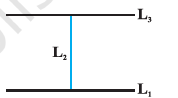

<page> 

# Review of Relations & Functions

**Relations**

Given two sets $A$ and $B$, We define a relation $R$ from $A$ to $B$ as an arbitrary subset of $A \times B$. 

If $(a, b) \in R$, we say that $a$ is related to $b$ under the relation $R$ and we write as $a \, R \, b$. 

*Functions*
Functions are a special kind of relations. Details will come later.

We will study different types of relations and functions, composition of functions, invertible functions and binary operations.

</page>

<page>

# Types of Relations

In this section, we would like to study different types of relations. 

**Definition: Empty Relation**  
A relation $R$ in a set $A$ is called **empty relation**, if no element of $A$ is related to any element of $A$, i.e., $R = \phi \subseteq A \times A$.

For illustration, consider a relation $R$ in the set $A = \{1, 2, 3, 4\}$ given by

$$
R = \{(a, b) : a - b = 10\}
$$

This is the empty set, as no pair $(a, b)$ satisfies the condition $a - b = 10$.

**Definition: Universal**  
A relation $R$ in a set $A$ is called **universal relation**, if each element of $A$ is related to every element of $A$, i.e., $R = A \times A$.

Example: 
$$
R' = \{(a, b) : |a - b| \geq 0\}
$$

is the whole set $A \times A$, as all pairs $(a, b)$ in $A \times A$ satisfy $|a - b| \geq 0$. 

Both the empty relation and the universal relation are sometimes called **trivial relations**.

</page>

<page>

# Example Exercise

**Example 1**  
Let $A$ be the set of all students of a boys school. Show that the relation $R$ in $A$ given by:

$$
R = \{(a, b) : a \text{ is sister of } b\}
$$

is the empty relation and 

$$
R' = \{(a, b) : \text{the difference between heights of } a \text{ and } b \text{ is less than } 3 \text{ meters}\}
$$

is the universal relation.

<ans>

**Solution:**  
Since the school is boys school, no student of the school can be sister of any student of the school. Hence, $R = \phi$, showing that $R$ is the empty relation. It is also obvious that the difference between heights of any two students of the school has to be less than 3 meters. This shows that $R' = A \times A$ is the universal relation.

</ans>

<page>

# Equivalence Relation

One of the most important relation, which plays a significant role in Mathematics, is an **equivalence relation**. To study equivalence relation, we first consider three types of relations, namely *reflexive*, *symmetric* and *transitive*.

**Definition** A relation $R$ in a set $A$ is called  
(i) *reflexive*, if $(a, a) \in R$, for every $a \in A$,  
(ii) *symmetric*, if $(a_1, a_2) \in R$ implies that $(a_2, a_1) \in R$, for all $a_1, a_2 \in A$,  
(iii) *transitive*, if $(a_1, a_2) \in R$ and $(a_2, a_3) \in R$ implies that $(a_1, a_3) \in R$, for all $a_1, a_2, a_3 \in A$.

---

**Definition**  
A relation $R$ in a set $A$ is said to be an *equivalence relation* if $R$ is reflexive, symmetric and transitive.

---

**Example**  
Let $T$ be the set of all triangles in a plane with $R$ a relation in $T$ given by  
$$
R = \{(T_1, T_2) : T_1 \text{ is congruent to } T_2\}.
$$  
Show that $R$ is an equivalence relation.

<ans>

**Solution** 

$R$ is reflexive, since every triangle is congruent to itself. Further, $(T_1, T_2) \in R \Rightarrow T_1$ is congruent to $T_2 \Rightarrow T_2$ is congruent to $T_1 \Rightarrow (T_2, T_1) \in R$. Hence, $R$ is symmetric. Moreover, $(T_1, T_2), (T_2, T_3) \in R \Rightarrow T_1$ is congruent to $T_2$ and $T_2$ is congruent to $T_3 \Rightarrow T_1$ is congruent to $T_3 \Rightarrow (T_1, T_3) \in R$. Therefore, $R$ is an equivalence relation.

</ans> 

---

**Example**  
Let $L$ be the set of all lines in a plane and $R$ be the relation in $L$ defined as  
$$
R = \{(L_1, L_2) : L_1 \text{ is perpendicular to } L_2\}.
$$

Show that $R$ is symmetric but neither reflexive nor transitive.

<ans> 

**Solution**  
$R$ is not reflexive, as a line $L_1$ can not be perpendicular to itself, i.e., $(L_1, L_1) \notin R$. $R$ is symmetric as $(L_1, L_2) \in R$  
$$
\Rightarrow \quad L_1 \text{ is perpendicular to } L_2  
\Rightarrow \quad L_2 \text{ is perpendicular to } L_1  
\Rightarrow \quad (L_2, L_1) \in R.
$$

$R$ is not transitive. Indeed, if $L_1$ is perpendicular to $L_2$ and $L_2$ is perpendicular to $L_3$, then $L_1$ can never be perpendicular to $L_3$. In fact, $L_1$ is parallel to $L_3$, i.e., $(L_1, L_2), (L_2, L_3) \in R$ but $(L_1, L_3) \notin R$.

</ans>

---

**Example**  
Show that the relation $R$ in the set $\{1, 2, 3\}$ given by  
$$
R = \{(1, 1), (2, 2), (3, 3), (1, 2), (2, 3)\}
$$  
is reflexive but neither symmetric nor transitive.

<ans>

**Solution**  
$R$ is reflexive, since $(1, 1), (2, 2)$ and $(3, 3)$ lie in $R$. Also, $R$ is not symmetric, as $(1, 2) \in R$ but $(2, 1) \notin R$. Similarly, $R$ is not transitive, as $(1, 2) \in R$ and $(2, 3) \in R$ but $(1, 3) \notin R$.

</ans> 

---

</page>

<page>

# Equivalent Class

**Example**  
Show that the relation $R$ in the set $\mathbb{Z}$ of integers given by  
$$
R = \{(a, b) : 2 \text{ divides } a - b\}
$$  
is an equivalence relation.

<ans> 

**Solution**  
$R$ is reflexive, as $2$ divides $(a - a)$ for all $a \in \mathbb{Z}$. Further, if $(a, b) \in R$, then $2$ divides $a - b$. Therefore, $2$ divides $b - a$. Hence, $(b, a) \in R$, which shows that $R$ is symmetric. Similarly, if $(a, b)$ and $(b, c) \in R$, then $a - b$ and $b - c$ are divisible by $2$. Now,  
$$
a - c = (a - b) + (b - c) \text{ is even (Why?)}.
$$  
So, $(a, c)$ is divisible by $2$. This shows that $R$ is transitive. Thus, $R$ is an equivalence relation in $\mathbb{Z}$.

</ans> 

---- 

In the last example, note that all even integers are related to zero, as $(0, \pm 2), (0, \pm 4)$ etc., lie in $R$ and no odd integer is related to $0$, as $(0, \pm 1), (0, \pm 3)$ etc., do not lie in $R$. Similarly, all odd integers are related to one and no even integer is related to one. Therefore, the set $E$ of all even integers and the set $O$ of all odd integers are subsets of $\mathbb{Z}$ satisfying following conditions:

(i) All elements of $E$ are related to each other and all elements of $O$ are related to each other.

(ii) No element of $E$ is related to any element of $O$ and vice-versa.

(iii) $E$ and $O$ are disjoint and $\mathbb{Z} = E \cup O$.

The subset $E$ is called the *equivalence class containing zero* and is denoted by $[0]$. Similarly, $O$ is the equivalence class containing $1$ and is denoted by $[1]$. Note that
$$
[0] \ne [1],\quad [0] = [2r] \text{ and } [1] = [2r+1],\ r \in \mathbb{Z}.
$$
In fact, what we have seen above is true for an arbitrary equivalence relation $R$ in a set $X$. Given an arbitrary equivalence relation $R$ in an arbitrary set $X$, $R$ divides $X$ into mutually disjoint subsets $A_i$ called partitions or subdivisions of $X$ satisfying:

(i) All elements of $A_i$ are related to each other, for all $i$.

(ii) No element of $A_i$ is related to any element of $A_j$, $i \ne j$.

(iii) $\bigcup A_i = X$ and $A_i \cap A_j = \emptyset,\ i \ne j$.

The subsets $A_i$ are called *equivalence classes*. The interesting part of the situation is that we can go reverse also. For example, consider a subdivision of the set $\mathbb{Z}$ given by three mutually disjoint subsets $A_1, A_2$ and $A_3$ whose union is $\mathbb{Z}$ with

$$
\begin{aligned}
A_1 &= \{x \in \mathbb{Z} : x \text{ is a multiple of } 3\} = \{\ldots, -6, -3, 0, 3, 6, \ldots\} \\
A_2 &= \{x \in \mathbb{Z} : x-1 \text{ is a multiple of } 3\} = \{\ldots, -5, -2, 1, 4, 7, \ldots\} \\
A_3 &= \{x \in \mathbb{Z} : x-2 \text{ is a multiple of } 3\} = \{\ldots, -4, -1, 2, 5, 8, \ldots\}
\end{aligned}
$$

Define a relation $R$ in $\mathbb{Z}$ given by $R = \{(a, b) : 3 \text{ divides } a - b\}$. Following the arguments similar to those used in Example 5, we can show that $R$ is an equivalence relation. Also, $A_1$ coincides with the set of all integers in $\mathbb{Z}$ which are related to $0$, $A_2$ coincides with the set of all integers which are related to $1$ and $A_3$ coincides with the set of all integers in $\mathbb{Z}$ which are related to $2$. Thus, $A_1 = [0]$, $A_2 = [1]$ and $A_3 = [2]$. In fact,
$$
A_i = [3r + i],\ A_2 = [3r + 1] \text{ and } A_3 = [3r + 2],\ \text{for all } r \in \mathbb{Z}.
$$

----
**Example** 

Let $R$ be the relation defined in the set $A = \{1, 2, 3, 4, 5, 6, 7\}$ by $R = \{(a, b) : \text{both } a \text{ and } b \text{ are either odd or even}\}$. Show that $R$ is an equivalence relation. Further, show that all the elements of the subset $\{1, 3, 5, 7\}$ are related to each other and all the elements of the subset $\{2, 4, 6\}$ are related to each other, but no element of the subset $\{1, 3, 5, 7\}$ is related to any element of the subset $\{2, 4, 6\}$.

<ans> 

**Solution** 

Given any element $a$ in $A$, both $a$ and $a$ must be either odd or even, so that $(a, a) \in R$. Further, $(a, b) \in R \Rightarrow$ both $a$ and $b$ must be either odd or even $\Rightarrow (b, a) \in R$. Similarly, $(a, b) \in R$ and $(b, c) \in R \Rightarrow$ all elements $a, b, c$ must be either even or odd simultaneously $\Rightarrow (a, c) \in R$. Hence, $R$ is an equivalence relation.

Further, all the elements of $\{1, 3, 5, 7\}$ are related to each other, as all the elements of this subset are odd. Similarly, all the elements of the subset $\{2, 4, 6\}$ are related to each other, as all of them are even. Also, no element of the subset $\{1, 3, 5, 7\}$ can be related to any element of $\{2, 4, 6\}$, as elements of $\{1, 3, 5, 7\}$ are odd, while elements of $\{2, 4, 6\}$ are even.

</page>

<page>

# Exercise 1

Determine whether each of the following relations are reflexive, symmetric and transitive:

   (i) Relation $R$ in the set $A = \{1, 2, 3, \ldots, 13, 14\}$ defined as  
   $$R = \{(x, y) : 3x - y = 0\}$$

   (ii) Relation $R$ in the set $\mathbb{N}$ of natural numbers defined as  
   $$R = \{(x, y) : y = x + 5 \text{ and } x < 4\}$$

   (iii) Relation $R$ in the set $A = \{1, 2, 3, 4, 5, 6\}$ as  
   $$R = \{(x, y) : y \text{ is divisible by } x\}$$

   (iv) Relation $R$ in the set $\mathbb{Z}$ of all integers defined as  
   $$R = \{(x, y) : x - y \text{ is an integer}\}$$

   (v) Relation $R$ in the set $A$ of human beings in a town at a particular time given by  
   (a) $R = \{(x, y) : x \text{ and } y \text{ work at the same place}\}$  
   (b) $R = \{(x, y) : x \text{ and } y \text{ live in the same locality}\}$  
   (c) $R = \{(x, y) : x \text{ is exactly 7 cm taller than } y\}$  
   (d) $R = \{(x, y) : x \text{ is wife of } y\}$  
   (e) $R = \{(x, y) : x \text{ is father of } y\}$

</page>

---

<page>

# Exercise 2

Show that the relation $R$ in the set $\mathbb{R}$ of real numbers, defined as  
   $$R = \{(a, b) : a \leq b^2\}$$  
   is neither reflexive nor symmetric nor transitive.

</page>

---

<page>

# Exercise 3
Check whether the relation $R$ defined in the set $\{1, 2, 3, 4, 5, 6\}$ as  
   $$R = \{(a, b) : b = a + 1\}$$  
   is reflexive, symmetric or transitive.

</page>

---

<page>

# Exercise 4

Show that the relation $R$ in $\mathbb{R}$ defined as  
   $$R = \{(a, b) : a \leq b\}$$  
   is reflexive and transitive but not symmetric.

</page>

---

<page>

# Exercise 5

Check whether the relation $R$ in $\mathbb{R}$ defined by  
   $$R = \{(a, b) : a \leq b^3\}$$  
   is reflexive, symmetric or transitive.

</page>

---

<page>

# Exercise 6
Show that the relation $R$ in the set $\{1, 2, 3\}$ given by  
   $$R = \{(1, 2), (2, 1)\}$$  
   is symmetric but neither reflexive nor transitive.

</page>

---

<page>

# Exercise 7

Show that the relation $R$ in the set $A$ of all the books in a library of a college, given by  
   $$R = \{(x, y) : x \text{ and } y \text{ have same number of pages}\}$$  
   is an equivalence relation.

</page>

---

<page>

# Exercise 8

Show that the relation $R$ in the set $A = \{1, 2, 3, 4, 5\}$ given by  
   $$R = \{(a, b) : |a - b| \text{ is even}\}$$  
   is an equivalence relation. Show that all the elements of $\{1, 3, 5\}$ are related to each other and all the elements of $\{2, 4\}$ are related to each other. But no element of $\{1, 3, 5\}$ is related to any element of $\{2, 4\}$.

</page>

---

<page>

# Exercise 9

Show that each of the relations $R$ in the set $A = \{x \in \mathbb{Z} : 0 \leq x \leq 12\}$ given by  
   (i) $R = \{(a, b) : |a - b| \text{ is a multiple of } 4\}$  
   (ii) $R = \{(a, b) : a = b\}$  
   is an equivalence relation. Find the set of all elements related to 1 in each case.

</page>

---

<page>

# Exercise 10

Give an example of a relation, which is  
   (i) Symmetric but neither reflexive nor transitive.  
   (ii) Transitive but neither reflexive nor symmetric.  
   (iii) Reflexive and symmetric but not transitive.  
   (iv) Reflexive and transitive but not symmetric.  
   (v) Symmetric and transitive but not reflexive.

</page>

---

<page>

# Exercise 11

Show that the relation $R$ in the set $A$ of points in a plane given by  
   $$R = \{(P, Q) : \text{distance of the point } P \text{ from the origin is same as the distance of the point } Q \text{ from the origin}\}$$  
   is an equivalence relation. Further, show that the set of all points related to a point $P \ne (0, 0)$ is the circle passing through $P$ with origin as centre.

</page>

---

<page>

# Exercise 12

Show that the relation $R$ defined in the set $A$ of all triangles as  
   $$R = \{(T_1, T_2) : T_1 \text{ is similar to } T_2\}$$  
   is equivalence relation. Consider three right angle triangles $T_1$ with sides $3, 4, 5$, $T_2$ with sides $5, 12, 13$ and $T_3$ with sides $6, 8, 10$. Which triangles among $T_1, T_2$ and $T_3$ are related?

</page>

---

<page>

# Exercise: 13

Show that the relation $R$ defined in the set $A$ of all polygons as  
   $$R = \{(P_1, P_2) : P_1 \text{ and } P_2 \text{ have same number of sides}\}$$  
   is an equivalence relation. What is the set of all elements in $A$ related to the right angle triangle $T$ with sides 3, 4 and 5?

</page>

---

<page>

# Exercise 14

Let $L$ be the set of all lines in $XY$ plane and $R$ be the relation in $L$ defined as  
   $$R = \{(L_1, L_2) : L_1 \text{ is parallel to } L_2\}$$  
   Show that $R$ is an equivalence relation. Find the set of all lines related to the line $y = 2x + 4$.

</page>

---

<page>

# Exercise 15

Let $R$ be the relation in the set $\{1, 2, 3, 4\}$ given by  
   $$R = \{(1, 2), (2, 2), (1, 1), (4, 4), (1, 3), (3, 3), (3, 2)\}$$  
   Choose the correct answer:  

   (A) $R$ is reflexive and symmetric but not transitive.  
   (B) $R$ is reflexive and transitive but not symmetric.  
   (C) $R$ is symmetric and transitive but not reflexive.  
   (D) $R$ is an equivalence relation.

</page>

---

<page>

# Exercise 16

Let $R$ be the relation in the set $\mathbb{N}$ given by  
   $$R = \{(a, b) : a = b - 2,\ b > 6\}$$  
   Choose the correct answer:  
   (A) $(2, 4) \in R$  
   (B) $(3, 8) \in R$  
   (C) $(6, 8) \in R$  
   (D) $(8, 7) \in R$
</page>