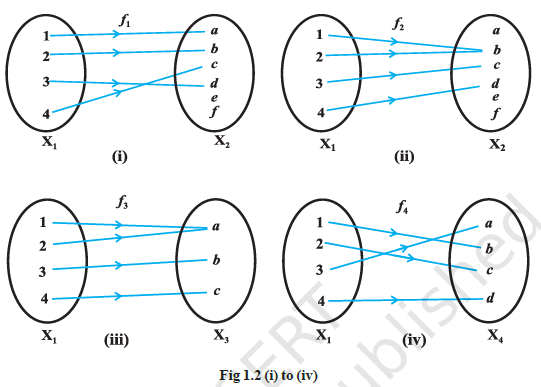
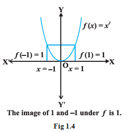

<page> 

# Types of Functions

Consider the functions $f_1, f_2, f_3$ and $f_4$ given by the following diagrams.

In Fig 1.2, we observe that the images of distinct elements of $X_1$ under the function $f_1$ are distinct, but the image of two distinct elements 1 and 2 of $X_1$ under $f_1$ is same, namely $b$. Further, there are some elements like $e$ and $f$ in $X_2$ which are not images of any element of $X_1$ under $f_1$, while all elements of $X_3$ are images of some elements of $X_1$ under $f_3$. The above observations lead to the following definitions:

**Definition: Injdective Functions or One-One Functions**  
A function $f : X \to Y$ is defined to be **one-one** (or **injective**), if the images of distinct elements of $X$ under $f$ are distinct, i.e. for every $x_1, x_2 \in X$, $f(x_1) = f(x_2)$ implies $x_1 = x_2$. Otherwise, $f$ is called *many-one*.

The functions $f_1$ and $f_4$ in Fig 1.2 (i) and (iv) are one-one and the function $f_2$ and $f_3$ in Fig 1.2 (ii) and (iii) are many-one.

**Definition: Onto Functions or Surjective Functions**  
A function $f : X \to Y$ is said to be **onto** (or **surjective**), if every element of $Y$ is the image of some element of $X$ under $f$, i.e., for every $y \in Y$, there exists an element $x$ in $X$ such that $f(x) = y$.

The function $f_3$ and $f_4$ in Fig 1.2 (iii), (iv) are onto and the function $f_1$ in Fig 1.2 (i) is not onto as elements $e, f$ in $X_2$ are not the image of any element in $X_1$ under $f_1$.

**Remark**  
$f : X \to Y$ is onto if and only if $\text{Range of } f = Y$.

**Definition: Bijective functions**  
A function $f : X \to Y$ is said to be *one-one and onto* (or *bijective*), if $f$ is both one-one and onto.

The function $f_4$ in Fig 1.2 (iv) is one-one and onto.

</page>

----

<page>

# Example Exercise

**Example 7**  
Let $A$ be the set of all 50 students of Class X in a school. Let $f : A \to \mathbb{N}$ be function defined by $f(x) = \text{roll number of the student } x$. Show that $f$ is one-one but not onto.

<ans>

**Solution**  
No two different students of the class can have same roll number. Therefore, $f$ must be one-one. We can assume without any loss of generality that roll numbers of students are from 1 to 50. This implies that 51 in $\mathbb{N}$ is not roll number of any student of the class, so 51 cannot be image of any element of $X$ under $f$. Hence, $f$ is not onto.

</ans>

</page>

----

<page>

# Example exercise

**Example 8**  
Show that the function $f : \mathbb{N} \to \mathbb{N}$, given by $f(x) = 2x$, is one-one but not onto.

<ans>

**Solution**  
The function $f$ is one-one, for $f(x_1) = f(x_2) \Rightarrow 2x_1 = 2x_2 \Rightarrow x_1 = x_2$.  
Further, $f$ is not onto, as for $1 \in \mathbb{N}$, there does not exist any $x \in \mathbb{N}$ such that $f(x) = 2x = 1$.

</ans>

</page>

----

<page>

# Example Exercise

**Example 9**  
Prove that the function $f : \mathbb{R} \to \mathbb{R}$, given by $f(x) = 2x$, is one-one and onto.

<ans> 

**Solution**  
$f$ is one-one, as $f(x_1) = f(x_2) \Rightarrow 2x_1 = 2x_2 \Rightarrow x_1 = x_2$.  
Also, given any real number $y$ in $\mathbb{R}$, there exists $\frac{y}{2}$ in $\mathbb{R}$ such that  
$$f\left( \frac{y}{2} \right) = 2 \cdot \left( \frac{y}{2} \right) = y$$  
Hence, $f$ is onto.

</ans>

</page>

----

<page>

# Example Exercise

**Example 10**  
Show that the function $f : \mathbb{N} \to \mathbb{N}$ given by $f(1) = f(2) = 1$ and $f(x) = x - 1$, for every $x > 2$, is onto but not one-one.

<ans>

**Solution**  
$f$ is not one-one, as $f(1) = f(2) = 1$.  
But $f$ is onto, as given any $y \in \mathbb{N}, y \ne 1$, we can choose $x$ as $y + 1$ such that  
$$f(y + 1) = y + 1 - 1 = y$$  
Also for $1 \in \mathbb{N}$, we have $f(1) = 1$.

</ans>

</page>

----

<page>

# Example Exercise

**Example 11**  
Show that the function $f : \mathbb{R} \to \mathbb{R}$, defined as $f(x) = x^2$, is neither one-one nor onto.

<ans>

**Solution**  

Since $f(-1) = 1 = f(1)$, $f$ is not one-one.  
Also, the element $-2$ in the co-domain $\mathbb{R}$ is not image of any element $x$ in the domain $\mathbb{R}$ (Why?).  
Therefore, $f$ is not onto.
</ans>

</page>

----

<page>

# Example Exercise

**Example 12**  
Show that $f : \mathbb{N} \to \mathbb{N}$, given by  
$$
f(x) =
\begin{cases}
x + 1, & \text{if } x \text{ is odd} \\
x - 1, & \text{if } x \text{ is even}
\end{cases}
$$  
is both one-one and onto.

<ans>

**Solution**  
Suppose $f(x_1) = f(x_2)$. Note that if $x_1$ is odd and $x_2$ is even, then we will have  
$$x_1 + 1 = x_2 - 1 \Rightarrow x_2 - x_1 = 2$$  
which is impossible. Similarly, the possibility of $x_1$ being even and $x_2$ being odd can also be ruled out, using the similar argument. Therefore, both $x_1$ and $x_2$ must be either odd or even. Suppose both $x_1$ and $x_2$ are odd. Then  
$$f(x_1) = f(x_2) \Rightarrow x_1 + 1 = x_2 + 1 \Rightarrow x_1 = x_2$$  
Similarly, if both $x_1$ and $x_2$ are even, then also  
$$f(x_1) = f(x_2) \Rightarrow x_1 - 1 = x_2 - 1 \Rightarrow x_1 = x_2$$  
Thus, $f$ is one-one.  
Also, any odd number $2r + 1$ in the co-domain $\mathbb{N}$ is the image of $2r + 2$ in the domain $\mathbb{N}$ and any even number $2r$ in the co-domain $\mathbb{N}$ is the image of $2r - 1$ in the domain $\mathbb{N}$. Thus, $f$ is onto.

</ans>

</page>

----

<page>

# Example Exercise 

**Example 13**  
Show that an onto function $f : \{1, 2, 3\} \to \{1, 2, 3\}$ is always one-one.

<ans>

**Solution**  
Suppose $f$ is not one-one. Then there exists two elements, say 1 and 2 in the domain whose image in the co-domain is same.  
Also, the image of 3 under $f$ can be only one element.  
Therefore, the range set can have at the most two elements of the co-domain $\{1, 2, 3\}$,  
showing that $f$ is not onto, a contradiction.  
Hence, $f$ must be one-one.

</ans>

</page>

---

<page>

# Example Exercise

**Example 14**  
Show that a one-one function $f : \{1, 2, 3\} \to \{1, 2, 3\}$ must be onto.

<ans>
**Solution**  
Since $f$ is one-one, three elements of $\{1, 2, 3\}$ must be taken to 3 different elements of the co-domain $\{1, 2, 3\}$ under $f$.  
Hence, $f$ has to be onto.

</ans>

</page>
